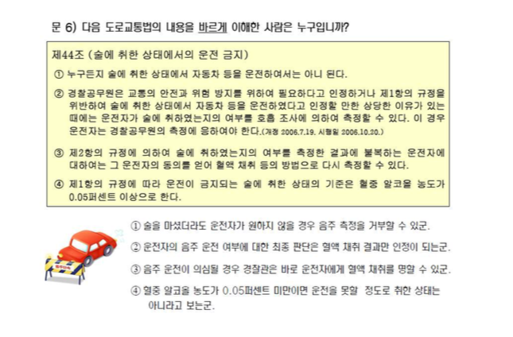
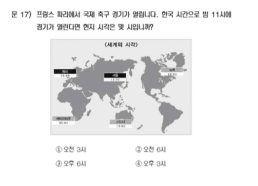

# 국민문해력조사 집계 결과

```{r setup_literacy, include=FALSE}
# Setup chunk
knitr::opts_chunk$set(echo = TRUE)
library(readxl)
library(pander)
library(knitr)
library(magrittr)
library(dplyr)
library(googlesheets4)
library(showtext)
font_add(family = "kopub", 
         regular = "/Users/kwlee/Library/Fonts/KoPubWorld Dotum Medium.ttf",
         bold = "/Users/kwlee/Library/Fonts/KoPubWorld Dotum Bold.ttf",
         italic  = "/Users/kwlee/Library/Fonts/KoPubWorld Dotum Light.ttf")
showtext_auto()
# Pander options for table formatting
panderOptions('table.split.table', Inf)
panderOptions('table.alignment.rownames', 'left')
panderOptions('table.alignment.default', 'left')
options(width=180)
```

```{r, read data, echo = FALSE, results = 'hide', message = FALSE}
class_roll <- readRDS("./class_roll_250407.RDS")
sheet_url <- "https://docs.google.com/spreadsheets/d/1I1XKZtv2sIBktX18TjB6czcwI_8xHtfqgIvqczx8HOQ"
literacy_roll <- 
  read_sheet(sheet_url)
literacy_roll <- literacy_roll[, -c(1:2)]
# literacy_roll <- 
#   read_excel("./data/literacy_250331.xlsx",
#              range = "C1:AD33",
#              col_names = TRUE) 
N <- nrow(literacy_roll)
names(literacy_roll) <- c("dept", "id", "name", paste0("Q", 1:25))
str(literacy_roll)
class(literacy_roll$dept) <- "character"
class(literacy_roll$id) <- "character"
class(literacy_roll$Q1) <- "character"
str(literacy_roll)
literacy_roll %<>%
  data.frame

#> =================================================
#> 학번 잘못 써서 고생시키는 녀석들 찾아내는 코드
wrong_id <- setdiff(literacy_roll$id, class_roll$id)
literacy_roll %>%
  filter(id %in% wrong_id) %>%
  select(dept, id, name)

#> id 또는 name 틀린 사람 찾아서 수정하기
# 1. 잘못된 id 또는 name 가진 행 찾기
literacy_wrong_ids <- literacy_roll %>%
  anti_join(class_roll, by = c("id", "name")) 
# 2. 수정 전 원래의 id와 name 쌍을 저장
wrong_keys <- literacy_wrong_ids %>% 
  select(id, name)
# 3.잘못된 id 또는 name 수정
literacy_wrong_ids <- literacy_wrong_ids %>%
  mutate(
    id = case_when(
      id == "202013353" ~ "20213353",
      id == "문화산업" & name == "ZOU YUANYUAN" ~ "20218005",
      id == "202244144" ~ "20244144",
      TRUE ~ id
      ),
    name = case_when(
      name == "윤어진ㅁ" ~ "윤어진",
      TRUE ~ name
      ),
    dept = case_when(
      dept == "20218005" ~ "문화산업",
      TRUE ~ dept
      ),
    )
# 3. quiz 에서 id 혹은 name 틀린 행을 제거하고 옳은 id 갖춘 행으로 교체하기
literacy_roll <- literacy_roll %>%
  anti_join(wrong_keys %>% select(id, name), by = c("id", "name")) %>%
  bind_rows(literacy_wrong_ids)
#>=============================

#> literacy_roll 에서 학과, 이름 제거하기
literacy_roll <- literacy_roll %>%
  select(-dept, -name)
#> literacy_roll 에 group 추가하기
literacy_roll <- literacy_roll %>%
  mutate(group = class_roll$group[match(id, class_roll$id)])
# literacy_roll$group <- class_roll$group[match(literacy_roll$id, class_roll$id)]
#> 1, 2, 3, 4 번호만 남기고 뒤의 글자는 모두 지우기
# literacy_roll[-c(1, 27)] %>%
#   sapply(table)
# literacy_roll[2:26] %<>% 
#   sapply(FUN = {. %>% substr(start = 1, stop = 1)})
# sapply(FUN = function(x) substr(x, 1, 1))
literacy_roll[2:26] %<>% 
  sapply(FUN = {. %>% strsplit(split = "[.]") %>% sapply(`[`, 1)})
kable(literacy_roll)
#> 문해력 집계에 필요한 변수만 추출. 
# literacy <- literacy_roll[, c(2:27)] 
literacy <- literacy_roll %>%
  select(-1)
kable(literacy)
#> RDS 포맷으로 저장 
saveRDS(literacy_roll, file = "./literacy_roll_250331.RDS")
```

```{r, echo = FALSE, results = "hide"}
#> 불참자 id 추출하기
class_roll %>%
  filter(!id %in% literacy_roll$id) %>%
  pull(id)
#> 옛 코드
# class_roll$id %in% literacy_roll$id %>%
#   `!` %>% 
#   which %>%
#   `[`(class_roll, ., "id")
#> 불참자들
absentee <- class_roll %>%
  filter(id %in% setdiff(id, literacy_roll$id)) %>%
  select(id, name, group) %>%
  arrange(id)
# absentee <- 
#   class_roll[class_roll$id %in% setdiff(class_roll$id, literacy_roll$id), c("id", "name", "group")] %>%
#   `[`(order(.$id), ) 
absentee %>%
  pander(row.names = FALSE) 
absentee$group %>%
  table
#> 국민문해력조사 참여자 vs Quiz 참여자
quiz <- readRDS("./quiz250331.RDS")
class_roll %>%
  filter(id %in% setdiff(literacy_roll$id, quiz$id)) %>%
  select(id, name, group)
class_roll %>%
  filter(id %in% setdiff(quiz$id, literacy_roll$id)) %>%
  select(id, name, group)
```

<!--
### `factor` 변환
-->

```{r, echo = FALSE, results = "hide"}
literacy_df <- literacy[1:25] %>%
  lapply(FUN = factor, levels = 1:4) %>%
  data.frame(row.names = NULL)
str(literacy_df)
```

## 응답 집계

```{r, echo = FALSE}
literacy_tbl <- literacy_df %>%
  sapply(FUN = table, useNA = "no")
pander(literacy_tbl, caption = "Counts")
literacy_ptbl <- literacy_tbl %>%
  apply(MARGIN = 2, FUN = prop.table) %>%
  `*`(100) %>%
  round(digits = 0)
pander(literacy_ptbl, caption = "%")
label_ptbl <- literacy_ptbl %>%
  format(digits = 2, nsmall = 0) %>%
  paste0("%") %>%
  ifelse(. %in% c(" 0%", " 1%", " 2%"), "", .) %>%
  matrix(nrow = 4)
```

## 막대그래프

막대그래프로 답안 분포를 시각적으로 살핀다. 차후 나오는 정답률과 함께 어느 문항에서 어느 답안을 많이 고르는지 파악하는 데 활용한다.

<!--
### `barplot`
-->

```{r, echo = FALSE, fig.width = 9, fig.height = 12, eval = FALSE}
library(RColorBrewer)
# png(file = "./pics/Literacy_250331.png", width = 640, height = 840)
par(family = "kopub", mar = c(5.1, 4.1, 4.1, 8.1))
b <- barplot(literacy_tbl, 
# b <- barplot(matrix(literacy_tbl, nrow = 4), 
             horiz = TRUE, 
             axes = FALSE, 
#              col = rainbow(4), 
             col = brewer.pal(4, "Accent"),
#> names.arg = NULL 이 작동하지 않아서 할 수 없이 ...
             names.arg = rep("", 25), 
             las = 1, 
#             xpd = TRUE, 
             legend.text = rownames(literacy_tbl), 
             args.legend = list(x = 1.1 * N, y = 30, title = "답문항"))
mtext(side = 2, at = b, line = 0, las = 1, text = colnames(literacy_tbl))
mtext(side = 2, at = mean(b), line = 2, text = "문항")
mtext(side = 1, at = N / 2, line = -1, text = "백분율")
# max(b)
# literacy_tbl[1, ]
# pos <- function(x){
#   cumsum(x) - x / 2
# }
#> 텍스트 라벨이 붙는 좌표를 계산하는 사용자 함수 설정
pos <- {. %>% {cumsum(.) - `/`(., 2)}}
x_text <- apply(literacy_tbl, MARGIN = 2, FUN = pos)
text(x = x_text, y = rep(b, each = 4), labels = label_ptbl)
title(main = "문해력조사 문항별 응답", cex.main = 1.8, line = -0.5)
# dev.copy(png, file = "./pics/Literacy_250331.png", width = 640, height = 840)
invisible(dev.off())
```

<!--
### ggplot
-->

```{r, echo = FALSE, message = FALSE, fig.width = 12, fig.height = 6}
library(tidyverse)
pos <- {. %>% {cumsum(.) - `/`(., 2)}}
x_text <- apply(literacy_tbl, MARGIN = 2, FUN = pos)
#> literacy_tbl을 깔끔한 데이터로 변환
literacy_tbl2 <- literacy_tbl %>%
  as_tibble %>%
#> Item 변수 설정
  mutate(Item = row.names(literacy_tbl)) %>%
#> Item은 빼고, key, value 쌍으로 변환, 
  gather(key = Questions, value = Counts, -Item) %>%
#> factor로 변환
  mutate(Questions = factor(Questions, levels = paste0("Q", 1:25))) %>%
  mutate(Item = factor(Item)) %>%
#> 라벨의 좌표와 라벨을 컬럼 단위로 펴서, 깔끔한 tibble에 별도의 벡터로 추가
  mutate(x_text = c(x_text), label_ptbl = c(label_ptbl))
#> ggplot layout 설정. 공통적으로 등장하는 x 좌표도  포함시킨다.
ggplot(data = literacy_tbl2, mapping = aes(x = Questions)) +
#> Counts 를 Item별로 막대그래프에 쌓아올린다. 순서는 1, 2, 3, 4 순 (reverse = TRUE).
#> stat = "identity" 는 디폴트이므로 굳이 설정하지 않아도 무방. 
  geom_bar(aes(y = Counts, fill = Item),
           col = "black", linewidth = 0.3,
           stat = "identity", position = position_stack(reverse = TRUE)) +
#> 퍼센티지를 추가 정보로 각 막대의 중점에 표시. mapping = aes() 에서 공통되는 x 좌표 설정은 생략 가능.
  geom_text(aes(y = x_text, label = label_ptbl)) +
#> fill 의 색깔과 레전드 제목 설정.
  scale_fill_brewer(name = "답문항", type = "qual", palette = "Accent") +
#> 제목과 x축 라벨, y축 라벨 설정.
  labs(title = "문해력조사 문항별 응답", x = "문항", y = "백분율") +
#  xlab("문제") +
#  ylab("백분율") +
#  ggtitle("문해력조사 문항별 응답") + 
#> 플롯 배경에 설정된 격자를 최소로 theme 설정
  theme_minimal(base_family = "kopub") +
#> 격자의 주요 선 없애고,
  theme(panel.grid = element_blank(),
#> 플롯 제목의 폰트, 폰트 크기, 가운데 정렬 설정
        plot.title = element_text(family = "kopub", face = "bold", size = 18, hjust = 0.5),
#> 레전드에 박스 두르기
        legend.background = element_rect(fill = "transparent"),
#> 레전드의 제목 폰트 설정
        legend.title = element_text(family = "kopub"),
#> x축 라벨의 폰트 설정
        axis.title.x = element_text(family = "kopub"),
#> x축 눈금 텍스트를 없앰 (너무 떨어져 있어서 새로 설정할 예정)
        axis.text.x = element_blank(),
#> y축 라벨의 폰트 설정. "문항"을 좀더 축에 가까이 보내고 싶지만 잘 안됨.
        axis.title.y = element_text(family = "kopub"),
#> y축 눈금 텍스트 없애기
        axis.text.y = element_blank()) +
#> x축의 라벨을 막대에 보다 가깝게 조정 (flip해서 x축을 수직으로 세울 예정이므로 y = -30)
  geom_text(mapping = aes(y = -15, label = Questions)) 
#> 좌표를 90도 회전하여 막대들을 수평으로 눕히기
#  coord_flip()
ggsave(file = "./pics/Literacy_250331_ggplot.png", bg = "white", dpi = 72, width = 840, height = 480, units = "px")
```

## 문해력 점수 계산

<!--* 정답 맞춰보기
    * 정답 읽어들이기. `what = ""`로 설정하여 `char`취급. 

* 각 학생들의 답안과 맞춰보기 위하여 정답표 작성.
    * 문항별로 정답과 비교하기 위하여 각 문항을 리스트의 원소로 분리
    * `split()` 의 기능과 한계에 유의. `factor` 성격으로부터 `1, 10, 11, ..., 2, 20, ..., 3, 4, 5, ... , 9`로 순서를 잡게 되므로 다시 한번 정리할 필요.
-->
    
    
```{r, ans list and unlist, echo = FALSE, results = 'hide'}
ans <- c("3", "4", "1", "3", "2", "4", "1", "4", "3", "2", "1", "3", "2", "4", "3", "1", "4", "2", "1", "3", "2", "4", "1", "3", "2") %>%
# ans <- "./data/literacy_ans.txt" %>%
#   scan(what = "") %>%
  split(f = paste0("A", 1:25)) %>%
  `[`(paste0("A", 1:25))
ans
```

### 정답과 대조하여 R(Right)/W(Wrong) 표시 
    
<!--* 채점표라는 의미의 `marks` 로 저장, (# 표시한 방식으로는 작동하지 않음)-->
    
```{r, marks, echo = FALSE}
marks_rw <- literacy_df %>%
  `==`(ans) %>%
  ifelse("R", "W") 
marks_rw %>%
  head %>%
  pander
```

### 학생별 점수 산출

<!--+ 정답을 집계하기 위하여 "R" 갯수를 다시 산출하는 `ifelse()` 적용.
    + 4점씩 곱하면 100점 만점 기준의 점수가 됨. 
    + 조사표는 작성해서 제출했지만 빈칸이 있는 경우는 그 문항을 0점 처리, 결석의 경우는 점수가 모두 0으로 나오는 경우를  NA처리 
-->

```{r, sum of rights answers, echo = FALSE, results = 'hide'}
marks <- marks_rw %>%
  `==`("R") %>%
  ifelse(1, 0)
score <- marks %>%
  apply(MARGIN = 1, FUN = sum, na.rm = TRUE) %>%
  `*`(4)
score[score == 0] <- NA
which(score < 60)
```

```{r, pander score, echo = FALSE}
pander(score)
```

<P style = "page-break-before:always">

## Red and Black 비교

### Summary

```{r, summary by group, echo = FALSE, eval = TRUE}
score %>%
  tapply(., literacy$group, FUN = { . %>% summary %>% round(digits = 1) }) %>%
  pander
# stem(score, scale = 2)
# score %>%
#   stem(scale = 0.5)
Red <- literacy %$%
  `==`(group, "Red")
Black <- literacy %$%
  `==`(group, "Black")
```

### 줄기-잎 그림

- Red

```{r, stem for Red, echo = FALSE, eval = TRUE}
score %>%
  `[`(literacy$group == "Red") %>%
  stem(scale = 0.5)
```

- Black

```{r, stem for Black, echo = FALSE, eval = TRUE}
score %>%
  `[`(literacy$group == "Black") %>%
  stem(scale = 0.5)
```

<P style = "page-break-before:always">

### Box Plots

```{r, boxplots, echo = FALSE, fig.width = 6, fig.height = 6, eval = TRUE}
score %>%
  plot(literacy$group, .)
```

### QQ plot

```{r, qqplots, echo = FALSE, fig.width = 6, fig.height = 6, eval = TRUE}
qqplot(x = score[Red], y = score[Black], 
       xlab = "Red", ylab = "Black", 
       xlim = c(60, 100), ylim = c(60, 100))
```

<P style = "page-break-before:always">

### ECDF plot

```{r, ECDF, echo = FALSE, fig.width = 6, fig.height = 6, eval = TRUE}
score %>%
  `[`(Red & !is.na(score)) %>%
  ecdf %>%
  plot(xlim = score %>% range(na.rm = TRUE), col = "red", main = "ECDF")
score %>%
  `[`(Black & !is.na(score)) %>%
  ecdf %>%
  plot(add = TRUE)
```

<P style = "page-break-before:always">

### t-test

Red 와 Black으로부터 관찰된 점수들의 평균에 대하여 t test를 적용하였더니 기초통계량에서 살핀 것을 뒷받침해 주듯이 p-value 가 0.05보다 큰 값이 나왔습니다. 평균은 닮았다는 뜻입니다.

```{r, t test, echo = FALSE, eval = TRUE}
literacy %$%
  t.test(score ~ .$group) %>%
  pander
```

## 문해력 등급 판정

### 분포표
    
* I수준(24점 이하), II수준(28 ~ 48점), III수준(52 ~ 72점), IV수준(76점 이상) 
    
```{r, literacy grade, echo = FALSE, warning = FALSE}
grade <- ifelse(score <= 24, "I", 
                ifelse(score <= 48, "II", 
                       ifelse(score <= 72, "III", "IV"))) %>%
  factor(levels = c("I", "II", "III", "IV"))
grade_tbl <- grade %>%
  table("문해력 등급 분포" = ., exclude = NULL) %>%
  c("계" = sum(.))
grade_tbl %>%
  t %>%
  pander(caption = "문해력 등급 분포")
grade %>%
  table(useNA = "no") %>%
  prop.table %>%
  `*`(100) %>%
  round(2) %>%
  c("계" = sum(.)) %>%
  t %>%
  pander(caption = "문해력 등급 분포(%)")
```

### Red and Black 

**카이제곱 테스트**로 Red와 Black에 들어간 등급별 인원수가 얼마나 닮았는지를 살펴보았지만 t-test와 마찬가지로 통계적으로 유의한 차이가 관찰되지 않았습니다. 

```{r, literacy grade RnB, echo = FALSE, warning = FALSE}
grade_tbl_group <- literacy %$%
  table("Group" = .$group, "문해력 등급 분포" = grade, exclude = NULL)
grade_tbl_group %>%
  cbind("계" = rowSums(.)) %>%
  rbind("계" = colSums(.)) %>%
  pander(caption = "그룹별 문해력 등급 분포")
grade_tbl_group %>%
  `[`(, -5) %>%
  chisq.test(simulate.p.value = FALSE) %>%
  pander
```

<P style = "page-break-before:always">

<!--## 문항 유형별 점수 분석-->

```{r, item by type, echo = FALSE}
type_kr <- c("a", "a", "c", "a", "b", "b", "b", "a", "b", "b", "a", "a", "a", "b", "a", "a", "b", "c", "a", "a", "a", "c", "b", "a", "b") %>%
# type_kr <- "./data/literacy_type.txt" %>%
#   scan(what = "") %>%
  factor(levels = c("a", "b", "c"), labels = c("사실적", "추론적", "비판적"))
```

<!--* 유형별 점수 파악
    * 왜 `marks`의 전치행렬을 사용하고 있는지 이해 필요.
    * 변수들은 사실상 각 학생을 나타내므로 변수명을 `s1, s2, ...` 등으로 바꿈.
    * 일부 문항의 응답이 NA이면 그 문항을 0점 처리, 결석이면 NA 처리. 
-->

```{r, computing scores by types, echo = FALSE, results = 'hide', eval = TRUE}
score_type <- marks %>%
  t %>%
  aggregate(list("유형" = type_kr), FUN = sum, na.rm = TRUE)
score_type
score_type <- aggregate(t(marks), list("유형" = type_kr), 
                        FUN = sum, na.rm = TRUE)
score_type == 0
score_type[score_type == 0] <- NA
score_type_student <- score_type %>%
  `[`(-1) %>%
  t
  t(score_type[, -1])
N <- nrow(literacy)
dimnames(score_type_student) <- list(paste0("s", 1:N), 
                                     paste0(levels(type_kr), c("(52점)", "(36점)", "(12점)")))
```

```{r, scores by types, echo = FALSE, results = 'hide', eval = TRUE}
score_type_student %>%
  `*`(4) %>%
  pander
```

<!--##### 문항별 정답률-->

<!--* 결석한 경우와 일부 문항에 답을 내지 않은 경우를 구분하는 것이 핵심.
    + `marks`를 그대로 이용하면 쉽게 계산되나, `is.na`학습 목적으로 `literacy.mark.rw`에서 출발
    + 모든 문항에 NA로 답한 결석한 학생들의 인덱스를 먼저 찾아내고,
-->

```{r, NA management, echo = FALSE, results = 'hide'}
na_all <- marks_rw %>%
  apply(MARGIN = 1, {. %>% is.na %>% all }) %>%
  which
```

<!--* 정답률 계산
    + NA를 모두 오답처리한 후, 결석한 학생들만 다시 NA로 정정.
    + TRUE의 갯수를 합하여 평균. 
-->

```{r, computing correct answer rates, echo = FALSE, results = 'hide', eval = TRUE}
marks_2 <- marks_rw
marks_2[is.na(marks_2)] <- "W"
marks_2[na_all, ] <- NA
marks_2 %<>% 
  `==`("R") %>%
  ifelse(1, 0)
rate_item <- marks_2 %>% 
  apply(MARGIN = 2, FUN = mean, na.rm = TRUE) %>%
  `*`(100)
str(rate_item)
rate_item %<>% 
  round(digits = 1) %>%
  as.matrix(nrow = 25)
dimnames(rate_item) <- list("문항" =  paste0("문", 1:25), 
                            "정답률" = "정답률")
```

## 유형별 정답률

```{r, rates by types, echo = FALSE, eval = TRUE}
rate_item_type <- data.frame("유형" = type_kr, "정답률" = rate_item)
dimnames(rate_item_type) <- list("문항" = paste0("문", 1:25), "유형과 정답률" = c("유형", "정답률(%)"))
rate_item_type %>%
  format(digits = 3, nsmall = 1) %>%
  pander(align = c("l", "r"))
```

<!--* `replace()`를 이용하면, 

```{r, eval = TRUE}
(marks.3 <- replace(marks_rw, is.na(marks_rw), "W"))
marks.3[na_all, ] <- NA
marks.3
```
-->

<!--<P style = "page-break-before:always">-->

## 어려운 문제?

### 정답률 80% 이하

```{r, hardest question below 80, echo = FALSE, eval = TRUE}
rate_item %>%
  `[`(`<=`(., 80), , drop = FALSE) %>%
#  `[`(. <= 80, , drop = FALSE) %>%
  t %>%
  kable
```

### 정답률 70% 이하

```{r, hardest question below 70, echo = FALSE, eval = TRUE}
rate_item %>%
  `[`(. <= 70, , drop = FALSE) %>%
  t %>%
  kable
```

### 정답률 60% 이하

```{r, hardest question below 60, echo = FALSE, eval = TRUE}
rate_item %>%
  `[`(. <= 60, , drop = FALSE) %>%
  t %>%
  kable
```

### 정답률 50% 이하

```{r, hardest question below 50, echo = FALSE, eval = TRUE}
rate_item %>%
  `[`(. <= 50, , drop = FALSE) %>%
  t %>%
  kable
```

## 정답률이 낮은 문제들

### 문6.

```{r, echo = FALSE, out.width = "75%", fig.align = "left"}

```

### 문9.

```{r, echo = FALSE, out.width = "75%", fig.align = "left"}
include_graphics("./pics/Q09.png")
```

### 문12.

```{r, echo = FALSE, out.width = "75%", fig.align = "left"}
include_graphics("./pics/Q12.png")
```

### 문15.

```{r, echo = FALSE, out.width = "75%", fig.align = "left"}
include_graphics("./pics/Q15.png")
```

### 문17.

```{r, echo = FALSE, out.width = "75%", fig.align = "left"}

```

### 문22.

```{r, echo = FALSE, out.width = "75%", fig.align = "left"}
include_graphics("./pics/Q22.png")
```