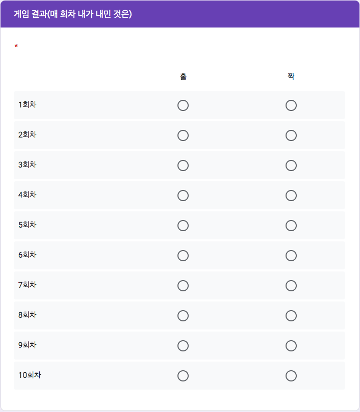

```{r setup, include=FALSE}
knitr::opts_chunk$set(echo = TRUE)
library(readxl)
library(pander)
library(knitr)
library(magrittr)
library(dplyr)
panderOptions('table.split.table', Inf)
panderOptions('table.alignment.rownames', 'left')
panderOptions('table.alignment.default', 'right')
options(width = 180)
```

### 게임 규칙과 기록표

```{r, echo = FALSE, out.width = "67%"}
include_graphics("./pics/MW_Game_rule.png")
```

```{r, echo = FALSE, out.width = "67%"}

```

### 개별 기록

```{r, data, echo = FALSE, results = 'hide'}
#> 엑셀 자료 읽어들이기
MW <- "./data/MW241118.xlsx" %>%
  read_excel(range = "C1:O615",
             col_types = "text")
str(MW)
#> Names for the Columns
names(MW) <- c("Team", "id", "name", paste0("Q", 1:10)) 
MW %<>% 
  data.frame
# kable(MW)
#> Team Names Assortment // Need to Check the Pairs
# Team <- MW$Team 
#> Unique team names
team_names <- MW$Team %>%
  unique 
team_names %>%
  table
team_names %>%
  length
# team_names
#> Absentees
# na.index <- which(is.na(Team)) 
#> Number of absentees
# length(na.index) 
#> Remove the NAs
# MW <- MW[-na.index, ] 
# MW <- MW
#> Assignment of non NAs to a vector
# Team <- MW$Team 
# team_names <- unique(Team)
#> table of unique team names, regard it as a named matrix
# tbl.2 <- table(Team) 
#> Do something if not in pair
# names(tbl.2)[tbl.2 != 2] 
#> Who are they?
# names.wrong <- names(tbl.2)[tbl.2 != 2]
# names.wrong
# which(Team %in% names.wrong)
#> Collapse their names into one. 
# team.new <- paste(names.wrong, collapse = "+") 
# team.new
#> Replace their names into the colllapsed one.
# MW$Team[Team %in% names.wrong] <- team.new 
#> Rerun the Team and team_names in order to get it right
# Team <- MW$Team 
# team_names <- unique(Team)
records <- MW[c("Team", paste0("Q", 1:10))]
# kable(MW[, c("id", "name","Team", paste("Q", 1:10, sep = ""))])
#> 데이터 오류 찾아내어 바꾸기, 예 : "홀 " 찾아내기
# #> "김서회희 ", "노지대홍승" 찾아내기
apply(records["Team"], MARGIN = 2, table)
# which(records[, "Team"] == "김서회희 ")
# records[182, "Team"] <- "김서회희"
# which(records[, "Team"] == "노지대홍승")
# records[249, "Team"] <- "노지대흥승"
```

```{r, cleaning, echo = FALSE, results = 'hide'}
#> 출석부 불러오기
class_roll <- 
  readRDS("./class_roll_241122.RDS")
#> 학번 잘못 써서 고생시키는 녀석들 찾아내는 코드
wrong_id <- setdiff(MW$id, class_roll$id)
MW %>%
  filter(id %in% wrong_id) %>%
  select(id, name)
# 1. 잘못된 id 가진 행 찾기
MW_wrong_ids <- MW %>%
  anti_join(class_roll, by = "id") 
# 2. 잘못된 id를 따로 저장하고 수정하기
wrong_ids <- MW_wrong_ids$id
MW_wrong_ids <- MW_wrong_ids %>%
  mutate(id = case_when(
    id == "29181623" ~ "20191623",
    id == "2020994" ~ "20202994",
    TRUE ~ id
  ))
# 3. MW 에서 id 틀린 행을 제거하고 옳은 id 갖춘 행으로 교체하기
MW <- MW %>%
  filter(!id %in% wrong_ids) %>%
  bind_rows(MW_wrong_ids)
# 확인 
MW[MW$id %in% setdiff(MW$id, class_roll$id), c("id", "name")]

#> 틀린 학번 수정하여 되돌리기 (작동하지 않음. 참고로만)
# MW <- MW %>%
#   #> `left_join`으로 `name`과 `dept`를 기준으로 교정 정보를 추가
#   left_join(class_roll %>% select(id, name, dept), 
#             by = "name", 
#             suffix = c("", "_correct")) %>%
#   #> `id_correct`가 있는 경우 이를 사용하여 `id`를 교정하고, 그렇지 않으면 기존의 `id`를 유지
#   mutate(id = if_else(!is.na(id_correct) & id != id_correct, id_correct, id)) %>%
#   #> 임시로 추가된 `id_correct` 열 제거
#   select(-id_correct)

#> 중복 제출자
# MW %>%
#   filter(duplicated(id)) %>%
#   select(time, id, name) %>%
#   arrange(time)
# which(duplicated(MW$id)) %>%
#   MW[., c("id", "name")]
# MW %>%
#   filter(name %in% c("최정환"))
# MW <- MW %>% 
#   arrange(id, desc(time)) %>%
#   distinct(id, .keep_all = TRUE)
#> 불참자들
# absentee <- class_roll %>%
#   anti_join(MW, by = "id") %>%
#   select(id, name, group) %>%
#   arrange(id)
# absentee <- 
#   class_roll[class_roll$id %in% setdiff(class_roll$id, MW$id), c("id", "name", "group")] %>%
#   `[`(order(.$name), ) 
# absentee %>%
#   pander(row.names = FALSE) 
# absentee %>%
#   count(group) %>%
#   print()
# absentee$group %>%
#   table
```


```{r, echo = FALSE}
kable(records)
```

<P style = "page-break-before:always">

### 팀별 기록

```{r, score, echo = FALSE, results = 'markup'}
#> Define the rule of scores of the game through an anonymous function with switch
score <- function(x) {
  switch(x,
         "홀홀" = c(-3, -3),
         "홀짝" = c(6, -6),
         "짝홀" = c(-6, 6),
         "짝짝" = c(3, 3))
  }
#> Collapse the results of each trial of the game, 예시
sample_coll <- sapply(records[records$Team == records$Team[1], -1], paste, collapse = "") 
#> Score reassignment sample for Team == Team[1] 
# sapply(sample_coll, score) 
#> Inintialize 
records_coll <- NULL 
#> Outcome of each trial of the game collapsed
for(x in team_names) {
  records_coll <- rbind(records_coll, 
                        sapply(records[records$Team == x, -1], 
                               paste, collapse = ""))
  }
# records_coll
#> row.names added
rownames(records_coll) <- team_names 
kable(records_coll)
```

<P style = "page-break-always">

### 게임 규칙에 따른 점수

```{r, scores, echo = FALSE, results = 'asis', eval = TRUE}
#> Score for each trial of the game 
score_coll <- NULL 
for(x in team_names) {
  score_coll <- rbind(score_coll, 
                      sapply(records_coll[rownames(records_coll) == x, ], 
                             score))
  }
# kable(score_coll)
#> Repeat team names for each palyers
rownames(score_coll) <- rep(rownames(records_coll), each = 2) 
kable(score_coll)
```


<P style = "page-break-before:always">

### 게임 규칙에 따른 점수와 합계

```{r, team scores, echo = FALSE, results = 'markup', eval = TRUE}
# id.name <- NULL ## ID and Names for each team and compute the final total scores
# for(x in team_names) {
# id.name <- rbind(id.name, MW[Team == x, c("id", "name")])
# }
# result_df <- data.frame(id.name, Team = rownames(score_coll), score_coll)
# result_df$sum <- rowSums(result_df[, 4:13])
# names(result_df) <- c("학번", "이름", 팀", paste(1:10, "회차", sep = ""), "총점")
#> ID only version
id_team <- NULL 
for(x in team_names) {
  id_team <- c(id_team, MW[MW$Team == x, "id"])
  }
## row.names = NULL needed to deal with score.roll
result_df <- data.frame(id_team, 
                        Team = rownames(score_coll), 
                        score_coll, 
                        stringsAsFactors = FALSE,
                        row.names = NULL) 
result_df$sum <- rowSums(result_df[, 3:12])
names(result_df) <- c("학번", "팀", paste0(1:10, "회차"), "총점")
#> 팀 점수 계산
team_scores <- tapply(result_df$"총점", result_df$"팀", sum)
team_scores_diff <- tapply(result_df$"총점", result_df$"팀", diff) %>%
  abs
#> 협동이 잘 이루어진 팀과 그러지 못한 팀 파악, named vector가 names attribute를 어떻게 내려보내는지 유의.
best_names <- names(which(team_scores == 60))
good_names <- names(which(team_scores >= 48 & team_scores < 60))
worst_names <- names(which(team_scores <= -30 | team_scores_diff > 60))
kable(result_df[-1])
# df <- data.frame("참여한 팀" = nrow(result_df) / 2)
# colnames(df) <- gsub("\\.", " ", colnames(df))
# pander(df)
# pander(setNames(data.frame(nrow(result_df) / 2), "참여한 팀"))
pander(data.frame("참여한 팀" = nrow(result_df) / 2, check.names = FALSE))
```

###  협동이 매우 잘된 팀

```{r, echo = FALSE, eval = TRUE}
#> Best team scores
kable(result_df[result_df$"팀" %in% best_names, -1], row.names = FALSE) 
pander(data.frame("협동이 매우 잘된 팀" = sum(result_df$"팀" %in% best_names) / 2, check.names = FALSE))
```

### 협동이 비교적 잘된 팀 (팀점수 48점 이상)

```{r, echo = FALSE, eval = TRUE}
#> Team scores higher than 48
kable(result_df[result_df$"팀" %in% good_names, -1], row.names = FALSE) 
pander(data.frame("협동이 비교적 잘된 팀(팀 점수 48이상)" = sum(result_df$"팀" %in% good_names) / 2, check.names = FALSE))
```

### 협동이 잘 안되는 팀 (팀 점수 -30점 이하거나 팀원 간 점수 차이 60점 이상)

```{r, echo = FALSE, eval = TRUE}
#> Worst team scores
kable(result_df[result_df$"팀" %in% worst_names, -1], row.names = FALSE) 
pander(data.frame("협동이 잘 안되는 팀(팀 점수 -30이하 또는 팀원 간 점수 차이 60이상)" = sum(result_df$"팀" %in% worst_names) / 2, check.names = FALSE))
```

<!--
### Save and Exit

```{r, save, echo = FALSE}
names(result_df) <- c("id", "Team", paste0(1:10, "회차"), "Total")
saveRDS(result_df, file = "./MW241118.RDS")
save.image("./MW.RDada")
```
-->
