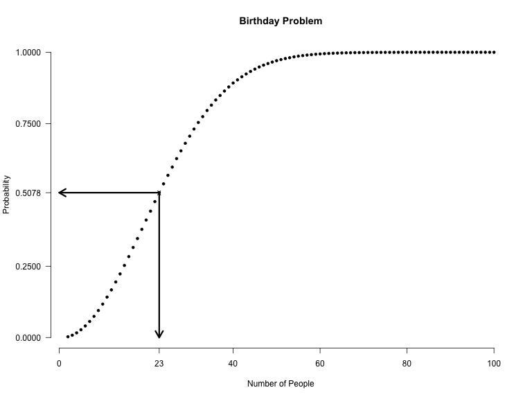
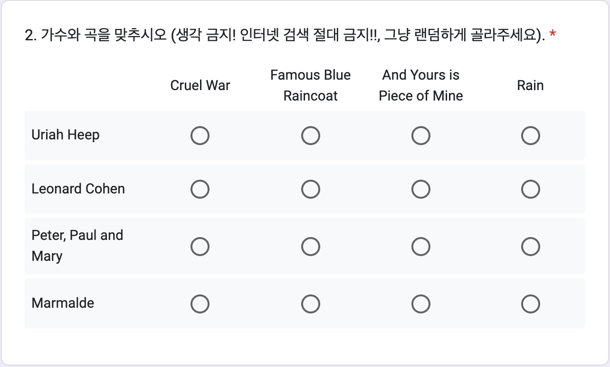
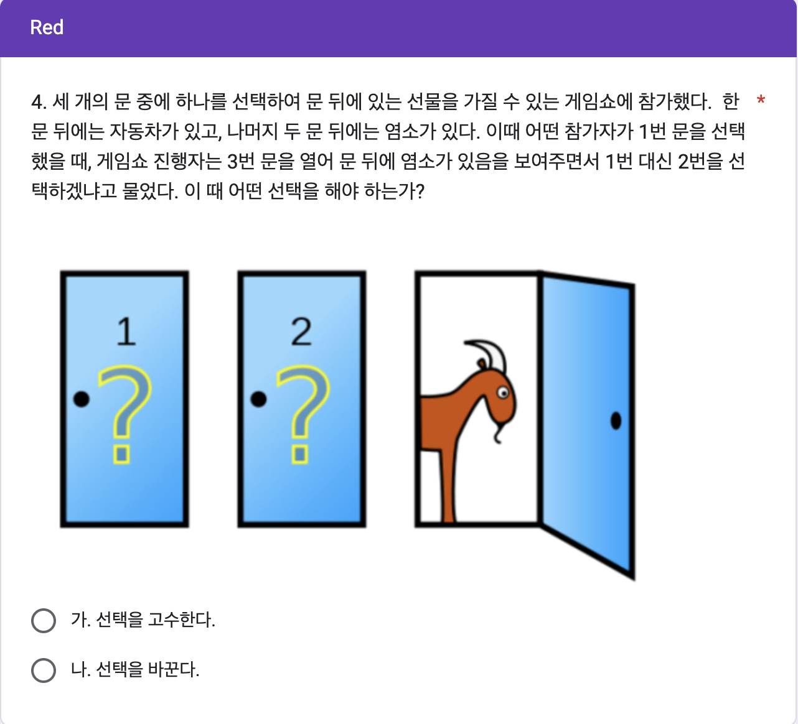
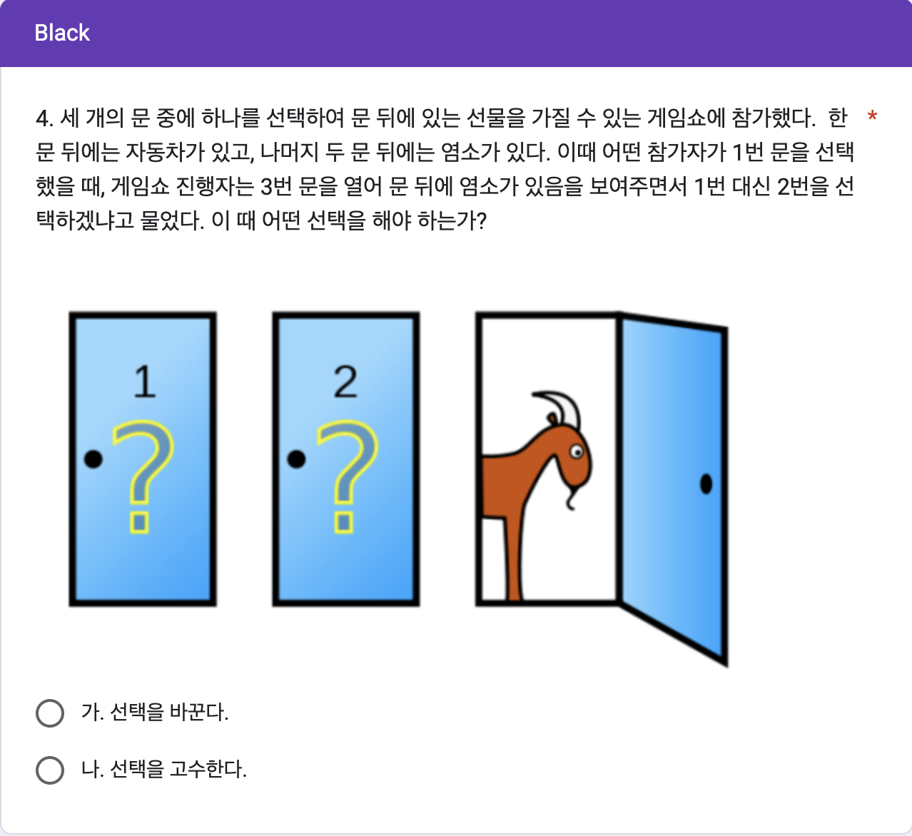

# 직관의 한계 데이터 실험 집계

```{r, include=FALSE}
knitr::opts_chunk$set(echo = TRUE)
library(readxl)
library(pander)
library(knitr)
library(magrittr)
library(tidyverse)
library(dplyr)
library(stringr)
library(googlesheets4)
library(showtext)
font_add(family = "kopub", 
         regular = "/Users/kwlee/Library/Fonts/KoPubWorld Dotum Medium.ttf",
         bold = "/Users/kwlee/Library/Fonts/KoPubWorld Dotum Bold.ttf",
         italic  = "/Users/kwlee/Library/Fonts/KoPubWorld Dotum Light.ttf")
showtext_auto()
panderOptions('table.split.table', Inf)
panderOptions('table.alignment.rownames', 'left')
panderOptions('table.alignment.default', 'right')
options(width = 180, quartz_off_screen = FALSE)
```

## 실험의 목적

13주차 구글 예습 설문지 집계결과를 분석합니다.<br><br>

Q1에서는 잘 알려진 생일 문제를 수강생들에게 적용하여 보았습니다. 

상당히 많은 인원이기 때문에 한쌍 이상의 생일이 같을 확률은 당연히 1이고 생일이 같은 사람이 얼마나 되는 지 알아보겠습니다. 

이론적으로 기대되는 인원과 표준오차를 계산하여 실제 관찰된 인원과 비교 합니다. 

생일의 월별분포에 대해서도 분석합니다. <br><br>


Q2에서는 맷칭문제의 사례로 가수와 노래를 짝짓는 문제를 살펴봅니다. 

랜덤하게 고르도록 하였는데 왜 이론적으로 기대하는 분포와 다른 결과가 나오는 것인지 생각해 봅니다. <br><br>

Q3에서는 연비라는 용어가 직관적으로 주는 오류에 대해서 알아 봅니다. 

연비가 높은 차를 연비가 좀 더 높은 차로 바꾸는 것과 연비가 낮은 차를 연비가 좀 더 높은 차로 바꾸는 것 중에서 어떤 선택이 좀더 연료비를 절감할 수 있는 지 알아 봅니다.<br><br>

Q4에서는 잘 알려진 Monty Hall 문제를 수강생들에게 물어 본 결과를 분석합니다. 

Red 와 Black 은 "고수한다"와 "바꾼다"의 순서를 바꿔 보았는데 그 효과는 통계적으로 유의한 차이를 보이지 않습니다. 

그리고 여러분들이 직관적으로 고른 답은 대부분 정답이 아닌 것으로 드러납니다. 

```{r, echo = FALSE, results = 'hide', message = FALSE}
class_roll <- 
  readRDS("./class_roll_250516.RDS")
class_roll %<>% 
  data.frame
# class_roll <- 
#   read_excel("./data/class_roll_250523.xlsx", 
#              range = "B1:G800")
# class_roll %<>% 
#   data.frame
# str(class_roll)
# names(class_roll) <- 
#   c("dept", "id", "name", "status", "email", "cell_no")
# class_roll$group <- 
#   class_roll1122$group[match(class_roll$id, class_roll1122$id)]
# saveRDS(class_roll, file = "./class_roll_241129.RDS")
MH_url <-"https://docs.google.com/spreadsheets/d/1TLBkalsr984g0R4AhojEfyVF-IvuwdmfcTBb8Q4coP0"
MH <- read_sheet(MH_url)
# MH <- "./data/MH250519.xlsx" %>% 
#   read_excel(range = "A1:N725",
#              col_types = c("date", rep("text", 13)))
names(MH) <- 
  c("time", "email", "dept", "id", "name", "Q1", paste("Q2", 1:4, sep = "_"), "Q3", "group", "Q4_R", "Q4_B")
class(MH$id) <- "character"
class(MH$dept) <- "character"
class(MH$Q1) <- "character"
str(MH)
MH[paste("Q2", 1:4, sep = "_")] %<>% 
  sapply(FUN = . %>% {substr(., 1, 1)})
MH$Q2 <- 
  apply(MH[paste("Q2", 1:4, sep = "_")], 
        MARGIN = 1, paste, collapse = "")
Singers <- 
  c("Uriah Heep", "Leonard Cohen", "Peter, Paul and Mary", "Marmalade")
Songs <- 
  c("Cruel War", "Famous Blue Raincoat", "And Yours is Piece of Mine", "Rain")
MH$group %<>% 
  factor(levels = c("Red", "Black"))
MH$Q4 <- 
  ifelse(is.na(MH$Q4_R), MH$Q4_B, MH$Q4_R)
# MH$Q4 <- ifelse(is.na(MH$Q4_R), MH$Q4_B, MH$Q4_R)
# MH$Q4 %<>% 
#   strsplit(split = "[.]") %>% sapply(`[`, 1)
MH[c("Q3", "Q4")] %<>%
  sapply(FUN = . %>% {strsplit(., split = "[.]") %>% 
  sapply(`[`, 1)})
```

```{r, echo = FALSE, results = 'hide'}
#> 학번 잘못 써서 고생시키는 녀석들 찾아내는 코드
#> # 1. 잘못된 id 또는 name 가진 행 찾기
MH_wrong_ids <- MH %>%
  anti_join(class_roll, by = c("id", "name")) 

# 2. 수정 전 원래의 id와 name 쌍을 저장
wrong_keys <- MH_wrong_ids %>% 
  select(id, name)

# 3. 잘못된 id 또는 name 수정
MH_wrong_ids <- MH_wrong_ids %>%
  mutate(
    id = case_when(
      id == "2019257" ~ "20192957",
      id == "데이터사이언스학부" & name == "정민재" ~ "20253246",
      id == "20226049" ~ "20226409",
      id == "202429090" ~ "20242909",
      id == "202223716" ~ "20223716",
      id == "2024136" ~ "20242136",
      id == "러시아학과" & name == "최시온" ~ "20231730",
    TRUE ~ id
    ),
    name = case_when(
      name == "최유" ~ "최유환",
      TRUE ~ name
      )
    )
# 3. MH 에서 id 또는 name 틀린 행을 제거하고 옳은 id 또는 name 갖춘 행으로 교체하기
MH <- MH %>%
  anti_join(wrong_keys %>% select(id, name), by = c("id", "name")) %>%
  bind_rows(MH_wrong_ids)
#> 수정 여부 확인
MH[MH$id %in% setdiff(MH$id, class_roll$id), c("id", "name", "dept", "group")]
MH$Q1
#> 틀린 학번 수정하여 되돌리기 (작동하지 않음. 참고로만)
# MH <- MH %>%
#   #> `left_join`으로 `name`과 `dept`를 기준으로 교정 정보를 추가
#   left_join(class_roll %>% select(id, name, dept), 
#             by = "name", 
#             suffix = c("", "_correct")) %>%
#   #> `id_correct`가 있는 경우 이를 사용하여 `id`를 교정하고, 그렇지 않으면 기존의 `id`를 유지
#   mutate(id = if_else(!is.na(id_correct) & id != id_correct, id_correct, id)) %>%
#   #> 임시로 추가된 `id_correct` 열 제거
#   select(-id_correct)

#> 중복 제출자
MH %>%
  filter(duplicated(id)) %>%
  select(time, id, name) %>%
  arrange(time)
# which(duplicated(MH$id)) %>%
#   MH[., c("id", "name")]
MH %>%
  filter(id %in% c(""))
MH <- MH %>% 
  arrange(id, desc(time)) %>%
  distinct(id, .keep_all = TRUE)
#> 불참자들
absentee <- class_roll %>%
  anti_join(MH, by = "id") %>%
  select(id, name, group) %>%
  arrange(id)
# absentee <- 
#   class_roll[class_roll$id %in% setdiff(class_roll$id, MH$id), c("id", "name", "group")] %>%
#   `[`(order(.$name), ) 
absentee %>%
  pander(row.names = FALSE) 
absentee %>%
  count(group) %>%
  print()
# absentee$group %>%
#   table
MH$Q1
```

```{r, echo = FALSE, results = 'hide', message = FALSE}
#> birth_month_date <- strsplit(MH$Q1, ",")
clean_birth_format <- function(x) {
  x <- stringr::str_trim(x)                                  # 앞뒤 공백 제거
  x <- stringr::str_replace_all(x, "[^0-9]", "/")            # 숫자 아닌 문자 전부 슬래시로
  x <- stringr::str_replace_all(x, "/+", "/")                # 슬래시 여러 개 → 하나로
  x <- stringr::str_remove_all(x, "^/|/$")                   # 앞뒤 슬래시 제거

  # 예외 처리: 4자리 숫자 (예: "1020") → "10/20"
  x <- ifelse(grepl("^[0-9]{4}$", x),
              paste0(substr(x, 1, 2), "/", substr(x, 3, 4)),
              x)
  
  # 각 항목별로 월/일 추출 "05/06/07" 처리하기 위한 코드
  result <- sapply(x, function(str) {
    parts <- unlist(strsplit(str, "/"))
    if (length(parts) >= 2) {
      month <- stringr::str_pad(parts[length(parts) - 1], 2, pad = "0")
      day   <- stringr::str_pad(parts[length(parts)],     2, pad = "0")
      paste0(month, "/", day)
    } else {
      NA
    }
  })
  
  return(unname(result))
  
#   parts <- stringr::str_split_fixed(x, "/", 2)               # 월/일 나누기
#   month <- stringr::str_pad(parts[, 1], 2, pad = "0")         # 1자리 → 2자리로
#   day   <- stringr::str_pad(parts[, 2], 2, pad = "0")

#   ifelse(month == "" | day == "", NA, paste0(month, "/", day))
}

MH$Q1 <- clean_birth_format(MH$Q1)

birth_month_date <- 
  MH %>%
  select("Q1") %>%
  .[[1]]
#> `[[`(1) 바로 윗 식을 고쳐 쓴 방법
#> .[, "Q1"] 두 줄을 한 줄로 
#> 월, 일을 날짜 순으로 정리하기 위하여 글자를 떼어내고 숫자로 변화. 1 => 01 등.
MH$month <- 
  MH$Q1 %>% 
  strsplit(split = "/") %>% 
  sapply(function(.).[1]) 
# MH$month %<>%
#   nchar %>% 
#   `==`(1) %>% 
#   ifelse(paste0(0, MH$month), MH$month)
MH$date <- 
  MH$Q1 %>% 
  strsplit(split = "/") %>% 
  sapply(function(.).[2]) 
# MH$date %<>%
#   nchar %>% 
#   `==`(1) %>% 
#   ifelse(paste0(0, MH$date), MH$date)

# MH$month <- sapply(strsplit(birth_month_date, split = ","), function(x) x[1])
# MH$month <- ifelse(nchar(MH$month) == 1, paste0(0, MH$month), MH$month)
# MH$date <- sapply(strsplit(birth_month_date, split = ","), function(x) x[2])
# MH$date <- ifelse(nchar(MH$date) == 1, paste0(0, MH$date), MH$date)
MH$Q1_2 <- 
  paste0(MH$month, "월", MH$date, "일")
MH$Q1_2[MH$Q1_2 == "NA월NA일"] <- NA
# MH$Q1_2 <- str_c(MH$month, "월", MH$date, "일")
#> 생일을 날짜 순서대로 정리한 복제본 생성
MH_2 <- 
  MH %>%
  `[`(order(.$month, .$date), )
# MH_2 <- MH %>%
#   `[`(.$month %>% order(MH$date), )
# MH_2 <- MH[order(MH$month, MH$date), ]
MH_2[, c("id", "Q1_2")]
#> NA 아닌 값만 추출
birthdate <- 
  MH_2$Q1_2 %>%
  `[`(is.na(.) %>% `!`)
N1 <- length(birthdate)
# birthdate <- MH_2$Q1_2[!is.na(MH_2$Q1_2)]
#> Places where duplicated birthdates appears
dup_b <- 
  birthdate %>%
  duplicated
# dup_b <- duplicated(birthdate)
#> Duplicated birthdates which appears at least twice (3번 이상 중복되는 값이 나올 수 있음)
b_dup <- 
  birthdate %>%
  `[`(duplicated(.))
# b_dup <- birthdate[duplicated(birthdate)]
# b_dup <- birthdate[dup_b]
#> List of duplicated birthdates
b_dup_b <- 
  birthdate %>%
  `[`(. %in% (birthdate %>%
  `[`(duplicated(.)) %>% unique))
# b_dup_b <- birthdate[birthdate %in% unique(birthdate[duplicated(birthdate)])]
# b_dup_b <- birthdate[birthdate %in% unique(b_dup_b)]
#> Where the duplicates appear in Q1_2
index_dup_b <- 
  MH_2$Q1_2 %>%
  `%in%`(b_dup_b %>% unique) %>%
  which
# index_dup_b <- which(MH$Q1_2 %in% unique(b_dup_b)
#> List Duplicated birthdates with id and group
MH_2 %>%
  `[`(index_dup_b, c("id", "Q1_2", "group"))
# MH_2[idex_dup_b, c("id", "Q1_2", group)]
#> To remove 0 counts cells, use `droplevels`. 
MH_2$Q1_2 %>%
  `[`(index_dup_b) %>%
  table %>%
  as.matrix(ncol = 1, byrow = TRUE) %>%
#  t %>%
#  cbind("계" = rowSums(.)) %>%
  rbind("계" = colSums(.)) %>%
  data.frame(Birth_Dates = rownames(.), 
             Counts = ., 
             row.names = NULL)
# %>%
#  t
# %>%
#   kable(row.names = NA)
# table(MH_2$Q1_2[index_dup_b])
# tbl_b <- t(as.matrix(table(MH_2$Q1_2[index.dup.b])))
# cbind(tbl_b, "계" = rowSums(tbl_b))
# kable(t(as.matrix(table(droplevels(MH_2$Q1_2[index.dup.b])))))

#> Matching Data
#> 데이터 오류 점검
MH$Q2 %>% 
  table
MH$Q2[MH$Q2 %>% `%in%`(c("RCFL", "RDGL")) %>% which] <- "RCGL"
# MH$Q2[which(MH$Q2 %in% c("RCFL", "RDGL"))] <- "RCGL"
#> 정답 분해
ans <- 
  "RFCA" %>% strsplit(split = "")
# ans <- strsplit("RCGL", split = "")
#> 답안 분해
matching_score <- 
  MH$Q2 %>% 
  strsplit(split = "") %>%
  sapply(. %>% { `==`(., unlist(ans)) %>% ifelse(1, 0)}) %>%
#   sapply(. %>% {ifelse( . == unlist(ans), 1, 0)}) %>%
#   sapply(function(x) ifelse(x == unlist(ans), 1, 0)) %>%
  apply(MARGIN = 2, sum)
N2 <- 
  matching_score %>%
  is.na %>%
  `!` %>%
  sum
# matching <- strsplit(MH$Q2, "")
# matching_count <- mapply(function(x) ifelse(x == unlist(ans), 1, 0), matching)
# matching_score <- apply(matching_count, 2, sum)
MH$Q2_m <- 
  matching_score
#> Q3
MH$Q3 %<>% 
  factor(levels = c("가", "나"), 
         labels = c("연비 10 => 12", "연비 30 => 40"))
#> Q4
MH$Q4 %<>% 
  factor(levels = c("가", "나"))
levels(MH$Q4[MH$group == "Black"]) <- c("나", "가")
MH$Q4 %<>%
  `levels<-` (c("고수한다", "바꾼다"))
pander(MH[c("Q3", "Q4", "group")])

#> 마감기한으로부터 제출시점의 기간
#> ## TZ Asia/Seoul 로 설정. UTC 왜곡 배제 효과
# MH$time <- as.POSIXct(MH$time, tz = "Asia/Seoul")
MH$time <- format(MH$time, format = "%Y-%m-%d %H:%M:%S")
## 자정 전에 들어 온 사람은 몇 명이나?
as.Date(MH$time) %>%
  table
MH$days <- 
  as.numeric(difftime("2025-06-02 00:00:00", 
                      MH$time, tz = "Asia/Seoul",  units = 'days'))
MH$hours <- 
  as.numeric(difftime("2025-06-02 00:00:00", 
                      MH$time, tz = "Asia/Seoul", units = 'hours'))
str(MH)
```

### Red, Black을 잘못 표시한 사람들

```{r, echo = FALSE}
#> group2 생성
MH <- MH %>%
  left_join(class_roll %>% select(id, group), by = "id", suffix = c("", "_class_roll")) %>%
  rename(group2 = group_class_roll)

#> group 과 group2가 다른 행 필터링
wrong_group <- MH %>%
  filter(group2 != group)

#> 잘못된 그룹 정보 출력
# wrong_group %>%
#   select(time, id, group2, group) %>%
#   arrange(time) %>%
#   rename("제출시간" = time, "학번" = id, "랜덤화출석부" = group2, "구글예습퀴즈" = group) %>%
#   pander(row.names = FALSE)

#> 옛 코드
# MH$group2 <- class_roll$group[match(MH$id, class_roll$id)]
# wrong_group <- which(MH$group != MH$group2)
# class_roll[wrong_group, c("id", "name", "group", "group2")] %>%
#   `colnames<-`(c("학번", "이름", "랜덤화출석부", "구글예습퀴즈")) %>%
#   pander
# MH[wrong_group, c("time", "id", "name", "group2", "group")] %>%
#   `[`(order(.$time), ) %>%
#   `colnames<-`(c("제출시간", "학번", "이름", "랜덤화출석부", "구글예습퀴즈")) %>%
#   pander(row.name = FALSE)

#> 잘못된 그룹 정보의 테이블 생성 및 출력
wrong_tbl <- 
  table("랜덤화출석부" = MH$group2, "구글예습퀴즈" = MH$group)

wrong_tbl %>%
  rbind("계" = colSums(.)) %>%
  pander(row.names = c("Red(랜덤화출석부)", "Black(랜덤화출석부)", "계"), 
         col.names = c("Red(구글예습퀴즈)", "Black(구글예습퀴즈)"))
```

랜덤화출석부에 있는 Red, Black 과 실제 구글설문에 올린 Red, Black 이 다른 사람들의 수효는 `r nrow(wrong_group)`명입니다. 

Red를 Black 이라고 한 사람이 `r wrong_tbl[1, 2]`명, Black 을 Red 라고 한 사람이 `r wrong_tbl[2, 1]`명입니다. 

두 가지 방법으로 분석합니다.

우선 Red, Black 을 잘못 선택한 `r nrow(wrong_group)`명을 랜덤하게 둘로 나누면 어느 한 쪽 집단에 들어갈 기대인원은 `r nrow(wrong_group)`명을 둘로 나눈 `r nrow(wrong_group) / 2`(명)이고, 표준오차는 `r nrow(wrong_group)`의 제곱근에 1/2을 곱해 준 `r round(sqrt(nrow(wrong_group)) / 2, digits  = 1)`명이 됩니다. 

실제로 Red를 Black 이라고 한 사람수, `r wrong_tbl[1, 2]`명이나 Black 을 Red 라고 한 사람수, `r wrong_tbl[2, 1]`명은 기대인원으로부터 표준오차 범위에 아주 잘 들어갑니다. 

두 번째 분석 방법은 확률을 계산해 보는 것입니다. 

Red, Black 을 잘못 선택한 `r nrow(wrong_group)`명을 랜덤하게 둘로 나눌 때, 실제로 관찰된 `r max(wrong_tbl[1, 2], wrong_tbl[2, 1])`명 이상이나 `r min(wrong_tbl[1, 2], wrong_tbl[2, 1])`명이하로  잘못 선택한 사람수가 나올 가능성은 얼마나 되는가 입니다. 

이 경우 공평한 동전던지기를 확률 법칙으로 표현한 이항분포로부터 계산할 수 있습니다. 

시행횟수가 `r nrow(wrong_group)`이고 한 번 시행에서 성공확률이 1/2 인 이항분포에서 성공횟수가 `r min(wrong_tbl[1, 2], wrong_tbl[2, 1])`이하이거나 `r max(wrong_tbl[1, 2], wrong_tbl[2, 1])`이상을 관찰할 확률은 `r min(1, round(pbinom(min(wrong_tbl[1, 2], wrong_tbl[2, 1]), nrow(wrong_group), 1/2) * 2,  digits = 3))`입니다. 

공평한 동전 던지기에서 앞면이 `r min(wrong_tbl[1, 2], wrong_tbl[2, 1])`개 이하 나오는 확률은 `r max(wrong_tbl[1, 2], wrong_tbl[2, 1])`개 이상 나오는 확률과 같기 때문에 사실상 한쪽만 계산해서 2배 해 주면 됩니다. 

다만, 이번 실험과 같이 3명씩 동일한 결과가 나온 경우에는 중복되는 확률을 빼 주어야 합니다. 

이 값을 p-value 라고 하는데, p-value가 0.05보다 작을 때 **통계적으로 유의한 차이를 관찰**하였다고 말합니다. 

즉, 공평한 동전을 던지는 것과 같은 과정이라고 가정하였을 때 실제로 관찰된 값들이 가정으로부터 얼마나 떨어져 있는지를 표현한 것입니다.

0.05는 이런 실험을 스무 번 정도 반복하면 1번 나올 정도로 드문 사건을 의미합니다. 

즉 가정이 잘못되었다는 것입니다.

그런데 Red, Black 을 잘못 표시한 사람들의 분포에서 관찰된 p-value 는 0.05와는 비교도 안될 정도로 큰 값입니다.

따라서 두 집단이 랜덤화 효과가 작동하여 **통계적으로 유의한 차이를 보이지 않는다**고 할 수 있습니다. 

### 응답인원의 Red, Black

Red 로 응답한 인원은 `r colSums(wrong_tbl)[1]`명, Black 에 응답한 인원은 `r colSums(wrong_tbl)[2]`명입니다. 

전체 응답인원 `r sum(wrong_tbl)` 명을 랜덤하게 둘로 나눌 때 어느 한 쪽의 기대인원은 전체 응답인원의 절반인 `r sum(wrong_tbl) / 2`명이고, 표준오차는 전체 응답인원의 제곱근에 1/2을 곱해 준 `r round(sqrt(sum(wrong_tbl)) * 1 / 2, digits = 1)` 명입니다. 

따라서 Red, Black 각 그룹에 관찰된 인원은 기대인원으로부터 표준오차 범위 안에 들어갑니다.

## Q1. Birthday Problem

```{r, echo = FALSE, out.width = "75%"}

```

Q1은 생일 문제라고 잘 알려져 있습니다.  

23명만 모여 있어도 생일이 같은 사람이 한 쌍 이상 있을 확률이 1/2을 넘어갑니다.  

다음 그림은 1에서 365의 숫자 중 x-축에  나온 숫자 만큼 랜덤하게 뽑아서 (복원 추출) 같은 숫자가 있는지 여부를 백만번씩  돌려서 나온 결과들입니다. 

23명을 뽑았을 때 백만번 중에 50만7천8백번 같은 숫자가 나왔다는 뜻입니다. 

큰수의 법칙에 따라서 그 비율은 23명 중에 생일이 같은 사람이 최소한 한 쌍 있을 확률로 수렴해 갑니다.

```{r, echo = FALSE, out.width = "75%"}

```

<!--
### 생일이 같은 사람

```{r, echo = FALSE}
MH_2 %>%
  `[`(index_dup_b, c("id", "Q1_2", "group")) %>%
  `colnames<-`(c("학번", "생일", "그룹")) %>%
  pander
#  kable(col.names = c("학번", "생일", "그룹"), 
#        row.names = FALSE, align = "c", )
```
-->

다음은 집계결과로부터 어느 날짜에 몇 명의 생일이 같은지 순서대로 정리한 것입니다. 

가끔 이 결과를 보고 "나도 제출했는데 내 생일이 빠졌다"고 의문을 제기하는 사람들이 있습니다만 그 사람과 생일 같은 사람이 없는 것 뿐입니다. 

집계가 진행되면서 당연히도 생일 같은 사람들의 수효는 늘어나게 마련입니다. 

그럼에도 그 인원은 이론적으로 계산한 기대인원과 표준오차 범위에 거의 들어가는 것을 관찰할 수 있습니다. 

보고서의 맨 위에 집계 시점이 나옵니다. 

시간 경과에 따라 생일이 같은 사람의 수효가 늘어나는 것과 그 수효가 이론적으로 에측한 범위에 들어가는지 살펴보기 바랍니다.

### 어느 날에 몇 명씩 생일이 같은가?

```{r, echo = FALSE}
dup_b_days <-
  MH_2$Q1_2 %>%
  `[`(index_dup_b) %>%
  table %>%
  as.matrix 
#  t %>%
dup_b_days %>%
  rbind("계" = colSums(.)) %>%
  pander
b_days <- 
  dup_b_days %>%
  nrow
b_counts <- 
  dup_b_days %>%
  colSums
b_max <-
  max(dup_b_days)
b_max_dates <-
  rownames(dup_b_days)[dup_b_days == b_max]
#   kable(row.names = NA, align = 'lc')
```

<!--
### 생일이 같은 날은 모두 며칠인가?

```{r, echo = FALSE}
b_days <- 
  MH_2$Q1_2 %>%
  `[`(index_dup_b) %>%
  table %>%
  as.matrix %>%
  t %>%
  ncol
```
-->

### 생일이 같은 사람은 몇 명 정도 기대되는가?

```{r, echo = FALSE}
E_N <- . %>% {. * (1 - (364 / 365) ^ ( . - 1))}
# E_N <- function(N){N * (1 - (364 / 365) ^ (N - 1))}
V_N <- . %>% {E_N(.) + . * ( . - 1) * (1 - (363 / 365)) ^ ( . - 2)}
# V_N <- function(N){N * (1 - (364 / 365) ^ (N - 1)) + N * (N - 1) * (1 - (363 / 365)) ^ (N - 2)}
```

전체 응답인원 `r N1`(명) 중에 생일이 같은 사람은 `r b_counts`(명)이고 생일이 같은 날은  `r b_days`(일)입니다.

$N$을 전체 인원이라 할 때, 기대 인원은 $N\times\{1- (\frac{364}{365})^{N-1}\}$, 
분산은 $N\times\{1- (\frac{364}{365})^{N-1}\} + N\times(N-1)\times\{1-(\frac{363}{365})^{N-2}\}$로 계산됩니다.

무응답이거나 결석한 학생을 제외한 응답 인원 `r N1`명에 대하여 공식에 따라 기대인원을 계산하면 `r N1 %>% E_N %>% round(1)`명, 표준오차는 `r N1 %>% V_N %>% sqrt %>% round(1)`명으로 계산되어 생일이 같은 사람들의 수효 `r b_counts`(명)은 기대인원으로부터 표준오차, 혹은 두 배의 표준오차 범위 안에 잘 들어감을 알 수 있습니다.

#### 기대되는 인원

```{r, echo = FALSE}
N1 %>% 
  E_N %>%
  round(digits = 1) %>%
  data.frame("기대인원" = .) %>%
  pander
```

#### 표준오차

```{r, echo = FALSE}
N1 %>%
  V_N %>%
  sqrt %>%
  round(digits = 1) %>%
  data.frame("표준오차" = .) %>%
  pander
```

이전 학기 자료들에서는 10명이 생일이 같은 경우도 있었고, 8명이 생일이 같은 경우는 여럿 나오기도 했는 데 이번 학기에는  `r b_max_dates`에 `r b_max`(명)의 생일이 같습니다.

2024년 1학기, 2023년 1, 2학기, 2022년 1, 2학기, 2021년 1, 2학기 모두 이론적으로 기대하는 값과 관찰값이 잘 들어 맞았습니다. 

2020년 1-2학기에는 기대에 약간 못 미치는 인원을 관찰하였지만 통상적으로 얘기하는 표준오차의 두배 이내에는 잘 들어맞는 인원입니다. 

여러분의 생일은 몇 명이나 같은 사람이 있나요? 

이론적으로 기대하는 인원과 실제 관찰된 인원이 잘 부합한다는 점에 대해서 어떤 생각이 듭니까?  

### 태어난 달의 분포는?

제출한 생일 날짜들을 월별로 정리하였습니다. 

아래 교차표로부터 두 가지 질문을 던져볼 수 있겠습니다. 

응답자들은 월별로 고르게 출생하였을까? 

출생한 달의 분포는 Red, Black 간에 닮았는가? 

이 질문에 답하기 위해서 카이제곱 테스트를 수행합니다.

```{r, echo = FALSE}
MH$month_f <- 
  MH$month %>%
  factor(levels = c(paste0("0", 1:9), 10:12), labels = paste0(1:12, "월"))
months_tbl <- 
  MH$month_f %>%
  table(MH$group, .) %>%
  cbind("계" = rowSums(.)) %>%
  rbind("계" = colSums(.)) 
months_tbl %>%
  kable(align = "r")
```

월별로 고르게 출생하였는지 알아보려면 위의 교차표에서 "계" 행의 1월부터 12월까지를 잘라 내어 카이제곱 균일성 테스트를 수행해야 합니다. 

이 때 1월부터 12월까지 12개의 범주가 있으니까 자유도는 하나를 뺀 11이 됩니다. 

### 월별로 고르게 출생하였는가?

```{r, echo = FALSE, warning = FALSE}
months_tbl[3, -13] %>%
  pander
months_chisq_test <-
  MH$month_f %>%
  table %>%
  chisq.test(simulate.p.value = FALSE) 
months_chisq_test %>%
  pander
```

월별로 고르게 출생하였는지 알아보기 위하여 수행한 카이제곱 테스트에서 카이제곱 통계량은 `r format(months_chisq_test[1], digits = 2, nsmall = 3)`, 자유도는 `r format(months_chisq_test[2], digits = 2, nsmall = 2)`, p-value 는 `r format(months_chisq_test[3], digits = 2, nsmall = 4)` 이므로 월별로 고르게 출생하고 있음을 시사합니다. 

가장 많이 태어난 달은 `r names(months_tbl[3, -13][months_tbl[3, -13] == max(months_tbl[3, -13])])`에 `r months_tbl[3, -13][months_tbl[3, -13] == max(months_tbl[3, -13])]`(명)이고 가장 적게 태어난 달은 `r names(months_tbl[3, -13][months_tbl[3, -13] == min(months_tbl[3, -13])])`에 `r months_tbl[3, -13][months_tbl[3, -13] == min(months_tbl[3, -13])]`(명)입니다. 

태어난 달의 분포가 Red, Black 간에 닮았는지 살펴보기 위하여 "계"행과 "계"열을 삭제한 다음 교차표에 카이제곱 테스트를 수행합니다.  

### Red and Black

```{r, echo = FALSE, warning = FALSE}
months_tbl[-3, -13] %>%
  pander
months_RnB_chisq_test <-
  MH$month %>%
  table(MH$group, .) %>%
  chisq.test(simulate.p.value = FALSE) 
months_RnB_chisq_test %>%
  pander
```

Red, Black 간에 월별 출생의 분포가 닮았는지 알아보기 위하여 수행한 카이제곱 테스트에서 카이제곱 통계량은 `r format(months_RnB_chisq_test[1], digits = 2, nsmall = 3)`, 자유도는 `r format(months_RnB_chisq_test[2], digits = 2, nsmall = 2)`, p-value 는 `r format(months_RnB_chisq_test[3], digits = 2, nsmall = 4)` 이므로 Red, Black 간에 출생의 분포는 통계적으로 유의한 차이를 보이고 있습니다.

여기서 자유도는 $(2-1)\times{(12-1) = 11}$로 계산한 것입니다. 

앞의 출생이 월별로 고른가에 대한 테스트와 결과적으로 자유도가 같지만 과정은 다릅니다.

매 학기 Red 와 Black 의 차이를 살펴보는 랜덤화효과는 거의 예외없이 잘 나타납니다. 

p-value 가 0.05보다 대부분 훨씬 큰 값으로 나오는 것이죠. 

그런데 월별 출생인원의 분포는 고르지 않은 경우가 제법 있습니다. 

바로 2023년 1, 2학기와 2021년 1학기가 그런 경우이죠.

확인해 보기 바랍니다. 

## Q2. Matching Problem

다음은 어느 가수가 어느 노래를 불렀는지 짝 짓는 (matching) 문제입니다. 

수강생들이 태어나기 훨씬 전에 활동하던 옛날 가수와 노래들이기 때문에 누가 무엇을 불렀는지 알 길이 없고 운에 기대어 랜덤하게 골라야 합니다. 

이 때 몇 개나 맞출 수 있을까요? 

맞춘 갯수가 이론적으로 기대하는 갯수와 잘 들어맞는지 알아보기 위하여 카이제곱 테스트를 수행합니다. <br><br>

하나도 못 맞추는 경우를 derangement 라고 합니다. 

완전히 엉클어진 경우이죠. 

ABCD 를 완전히 엉클어 놓기 위해서 A에 주목합시다. 

A를 갖다 놓을 수 있는 곳은 A위치를 제외한 나머지 3군데 중 하나입니다. 

그 위치를 B라고 했을 때 두 가지 경우가 생깁니다. 

원래의 B를 어디에 놓느냐 하는 것이죠. 

B를 A의 위치에 놓는 경우와 A아닌 다른 위치에 놓는 방법이 있습니다. 

B를 A의 위치에 놓으면 C와 D를 엉클어 놓으면 됩니다. 

방법은 하나밖에 없습니다. 

그런데 B를 A가 아닌 다른 위치에 놓겠다고 하면 선택은 ACD 를 엉클어 놓는 방법의 수만큼 있습니다. 

두 개입니다. 

CDA와 DAC이죠. 

따라서 ABCD를 엉클어 놓는 방법의 수는 $(4 - 1)\times(1 + 2) = 9$(개)입니다. <br><br>

맷칭이 두개 일어나는 경우는 서로 맞는 2개, 예를 들어서 AB를 고르고 나머지 두 개, CD는 자동적으로 서로 맞지 않게 DC로 배치하면 되니까 서로 맞는 2개를 고르는 방법의 수, 즉 4개에서 2개를 고르는 방법의 수 $\binom{4}{2} = 6$(개)가 나옵니다. 

1개를 맞추려면 나머지 3개를 서로 엇갈리게 배치하는 방법이 2개 밖에 없습니다. 

예를 들어서 ABCD가 바른 순서일 때 A를 고정시키면 BCD 를 엇갈리게 배치하는 방법은 CDB와 DBC 밖에 없습니다. 

따라서 $4\times2 = 8$(개)의 배치 방법이 있습니다. <br><br>

여기까지 잘 따라왔으면 1개도 맞추지 못하는 경우의 수는 $24 - (8 + 6 + 1) = 9$(개)가 되기 때문에 또 다른 방법으로 derangement 의 갯수를 확인하게 됩니다. 

이 9개가 나오는 과정을 잘 알려진 공식으로 표현하면 $4! \left( 1 - \frac{1}{1!} + \frac{1}{2!} - \frac{1}{3!} + \frac{1}{4!} \right)$ 이 됩니다.

```{r, echo = FALSE, out.width = "75%"}

```

Q2는 맷칭 (matching)문제라고 잘 알려져 있는데 스마트폰이 대중화된 이후로 이상하게도 가수와 노래를 짝짓는 문제에서 수강생들의 정답 비율이, 특히 네개를 다 맞히는, 매우 높았었습니다. 

예전 학기들 자료를 보세요.<br><br> 

가수와 노래가 60년대에 속하기 때문에 여러분이 전혀 알 수 없는 것들인데 이 높은 정답률이 인터넷 검색의 위력이라는 것을 2018년 2학기에 알게 되었습니다. 

여러분들이 이 노래를 전혀 모르는 상태에서 랜덤하게 고른다면 하나도 못 맞출 확률이 9/24로 가장 높습니다. 
1개 맞출 확률은 8/24, 2개는 6/24, 다 맞출 확률은 1/24에 불과합니다. 

따라서 맞추는 갯수의 기대값과 표준편차는 모두 한 개입니다. 

재수 없으면 하나도 못 맞히고, 재수 좋으면 두 개 정도 맞힌다는 것입니다. <br><br>

"A이면 B이다"와 논리적으로 동등한 것은 "B가 아니면 A가 아니다"라는 것을 기억해 보면, **집계결과가 이론적으로 예측한 바와 잘 맞지 않으므로 랜덤하게 고르지 않았다**는 얘기가 됩니다. <br><br>

그래서 2018년2학기와 2019년 2학기에 Matching 이라는 퀴즈를 준비했는데 이마저도 기대한 대로 결과가 나오지 않았습니다. 

주역의 괘를 어느 정도 알고 있거나 이 정도는 인터넷 검색이 가능한 것 같습니다. 

주역 괘 구분하기와 비교해 보십시요. 

그러던 중에 2020년 1학기 온라인 수업으로 소통이 원활하지 않다고 생각하던 중에 구글 설문지에다 여러분의 인터넷 검색을 금지하고, 랜덤하게 골라달라는 부탁을 하였더니 이론과 너무나도 잘 들어맞는 결과가 나왔습니다. <br><br>

그런데, 지난 학기에도 예전 학기들 만큼이나 1개를 맞추는 사람들의 수효 352명이 맷칭 모델로부터 기대되는 인원 234명보다 압도적으로 많이 관찰되면서 4곡 다는 아니더라도 한 곡 정도는 인터넷 검색이 많이 있었던 게 아닌가 싶습니다. 

인터넷 검색을 금하지 않았던 시기에는 4개 다 맞히는 인원이 가장 많았던 점과 비교해 보면 덜하긴 한 것이죠. <br><br>

각자 자신의 경험을 댓글로 올려 보세요. 

랜덤하게 골랐나요?

몇 개나 맞췄나요?

70년대초 즐겨 듣던 노래들인 데 ... 한 학기 댓글 올리느라고 힘든 몸과 마음을 음악으로 차분하게 다스려 보세요. 

음악에 대한 의견은 어떤가요? 

음악 감상이 끝나면 분석으로 들어갑니다.

```{r, echo = FALSE}
knitr::include_url("https://www.youtube.com/embed/VrbgbL-iIOY?si=QWnqyuoXaysvw4pU")
```

```{r, echo = FALSE}
knitr::include_url("https://www.youtube.com/embed/ohk3DP5fMCg?si=-EnvoOkjWKV6pEjg")
```

```{r, echo = FALSE}
knitr::include_url("https://www.youtube.com/embed/cwKSCszja4g?si=VLRQsCkp7tBi6JcN")
```

```{r, echo = FALSE}
knitr::include_url("https://www.youtube.com/embed/Sn1h4ZXwLqo?si=lyMdHLglPE_2YT2o")
```

### 응답 분포

```{r, echo = FALSE}
q2_tbl <- 
  MH[, paste("Q2", 1:4, sep = "_")] %>%
  sapply(table) %>%
  t %>%
  `dimnames<-`(list(Singers = Singers, Songs = Songs)) %>%
  cbind("계" = rowSums(.)) %>%
  rbind("계" = colSums(.)) 
q2_tbl %>%
  pander
```

가수별, 노래별로 응답 빈도의 교차표를 만들었습니다. 

행의 소계나 열의 소계가 모두 `r q2_tbl[1, 5]`(명)으로 같습니다. 

Uriah Heep 의 노래가 Rain이니까 정답을 맞춘 사람은 `r q2_tbl[1, 4]`(명)입니다. 

랜덤하게 골랐다면 `r q2_tbl[1, 5]`(명)을 4로 나눠 준 `r q2_tbl[1, 5] / 4 %>% round(1)`(명) 정도 나와야 합니다. 

어떻습니까? 

Leonard Cohen의 노래는 Famous Blue Raincoat 입니다. 

정답을 맞춘 사람은 `r q2_tbl[2, 2]`(명)입니다. 

Peter, Paul and Mary 의 노래는 Cruel War 이니까 정답을 맞춘 사람은 `r q2_tbl[3, 1]`(명)입니다.

Marmalade 의 노래는 And Yours is Piece of Mine 이니까 정답을 맞춘 사람은 `r q2_tbl[4, 3]`(명)입니다. 

유난히 많이 맞춘 가수의 노래가 있군요. 

검색을 한 걸까요? 

가수별로 응답 분포의 백분율을 구해 보겠습니다.

### 응답분포(가수별 %)

```{r, echo = FALSE}
q2_ptbl <-
  MH[, paste("Q2", 1:4, sep = "_")] %>%
  sapply(table) %>%
  t %>%
  `dimnames<-`(list(Singers = Singers, Songs = Songs)) %>%
  prop.table(margin = 1) %>%
  `*`(100) %>%
  cbind("계" = rowSums(.)) %>%
  round(digits = 1) 
q2_ptbl %>% 
  pander(row.names = paste0(Singers, " (", Songs[c(4, 2, 1, 3)], ")"))
```

가수별 백분율을 살펴보면 어느 가수의 노래를 유난히 잘 맞추고 있는지 파악할 수 있습니다. 

우선 Uriah Heep 의 노래는 정답을 맞춘 백분율이 `r q2_ptbl[1, 4]`(%) 입니다. 

간단히 25%가 평균이라고 할 수 있는데 어떻습니까? 

Leonard Cohen 의 노래는 정답을 맞춘 백분율이 `r q2_ptbl[2, 2]`(%) 입니다. Peter, Paul and Mary 의 노래는 정답을 맞춘 백분율이 `r q2_ptbl[3, 1]`(%) 입니다. 

Marmalade 의 노래는 정답을 맞춘 백분율이 `r q2_ptbl[4, 3]`(%) 입니다. 

누구의 노래를 유난히 잘 맞히고 있습니까? 

랜덤하게 고르라고 한 지시를 잘 지키고 있는지 알아 봅시다.  

### 정답갯수의 분포

```{r, echo = FALSE}
tbl_matching <- 
  MH$Q2_m %>%
  factor(levels = c(0, 1, 2, 4),
         labels = paste0(c(0, 1, 2, 4), "개")) %>%
  table(MH$group, .) %>%
  cbind("계" = rowSums(.)) %>%
  rbind("계" = colSums(.)) 
tbl_matching[3, ] %>%
  pander
```

응답자별로 정답 맟춘 갯수를 세어서 테이블로 정리한 것입니다. 

전체 `r tbl_matching[3, 5]`(명) 중에서 하나도 못 맞춘 사람은 `r tbl_matching[3, 1]`(명), 1개를 맞춘 사람은 `r tbl_matching[3, 2]`(명), 2개를 맞춘 사람은 `r tbl_matching[3, 3]`(명), 4개 모두 맞춤 사람은 `r tbl_matching[3, 4]`(명) 입니다. 

랜덤하게 고르라고 한 지시를 잘 지켰는지를 파악하기 위하여 카이제곱 테스트를 수행합니다. 

맷칭 문제의 확률분포로부터 각 맞춘 개수의 기대인원을 계산해 보겠습니다.
 
### Observed vs Expected

```{r, echo = FALSE}
options(digits = 3)
prob <- c(9, 8, 6, 1) / 24
Expected <- N2 * prob
names(Expected) <- paste0(c("0", "1", "2", "4"), "개")
O_E_tbl <- 
  Expected %>%
  as.matrix %>%
  t %>%
  cbind("계" = rowSums(.)) %>%
  rbind(tbl_matching[3, ], .) 
Diff <- 
  O_E_tbl[1, ] - O_E_tbl[2, ] %>% 
  round(1)
O_E_tbl <- rbind(O_E_tbl, Diff)
rownames(O_E_tbl) <-c("Observed", "Expected", "Difference")
O_E_tbl %>%
  format(digits = 2, nsmall = 1) %>%
  pander(caption = "Observed vs Expected")
```

네명의 가수와 노래를 짝짓는 맷칭 문제에서 맷칭 갯수 {0, 1, 2, 4} 각각의 확률은 {9/24, 8/24, 6/24, 1/24}입니다.  

응답인원 `r N2`명을 각 확률에 곱해보면 이론적으로 기대되는 인원이 계산됩니다. 

맷칭 갯수 별로 관찰된 인원을 Observed 행에 올리고, 맷칭 문제의 확률분포로부터 계산한 기대 인원을 Expected 행에 올렸습니다. 

하나도 못 맞춘 인원은 `r O_E_tbl[1, 1]`(명)인데 확률분포로부터 기대되는 인원은 `r O_E_tbl[2, 1] %>% format(digits = 1, nsmall = 1)`(명)이어서 그 차이가 `r O_E_tbl[3, 1] %>% format(digits = 1, nsmall = 1)`(명)입니다. 1개를 맞춘 인원은 `r O_E_tbl[1, 2]`(명)인데 확률분포로부터 기대되는 인원은 `r O_E_tbl[2, 2] %>% format(digits = 1, nsmall = 1)`(명)이어서 그 차이가 `r O_E_tbl[3, 2] %>% format(digits = 1, nsmall = 1)`(명)입니다. 

2개를 맞춘 인원은 `r O_E_tbl[1, 3]`(명)인데 확률분포로부터 기대되는 인원은 `r O_E_tbl[2, 3] %>% format(digits = 1, nsmall = 1)`(명)이어서 그 차이가 `r O_E_tbl[3, 3] %>% format(digits = 1, nsmall = 1)`(명)입니다. 

4개를 다 맞춘 인원은 `r O_E_tbl[1, 4]`(명)인데 확률분포로부터 기대되는 인원은 `r O_E_tbl[2, 4] %>% format(digits = 1, nsmall = 1)`(명)이어서 그 차이가 `r O_E_tbl[3, 4] %>% format(digits = 1, nsmall = 1)`(명)입니다. 

4개를 맞춘 인원은 거의 기대인원과 같은데, 1개를 맞춘 인원은 기대인원보다 유난히 많습니다. 

그래서 하나도 못 맞추거나 2개를 맞춘 인원이 기대인원보다 적은 결과를 빚습니다. 

인터넷 검색하지 말라고 해서 네 개 다 검색하지는 못하고 한 개만 검색한 걸까요? 카이제곱 테스트를 수행합니다.

### 맷칭 모델 카이제곱 적합도 테스트

```{r, echo = FALSE, warning = FALSE}
O_E_tbl_chisq_test <-
  MH$Q2_m %>%
  factor(levels = c(0, 1, 2, 4)) %>%
  table %>%
  chisq.test(p = c(9, 8, 6, 1)/24, simulate.p.value = FALSE) 
O_E_tbl_chisq_test %>%
  pander
```

맷칭 문제의 집계 결과가 맷칭 문제의 확률분포로부터 기대되는 인원과 통계적으로 유의한 차이가 있는지 알아보기 위하여 카이제곱 테스트를 수행하였습니다. 

그 결과 카이제곱 통계량은 `r O_E_tbl_chisq_test[1] %>% format(digits = 2, nsmall = 3)`, 자유도는 `r O_E_tbl_chisq_test[2] %>% format(digits = 2, nsmall = 2)`, p-value 는 `r O_E_tbl_chisq_test[3] %>% format(digits = 2, nsmall = 4)`이므로 매우 통계적으로 유의한 차이를 보입니다. 

앞에서 관찰한 것처럼 1개 맞춘 사람들이 유난히 많은 게 카이제곱 통계량이 커지는 데 크게 기여하였습니다. 

그 의미를 각자 새겨보기 바랍니다. 

응답결과를 Red 와 Black으로 나눠 보았을 떄 통계적으로 유의한 차이가 있을까요?

### Red and Black

```{r, echo = FALSE, warning = FALSE}
tbl_matching %>%
  pander
tbl_matching_chisq_test <- 
  tbl_matching[-3, -5] %>%
  chisq.test 
tbl_matching_chisq_test %>%
  pander
```

맷칭 문제의 집계 결과를 Red, Black으로 나누어 보았습니다. 

Red, Black 간에 통계적으로 유의한 차이가 있는지 알아보기 위하여 카이제곱 테스트를 수행하였더니 카이제곱 통계량은 `r tbl_matching_chisq_test[1] %>% format(digits = 2, nsmall = 3)`, 자유도는 `r tbl_matching_chisq_test[2] %>% format(digits = 2, nsmall = 2)`, p-value 는 `r tbl_matching_chisq_test[3] %>% format(digits = 2, nsmall = 4)`이므로 Red, Black 간에는 통계적으로 유의한 차이를 보이지 않습니다. 

## Q3. 직관과 어긋나는 용어

### 연비

Q3는 Thinking Fast and Slow 에 나오는 예로 연비의 정의를 단위 연료당 갈 수 있는 거리로 정의하다보니 생길 수 있는 오류를 지적하고 있습니다. 

연비라는 용어가 주는 직관과는 잘 맞지 않다는 것을 여러분의 응답에서 잘 알 수 있습니다.

연비는 1리터의 연료로 갈 수 있는 거리입니다. 

연비가 높으면 높을수록 적은 연료를 넣고도 먼 거리를 갈 수 있습니다. 

그런데 원래 연비가 10인 차량을 연비 12인 차량으로 업그레이드하는 것과 연비가 30인 차량을 연비가 40인 차량으로 업그레이드 하는 것 중에서 어떤 선택이 더 연료를 절감할 수 있는지 계산해 보면 우리가 직관적으로 생각하는 것과는 다른 정답이 기다리고 있음을 알게 됩니다. 

이 문제에 대하여 우리 수강생들의 응답을 분석해 봅니다.  

```{r, echo = FALSE, out.width = "75%"}

```

1,200 킬로미터룰 주행한다고 해 봅시다. 

'가'는 120리터에서 100리터로 20리터를 절감하고, '나'는 40리터에서 30리터로 10리터를 절감하게 됩니다.

따라서 '가'운전자가 이전보다 더 절감합니다. 

연비라는 용어가 주는 직관과는 잘 맞지 않다는 것을 여러분의 응답에서 잘 알 수 있습니다. 

연비 높은 차량으로 바꾸는 것이 더 절감할 것이라는 응답이 압도적입니다. 

악마는 디테일에 있습니다. 

Red, Black 부터 살펴봅니다.

### 집계

```{r, echo = FALSE}
tbl_q3_a <- 
  MH$Q3 %>%
  table(MH$group, ., useNA = "ifany") %>%
  cbind("계" = rowSums(.)) %>%
  rbind("계" = colSums(.))
tbl_q3_a %>% 
  kable
chisq_test_q3 <- 
  tbl_q3_a %>%
  `[`(-3, -3) %>%
  chisq.test(simulate.p.value = FALSE) 
chisq_test_q3 %>%
  pander
```

Q3의 집계 결과가 Red, Black 간에 통계적으로 유의한 차이가 있는지 알아보기 위하여 카이제곱 테스트를 수행하였습니다. 

그 결과 카이제곱 통계량은 `r chisq_test_q3[1] %>% format(digits = 2, nsmall = 3)`, 자유도는 `r chisq_test_q3[2] %>% format(digits = 2, nsmall = 2)`, p-value 는 `r chisq_test_q3[3] %>% format(digits = 2, nsmall = 4)`이므로 Red, Black 간에 통계적으로 유의한 차이를 보이지 않습니다. 

따라서 합쳐서 백분율을 비교해 보겠습니다. 

### % 비교.  

```{r, echo = FALSE}
tbl_q3_a %>%
  `[`(-3, -3) %>%
  prop.table(margin = 1) %>%
  cbind("계" = rowSums(.)) %>%
  `*`(100) %>%
  format(digits = 2, nsmall = 1) %>%
  kable(align = "c")
```

합쳐서 보겠습니다. 

### %(통합)

```{r, echo = FALSE}
ptbl_q3 <- 
  tbl_q3_a %>% 
  `[`(3, -3) %>%
  prop.table %>% 
  c("계" = sum(.)) %>%
  `*`(100) 
ptbl_q3 %>%
  format(digits = 2, nsmall = 1) %>%
  pander
```

Red, Black을 합쳐서 계산할 때 `r ptbl_q3[2] %>% format(digits = 2, nsmall = 1)`(%)가 정답을 고르지 못하였습니다. 

이러한 경향은 학기마다 거의 비슷합니다.

### 학기별 응답 요약

```{r, echo = FALSE, fig.width = 12, fig.height = 6, message = FALSE}
M24_2 <- tbl_q3_a[3, -3]
M24_1 <- c(257, 445)
M23_2 <- c(289, 525)
M23_1 <- c(354, 517)
M22_2 <- c(355, 632)
M22_1 <- c(316, 504)
M21_2 <- c(182, 359)
M21_1 <- c(143, 295)
M20_2 <- c(93, 174)
M20_1 <- c(58, 87)
M19_2 <- c(62, 84)
MPG <- 
  cbind(M19_2, M20_1, M20_2, M21_1, M21_2, M22_1, M22_2, M23_1, M23_2, M24_1, M24_2)
semesters <- 
  c("19/2", "", "20/2", "21/1", "21/2", "22/1", "22/2", "23/1", "23/2", "24/1", "24/2")
colnames(MPG) <- semesters
MPG_tbl <-
  apply(MPG, MARGIN = 2, proportions) %>% 
  `*`(100) %>% 
  round(1)
source("./mosaic_gg.R")
m_list <- mosaic_gg(as.table(MPG))
m <- m_list$m
df <- m_list$df
p_df <- m_list$p_df
y_min <- min(p_df$y_breaks)
y_max <- sort(unique(p_df$y_breaks[p_df$y_breaks < 0.99]), decreasing = TRUE)[1]
m_list$m +
  geom_text(aes(x = center, y = 1.05),
            family = "kopub",
            label = p_df[, 2]) + 
  theme_bw() +
  scale_y_continuous(breaks = c(0, y_min, y_max, 1),
                     labels = format(c(0, y_min, y_max, 1) * 100, digits = 2, nsmall = 1)) +
  labs(x = "학기별 응답 인원 누적(%)", y = "연비 10 => 12 vs 연비 30 => 40 (%)") + 
  ggtitle("MPG") + 
  scale_fill_brewer(name = "", 
                    labels = c("연비 10 => 12", "연비 30 => 40"),
                    type = "qual", 
                    palette = "Set2", 
                    direction = 1) +
  theme(axis.title.x = element_text(family = "kopub", face = "italic"),
        axis.title.y = element_text(family = "kopub", face = "italic"),
        legend.text = element_text(family = "kopub", face = "italic"),
        plot.title = element_text(size = 20, hjust = 0.5, family = "kopub", face = "bold"))
ggsave("./pics/MPG_ggplot.png", width = 12, height = 6, dpi = 600)
```

데이터로 확인헤 보세요. 

정답을 맞춘 백분율은 32.6%에서 42.5%사이에 있습니다. 절반을 넘어가지 못하는 것을 Mosaic Plot이 잘 보여주고 있습니다. 

용어에서 직관적으로 받는 인상과 실제는 다른 것이죠. 

## Q4. Monty Hall 문제

퀴즈 쇼 진행자인 Monty Hall 이 세 개의 문을 보여줍니다. 

세 문 중 하나는 자동차를 숨기고 있고, 나머지 두 문 뒤에는 염소가 있습니다. 

참가자는 세 문 중 하나를 선택합니다. 

참가자가 선택한 문을 열기 전에, Monty Hall 은 항상 염소가 있는 디른 문 하나를 열어 보여줍니다. 

이제 Monty Hall 은 참가자에게 선택을 바꿀 기회를 줍니다.<br><br>

1. 참가자는 선택한 문을 고수하거나,

2. 남아 있는 다른 문으로 바꿀 수 있습니다.<br><br>

질문 : 선택을 바꾸는 것이 더 나은 전략일까요?

### 문항 배열 효과?

```{r, echo = FALSE, out.width = "75%"}

```

```{r, echo = FALSE, out.width = "75%"}

```

많은 사람들은 선택을 바꾸나 유지하거나 확률이 동일하다고 생각하지만, 선택을 바꾸는 것이 항상 유리합니다.<br><br>

처음 선택한 문이 자동차일 확률은 1/3이고 처음 선택한 문이 염소일 확룰은 2/3입니다. 

Monty는 항상 염소가 있는 문을 엽니다. 

즉, 선택을 바꾸는 경우, 처음에 염소를 선택했을 확률 2/3가 남은 문에 자동차가 있을 확률로 전환됩니다.

따라서 처음 선택을 유지할 경우 자동차일 확률은 1/3 그대로이지만 선택을 바꿀 경우 자동차일 확률은 2/3로 늘어나게 됩니다.<br><br>

자동차는 세 문 중 하나에 무작위로 배치되어 있습니다. 

참가자가 문1을 선택했을 때, 자동차가 문1에 있을 확률은 1/3이고 Monty는 문2나 문3 중에 하나를 고를 수 밖에 업습니다. 

이 때 참가자가 선택을 바꾸면 염소를 고르게 됩니다. 

자동차가 문2에 있다면, Monty 는 반드시 문3을 열 수 밖에 없고 이때 참가자가 선택을 바꾸면 자동차가 있는 문2를 선택하여 승리하게 됩니다. 

자동차가 문3에 있더라도 같은 논리로 참가자가 선택을 바꾸면 자동차가 있는 문3을 선택하여 승리하게 됩니다. 

즉, 선택을 바꾸면 승리할 확률이 2/3가 되는 것입니다.<br><br>

사람들은 "문이 두 개 남았으니, 확률은 1/2로 동일할 것이다"라고 생각하기 쉽습니다. 

그러나 Monty 가 문을 열 때 이미 정보를 반영한다는 점에서 조건부 확률이 적용됩니다. 

따라서 이 문제는 우리의 직관이 얼마나 확률을 잘못 이해할 수 있는지를 보여줍니다.<br><br>

Red 와 Black 의 차이는 "바꾼다"와 "고수한다"의 순서를 바꾼 것으로 "바꾼다"를 앞에 놓은 Black 집단에서 바꾼다는 응답이 다소 높게 나왔으나 통계적으로 유의한 수준은 아닙니다.

### 집계

```{r, echo = FALSE}
tbl_q4_a <- 
  MH$Q4 %>%
  table(MH$group, ., useNA = "ifany") %>%
  cbind("계" = rowSums(.)) %>%
  rbind("계" = colSums(.))
tbl_q4_a %>% 
  pander
#> 카이제곱 테스트
chisq_test_q4 <- 
  tbl_q4_a %>%
  `[`(-3, -3) %>%
  chisq.test(simulate.p.value = FALSE) 
chisq_test_q4 %>%
  pander
```

Q4의 Red는 "선택을 고수한다"를 앞에, "선택을 바꾼다"를 뒤에 나오도록 하였고, Black은 "선택을 바꾼다"를 앞에, "선택을 고수한다"를 뒤에 나오도록 하여 소위 1번효과가 작동하는지를 살펴 보았습니다.  

그 결과 Red, Black 의 차이를 분석하기 위한 카이제곱 통계량은 `r chisq_test_q4[1] %>% format(digits = 2, nsmall = 3)`, 자유도는 `r chisq_test_q4[2] %>% format(digits = 2, nsmall = 2)`, p-value 는 `r chisq_test_q4[3] %>% format(digits = 2, nsmall = 4)` 으로 
1번효과는 통계적으로 유의하지 않음을 보여 줍니다. <br><br>

그런데 2023년 1학기에는 특이하게도 "바꾼다"를 앞에 놓은 Black 에서 "바꾼다"를 선택한 인원이 Red 보다 통계적으로 유의한 수준으로 많이 나와서 소위 1번효과를 관찰할 수 있습니다. 

2021년 2학기에도 통계적으로 유의한 차이를 관찰하였고,  2017년 2학기에도 통계적으로 유의한 차이가 나온 적이 있지만 대체로 1번효과는 잘 나타나지 않습니다. 

백분율로 비교합니다.

### % 비교.  

```{r, echo = FALSE}
ptbl_q4_a <- 
  tbl_q4_a %>% 
  `[`(-3, -3) %>%
  prop.table(margin = 1) %>% 
  `*`(100) %>%
  cbind("계" = rowSums(.))
ptbl_q4_a %>%
  format(digits = 2, nsmall = 1) %>%
  pander
```

이를 백분율로 살펴보면 Red에서 "선택을 고수한다"는  백분율, `r format(ptbl_q4_a[1, 1], digits = 2, nsmall = 1)`(%)(은)는 "선택을 바꾼다"는 백분율, `r format(ptbl_q4_a[1, 2], digits = 2, nsmall = 1)`(%) 보다 윌등히 높고, Black에서 "선택을 고수한다"는  백분율, `r format(ptbl_q4_a[2, 1], digits = 2, nsmall = 1)`(%)(은)는 "선택을 바꾼다"는 백분율, `r format(ptbl_q4_a[2, 2], digits = 2, nsmall = 1)`(%)보다 역시 월등히 높다는 것을 알 수 있습니다. 

통계적으로 유의한 차이를 관찰하지 않았기 때문에 합쳐서 보는 게 타당합니다.

### 합산(%)

```{r, echo = FALSE}
ptbl_q4_a2 <-
  tbl_q4_a %>% 
  `[`(3, -3, drop = FALSE) %>%
  prop.table(margin = 1) %>%
  `*`(100) %>%
  cbind("계" = rowSums(.)) 
ptbl_q4_a2 %>%
  format(digits = 2, nsmall = 1) %>%
  pander
```

Red, Black 을 통합하여 보면 "선택을 고수한다"는 백분율 `r format(ptbl_q4_a2[1, 1], digits = 2, nsmall = 1)`(%)는 '선택을 바꾼다'는 백분율 `r format(ptbl_q4_a2[1, 2], digits = 2, nsmall = 1)`(%)보다 월등히 높습니다. 

그만큼 우리의 직관이 취약하다는 것을 알 수 있습니다.

### Mosaic Plot

```{r, echo = FALSE, message = FALSE, fig.width = 7, fig.height = 5}
source("./mosaic_gg.R")
m_list <- MH$Q4 %>%
  table(MH$group, ., useNA = "ifany") %>%
  t %>%
  mosaic_gg
m <- m_list$m
df <- m_list$df
p_df <- m_list$p_df
names(df)[1] <- "Var1"
names(p_df)[1] <- "Var1"
# df$Var1 %<>% factor(labels = c("반이나 남았네", "반밖에 안 남았네", "모름/무응답"))
df$Var2 %<>% factor(labels = c("Red('선택을 고수한다' 먼저)", "Black('선택을 바꾼다' 먼저)"))
# p_df$Var1 %<>% factor(labels = c("반이나 남았네", "반밖에 안 남았네", "모름/무응답"))
p_df$Var2 %<>% factor(labels = c("Red('선택을 고수한다' 먼저)", "Black('선택을 바꾼다' 먼저)"))
m + geom_text(aes(x = center, y = 1.05), 
              family = "kopub",
              label = df[, 2]) +
  theme_bw(base_family = "kopub") +
  labs(title = "Monty Hall Show", x = "Red or Black(누적 %)", y = "인원(%, 명)") +
  scale_fill_brewer(name = "응답", 
                    labels = c("선택을 고수한다", "선택을 바꾼다"),
                    type = "qual", 
                    palette = "Set2", 
                    direction = 1) +
  theme(plot.title = element_text(hjust = 0.5, 
                                  size = 18, 
                                  family = "kopub", face = "bold")) 
ggsave("./pics/MH250519_Q4_RnB.png", dpi = 120, width = 960, height = 840, units = "px")
```

### 학기별 응답 요약

학기별로 '고수한다'와 '바꾼다'의 비율을 Mosaic Plot 으로 요약해 보았습니다. 

여러분의 직관에 대해서 그리고 학기별로 꾸준히 관찰되는 거의 고정된 비율에 대해서 댓글을 올려 주세요. 

```{r, echo = FALSE, fig.width = 12, fig.height = 6, message = FALSE}
M25_1 <- c(383, 185)
M24_2 <- c(482, 237)
M24_1 <- c(451, 251)
M23_2 <- c(508, 296)
M23_1 <- c(574, 297)
M22_2 <- c(680, 307)
M22_1 <- c(530, 290)
M21_2 <- c(312, 229)
M21_1 <- c(289, 149)
M20_2 <- c(183, 84)
M20_1 <- c(112, 31)
M19_2 <- c(89, 50)
M19_1 <- c(82, 49)
M18_2 <- c(83, 47)
M18_1 <- c(120, 47)
M17_2 <- c(111, 53)
M17_1 <- c(90, 37)
M16_2 <- c(70, 14)
M16_1 <- c(41, 15)
MHS <- 
  cbind(M16_1, M16_2, M17_1, M17_2, M18_2, M18_2, M19_1, M19_2, M20_1, M20_2, M21_1, M21_2, M22_1, M22_2, M23_1, M23_2, M24_1, M24_2, M25_1)
semesters <- 
  c("16/1", "16/2", "17/1", "17/2", "18/1", "18/2", "19/1", "19/2", "20/1", "20/2", "21/1", "21/2", "22/1", "22/2", "23/1", "23/2", "24/1", "24/2", "25/1")
colnames(MHS) <- semesters
MHS_tbl <- 
  apply(MHS, MARGIN = 2, proportions) %>% 
  `*`(100) %>% 
  round(1)
m_list <- mosaic_gg(as.table(MHS))
m <- m_list$m
df <- m_list$df
p_df <- m_list$p_df
y_min <- min(p_df$y_breaks)
y_max <- sort(unique(p_df$y_breaks[p_df$y_breaks < 0.99]), decreasing = TRUE)[1]
custom_labels <-
  c("16/1", "", "", "", "18/1", "", "19/1", "", "20/1", "", "21/1", "21/2", "22/1", "22/2", "23/1", "23/2", "24/1", "24/2", "25/1")
m_list$m +
  geom_text(aes(x = center, y = 1.05),
            family = "kopub",
            label = rep(custom_labels, each = 2)) + 
  theme_bw() +
  scale_y_continuous(breaks = c(0, y_min, y_max, 1),
                     labels = format(c(0, y_min, y_max, 1) * 100, digits = 2, nsmall = 1)) +
  labs(x = "학기별 응답 인원 누적(%)", y = "고수한다 vs 바꾼다(%)") + 
  ggtitle("Monty Hall Show") + 
  scale_fill_brewer(name = "", 
                    labels = c("고수한다", "바꾼다"),
                    type = "qual", 
                    palette = "Set2", 
                    direction = 1) +
  theme(axis.title.x = element_text(family = "kopub", face = "italic"),
        axis.title.y = element_text(family = "kopub", face = "italic"),
        legend.text = element_text(family = "kopub", face = "italic"),
        plot.title = element_text(size = 20, hjust = 0.5, 
                                  family = "kopub", face = "bold"))
ggsave("./pics/Monty_Hall_mosaic_ggplot.png", width = 12, height = 6, dpi = 600)
```

## 마감 시간으로부터 제출 시간의 분포

### 분포표

```{r, echo = FALSE, warning = FALSE}
N <- nrow(MH)
days_tbl <- 
  MH$days %>%
  cut(breaks = c(0:14), include.lowest = TRUE) %>%
  table(MH$group, .) 
days_tbl %>%
  cbind("계" = rowSums(.)) %>%
  rbind("계" = colSums(.)) %>%
  `colnames<-`(., c(paste0(14:1, "일"), "계")) %>%
  pander(caption = "일 단위")
```

분포표로부터 두 가지 문제를 살펴보겠습니다. 

첫째, 날마다 고르게 제출하는가? 

둘째, Red, Black 간에 통게적으로 유의한 차이가 있는가?

각 문제를 살펴보기 위해서는 분포표의 일부분을 대상으로 카이제곱 테스트를 수행합니다.

### 날마다 고르게 제출하는가?

```{r, echo = FALSE, warning = FALSE}
days_tbl %>%
  rbind("계" = colSums(.)) %>%
  `[`(3, 1:14) %>%
  `names<-`(., paste0(14:1, "일")) %>%
  pander
days_chisq_test <-
  days_tbl %>%
  rbind("계" = colSums(.)) %>%
  `[`(3, 1:14) %>%
  chisq.test(simulate.p.value = FALSE) 
days_chisq_test %>%
  pander
```

날마다 고르게 제출하는지 알아 보았습니다. 

분포표의 "계"행에서 '계'열을 제외하고 카이제곱테스트를 수행합니다. 

분포표 만으로도 쉽게 파악할 수 있지만 카이제곱테스트가 명확히 해 줍니다. 

카이제곱 통계량은 `r format(days_chisq_test[1], digits = 2, nsmall = 3)`, 자유도는 `r format(days_chisq_test[2], digits = 2, nsmall = 2)`, p-value 는 `r format(days_chisq_test[3], digits = 2, nsmall = 4)` 이므로 날짜별로 고르게 제출하고 있지 않다는 것을 강력히 시사합니다. 

막대그래프로 살펴 보겠습니다.

### 막대그래프

```{r, echo = FALSE}
# png(file = "./pics/2302/MH_submission_8.png", width = 640, height = 480)
suppressMessages({
par(family = "kopub")
b <- 
  MH$days %>%
  cut(breaks = c(0:14), include.lowest = TRUE) %>%
  table %>%
  rev %>%
  barplot(space = 0, names.arg = rep(c("월", "화", "수", "목", "금", "토", "일"), 2),
          col = c(rep("white", 13), "pink"),
          ylim = c(0, 300)) 
text(x = b[14, 1], y = sum(days_tbl[, 1]), 
     labels = paste0(sum(days_tbl[, 1]), "명"), pos = 3)
text(x = b[14, 1], y = sum(days_tbl[, 1]) / 2, 
     labels = paste0(format(sum(days_tbl[, 1]) / N * 100, digits = 1, nsmall = 0), "%"))
title(main = paste0("MH250519 (", N, "명 제출)"))
# title(main = "일 단위 퀴즈 제출 인원", sub = paste0("MH230925 (", N, "명 제출)"))
dev.copy(png, file = "./pics/2501/quiz_submission_13.png", width = 640, height = 480)
invisible(dev.off())
})
```

### Red, Black 간에 닮았는가?

```{r, echo = FALSE, warning = FALSE}
days_tbl %>%
  rbind("계" = colSums(.)) %>%
  `[`(-3, 1:14) %>%
  `colnames<-`(., paste0(14:1, "일")) %>%
  pander
days_RnB_chisq_test <-
  days_tbl %>%
  `[`(-3, 1:14) %>%
  chisq.test(simulate.p.value = FALSE) 
days_RnB_chisq_test %>%
  pander
```

제출시간의 분포가 Red, Black 간에 닮았는지 알아 보았습니다. 

이번에는 분포표의 첫번째와 두번째 행, '계'열을 제외한 나머지 열에 대해서 카이제곱테스트를 수행합니다. 

카이제곱 통계량은 `r format(days_RnB_chisq_test[1], digits = 2, nsmall = 2)`, 자유도는 `r format(days_RnB_chisq_test[2], digits = 2, nsmall = 3)`, p-value 는 `r format(days_RnB_chisq_test[3], digits = 2, nsmall = 4)` 이므로 제출 시간의 분포는 Red, Black 간에 통계적으로 유의한 차이가 관찰되지 않습니다. 

이 사실을 Mosaic Plot 을 이용하여 시각적으로 살펴보겠습니다. 

닮았다고 느껴지나요?

### Mosaic Plot

```{r, echo = FALSE, fig.width = 10, fig.height = 5}
m2_list <- days_tbl[, 14:1] %>%
  mosaic_gg
m2 <- m2_list$m
df2 <- m2_list$df
p_df2 <- m2_list$p_df
names(df2[, 2]) <- "Days"
m2 + geom_text(aes(x = center, y = 1.05), 
              family = "kopub",
              label = rep(rep(c("월", "화", "수", "목", "금", "토", "일"), each = 2), times = 2)) +
  theme_bw(base_family = "kopub") +
  labs(title = "마감일로부터 제출시간의 분포", x = "마감일로부터 일수(누적 %)", y = "인원 백분율(%)") +
  scale_fill_brewer(name = "그룹", 
                    labels = c("Red", 
                               "Black"),
                    type = "qual", 
                    palette = "Set1", 
                    direction = 1) +
  theme(plot.title = element_text(hjust = 0.5, 
                                  size = 18, 
                                  family = "kopub", face = "bold"),
        axis.text.x = element_text(angle = -90, vjust = 0.5)) 
ggsave("./pics/MH250519_submission_13.png", dpi = 120, width = 960, height = 840, units = "px")
```

<!--
## 제출 시간 분포의 변화

```{r, echo = FALSE, message = FALSE, eval = FALSE}
library(magick)
file_names <- paste0("./pics/2501/quiz_submission_", 1:13, ".png")
img <- sapply(file_names, image_read)
img <- image_join(img)
# img <- image_read(file_names[1])
# for (file in file_names[-1]) {
#   img <- c(img, image_read(file))
# }
image_animate(img, fps = 1, loop = 0)
```
-->

```{r, echo = FALSE}
saveRDS(MH, file = "./MH250519.RDS")
```