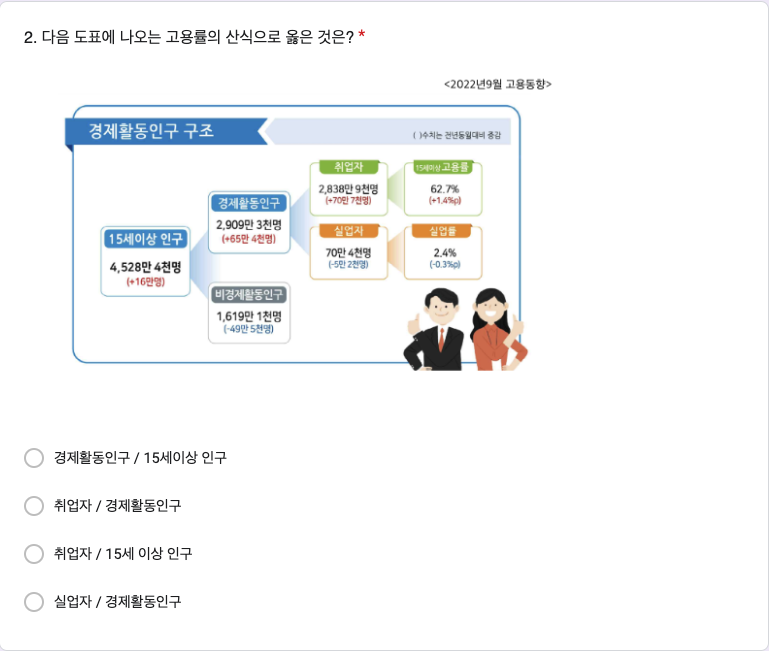

# 9주차 데이터 실험 집계

```{r, include=FALSE}
knitr::opts_chunk$set(echo = TRUE)
library(magrittr)
library(readxl)
library(pander)
library(knitr)
library(extrafont)
library(dplyr)
library(showtext)
font_add(family = "kopub", 
         regular = "/Users/kwlee/Library/Fonts/KoPubWorld Dotum Medium.ttf",
         bold = "/Users/kwlee/Library/Fonts/KoPubWorld Dotum Bold.ttf",
         italic  = "/Users/kwlee/Library/Fonts/KoPubWorld Dotum Light.ttf")
showtext_auto()
panderOptions('table.split.table', Inf)
panderOptions('table.alignment.rownames', 'left')
panderOptions('table.alignment.default', 'left')
options(width=180)
```

## 실험의 목적

9주차 구글 예습 설문지 집계결과를 분석합니다. 

Q1~Q6에서는 랜덤화의 효과로 Red, Black이 얼마나 닮았는지 알아봅니다.

Q7에서는 Default Effects 에 대한 데이터실험 결과에 대하여 분석합니다.

제출시간의 분포가 날마다 고른지, Red, Black 간에는 닮았는지 알아봅니다.

```{r, echo = FALSE, results = 'hide', message = FALSE}
class_roll1025 <- 
  readRDS("./class_roll_241025.RDS")
class_roll1025 %<>% 
  data.frame
class_roll <- 
  read_excel("./data/class_roll241101.xlsx", 
             range = "B1:G801")
class_roll %<>% 
  data.frame
str(class_roll)
names(class_roll) <- c("dept","id", "name", "status", "email", "cell_no")
class_roll$group <- class_roll1025$group[match(class_roll$id, class_roll1025$id)]
saveRDS(class_roll, file = "./class_roll_241101.RDS")
quiz <- 
  read_excel("./data/quiz241028.xlsx",
             range = "A2:N720",
             col_names = FALSE)
str(quiz)
names(quiz) <- 
  c("time", "email", "dept", "id", "name", 
    paste0("Q", 1:6),  "group", "Q7_R", "Q7_B")
class(quiz$id) <- "character"
quiz <- data.frame(quiz)
quiz[c("group", "Q7_R", "Q7_B")]
quiz[quiz$group == "Red", "Q7_R"] <- 
  ifelse(is.na(quiz[quiz$group == "Red", "Q7_R"]), 
         "나는 사후 장기기증에 참여할 뜻이 있다", 
         quiz[quiz$group == "Red", "Q7_R"])
quiz[quiz$group == "Black", "Q7_B"] <- 
  ifelse(is.na(quiz[quiz$group == "Black", "Q7_B"]), 
         "나는 사후 장기기증에 참여할 뜻이 없다", 
         quiz[quiz$group == "Black", "Q7_B"])
quiz$Q7 <- 
  ifelse(is.na(quiz$Q7_R), quiz$Q7_B, quiz$Q7_R)
quiz[c("group", "Q7_R", "Q7_B", "Q7")]
quiz$dept <- factor(quiz$dept)
quiz$group <- 
  factor(quiz$group, levels = c("Red", "Black"))
quiz$Q1 %<>% 
  factor(levels = c("스페인", "미국", "OECD 전체", "대한민국"))
quiz$Q2 %<>% 
  factor(levels = c("경제활동인구 / 15세이상 인구", 
                    "취업자 / 경제활동인구", 
                    "취업자 / 15세 이상 인구",
                    "실업자 / 경제활동인구"))
quiz$Q3 %<>% 
  factor(levels = c("조사 대상 주간 중 수입을 목적으로 1시간 이상 일한 자", 
                    "자기 가구에서 경영하는 농장이나 사업체의 수입을 높이는 데 도운 가족종사자로서 주당 18시간 이상 일한 자", 
                    "조사대상 주간에 일시적으로 병이 나거나, 날씨가 안 좋거나, 휴가 또는 연가, 노동쟁의 등의 이유로 일을 못한 일시 휴직자", 
                    "조사대상 주간에 수입 있는 일을 하지 않았으나, 지난 4주간 구직활동하였으며 즉시 취업 가능한자"))
quiz$Q4 %<>% 
  factor(levels = c("평균 : 100만원, 중위값 : 200만원", 
                    "평균 : 200만원, 중위값 : 100만원", 
                    "평균 : 1,000만원, 중위값 : 100만원", 
                    "평균 : 100만원, 중위값 : 1,000만원"))
quiz$Q5 %<>% 
  factor(levels = c("평균 : 100만원, 중위값 : 200만원", 
                    "평균 : 200만원, 중위값 : 100만원", 
                    "평균 : 1,000만원, 중위값 : 100만원", 
                    "평균 : 100만원, 중위값 : 1,000만원"))
quiz$Q6 %<>% 
  factor(levels = c("\"5%\"", "\"10%\"", "\"15%\"", "\"19.1%\"", "\"25%\""),
         labels = c("5%", "10%", "15%", "19.1%", "25%"))
quiz$Q7 %>%
  table(quiz$group, ., exclude = NULL)
#> `factor`로 변환
quiz$Q7 %<>% 
  factor(level = c("나는 사후 장기기증에 참여할 뜻이 있다", 
                   "나는 사후 장기기증에 참여할 뜻이 없다"), 
         labels = c("사후 장기기증 의사 있음", "사후 장기기증 의사 없음"))
#> 마감기한으로부터 제출시점의 기간
quiz$days <- as.numeric(difftime("2024-11-11 09:00:00", quiz$time, tz = "Asia/Seoul",  units = 'days'))
quiz$hours <- as.numeric(difftime("2024-11-11 09:00:00", quiz$time, tz = "Asia/Seoul", units = 'hours'))
quiz %>% 
  str  
```

```{r, echo = FALSE, results = 'hide'}
#> 학번 잘못 써서 고생시키는 녀석들 찾아내는 코드
wrong_id <- setdiff(quiz$id, class_roll$id)
quiz %>%
  filter(id %in% wrong_id) %>%
  select(id, name, dept, email)
# 1. 잘못된 id 가진 행 찾기
quiz_wrong_ids <- quiz %>%
  anti_join(class_roll, by = "id") 
# 2. 잘못된 id를 따로 저장하고 수정하기
wrong_ids <- quiz_wrong_ids$id
quiz_wrong_ids <- quiz_wrong_ids %>%
  mutate(id = case_when(
    id == "20227131" ~ "20227141",
    id == "20143824" ~ "20183824",
    id == "202425259" ~ "20245259",
    id == "20212556" ~ "20212566",
    id == "060824" ~ "20242616",
    id == "20203731" ~ "20213731",
    id == "20172850" ~ "20182850",
    TRUE ~ id
  ))
# 3. quiz 에서 id 틀린 행을 제거하고 옳은 id 갖춘 행으로 교체하기
quiz <- quiz %>%
  filter(!id %in% wrong_ids) %>%
  bind_rows(quiz_wrong_ids)
# quiz[quiz$id %in% setdiff(quiz$id, class_roll$id), c("id", "name", "dept", "group")]

#> 틀린 학번 수정하여 되돌리기 (작동하지 않음. 참고로만)
# quiz <- quiz %>%
#   #> `left_join`으로 `name`과 `dept`를 기준으로 교정 정보를 추가
#   left_join(class_roll %>% select(id, name, dept), 
#             by = "name", 
#             suffix = c("", "_correct")) %>%
#   #> `id_correct`가 있는 경우 이를 사용하여 `id`를 교정하고, 그렇지 않으면 기존의 `id`를 유지
#   mutate(id = if_else(!is.na(id_correct) & id != id_correct, id_correct, id)) %>%
#   #> 임시로 추가된 `id_correct` 열 제거
#   select(-id_correct)

#> 중복 제출자
quiz %>%
  filter(duplicated(id)) %>%
  select(time, id, name) %>%
  arrange(time)
# which(duplicated(quiz$id)) %>%
#   quiz[., c("id", "name")]
quiz %>%
  filter(name %in% c("최정환"))
# quiz[quiz$name %in% c("최재혁", "박지연"), ] #> 최재혁, 박지연이 중복 제출
quiz <- quiz %>% 
  arrange(id, desc(time)) %>%
  distinct(id, .keep_all = TRUE)
#> 불참자들
absentee <- class_roll %>%
  anti_join(quiz, by = "id") %>%
  select(id, name, group) %>%
  arrange(id)
# absentee <- 
#   class_roll[class_roll$id %in% setdiff(class_roll$id, quiz$id), c("id", "name", "group")] %>%
#   `[`(order(.$name), ) 
absentee %>%
  pander(row.names = FALSE) 
absentee %>%
  count(group) %>%
  print()
# absentee$group %>%
#   table
```

### Red, Black을 잘못 표시한 사람들

```{r, echo = FALSE}
#> group2 생성
quiz <- quiz %>%
  left_join(class_roll %>% select(id, group), by = "id", suffix = c("", "_class_roll")) %>%
  rename(group2 = group_class_roll)

#> group 과 group2가 다른 행 필터링
wrong_group <- quiz %>%
  filter(group2 != group)

#> 잘못된 그룹 정보 출력
# wrong_group %>%
#   select(time, id, group2, group) %>%
#   arrange(time) %>%
#   rename("제출시간" = time, "학번" = id, "랜덤화출석부" = group2, "구글예습퀴즈" = group) %>%
#   pander(row.names = FALSE)

#> 옛 코드
# quiz$group2 <- class_roll$group[match(quiz$id, class_roll$id)]
# wrong_group <- which(quiz$group != quiz$group2)
# class_roll[wrong_group, c("id", "name", "group", "group2")] %>%
#   `colnames<-`(c("학번", "이름", "랜덤화출석부", "구글예습퀴즈")) %>%
#   pander
# quiz[wrong_group, c("time", "id", "name", "group2", "group")] %>%
#   `[`(order(.$time), ) %>%
#   `colnames<-`(c("제출시간", "학번", "이름", "랜덤화출석부", "구글예습퀴즈")) %>%
#   pander(row.name = FALSE)

#> 잘못된 그룹 정보의 테이블 생성 및 출력
wrong_tbl <- 
  table("랜덤화출석부" = quiz$group2, "구글예습퀴즈" = quiz$group)

wrong_tbl %>%
  rbind("계" = colSums(.)) %>%
  pander(row.names = c("Red(랜덤화출석부)", "Black(랜덤화출석부)", "계"), 
         col.names = c("Red(구글예습퀴즈)", "Black(구글예습퀴즈)"))
```

<!--
랜덤화출석부에 있는 Red, Black 과 실제 구글설문에 올린 Red, Black 이 다른 사람들의 수효는 `r nrow(wrong_group)`명입니다. 

Red를 Black 이라고 한 사람이 `r wrong_tbl[1, 2]`명, Black 을 Red 라고 한 사람이 `r wrong_tbl[2, 1]`명입니다. 

두 가지 방법으로 분석합니다.

우선 Red, Black 을 잘못 선택한 `r nrow(wrong_group)`명을 랜덤하게 둘로 나누면 어느 한 쪽 집단에 들어갈 기대인원은 `r nrow(wrong_group)`명을 둘로 나눈 `r nrow(wrong_group) / 2`(명)이고, 표준오차는 `r nrow(wrong_group)`의 제곱근에 1/2을 곱해 준 `r round(sqrt(nrow(wrong_group)) / 2, digits  = 1)`명이 됩니다. 

실제로 Red를 Black 이라고 한 사람수, `r wrong_tbl[1, 2]`명이나 Black 을 Red 라고 한 사람수, `r wrong_tbl[2, 1]`명은 기대인원으로부터 표준오차 범위에 아주 잘 들어갑니다. 

두 번째 분석 방법은 확률을 계산해 보는 것입니다. 

Red, Black 을 잘못 선택한 `r nrow(wrong_group)`명을 랜덤하게 둘로 나눌 때, 실제로 관찰된 `r max(wrong_tbl[1, 2], wrong_tbl[2, 1])`명 이상이나 `r min(wrong_tbl[1, 2], wrong_tbl[2, 1])`명이하로  잘못 선택한 사람수가 나올 가능성은 얼마나 되는가 입니다. 

이 경우 공평한 동전던지기를 확률 법칙으로 표현한 이항분포로부터 계산할 수 있습니다. 

시행횟수가 `r nrow(wrong_group)`이고 한 번 시행에서 성공확률이 1/2 인 이항분포에서 성공횟수가 `r min(wrong_tbl[1, 2], wrong_tbl[2, 1])`이하이거나 `r max(wrong_tbl[1, 2], wrong_tbl[2, 1])`이상을 관찰할 확률은 `r min(1, round(pbinom(min(wrong_tbl[1, 2], wrong_tbl[2, 1]), nrow(wrong_group), 1/2) * 2,  digits = 3))`입니다. 

공평한 동전 던지기에서 앞면이 `r min(wrong_tbl[1, 2], wrong_tbl[2, 1])`개 이하 나오는 확률은 `r max(wrong_tbl[1, 2], wrong_tbl[2, 1])`개 이상 나오는 확률과 같기 때문에 사실상 한쪽만 계산해서 2배 해 주면 됩니다. 

다만, 이번 실험과 같이 3명씩 동일한 결과가 나온 경우에는 중복되는 확률을 빼 주어야 합니다. 

이 값을 p-value 라고 하는데, p-value가 0.05보다 작을 때 **통계적으로 유의한 차이를 관찰**하였다고 말합니다. 

즉, 공평한 동전을 던지는 것과 같은 과정이라고 가정하였을 때 실제로 관찰된 값들이 가정으로부터 얼마나 떨어져 있는지를 표현한 것입니다.

0.05는 이런 실험을 스무 번 정도 반복하면 1번 나올 정도로 드문 사건을 의미합니다. 

즉 가정이 잘못되었다는 것입니다.

그런데 Red, Black 을 잘못 표시한 사람들의 분포에서 관찰된 p-value 는 0.05와는 비교도 안될 정도로 큰 값입니다.

따라서 두 집단이 랜덤화 효과가 작동하여 **통계적으로 유의한 차이를 보이지 않는다**고 할 수 있습니다. 
-->

### 응답인원의 Red, Black

Red 로 응답한 인원은 `r colSums(wrong_tbl)[1]`명, Black 에 응답한 인원은 `r colSums(wrong_tbl)[2]`명입니다. 

전체 응답인원 `r sum(wrong_tbl)` 명을 랜덤하게 둘로 나눌 때 어느 한 쪽의 기대인원은 전체 응답인원의 절반인 `r sum(wrong_tbl) / 2`명이고, 표준오차는 전체 응답인원의 제곱근에 1/2을 곱해 준 `r round(sqrt(sum(wrong_tbl)) * 1 / 2, digits = 1)` 명입니다. 

따라서 Red, Black 각 그룹에 관찰된 인원은 기대인원으로부터 표준오차 범위 안에 들어갑니다.
랜덤화출석부에 있는 Red, Black 과 실제 구글설문에 올린 Red, Black 이 다른 사람들의 수효는 `r nrow(wrong_group)`명입니다. Red를 Black 이라고 한 사람이 `r wrong_tbl[1, 2]`명, Black 을 Red 라고 한 사람이 `r wrong_tbl[2, 1]`명입니다.

## Q1. OECD 2022년 9월 실업률 비교

```{r, echo = FALSE, out.width = "75%", fig.align = "left"}

```

### 실업률 가장 낮은 나라 (집계))

```{r, echo = FALSE, warning = FALSE}
tbl_q1_a <- 
  quiz$Q1 %>% 
  table(quiz$group, ., useNA = "ifany") %>%
  cbind("계" = rowSums(.)) %>%
  rbind("계" = colSums(.))
tbl_q1_a %>% 
  pander 
chisq_test_q1 <- 
  tbl_q1_a %>%
  `[`(-3, -5) %>%
  chisq.test(simulate.p.value = FALSE) 
chisq_test_q1 %>%
  pander
```

Q1의 집계 결과가 Red, Black 간에 통계적으로 유의한 차이가 있는지 알아보기 위하여 카이제곱 테스트를 수행하였습니다. 

그 결과 카이제곱 통계량은 `r chisq_test_q1[1] %>% format(digits = 2, nsmall = 3)`, 자유도는 `r chisq_test_q1[2] %>% format(digits = 2, nsmall = 2)` , p-value 는 `r chisq_test_q1[3] %>% format(digits = 2, nsmall = 4)`이므로 Red, Black 간에 통계적으로 유의한 차이를 보이지 않습니다. 

실제로 닮은 게 느껴집니까?

### 실업률 가장 낮은 나라 (%)

```{r, echo = FALSE}
ptbl_q1 <- 
  tbl_q1_a %>% 
  `[`(3, -5) %>%
  prop.table %>% 
  c("계" = sum(.)) %>%
  `*`(100) 
ptbl_q1 %>%
  format(digits = 2, nsmall = 1) %>%
  pander
```

정답률은 Red, Black 을 합하여 계산하는데, `r ptbl_q1[4] %>% format(digits = 2, nsmall = 1)`(%) 입니다.

## Q2. 고용률의 산식

```{r, echo = FALSE, out.width = "75%", fig.align = "left"}

```

### 고용률?

```{r, echo = FALSE, warning = FALSE}
tbl_q2_a <- quiz$Q2 %>% 
  table(quiz$group, ., useNA = "ifany") %>%
  cbind("계" = rowSums(.)) %>%
  rbind("계" = colSums(.))
tbl_q2_a %>% 
  pander 
chisq_test_q2 <- 
  tbl_q2_a %>%
  `[`(-3, -5) %>%
  chisq.test(simulate.p.value = FALSE) 
chisq_test_q2 %>%
  pander
```

Q2의 집계 결과가 Red, Black 간에 통계적으로 유의한 차이가 있는지 알아보기 위하여 카이제곱 테스트를 수행하였습니다. 

그 결과 카이제곱 통계량은 `r chisq_test_q2[1] %>% format(digits = 2, nsmall = 3)`, 자유도는 `r chisq_test_q2[2] %>% format(digits = 2, nsmall = 2)`, p-value 는 `r chisq_test_q2[3] %>% format(digits = 2, nsmall = 4)`이므로 Red, Black 간에 통계적으로 유의한 차이를 보이지 않습니다. 

실제로 닮은 게 느껴집니까?

### 고용률? (%)

```{r, echo = FALSE}
ptbl_q2 <- 
  tbl_q2_a %>% 
  `[`(3, -5) %>%
  prop.table %>% 
  c("계" = sum(.)) %>%
  `*`(100) 
ptbl_q2 %>%
  format(digits = 2, nsmall = 1) %>%
  pander
```

정답률은 Red, Black 을 합하여 계산하는데, `r ptbl_q2[3] %>% format(digits = 2, nsmall = 1)`(%) 입니다.

## Q3. 취업자의 조건

```{r, echo = FALSE, out.width = "75%", fig.align = "left"}

```

### 취업자란?

```{r, echo = FALSE, warning = FALSE}
tbl_q3_a <- quiz$Q3 %>% 
  table(quiz$group, ., useNA = "ifany") %>%
  cbind("계" = rowSums(.)) %>%
  rbind("계" = colSums(.))
tbl_q3_a %>% 
  pander 
chisq_test_q3 <- 
  tbl_q3_a %>%
  `[`(-3, -5) %>%
  chisq.test(simulate.p.value = FALSE) 
chisq_test_q3 %>%
  pander
```

Q3의 집계 결과가 Red, Black 간에 통계적으로 유의한 차이가 있는지 알아보기 위하여 카이제곱 테스트를 수행하였습니다. 

그 결과 카이제곱 통계량은 `r chisq_test_q3[1] %>% format(digits = 2, nsmall = 3)`, 자유도는 `r chisq_test_q3[2] %>% format(digits = 2, nsmall = 2)`, p-value 는 `r chisq_test_q3[3] %>% format(digits = 2, nsmall = 4)`이므로 Red, Black 간에 통계적으로 유의한 차이를 보이지 않습니다. 

실제로 닮은 게 느껴집니까?

### 취업자란? (%)

```{r, echo = FALSE}
ptbl_q3 <- 
  tbl_q3_a %>% 
  `[`(3, -5) %>%
  prop.table %>% 
  c("계" = sum(.)) %>%
  `*`(100) 
ptbl_q3 %>%
  format(digits = 2, nsmall = 1) %>%
  pander
```

정답률은 Red, Black 을 합하여 계산하는데, `r ptbl_q3[4] %>% format(digits = 2, nsmall = 1)`(%) 입니다.

## Q4. 평균과 중위값

```{r, echo = FALSE, out.width = "75%", fig.align = "left"}

```

### 집계

```{r, echo = FALSE, warning = FALSE}
tbl_q4_a <- quiz$Q4 %>% 
  table(quiz$group, ., useNA = "ifany") %>%
  cbind("계" = rowSums(.)) %>%
  rbind("계" = colSums(.))
tbl_q4_a %>% 
  pander 
chisq_test_q4 <- 
  tbl_q4_a %>%
  `[`(-3, -5) %>%
  chisq.test(simulate.p.value = FALSE) 
chisq_test_q4 %>%
  pander
```

Q4의 집계 결과가 Red, Black 간에 통계적으로 유의한 차이가 있는지 알아보기 위하여 카이제곱 테스트를 수행하였습니다. 

그 결과 카이제곱 통계량은 `r chisq_test_q4[1] %>% format(digits = 2, nsmall = 3)`, 자유도는 `r chisq_test_q4[2] %>% format(digits = 2, nsmall = 2)`, p-value 는 `r chisq_test_q4[3] %>% format(digits = 2, nsmall = 4)`이므로 Red, Black 간에 통계적으로 유의한 차이를 보이지 않습니다. 

실제로 닮은 게 느껴집니까?

### %

```{r, echo = FALSE}
ptbl_q4 <- 
  tbl_q4_a %>% 
  `[`(3, -5) %>%
  prop.table %>% 
  c("계" = sum(.)) %>%
  `*`(100) 
ptbl_q4 %>%
  format(digits = 2, nsmall = 1) %>%
  pander
```

정답률은 Red, Black 을 합하여 계산하는데, `r ptbl_q4[2] %>% format(digits = 2, nsmall = 1)`(%) 입니다.

## Q5. 평균과 중위값

```{r, echo = FALSE, out.width = "75%", fig.align = "left"}

```

### 집계

```{r, self-employed, echo = FALSE, warning = FALSE}
tbl_q5_a <- quiz$Q5 %>%
  table(quiz$group, ., useNA = "ifany") %>%
  cbind("계" = rowSums(.)) %>%
  rbind("계" = colSums(.))
tbl_q5_a %>% 
  pander 
chisq_test_q5 <- 
  tbl_q5_a %>%
  `[`(-3, -5) %>%
  chisq.test(simulate.p.value = FALSE) 
chisq_test_q5 %>%
  pander
```

Q5의 집계 결과가 Red, Black 간에 통계적으로 유의한 차이가 있는지 알아보기 위하여 카이제곱 테스트를 수행하였습니다. 

그 결과 카이제곱 통계량은 `r chisq_test_q5[1] %>% format(digits = 2, nsmall = 3)`, 자유도는 `r chisq_test_q5[2] %>% format(digits = 2, nsmall = 2)`, p-value 는 `r chisq_test_q5[3] %>% format(digits = 2, nsmall = 4)`이므로 Red, Black 간에 통계적으로 유의한 차이를 보이지 않습니다. 

실제로 닮은 게 느껴집니까?

### %

```{r, self-employed in percentage, echo = FALSE}
ptbl_q5 <- 
  tbl_q5_a %>% 
  `[`(3, -5) %>%
  prop.table %>% 
  c("계" = sum(.)) %>%
  `*`(100) 
ptbl_q5 %>%
  format(digits = 2, nsmall = 1) %>%
  pander
```

정답률은 Red, Black 을 합하여 계산하는데, `r ptbl_q5[3] %>% format(digits = 2, nsmall = 1)`(%) 입니다. 

## Q6. 연 500만원 이하 근로소득자의 비율

```{r, echo = FALSE, out.width = "75%", fig.align = "left"}

```

### 집계

```{r, public expenditure, echo = FALSE, warning = FALSE}
tbl_q6_a <- quiz$Q6 %>%
  table(quiz$group, ., useNA = "ifany") %>%
  cbind("계" = rowSums(.)) %>%
  rbind("계" = colSums(.))
tbl_q6_a %>% 
  pander
chisq_test_q6 <- 
  tbl_q6_a %>%
  `[`(-3, -5) %>%
  chisq.test(simulate.p.value = FALSE) 
chisq_test_q6 %>%
  pander
```

Q6의 집계 결과가 Red, Black 간에 통계적으로 유의한 차이가 있는지 알아보기 위하여 카이제곱 테스트를 수행하였습니다. 

그 결과 카이제곱 통계량은 `r chisq_test_q6[1] %>% format(digits = 2, nsmall = 3)`, 자유도는 `r chisq_test_q6[2] %>% format(digits = 2, nsmall = 2)`, p-value 는 `r chisq_test_q6[3] %>% format(digits = 2, nsmall = 4)`이므로 Red, Black 간에 통계적으로 유의한 차이를 보이지 않습니다. 

실제로 닮은 게 느껴집니까?

### %

```{r, public expenditure in percentage, echo = FALSE}
ptbl_q6 <- 
  tbl_q6_a %>% 
  `[`(3, -6) %>%
  prop.table %>% 
  c("계" = sum(.)) %>%
  `*`(100) 
ptbl_q6 %>%
  format(digits = 2, nsmall = 1) %>%
  pander
```

정답률은 Red, Black 을 합하여 계산하는데, `r ptbl_q6[4] %>% format(digits = 2, nsmall = 1)`(%) 입니다. 

## Q7. 디폴트 효과 : "... 하면 표시하세요"의 효과

표시하지 않으면 사후 장기기증 의사가 있는 것으로 간주하는 경우(Red)와 표시하면 사후 장기기증 의사가 있는 것으로 간주하는 경우(Black), 표시하지 않으면 사후 장기기증 의사가 있다고 보는 질문지(Red)에 사후 장기기증 의사 비율이 더 높게 나오는 것으로 알려져 있으나 관찰 결과는 반대로 나옵니다. 

어디에 디폴트를 설정하느냐에 따라 조사결과가 달라지는 것으로 알려져 있으나 응답 결과는 랜덤화 효과에 가깝게 나와서 당황스럽습니다.

```{r, echo = FALSE, out.width = "67%", fig.align = "left"}

```

```{r, echo = FALSE, out.width = "67%", fig.align = "left"}

```

### 집계 (전체)

```{r, vote attitude, echo = FALSE}
tbl_q7_a <- quiz$Q7 %>%
  table(quiz$group, ., useNA = "ifany") %>%
  cbind("계" = rowSums(.)) %>%
  rbind("계" = colSums(.))
rownames(tbl_q7_a)[1:2] <- c("Red(사후 장기기증 의사 없으면 표시)", "Black(사후 장기기증 의사 있으면 표시)")
tbl_q7_a %>% 
  pander
#> 카이제곱 테스트
chisq_test_q7 <- 
  tbl_q7_a %>%
  `[`(-3, -3) %>%
  chisq.test(simulate.p.value = FALSE) 
chisq_test_q7 %>%
  pander
```

Q7의 Red 는 default 가 사후 장기기증 의사가 있는 것으로서 사후 장기기증 의사가 없으면 표시토록 하고, Black 은 default 가 사후 장기기증 의사가 없는 것으로서 사후 장기기증 의사가 있으면 표시토록 합니다.

표시하는 것조차 귀찮은 사람들은 당연히 default 를 따를 것으로 기대되어 Red 에서는 장기기증 의사가 있다는 응답 비율이 더 높고, Black 에서는 장기기증의사가 없다는 응답 비율이 더 높을 것으로 기대되었지만 지난 학기들의 기록이나 이번 학기의 집계결과를 보면 그렇지 않아서 당황스럽습니다.  

여기서 수행하고 있는 카이제곱 테스트는 default 를 어떻게 설정하느냐의 효과가 통계적으로 유의한지 알아보기 위한 것입니다. 

그 결과 카이제곱 통계량은 `r chisq_test_q7[1] %>% format(digits = 2, nsmall = 2)`, 자유도는 `r chisq_test_q7[2] %>% format(digits = 2, nsmall = 2)`, p-value 는 `r chisq_test_q7[3] %>% format(digits = 2, nsmall = 2)`이므로 default의 설정을 바꾼 것은 사후 장기기증 의사에 통계적으로 유의한 차이를 보이지 않습니다. 

### % 비교

```{r, echo = FALSE}
ptbl_q7_a <- 
  tbl_q7_a %>% 
  `[`(-3, -3) %>%
  prop.table(margin = 1) %>% 
  `*`(100) %>%
  cbind("계" = rowSums(.))
ptbl_q7_a %>%
  format(digits = 2, nsmall = 1) %>%
  pander
```

이를 백분율로 살펴보면 사후 장기기증 의사가 없으면 표시하라는 Red에서 사후 장기기증 의사가 있다고 응답한 백분율, `r format(ptbl_q7_a[1, 1], digits = 2, nsmall = 1)`(%)(이)나 사후 장기기증 의사가 있으면 표시하라는 Black 에서 사후 장기기증 의사가 있다고 응답한 백분율, `r format(ptbl_q7_a[2, 1], digits = 2, nsmall = 1)`(%)(이)나 큰 차이가 없어서 default의 설정이 응답에는 통계적으로 유의한 영향을 주지 못한다는 것을 명확히 알 수 있습니다. 

오히려 기대와는 반대로 장기기증 의사가 있으면 표시해야 하는 Black 의 사후 장기기증 의사가 있다는 응답 백분율이 더 높습니다. 

어쨌든 통계적으로 유의한 차이를 관찰하지 못했으므로  Red, Black 은 합쳐서 분석하는 것이 타당합니다. 그 결과는 다음과 같습니다.

### 합산(%)

```{r, echo = FALSE}
ptbl_q7 <- 
  tbl_q7_a %>% 
  `[`(3, -3) %>%
  prop.table %>% 
  c("계" = sum(.)) %>%
  `*`(100) 
ptbl_q7 %>%
  format(digits = 2, nsmall = 1) %>%
  pander
```

사후 장기기증 의사가 있다고 응답한 백분률은 default의 설정과는 무관하게 `r format(ptbl_q7[1], digits = 2, nsmall = 1)`(%)(으)로 절반이 좀 안 되는군요. 

### Mosaic Plot

```{r, mosaic plot1, echo = FALSE, fig.width = 7, fig.height = 5}
library(ggplot2)
source("./mosaic_gg.R")
m_list <- quiz$Q7 %>%
  table(quiz$group, ., useNA = "ifany") %>%
  t %>%
  mosaic_gg
m <- m_list$m
df <- m_list$df
p_df <- m_list$p_df
names(df)[1] <- "Var1"
names(p_df)[1] <- "Var1"
df$Var2 %<>% factor(labels = c("Red(의사 없으면 표시)", "Black(의사 있으면 표시)"))
p_df$Var2 %<>% factor(labels = c("Red(의사 없으면 표시)", "Black(의사 있으면 표시)"))
m + geom_text(aes(x = center, y = 1.05), 
              family = "kopub",
              label = df[, 2]) +
  theme_bw(base_family = "kopub") +
  labs(title = "디폴트 효과", x = "Red or Black(누적 %)", y = "인원(%, 명)") +
  scale_fill_brewer(name = "응답", 
                    labels = c("의사 있음", "의사 없음"),
                    type = "qual", 
                    palette = "Set2", 
                    direction = 1) +
  theme(plot.title = element_text(hjust = 0.5, 
                                  size = 18, 
                                  family = "kopub",
                                  face = "bold")) 
ggsave("./pics/Quiz241028_Q7_RnB.png", dpi = 120, width = 960, height = 840, units = "px")
```

Mosaic Plot 은 이 집계결과를 시각적으로 잘 보여줍니다. 

default 의 설정에 거의 무관할 정도로 응답이 비슷하기 때문에 Red, Black 이 닮았고, 사후 장기기증 의사가 있다고 응답한 백분율도 닮은 것을 잘 알 수 있습니다.

## Thinking, Fast and Slow

### Article

```{r, echo = FALSE, out.width = "50%", fig.align = "left"}

```

우리의 관찰은 Thinking, Fast and Slow (Daniel Kahneman, 2011) 의 default effects 에서 소개한 유럽의 사례와는 아주 차이가 많이 납니다. 

2003년 오스트리아는 100%, 스웨덴은 86%가 사후 장기기증 의사가 있다고 한 반면에 독일은 12%, 덴마크는 4% 밖에 사후 장기기증 의사가 있다는 조사 결과가 나왔습니다.

### Facts Found

```{r, echo = FALSE, out.width = "50%", fig.align = "left"}

```

여기서 결정적인 차이는 오스트리아와 스웨덴은 사후 장기기증 의사가 없으면 표시를 해야 하고, 독일과 덴마크는 사후 장기기증 의사가 있으면 표시를 해야 하는 시스템이었다는 점입니다. 

여러분들의 응답과는 아주 다른 상황이죠? 

### Original Article (Johnson & Goldstein 2003)

```{r, echo = FALSE, out.width = "50%", fig.align = "left"}

```

Johnson and Goldstein의 원전에 나오는 그래프를 옮겨 왔습니다. 

황금색으로 표시한 나라들은 사후 장기기증 의사를 직접 표시해야 하는 나라들이고 하늘색으로 표시한 나라들은 사후 장기기증 의사를 default 로 하여 사후 장기기증 의사가 없으면 직접 표시해야 하는 나라들입니다. 

여기서 오스트리아, 독일, 스웨덴, 덴마크의 수치를 확인해 보세요.

## 마감 시간으로부터 제출 시간의 분포

### 분포표

```{r, echo = FALSE, warning = FALSE}
N <- nrow(quiz)
days_tbl <- 
  quiz$days %>%
  cut(breaks = c(0:14), include.lowest = TRUE) %>%
  table(quiz$group, .) 
days_tbl %>%
  cbind("계" = rowSums(.)) %>%
  rbind("계" = colSums(.)) %>%
  `colnames<-`(., c(paste0(14:1, "일"), "계")) %>%
  pander(caption = "일 단위")
```

분포표로부터 두 가지 문제를 살펴보겠습니다. 

첫째, 날마다 고르게 제출하는가? 

둘째, Red, Black 간에 통계적으로 유의한 차이가 있는가?

각 문제를 살펴보기 위해서는 분포표의 일부분을 대상으로 카이제곱 테스트를 수행합니다.

### 날마다 고르게 제출하는가?

```{r, echo = FALSE, warning = FALSE}
days_tbl %>%
  rbind("계" = colSums(.)) %>%
  `[`(3, 1:14) %>%
  `names<-`(., paste0(14:1, "일")) %>%
  pander
days_chisq_test <-
  days_tbl %>%
  rbind("계" = colSums(.)) %>%
  `[`(3, 1:14) %>%
  chisq.test(simulate.p.value = FALSE) 
days_chisq_test %>%
  pander
```

날마다 고르게 제출하는지 알아 보았습니다. 

분포표의 "계"행에서 '계'열을 제외하고 카이제곱테스트를 수행합니다. 

분포표 만으로도 쉽게 파악할 수 있지만 카이제곱테스트가 명확히 해 줍니다. 

카이제곱 통계량은 `r format(days_chisq_test[1], digits = 2, nsmall = 2)`, 자유도는 `r format(days_chisq_test[2], digits = 2, nsmall = 2)`, p-value 는 `r format(days_chisq_test[3], digits = 2, nsmall = 2)` 이므로 날짜별로 고르게 제출하고 있지 않음을 시사합니다. 

막대그래프로 살펴 보겠습니다.

### 막대그래프

```{r, echo = FALSE}
# png(file = "./pics/2302/quiz_submission_8.png", width = 640, height = 480)
suppressMessages({
par(family = "kopub")
b <- 
  quiz$days %>%
  cut(breaks = c(0:14), include.lowest = TRUE) %>%
  table %>%
  rev %>%
  barplot(space = 0, names.arg = rep(c("월", "화", "수", "목", "금", "토", "일"), 2),
          col = c(rep("white", 13), "pink"),
          ylim = c(0, 300)) 
text(x = b[14, 1], y = sum(days_tbl[, 1]), 
     labels = paste0(sum(days_tbl[, 1]), "명"), pos = 3)
text(x = b[14, 1], y = sum(days_tbl[, 1]) / 2, 
     labels = paste0(format(sum(days_tbl[, 1]) / N * 100, digits = 1, nsmall = 0), "%"))
title(main = paste0("Quiz241028 (", N, "명 제출)"))
# title(main = "일 단위 퀴즈 제출 인원", sub = paste0("Quiz230925 (", N, "명 제출)"))
dev.copy(png, file = "./pics/2402/quiz_submission_9.png", width = 640, height = 480)
invisible(dev.off())
})
```

### Red, Black 간에 닮았는가?

```{r, echo = FALSE, warning = FALSE}
days_tbl %>%
  rbind("계" = colSums(.)) %>%
  `[`(-3, 1:14) %>%
  `colnames<-`(., paste0(14:1, "일")) %>%
  pander
days_RnB_chisq_test <-
  days_tbl %>%
  `[`(-3, 1:14) %>%
  chisq.test(simulate.p.value = FALSE) 
days_RnB_chisq_test %>%
  pander
```

제출시간의 분포가 Red, Black 간에 닮았는지 알아 보았습니다. 

이번에는 분포표의 첫번째와 두번째 행, '계'열을 제외한 나머지 열에 대해서 카이제곱테스트를 수행합니다. 

카이제곱 통계량은 `r format(days_RnB_chisq_test[1], digits = 2, nsmall = 3)`, 자유도는 `r format(days_RnB_chisq_test[2], digits = 2, nsmall = 2)`, p-value 는 `r format(days_RnB_chisq_test[3], digits = 2, nsmall = 4)`이므로 제출 시간의 분포는 Red, Black 간에 통계적으로 유의한 차이가 관찰되지 않습니다. 

이 사실을 Mosaic Plot 을 이용하여 시각적으로 살펴보겠습니다. 닮았다고 느껴지나요?

### Mosaic Plot

```{r, echo = FALSE, fig.width = 10, fig.height = 5}
library(ggplot2)
source("./mosaic_gg.R")
m2_list <- days_tbl[, 14:1] %>%
  mosaic_gg
m2 <- m2_list$m
df2 <- m2_list$df
p_df2 <- m2_list$p_df
names(df2[, 2]) <- "Days"
m2 + geom_text(aes(x = center, y = 1.05), 
              family = "kopub",
              label = rep(rep(c("월", "화", "수", "목", "금", "토", "일"), each = 2), times = 2)) +
  theme_bw(base_family = "kopub") +
  labs(title = "마감일로부터 제출시간의 분포", x = "마감일로부터 일수(누적 %)", y = "인원 백분율(%)") +
  scale_fill_brewer(name = "그룹", 
                    labels = c("Red", 
                               "Black"),
                    type = "qual", 
                    palette = "Set1", 
                    direction = 1) +
  theme(plot.title = element_text(hjust = 0.5, 
                                  size = 18, 
                                  family = "kopub",
                                  face = "bold"),
        axis.text.x = element_text(angle = -90, vjust = 0.5)) 
ggsave("./pics/Quiz241028_submission_9.png", dpi = 120, width = 960, height = 840, units = "px")
```

```{r, echo = FALSE}
saveRDS(quiz, file = "quiz241028.RDS")
# save.image("quiz241028.RData")
```
