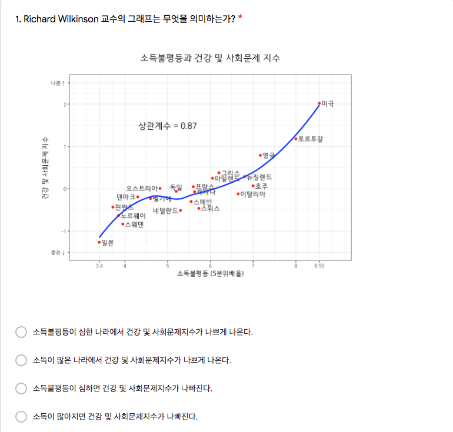
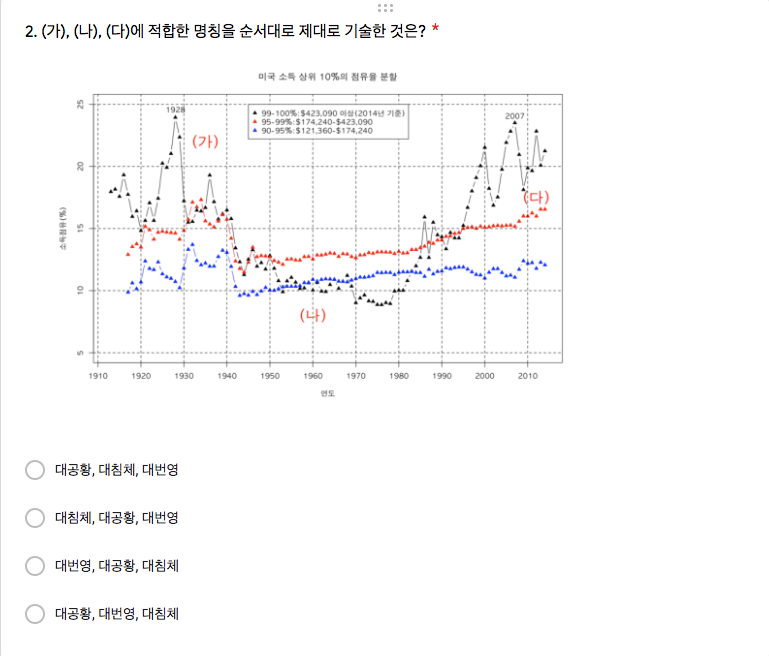
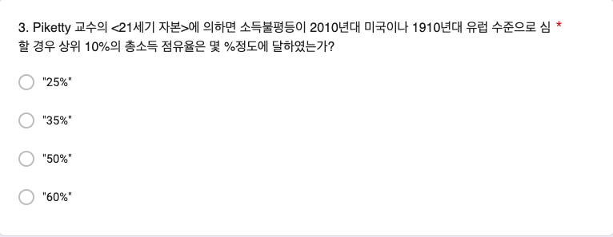
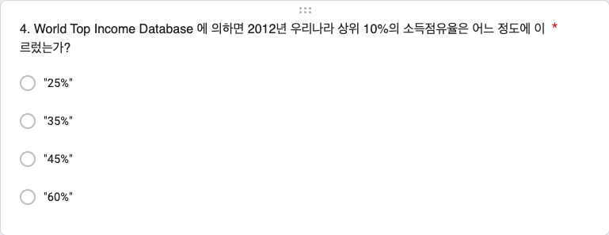
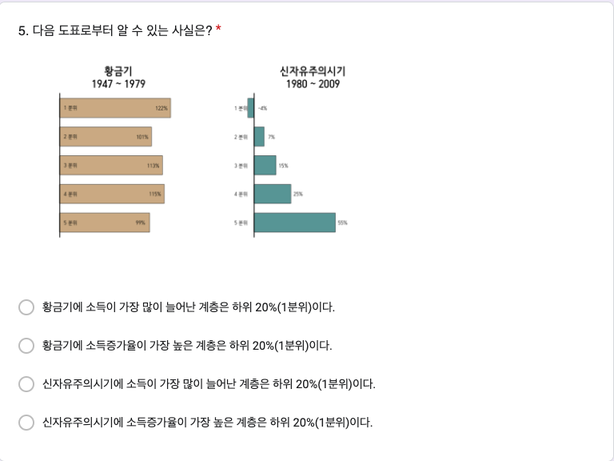
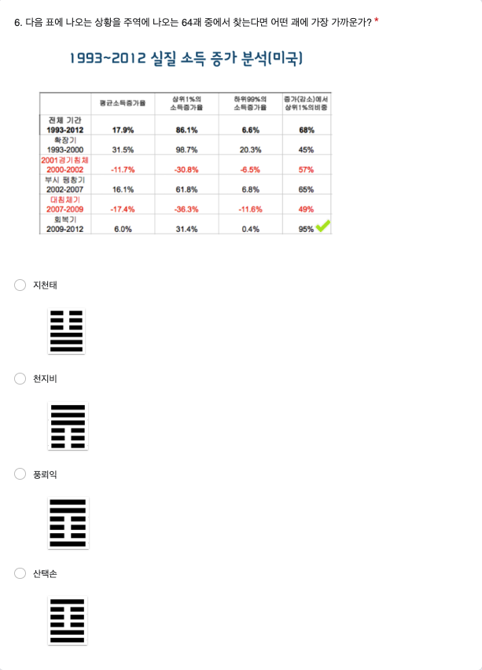

# 10주차 데이터 실험 집계

```{r, include=FALSE}
knitr::opts_chunk$set(echo = TRUE)
library(readxl)
library(pander)
library(knitr)
library(magrittr)
library(dplyr)
library(showtext)
font_add(family = "kopub", 
         regular = "/Users/kwlee/Library/Fonts/KoPubWorld Dotum Medium.ttf",
         bold = "/Users/kwlee/Library/Fonts/KoPubWorld Dotum Bold.ttf",
         italic  = "/Users/kwlee/Library/Fonts/KoPubWorld Dotum Light.ttf")
showtext_auto()
panderOptions('table.split.table', Inf)
panderOptions('table.alignment.rownames', 'left')
panderOptions('table.alignment.default', 'left')
options(width = 180)
```

## 실험의 목적

10주차 구글 예습 설문지 집계결과를 분석합니다. 

Q1~Q6에서는 랜덤화의 효과로 Red, Black 이 얼마나 닮았는지 알아봅니다.

Q7에서는 Prospect Theory 에서 이득은 확고히 하고 손실은 회피하려는 심리에 대해서 살펴봅니다.

제출시간의 분포가 날마다 고른지, Red, Black 간에는 닮았는지 알아봅니다.

```{r, echo = FALSE, results = 'hide', message = FALSE}
class_roll1101 <- 
  readRDS("./class_roll_241101.RDS")
class_roll1101 %<>% 
  data.frame
#> 11월 8일 출석부로 업데이트할 부분
class_roll <- 
  read_excel("./data/class_roll241108.xlsx", 
             range = "B1:G801")
class_roll %<>% 
  data.frame
str(class_roll)
names(class_roll) <- c("dept","id", "name", "status", "email", "cell_no")
class_roll$group <- class_roll1101$group[match(class_roll$id, class_roll1101$id)]
saveRDS(class_roll, file = "./class_roll_241108.RDS")
quiz <- 
  read_excel("./data/quiz241104.xlsx",
             range = "A2:N721",
             col_names = FALSE)
str(quiz)
names(quiz) <- 
  c("time", "email", "dept", "id", "name", paste0("Q", 1:6),  "group", "Q7_R", "Q7_B")
# class(quiz$id) <- "character"
class(quiz$id) <- "character"
quiz <- data.frame(quiz)
quiz[c("group", "Q7_R", "Q7_B")]
quiz$Q7 <- ifelse(is.na(quiz$Q7_R), quiz$Q7_B, quiz$Q7_R)
quiz$Q7 %<>% 
  strsplit(split = " : ") %>% 
  sapply(`[`, 1)
quiz[c("group", "Q7_R", "Q7_B", "Q7")]
quiz$dept <- factor(quiz$dept)
quiz$group <- factor(quiz$group, 
                         levels = c("Red", "Black"))
quiz$Q1 %<>% 
  factor(levels = c("소득불평등이 심한 나라에서 건강 및 사회문제지수가 나쁘게 나온다.", 
                    "소득이 많은 나라에서 건강 및 사회문제지수가 나쁘게 나온다.", 
                    "소득불평등이 심하면 건강 및 사회문제지수가 나빠진다.", 
                    "소득이 많아지면 건강 및 사회문제지수가 나빠진다."))
quiz$Q2 %<>% 
  factor(levels = c("대공황, 대침체, 대번영", 
                    "대침체, 대공황, 대번영", 
                    "대번영, 대공황, 대침체", 
                    "대공황, 대번영, 대침체"))
quiz$Q3 %<>% 
  factor(levels = c("\"25%\"", "\"35%\"", "\"50%\"", "\"60%\""), 
         labels = c("25%", "35%", "50%", "60%"))
quiz$Q4 %<>% 
  factor(levels = c("\"25%\"", "\"35%\"", "\"45%\"", "\"60%\""), 
         labels = c("25%", "35%", "45%", "60%"))
quiz$Q5 %<>% 
  factor(levels = c("황금기에 소득이 가장 많이 늘어난 계층은 하위 20%(1분위)이다.", 
                    "황금기에 소득증가율이 가장 높은 계층은 하위 20%(1분위)이다.", 
                    "신자유주의시기에 소득이 가장 많이 늘어난 계층은 하위 20%(1분위)이다.", 
                    "신자유주의시기에 소득증가율이 가장 높은 계층은 하위 20%(1분위)이다."))
quiz$Q6 %<>% 
  factor(levels = c("지천태", "천지비", "풍뢰익", "산택손"))
quiz$Q7 %<>% 
  factor(levels = c("A", "B"))
# quiz$Q7.2 <- quiz$Q7
# quiz$Q7.2[quiz$group == "Black"] <- factor(quiz$Q7.2[quiz$group == "Black"], levels = c("A", "B"), labels = c("100%확률로 잃기", "90%확률로 잃기"))
# quiz$Q7.2[quiz$group == "Red"] <- factor(quiz$Q7.2[quiz$group == "Red"], levels = c("A", "B"), labels = c("100%확률로 따기", "90%확률로 따기"))

#> 마감기한으로부터 제출시점의 기간
quiz$days <- 
  as.numeric(difftime("2024-11-18 09:00:00", quiz$time, tz = "Asia/Seoul",  units = 'days'))
quiz$hours <- 
  as.numeric(difftime("2024-11-18 09:00:00", quiz$time, tz = "Asia/Seoul", units = 'hours'))
str(quiz)
```

```{r, echo = FALSE, results = 'hide'}
#> 학번 잘못 써서 고생시키는 녀석들 찾아내는 코드
wrong_id <- setdiff(quiz$id, class_roll$id)
quiz %>%
  filter(id %in% wrong_id) %>%
  select(id, name, dept, email)
# 1. 잘못된 id 가진 행 찾기
quiz_wrong_ids <- quiz %>%
  anti_join(class_roll, by = "id") 
# 2. 잘못된 id를 따로 저장하고 수정하기
wrong_ids <- quiz_wrong_ids$id
quiz_wrong_ids <- quiz_wrong_ids %>%
  mutate(id = case_when(
    id == "20203312" ~ "20203321",
    id == "20236706" ~ "20236705",
    TRUE ~ id
  ))
# 3. quiz 에서 id 틀린 행을 제거하고 옳은 id 갖춘 행으로 교체하기
quiz <- quiz %>%
  filter(!id %in% wrong_ids) %>%
  bind_rows(quiz_wrong_ids)
# quiz[quiz$id %in% setdiff(quiz$id, class_roll$id), c("id", "name", "dept", "group")]

#> 틀린 학번 수정하여 되돌리기 (작동하지 않음. 참고로만)
# quiz <- quiz %>%
#   #> `left_join`으로 `name`과 `dept`를 기준으로 교정 정보를 추가
#   left_join(class_roll %>% select(id, name, dept), 
#             by = "name", 
#             suffix = c("", "_correct")) %>%
#   #> `id_correct`가 있는 경우 이를 사용하여 `id`를 교정하고, 그렇지 않으면 기존의 `id`를 유지
#   mutate(id = if_else(!is.na(id_correct) & id != id_correct, id_correct, id)) %>%
#   #> 임시로 추가된 `id_correct` 열 제거
#   select(-id_correct)

#> 중복 제출자
quiz %>%
  filter(duplicated(id)) %>%
  select(time, id, name) %>%
  arrange(time)
# which(duplicated(quiz$id)) %>%
#   quiz[., c("id", "name")]
quiz %>%
  filter(name %in% c("최정환"))
quiz <- quiz %>% 
  arrange(id, desc(time)) %>%
  distinct(id, .keep_all = TRUE)
#> 불참자들
absentee <- class_roll %>%
  anti_join(quiz, by = "id") %>%
  select(id, name, group) %>%
  arrange(id)
# absentee <- 
#   class_roll[class_roll$id %in% setdiff(class_roll$id, quiz$id), c("id", "name", "group")] %>%
#   `[`(order(.$name), ) 
absentee %>%
  pander(row.names = FALSE) 
absentee %>%
  count(group) %>%
  print()
# absentee$group %>%
#   table
```

### Red, Black을 잘못 표시한 사람들

```{r, echo = FALSE}
#> group2 생성
quiz <- quiz %>%
  left_join(class_roll %>% select(id, group), by = "id", suffix = c("", "_class_roll")) %>%
  rename(group2 = group_class_roll)

#> group 과 group2가 다른 행 필터링
wrong_group <- quiz %>%
  filter(group2 != group)

#> 잘못된 그룹 정보 출력
# wrong_group %>%
#   select(time, id, group2, group) %>%
#   arrange(time) %>%
#   rename("제출시간" = time, "학번" = id, "랜덤화출석부" = group2, "구글예습퀴즈" = group) %>%
#   pander(row.names = FALSE)

#> 옛 코드
# quiz$group2 <- class_roll$group[match(quiz$id, class_roll$id)]
# wrong_group <- which(quiz$group != quiz$group2)
# class_roll[wrong_group, c("id", "name", "group", "group2")] %>%
#   `colnames<-`(c("학번", "이름", "랜덤화출석부", "구글예습퀴즈")) %>%
#   pander
# quiz[wrong_group, c("time", "id", "name", "group2", "group")] %>%
#   `[`(order(.$time), ) %>%
#   `colnames<-`(c("제출시간", "학번", "이름", "랜덤화출석부", "구글예습퀴즈")) %>%
#   pander(row.name = FALSE)

#> 잘못된 그룹 정보의 테이블 생성 및 출력
wrong_tbl <- 
  table("랜덤화출석부" = quiz$group2, "구글예습퀴즈" = quiz$group)

wrong_tbl %>%
  rbind("계" = colSums(.)) %>%
  pander(row.names = c("Red(랜덤화출석부)", "Black(랜덤화출석부)", "계"), 
         col.names = c("Red(구글예습퀴즈)", "Black(구글예습퀴즈)"))
```

<!--
랜덤화출석부에 있는 Red, Black 과 실제 구글설문에 올린 Red, Black 이 다른 사람들의 수효는 `r nrow(wrong_group)`명입니다. 

Red를 Black 이라고 한 사람이 `r wrong_tbl[1, 2]`명, Black 을 Red 라고 한 사람이 `r wrong_tbl[2, 1]`명입니다. 

두 가지 방법으로 분석합니다.

우선 Red, Black 을 잘못 선택한 `r nrow(wrong_group)`명을 랜덤하게 둘로 나누면 어느 한 쪽 집단에 들어갈 기대인원은 `r nrow(wrong_group)`명을 둘로 나눈 `r nrow(wrong_group) / 2`(명)이고, 표준오차는 `r nrow(wrong_group)`의 제곱근에 1/2을 곱해 준 `r round(sqrt(nrow(wrong_group)) / 2, digits  = 1)`명이 됩니다. 

실제로 Red를 Black 이라고 한 사람수, `r wrong_tbl[1, 2]`명이나 Black 을 Red 라고 한 사람수, `r wrong_tbl[2, 1]`명은 기대인원으로부터 표준오차 범위에 아주 잘 들어갑니다. 

두 번째 분석 방법은 확률을 계산해 보는 것입니다. 

Red, Black 을 잘못 선택한 `r nrow(wrong_group)`명을 랜덤하게 둘로 나눌 때, 실제로 관찰된 `r max(wrong_tbl[1, 2], wrong_tbl[2, 1])`명 이상이나 `r min(wrong_tbl[1, 2], wrong_tbl[2, 1])`명이하로  잘못 선택한 사람수가 나올 가능성은 얼마나 되는가 입니다. 

이 경우 공평한 동전던지기를 확률 법칙으로 표현한 이항분포로부터 계산할 수 있습니다. 

시행횟수가 `r nrow(wrong_group)`이고 한 번 시행에서 성공확률이 1/2 인 이항분포에서 성공횟수가 `r min(wrong_tbl[1, 2], wrong_tbl[2, 1])`이하이거나 `r max(wrong_tbl[1, 2], wrong_tbl[2, 1])`이상을 관찰할 확률은 `r min(1, round(pbinom(min(wrong_tbl[1, 2], wrong_tbl[2, 1]), nrow(wrong_group), 1/2) * 2,  digits = 3))`입니다. 

공평한 동전 던지기에서 앞면이 `r min(wrong_tbl[1, 2], wrong_tbl[2, 1])`개 이하 나오는 확률은 `r max(wrong_tbl[1, 2], wrong_tbl[2, 1])`개 이상 나오는 확률과 같기 때문에 사실상 한쪽만 계산해서 2배 해 주면 됩니다. 

다만, 이번 실험과 같이 3명씩 동일한 결과가 나온 경우에는 중복되는 확률을 빼 주어야 합니다. 

이 값을 p-value 라고 하는데, p-value가 0.05보다 작을 때 **통계적으로 유의한 차이를 관찰**하였다고 말합니다. 

즉, 공평한 동전을 던지는 것과 같은 과정이라고 가정하였을 때 실제로 관찰된 값들이 가정으로부터 얼마나 떨어져 있는지를 표현한 것입니다.

0.05는 이런 실험을 스무 번 정도 반복하면 1번 나올 정도로 드문 사건을 의미합니다. 

즉 가정이 잘못되었다는 것입니다.

그런데 Red, Black 을 잘못 표시한 사람들의 분포에서 관찰된 p-value 는 0.05와는 비교도 안될 정도로 큰 값입니다.

따라서 두 집단이 랜덤화 효과가 작동하여 **통계적으로 유의한 차이를 보이지 않는다**고 할 수 있습니다. 
-->

### 응답인원의 Red, Black

Red 로 응답한 인원은 `r colSums(wrong_tbl)[1]`명, Black 에 응답한 인원은 `r colSums(wrong_tbl)[2]`명입니다. 

전체 응답인원 `r sum(wrong_tbl)` 명을 랜덤하게 둘로 나눌 때 어느 한 쪽의 기대인원은 전체 응답인원의 절반인 `r sum(wrong_tbl) / 2`명이고, 표준오차는 전체 응답인원의 제곱근에 1/2을 곱해 준 `r round(sqrt(sum(wrong_tbl)) * 1 / 2, digits = 1)` 명입니다. 

따라서 Red, Black 각 그룹에 관찰된 인원은 기대인원으로부터 표준오차 범위 안에 들어갑니다.
랜덤화출석부에 있는 Red, Black 과 실제 구글설문에 올린 Red, Black 이 다른 사람들의 수효는 `r nrow(wrong_group)`명입니다. Red를 Black 이라고 한 사람이 `r wrong_tbl[1, 2]`명, Black 을 Red 라고 한 사람이 `r wrong_tbl[2, 1]`명입니다.

## Q1. Wilkinson

```{r, echo = FALSE, out.width = "75%"}

```

### 소득불평등과 건강 및 사회문제 지표

```{r, inequality, echo = FALSE, warning = FALSE}
tbl_q1_a <- quiz$Q1 %>%
  table(quiz$group, ., useNA = "ifany") %>%
  cbind("계" = rowSums(.)) %>%
  rbind("계" = colSums(.))
tbl_q1_a %>% 
  pander 
chisq_test_q1 <- 
  tbl_q1_a %>%
  `[`(-3, -5) %>%
  chisq.test(simulate.p.value = FALSE) 
chisq_test_q1 %>%
  pander
```

Q1의 집계 결과가 Red, Black 간에 통계적으로 유의한 차이가 있는지 알아보기 위하여 카이제곱 테스트를 수행하였습니다. 

그 결과 카이제곱 통계량은 `r chisq_test_q1[1] %>% format(digits = 2, nsmall = 3)`, 자유도는 `r chisq_test_q1[2] %>% format(digits = 2, nsmall = 2)` , p-value 는 `r chisq_test_q1[3] %>% format(digits = 2, nsmall = 4)`이므로 Red, Black 간에 통계적으로 유의한 차이를 보이지 않습니다. 

실제로 닮은 게 느껴집니까?

### 소득불평등과 건강 및 사회문제 지표 (%)

```{r, inequality in percentage, echo = FALSE}
ptbl_q1 <- 
  tbl_q1_a %>% 
  `[`(3, -5) %>%
  prop.table %>% 
  c("계" = sum(.)) %>%
  `*`(100) 
ptbl_q1 %>%
  format(digits = 2, nsmall = 1) %>%
  pander
```

정답률은 Red, Black 을 합하여 계산하는데, `r ptbl_q1[1] %>% format(digits = 2, nsmall = 1)`(%) 입니다.

## Q2. 소득 상위1%의 몫과 시대적 사건들

```{r, echo = FALSE, out.width = "75%"}

```

### 대공황. 대번영, 대침체

```{r, times, echo = FALSE, warning = FALSE}
tbl_q2_a <- quiz$Q2 %>% 
  table(quiz$group, ., useNA = "ifany") %>%
  cbind("계" = rowSums(.)) %>%
  rbind("계" = colSums(.))
tbl_q2_a %>% 
  pander 
chisq_test_q2 <- 
  tbl_q2_a %>%
  `[`(-3, -5) %>%
  chisq.test(simulate.p.value = FALSE) 
chisq_test_q2 %>%
  pander
```

Q2의 집계 결과가 Red, Black 간에 통계적으로 유의한 차이가 있는지 알아보기 위하여 카이제곱 테스트를 수행하였습니다. 

그 결과 카이제곱 통계량은 `r chisq_test_q2[1] %>% format(digits = 2, nsmall = 3)`, 자유도는 `r chisq_test_q2[2] %>% format(digits = 2, nsmall = 2)`, p-value 는 `r chisq_test_q2[3] %>% format(digits = 2, nsmall = 4)`이므로 Red, Black 간에 통계적으로 유의한 차이를 보이지 않습니다. 

실제로 닮은 게 느껴집니까?

### 대공황. 대번영, 대침체(%)

```{r, times in percentage, echo = FALSE}
ptbl_q2 <- 
  tbl_q2_a %>% 
  `[`(3, -5) %>%
  prop.table %>% 
  c("계" = sum(.)) %>%
  `*`(100) 
ptbl_q2 %>%
  format(digits = 2, nsmall = 1) %>%
  pander
```

정답률은 Red, Black 을 합하여 계산하는데, `r ptbl_q2[4] %>% format(digits = 2, nsmall = 1)`(%) 입니다.

## Q3. Piketty의 21세기 자본

```{r, echo = FALSE, out.width = "75%"}

```

### 상위10%의 총소득 점유율

```{r, echo = FALSE, warning = FALSE}
tbl_q3_a <- quiz$Q3 %>%
  table(quiz$group, ., useNA = "ifany") %>%
  cbind("계" = rowSums(.)) %>%
  rbind("계" = colSums(.))
tbl_q3_a %>% 
  pander
chisq_test_q3 <- 
  tbl_q3_a %>%
  `[`(-3, -5) %>%
  chisq.test(simulate.p.value = FALSE) 
chisq_test_q3 %>%
  pander
```

Q3의 집계 결과가 Red, Black 간에 통계적으로 유의한 차이가 있는지 알아보기 위하여 카이제곱 테스트를 수행하였습니다. 

그 결과 카이제곱 통계량은 `r chisq_test_q3[1] %>% format(digits = 2, nsmall = 3)`, 자유도는 `r chisq_test_q3[2] %>% format(digits = 2, nsmall = 2)`, p-value 는 `r chisq_test_q3[3] %>% format(digits = 2, nsmall = 4)`이므로 Red, Black 간에 통계적으로 유의한 차이를 보이지 않습니다. 

실제로 닮은 게 느껴집니까?

### 상위10%의 총소득 점유율 (%)

```{r, echo = FALSE}
ptbl_q3 <- 
  tbl_q3_a %>% 
  `[`(3, -5) %>%
  prop.table %>% 
  c("계" = sum(.)) %>%
  `*`(100) 
ptbl_q3 %>%
  format(digits = 2, nsmall = 1) %>%
  pander
```

정답률은 Red, Black 을 합하여 계산하는데, `r ptbl_q3[3] %>% format(digits = 2, nsmall = 1)`(%) 입니다.

## Q4. World Top Income Database

```{r, echo = FALSE, out.width = "75%"}

```

### 우리나라 상위10%의 소득점유율

```{r, echo = FALSE, warning = FALSE}
tbl_q4_a <- quiz$Q4 %>% 
  table(quiz$group, ., useNA = "ifany") %>%
  cbind("계" = rowSums(.)) %>%
  rbind("계" = colSums(.))
tbl_q4_a %>% 
  pander 
chisq_test_q4 <- 
  tbl_q4_a %>%
  `[`(-3, -5) %>%
  chisq.test(simulate.p.value = FALSE) 
chisq_test_q4 %>%
  pander
```

Q4의 집계 결과가 Red, Black 간에 통계적으로 유의한 차이가 있는지 알아보기 위하여 카이제곱 테스트를 수행하였습니다. 

그 결과 카이제곱 통계량은 `r chisq_test_q4[1] %>% format(digits = 2, nsmall = 3)`, 자유도는 `r chisq_test_q4[2] %>% format(digits = 2, nsmall = 2)`, p-value 는 `r chisq_test_q4[3] %>% format(digits = 2, nsmall = 4)`이므로 Red, Black 간에 통계적으로 유의한 차이를 보이지 않습니다. 

실제로 닮은 게 느껴집니까?

### 우리나라 상위10%의 소득점유율(%)

```{r, echo = FALSE}
ptbl_q4 <- 
  tbl_q4_a %>% 
  `[`(3, -5) %>%
  prop.table %>% 
  c("계" = sum(.)) %>%
  `*`(100) 
ptbl_q4 %>%
  format(digits = 2, nsmall = 1) %>%
  pander
```

정답률은 Red, Black 을 합하여 계산하는데, `r ptbl_q4[3] %>% format(digits = 2, nsmall = 1)`(%) 입니다.

## Q5. 황금기와 신자유주의 시기

```{r, echo = FALSE, out.width = "75%"}

```

### 5분위별 소득증가율 비교 

```{r, echo = FALSE, warning = FALSE}
tbl_q5_a <- quiz$Q5 %>%
  table(quiz$group, ., useNA = "ifany") %>%
  cbind("계" = rowSums(.)) %>%
  rbind("계" = colSums(.))
tbl_q5_a %>% 
  pander 
chisq_test_q5 <- 
  tbl_q5_a %>%
  `[`(-3, -5) %>%
  chisq.test(simulate.p.value = FALSE) 
chisq_test_q5 %>%
  pander
```

Q5의 집계 결과가 Red, Black 간에 통계적으로 유의한 차이가 있는지 알아보기 위하여 카이제곱 테스트를 수행하였습니다. 

그 결과 카이제곱 통계량은 `r chisq_test_q5[1] %>% format(digits = 2, nsmall = 3)`, 자유도는 `r chisq_test_q5[2] %>% format(digits = 2, nsmall = 2)`, p-value 는 `r chisq_test_q5[3] %>% format(digits = 2, nsmall = 4)`이므로 Red, Black 간에 통계적으로 유의한 차이를 보이고 있습니다. 

실제로 닮은 게 느껴집니까?

### 5분위별 소득증가율 비교 (%)

```{r, echo = FALSE}
ptbl_q5 <- 
  tbl_q5_a %>% 
  `[`(3, -5) %>%
  prop.table %>% 
  c("계" = sum(.)) %>%
  `*`(100) 
ptbl_q5 %>%
  format(digits = 2, nsmall = 1) %>%
  pander
```

정답률은 Red, Black 을 합하여 계산하는데, `r ptbl_q5[2] %>% format(digits = 2, nsmall = 1)`(%) 입니다.

## Q6. 주역 

```{r, echo = FALSE, out.width = "75%"}

```

### 천지비

```{r, echo = FALSE, warning = FALSE}
tbl_q6_a <- quiz$Q6 %>%
  table(quiz$group, ., useNA = "ifany") %>%
  cbind("계" = rowSums(.)) %>%
  rbind("계" = colSums(.))
tbl_q6_a %>% 
  pander
chisq_test_q6 <- 
  tbl_q6_a %>%
  `[`(-3, -5) %>%
  chisq.test(simulate.p.value = FALSE) 
chisq_test_q6 %>%
  pander
```

Q6의 집계 결과가 Red, Black 간에 통계적으로 유의한 차이가 있는지 알아보기 위하여 카이제곱 테스트를 수행하였습니다. 

그 결과 카이제곱 통계량은 `r chisq_test_q6[1] %>% format(digits = 2, nsmall = 3)`, 자유도는 `r chisq_test_q6[2] %>% format(digits = 2, nsmall = 2)`, p-value 는 `r chisq_test_q6[3] %>% format(digits = 2, nsmall = 4)`이므로 Red, Black 간에 통계적으로 유의한 차이를 보이지 않습니다. 

실제로 닮은 게 느껴집니까?

### 천지비 (%)

```{r, echo = FALSE}
ptbl_q6 <- 
  tbl_q6_a %>% 
  `[`(3, -5) %>%
  prop.table %>% 
  c("계" = sum(.)) %>%
  `*`(100) 
ptbl_q6 %>%
  format(digits = 2, nsmall = 1) %>%
  pander
```

정답률은 Red, Black 을 합하여 계산하는데, `r ptbl_q6[2] %>% format(digits = 2, nsmall = 1)`(%) 입니다. 

## Q7. Prospect Theory : 이득과 손실

이득은 확고히 하고, 손실은 피하고자 하는 보통 사람들의 심리적 경향을 확인합니다. 

기대값을 계산해 보면 어는 게임을 선택하더라도 상관이 없어야 하는 데 이득 게임인 Red에서는 조금 덜 받더라도이득을 확고히 하려는 게임(A)에, 손실 게임인 Black에서는 손실을 확률적으로 줄이려는 게임(B)을 많이 선택하여 Kahneman과 Tversky의 Prospect Theory 에 부합하는 결과를 보여줍니다.

```{r, echo = FALSE, out.width = "75%"}

```

```{r, echo = FALSE, out.width = "75%"}

```

### 집계

```{r, prospect theory, echo = FALSE, warning = FALSE}
tbl_q7_a <- quiz$Q7 %>%
  table(quiz$group, ., useNA = "ifany") %>%
  cbind("계" = rowSums(.)) %>%
  rbind("계" = colSums(.))
colnames(tbl_q7_a) <- c("확률 100%", "확률 90%", "계")
rownames(tbl_q7_a) <- c("이득 게임", "손실 게임", "계")
tbl_q7_a %>% 
  pander
#> 카이제곱 테스트
chisq_test_q7 <- 
  tbl_q7_a %>%
  `[`(-3, -3) %>%
  chisq.test(simulate.p.value = FALSE) 
chisq_test_q7 %>%
  pander
```

Q7의 Red 는 100%의 확률로 900달러를 따거나 90%의 확률로 1000달러를 따는 게임 중에서 많은 사람들이 900달러를 확고하게 갖는 것이 혹시라도 모를 10%의 확률로 아무 것도 안 생기는 것보다 선호한다는 것을 보여줍니다. 

Black 은 100%의 확률로 900달러를 잃거나 90%의 확률로 1000달러를 잃는 게임 중에서는 손실을 확고히 하기 보다 10%의 확률이라도 1000달러의 손실을 회피하는 게임을 선호한다는 것을 보여줍니다. 

이론적으로는 손실 게임이나 이득 게임이나 기대값이 같기 때문에 100% 게임이나 90% 게임을 비슷하게 선택할 것으로 생각되지만 우리의 실제 행동은 전혀 그렇지 않다는 것을 보여 줍니다. 

여기서 수행하고 있는 카이제곱 테스트는 이득은 확고히 하고 손실은 운에 기대어 회피하려는 경향을 잘 보여 줍니다. 

그 결과 카이제곱 통계량은 `r chisq_test_q7[1] %>% format(digits = 2, nsmall = 2)`, 자유도는 `r chisq_test_q7[2] %>% format(digits = 2, nsmall = 2)`, p-value 는 `r chisq_test_q7[3] %>% format(digits = 2, nsmall = 2)` 합리적 행동을 한다는 가설로부터 어떤 선택도 비슷하게 나오리라는 기대와는 통계적으로 매우, 매우 유의하게 차이나는 결과를 보여줍니다.

### % 비교

```{r, echo = FALSE}
ptbl_q7_a <- 
  tbl_q7_a %>% 
  `[`(-3, -3) %>%
  prop.table(margin = 1) %>% 
  `*`(100) %>%
  cbind("계" = rowSums(.))
ptbl_q7_a %>%
  format(digits = 2, nsmall = 1) %>%
  pander
```

이를 백분율로 살펴보면 이득 게임인 Red에서 100% 확률로 900달러를 따려는 사람들의 백분율, `r format(ptbl_q7_a[1, 1], digits = 2, nsmall = 1)`(%)은 90% 확률로 1000달러를 따려는 사람들의 백분율, `r format(ptbl_q7_a[1, 2], digits = 2, nsmall = 1)`(%) 보다 월등히 높습니다.반면 손실 게임인 Black에서 100% 확률로 900달러를 잃겠다는 사람들의 백분율, `r format(ptbl_q7_a[2, 1], digits = 2, nsmall = 1)`(%)은 90%의 확률로 1000달러를 잃겠다는 사람들의 백분율, `r format(ptbl_q7_a[2, 2], digits = 2, nsmall = 1)`(%) 보다 적습니다. 

이득을 확고히 하려는 사람들의 백분율보다 손실을 운에 기대어 회피하려는 사람들의 백분울이 월등히 적은 것을 관찰할 수 있습니다.

### Mosaic Plot

```{r, echo = FALSE, fig.width = 7, fig.height = 5}
library(ggplot2)
source("./mosaic_gg.R")
m_list <- quiz$Q7 %>%
  table(quiz$group, ., useNA = "ifany") %>%
  t %>%
  mosaic_gg
m <- m_list$m
df <- m_list$df
p_df <- m_list$p_df
names(df)[1] <- "Var1"
names(p_df)[1] <- "Var1"
df$Var2 %<>% 
  factor(labels = c("Red(이득 게임)", "Black(손실 게임)"))
p_df$Var2 %<>% 
  factor(labels = c("Red(이득 게임)", "Black(손실 게임)"))
m + geom_text(aes(x = center, y = 1.05), 
              family = "kopub",
              label = df[, 2]) +
  theme_bw(base_family = "kopub") +
  labs(title = "Prospect Theory", x = "Red or Black(누적 %)", y = "인원(%, 명)") +
  scale_fill_brewer(name = "응답", 
                    labels = c("확률 100%", "확률 90%"),
                    type = "qual", 
                    palette = "Set2", 
                    direction = 1) +
  theme(plot.title = element_text(hjust = 0.5, 
                                  size = 18, 
                                  family = "kopub",
                                  face = "bold")) 
ggsave("./pics/Quiz241104_Q7_RnB.png", dpi = 120, width = 960, height = 840, units = "px")
```

Mosaic Plot 은 이 집계결과를 시각적으로 잘 보여줍니다. 

이득을 확고히 하려는 사람들의 백분율이 손실을 운에 기대어 회피하려는 사람들의 백분율보다 월등히 많은 것을 쉽게 파악할 수 있습니다.

## 마감 시간으로부터 제출 시간의 분포

### 분포표

```{r, echo = FALSE, warning = FALSE}
N <- nrow(quiz)
days_tbl <- 
  quiz$days %>%
  cut(breaks = c(0:14), include.lowest = TRUE) %>%
  table(quiz$group, .) 
days_tbl %>%
  cbind("계" = rowSums(.)) %>%
  rbind("계" = colSums(.)) %>%
  `colnames<-`(., c(paste0(14:1, "일"), "계")) %>%
  pander(caption = "일 단위")
```

분포표로부터 두 가지 문제를 살펴보겠습니다. 

첫째, 날마다 고르게 제출하는가? 

둘째, Red, Black 간에 통계적으로 유의한 차이가 있는가?

각 문제를 살펴보기 위해서는 분포표의 일부분을 대상으로 카이제곱 테스트를 수행합니다.

### 날마다 고르게 제출하는가?

```{r, echo = FALSE, warning = FALSE}
days_tbl %>%
  rbind("계" = colSums(.)) %>%
  `[`(3, 1:14) %>%
  `names<-`(., paste0(14:1, "일")) %>%
  pander
days_chisq_test <-
  days_tbl %>%
  rbind("계" = colSums(.)) %>%
  `[`(3, 1:14) %>%
  chisq.test(simulate.p.value = FALSE) 
days_chisq_test %>%
  pander
```

날마다 고르게 제출하는지 알아 보았습니다. 

분포표의 "계"행에서 '계'열을 제외하고 카이제곱테스트를 수행합니다. 

분포표 만으로도 쉽게 파악할 수 있지만 카이제곱테스트가 명확히 해 줍니다. 

카이제곱 통계량은 `r format(days_chisq_test[1], digits = 2, nsmall = 3)`, 자유도는 `r format(days_chisq_test[2], digits = 2, nsmall = 2)`, p-value 는 `r format(days_chisq_test[3], digits = 2, nsmall = 4)` 이므로 날짜별로 고르게 제출하지 않고 있음을 강력히 시사합니다. 

막대그래프로 살펴 보겠습니다.

### 막대그래프

```{r, echo = FALSE}
# png(file = "./pics/2302/quiz_submission_8.png", width = 640, height = 480)
suppressMessages({
par(family = "kopub")
b <- 
  quiz$days %>%
  cut(breaks = c(0:14), include.lowest = TRUE) %>%
  table %>%
  rev %>%
  barplot(space = 0, names.arg = rep(c("월", "화", "수", "목", "금", "토", "일"), 2),
          col = c(rep("white", 13), "pink"),
          ylim = c(0, 300)) 
text(x = b[14, 1], y = sum(days_tbl[, 1]), 
     labels = paste0(sum(days_tbl[, 1]), "명"), pos = 3)
text(x = b[14, 1], y = sum(days_tbl[, 1]) / 2, 
     labels = paste0(format(sum(days_tbl[, 1]) / N * 100, digits = 1, nsmall = 0), "%"))
title(main = paste0("Quiz241104 (", N, "명 제출)"))
# title(main = "일 단위 퀴즈 제출 인원", sub = paste0("Quiz230925 (", N, "명 제출)"))
dev.copy(png, file = "./pics/2402/quiz_submission_10.png", width = 640, height = 480)
invisible(dev.off())
})
```

### Red, Black 간에 닮았는가?

```{r, echo = FALSE, warning = FALSE}
days_tbl %>%
  rbind("계" = colSums(.)) %>%
  `[`(-3, 1:14) %>%
  `colnames<-`(., paste0(14:1, "일")) %>%
  pander
days_RnB_chisq_test <-
  days_tbl %>%
  `[`(-3, 1:14) %>%
  chisq.test(simulate.p.value = FALSE) 
days_RnB_chisq_test %>%
  pander
```

제출시간의 분포가 Red, Black 간에 닮았는지 알아 보았습니다. 

이번에는 분포표의 첫번째와 두번째 행, '계'열을 제외한 나머지 열에 대해서 카이제곱테스트를 수행합니다.

카이제곱 통계량은 `r format(days_RnB_chisq_test[1], digits = 2, nsmall = 2)`, 자유도는 `r format(days_RnB_chisq_test[2], digits = 2, nsmall = 3)`, p-value 는 `r format(days_RnB_chisq_test[3], digits = 2, nsmall = 4)` 이므로 제출 시간의 분포는 Red, Black 간에 통계적으로 유의한 차이가 관찰되지 않습니다. 

이 사실을 Mosaic Plot 을 이용하여 시각적으로 살펴보겠습니다. 

닮았다고 느껴지나요?

### Mosaic Plot

```{r, echo = FALSE, fig.width = 10, fig.height = 5}
library(ggplot2)
source("./mosaic_gg.R")
m2_list <- days_tbl[, 14:1] %>%
  mosaic_gg
m2 <- m2_list$m
df2 <- m2_list$df
p_df2 <- m2_list$p_df
names(df2[, 2]) <- "Days"
m2 + geom_text(aes(x = center, y = 1.05), 
              family = "kopub",
              label = rep(rep(c("월", "화", "수", "목", "금", "토", "일"), each = 2), times = 2)) +
  theme_bw(base_family = "kopub") +
  labs(title = "마감일로부터 제출시간의 분포", x = "마감일로부터 일수(누적 %)", y = "인원 백분율(%)") +
  scale_fill_brewer(name = "그룹", 
                    labels = c("Red", 
                               "Black"),
                    type = "qual", 
                    palette = "Set1", 
                    direction = 1) +
  theme(plot.title = element_text(hjust = 0.5, 
                                  size = 18, 
                                  family = "kopub",
                                  face = "bold"),
        axis.text.x = element_text(angle = -90, vjust = 0.5)) 
ggsave("./pics/Quiz241104_submission_10.png", dpi = 120, width = 960, height = 840, units = "px")
```

```{r, echo = FALSE}
saveRDS(quiz, file = "quiz241104.RDS")
# save.image("quiz241104.RData")
```
