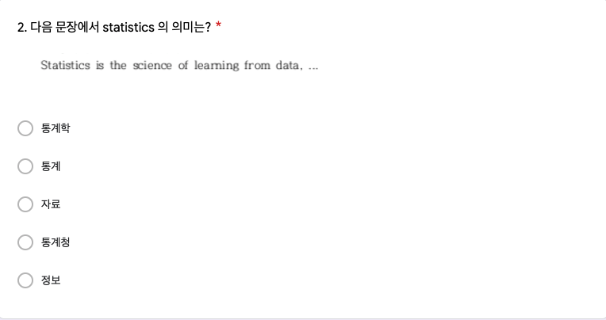

# 1주차 데이터 실험 집계

```{r setup_quiz01, include=FALSE}
knitr::opts_chunk$set(echo = TRUE)
# Sys.setenv(TZ = "Asia/Seoul")
library(readxl)
library(readODS)
library(pander)
library(knitr)
library(magrittr)
library(dplyr)
library(googlesheets4)
library(showtext)
font_add(family = "kopub", 
         regular = "/Users/kwlee/Library/Fonts/KoPubWorld Dotum Medium.ttf",
         bold = "/Users/kwlee/Library/Fonts/KoPubWorld Dotum Bold.ttf",
         italic  = "/Users/kwlee/Library/Fonts/KoPubWorld Dotum Light.ttf")
showtext_auto()
panderOptions('table.split.table', Inf)
panderOptions('table.alignment.rownames', 'left')
panderOptions('table.alignment.default', 'right')
options(width=180)
```

## 실험의 목적

1주차 구글 예습 설문지 집계결과를 분석합니다. 

Q1~Q3에서는 랜덤화의 효과로 Red, Black 이 얼마나 닮았는지 알아봅니다.

Q4에서는 같은 내용의 질문지인데 "바람직한 논의이다"라는 선택지에 부연설명을 붙이거나(Red), "부적절한 논의이다"라는 선택지에 부연설명을 붙였을 때(Black), 부연설명의 여부에 따라 응답이 달라지는 지 살펴봅니다.

끝으로 제출시간의 분포가 날마다 고른지, Red, Black 간에는 닮았는지 알아봅니다.

```{r, echo = FALSE, message = FALSE, results = 'hide'}
## 2월25일자 랜덤화 출석부
class_roll <- readRDS("./class_roll_250225.RDS") %>%
  select(dept, id, name, status, email, cell_no, group)
```

```{r, echo = FALSE, message = FALSE, results = 'hide', eval = TRUE}
## 2월25일자 랜덤화 출석부
class_roll0225 <- readRDS("./class_roll_250225.RDS") %>%
  select(dept, id, name, status, email, cell_no, group)
## 3월8일자 랜덤화 출석부
class_roll0308 <- readRDS("./class_roll_250308.RDS") %>%
  select(dept, id, name, status, email, cell_no, group)
## 3월8일자 신규 수강생의 학번
id_new <- setdiff(class_roll0308$id, class_roll0225$id)
## 2월25일 출석부에는 있지만 수강신청변경으로 나간 사람들의 학번
id_out <- setdiff(class_roll0225$id, class_roll0308$id)
## 2월25일, 3월8일 양 출석부에 등장하는 사람들의 학번
id_stay <- intersect(class_roll0225$id, class_roll0308$id)
## 새로 들어 온 사람들만의 출석부
class_roll_id_new <- class_roll0308 %>%
  filter(id %in% id_new) %>%
  arrange(name)
## 2월25일, 3월8일 통합 랜덤화 출석부 (기존 수강생들은 2월25일 Red, Black 적용)
## 2월25일 등록하고 나간 수강생 중에도 1주차 퀴즈는 수행하였을 가능성이 있기 때문에 0225 전체 적용
class_roll <- 
  rbind(class_roll0225, class_roll_id_new)
saveRDS(class_roll, file = "./class_roll_0225_0308.RDS")
saveRDS(class_roll_id_new, file = "class_roll_250308_id_new.RDS")
```

```{r, echo = FALSE, message = FALSE, results = 'hide', eval = TRUE}
## 03/08 이후 신규 수강인원 반영 출석부 (매일 업데이트)
class_roll0309 <- read_excel("./data/class_roll_250309.xlsx", 
                             range = "B1:H611")
str(class_roll0309)
names(class_roll0309) <- c("dept", "college", "id", "name", "status", "email", "cell_no")
str(class_roll0309)
## 나간 사람들의 학번과 그룹
id_out2 <-
  setdiff(class_roll0308$id, class_roll0309$id)
class_roll0225_0308 <- readRDS("class_roll_0225_0308.RDS")
class_roll0225_0308 %>%
  filter(id %in% id_out2)
## 새로 들어온 사람들의 학번
id_new2 <- 
  setdiff(class_roll0309$id, class_roll0308$id)
## 새로 들어온 사람들 출석부
class_roll_id_new2 <- class_roll0309 %>%
  filter(id %in% id_new2)
## 새로 들어온 사람들 그룹은 직접 지정
class_roll_id_new2$group <- c("Red", "Black", "Red")
class_roll_id_new2 <- class_roll_id_new2 %>%
  select(dept, id, name, status, email, cell_no, group)
## 2월25일, 3월9일 통합 랜덤화 출석부 (기존 수강생들은 02/25 Red, Black 적용)
## 2월25일 등록하고 나간 수강생 중에도 1주차 퀴즈는 수행하였을 가능성이 있기 때문에 0225 전체 적용 
class_roll <- 
  rbind(class_roll0225, class_roll_id_new, class_roll_id_new2)
saveRDS(class_roll, file = "./class_roll_0225_0309.RDS")
saveRDS(class_roll_id_new2, file = "./class_roll_250309_id_new2.RDS")
## 3월10일 상황 반영
class_roll0310 <- read_excel("./data/class_roll_250310.xlsx", 
                             range = "B1:H611")
str(class_roll0310)
names(class_roll0310) <- c("dept", "college", "id", "name", "status", "email", "cell_no")
str(class_roll0310)
## 나간 사람들의 학번과 그룹
id_out3 <-
  setdiff(class_roll0309$id, class_roll0310$id)
class_roll0225_0309 <- readRDS("class_roll_0225_0309.RDS")
class_roll0225_0309 %>%
  filter(id %in% id_out3)
# class_roll0309 %>%
#   filter(id %in% id_out3)
## 새로 들어온 사람들의 학번
id_new3 <- 
  setdiff(class_roll0310$id, class_roll0309$id)
## 새로 들어온 사람들 출석부
class_roll_id_new3 <- class_roll0310 %>%
  filter(id %in% id_new3)
## 새로 들어온 사람들 그룹은 직접 지정
class_roll_id_new3$group <- c(rep("Black", 7), rep("Red", 5))
class_roll_id_new3 <- class_roll_id_new3 %>%
  select(dept, id, name, status, email, cell_no, group)
## 2월25일, 3월9일, 3월10일 통합 랜덤화 출석부 (기존 수강생들은 02/25 Red, Black 적용)
## 2월25일 등록하고 나간 수강생 중에도 1주차 퀴즈는 수행하였을 가능성이 있기 때문에 0225 전체 적용 
class_roll <- 
  rbind(class_roll0225_0309, class_roll_id_new3)
saveRDS(class_roll, file = "./class_roll_0225_0310.RDS")
saveRDS(class_roll_id_new3, file = "./class_roll_250310_id_new3.RDS")
## 3월14일 상황 반영
class_roll0314 <- read_excel("./data/class_roll_250314.xlsx", 
                             range = "B1:H611")
str(class_roll0314)
names(class_roll0314) <- c("dept", "college", "id", "name", "status", "email", "cell_no")
str(class_roll0314)
## 나간 사람들의 학번과 그룹
id_out_4 <-
  setdiff(class_roll0310$id, class_roll0314$id)
class_roll0225_0310 <- readRDS("class_roll_0225_0310.RDS")
class_roll0225_0310 %>%
  filter(id %in% id_out_4)
# class_roll0309 %>%
#   filter(id %in% id_out3)
## 새로 들어온 사람들의 학번
id_new_4 <- 
  setdiff(class_roll0314$id, class_roll0310$id)
## 새로 들어온 사람들 출석부
class_roll_id_new4 <- class_roll0314 %>%
  filter(id %in% id_new_4)
## 새로 들어온 사람들 그룹은 직접 지정
class_roll_id_new4$group <- c(rep("Black", 3))
class_roll_id_new4 <- class_roll_id_new4 %>%
  select(dept, id, name, status, email, cell_no, group)
## 2월25일, 3월9일, 3월10일, 3월14일 통합 랜덤화 출석부 (기존 수강생들은 02/25 Red, Black 적용)
## 2월25일 등록하고 나간 수강생 중에도 1주차 퀴즈는 수행하였을 가능성이 있기 때문에 0225 전체 적용 
class_roll <- 
  rbind(class_roll0225_0310, class_roll_id_new4)
saveRDS(class_roll, file = "./class_roll_0225_0314.RDS")
saveRDS(class_roll_id_new4, file = "./class_roll_250314_id_new4.RDS")
```

```{r, echo = FALSE, message = FALSE, results = 'hide'}
# Quiz Assortment  
sheet_url <- "https://docs.google.com/spreadsheets/d/1RWDoakqN6ntnKqZB8wDt_xoXIuiU1DOJnZ_25dOGTkg"
quiz <-
  read_sheet(sheet_url)
# quiz <- 
#   read_excel("./data/quiz_250303.xlsx",
#              range = "A2:K582",
#              col_names = FALSE)
names(quiz) <- 
  c("time", "email", "dept", "id", "name", "Q1", "Q2", "Q3", "group", "Q4_R", "Q4_B")
str(quiz)
## as.POSIXct 는 말썽 초래.
# quiz$time <- as.POSIXct(quiz$time, format = "%m/%d%/Y %H:%M:%S", tz = "Asia/Seoul")
quiz$time <- format(quiz$time, format = "%Y-%m-%d %H:%M:%S")
quiz <- data.frame(quiz)
class(quiz$id) <- "character"
quiz %<>%
  mutate(Q4_R = if_else(Q4_R == "납세자들의 과도한 세금 부담을 낮추기 위한 바람직한 논의이다",
                        "바람직한 논의이다", Q4_R))
quiz %<>%
  mutate(Q4_B = if_else(Q4_B == "상위 계층에 감세 혜택을 집중시킬 수 있는 부적절한 논의이다",
                        "부적절한 논의이다", Q4_B))
quiz$Q4 <- ifelse(is.na(quiz$Q4_R), quiz$Q4_B, quiz$Q4_R)
# quiz %>%
#   filter(id %in% id_new) %>%
#   select(id, name, group)
setdiff(class_roll$id, quiz$id)
# quiz$group <- class_roll$group[match(quiz$id, class_roll$id)]
sapply(quiz[, c("Q1", "Q2", "Q3", "Q4")], table, useNA = "ifany")
quiz$dept <- factor(quiz$dept)
quiz$group <- factor(quiz$group, 
                     levels = c("Red", "Black"))
quiz$Q1 <- factor(quiz$Q1, 
                  levels = c("통계학", "통계", "자료", "통계청", "정보"))
quiz$Q2 <- factor(quiz$Q2, 
                  levels = c("통계학", "통계", "자료", "통계청", "정보"))
quiz$Q3 <- factor(quiz$Q3, 
                  levels = c("통계학", "통계", "자료", "통계청", "정보"))
quiz$Q4 <- factor(quiz$Q4, 
                  levels = c("바람직한 논의이다", "부적절한 논의이다", "모름/무응답"))
table(quiz$Q4, useNA = "ifany")
```

```{r, echo = FALSE, results = 'hide'}
#> 학번 잘못 써서 고생시키는 녀석들 찾아내는 코드
wrong_id <- setdiff(quiz$id, class_roll$id)
quiz %>%
  filter(id %in% wrong_id) %>%
  select(id, name, dept, email)
# 1. 잘못된 id 가진 행 찾기
quiz_wrong_ids <- quiz %>%
  anti_join(class_roll, by = "id") 
# 2. 잘못된 id를 따로 저장하고 수정하기
wrong_ids <- quiz_wrong_ids$id
quiz_wrong_ids <- quiz_wrong_ids %>%
  mutate(id = case_when(
    id == "2024274" ~ "20242743",
    id == "2020301" ~ "20203014",
    id == "2024748" ~ "20242748",
    id == "20242616" ~ "20242615",
    TRUE ~ id
  ))
# 3. quiz 에서 id 틀린 행을 제거하고 옳은 id 갖춘 행으로 교체하기
quiz <- quiz %>%
  filter(!id %in% wrong_ids) %>%
  bind_rows(quiz_wrong_ids)
wrong_id <- setdiff(quiz$id, class_roll$id)
quiz %>%
  filter(id %in% wrong_id) %>%
  select(id, name, dept, email)
# quiz[quiz$id %in% setdiff(quiz$id, class_roll$id), c("id", "name", "dept")]
#> 찾아서 수정하는 코드
# quiz$id <- 
#   class_roll$id[match(quiz$email, class_roll$email)]
quiz <- quiz %>%
  left_join(class_roll %>% select(email, id), by = "email", suffix = c("", "_correct")) %>%
  mutate(id = if_else(!is.na(id_correct), id_correct, id)) %>%
  select(-id_correct)
#> 중복 제출자
which(duplicated(quiz$id)) %>%
  quiz[., c("id", "name")]
#> 중복 제출자
quiz %>%
  filter(duplicated(id)) %>%
  select(id, name)
# which(duplicated(quiz$id)) %>%
#   quiz[., c("id", "name")]
quiz %>%
  filter(id %in% c("20242917", "20243023", "20241232", "20256637", "20223044"))
# quiz[quiz$name %in% c("최재혁", "박지연"), ] #> 최재혁, 박지연이 중복 제출
quiz <- quiz %>% 
  arrange(id, desc(time)) %>%
  distinct(id, .keep_all = TRUE)
#> 불참자들
class_roll0314 <- readRDS("./class_roll_250314.RDS")
absentee <- class_roll0314 %>%
  anti_join(quiz, by = "id") %>%
  select(id, name) %>%
  arrange(id)
absentee <- 
  class_roll0314[class_roll0314$id %in% setdiff(class_roll0314$id, quiz$id), c("id", "name", "group")] %>%
  `[`(order(.$id), ) 
absentee %>%
  pander(row.names = FALSE) 
absentee$group %>%
  table
#> 마감기한으로부터 제출시점의 기간
quiz$days <- as.numeric(difftime("2025-03-17 00:00:00", quiz$time, units = 'days'))
quiz$hours <- as.numeric(difftime("2025-03-17 00:00:00", quiz$time, units = 'hours'))
str(quiz)
table(as.Date(quiz$time))
```

### Red, Black을 잘못 표시한 사람들

랜덤화출석부(2월 25일 기준)에 있는 Red, Black 과 실제 구글예습설문지에 올린 Red, Black 이 다른 사람들의 분포를 파악해 보았습니다. 

```{r, echo = FALSE}
quiz$group2 <- class_roll$group[match(quiz$id, class_roll$id)]
## 2/25 출석부에 나오고, 퀴즈도 수행하였지만 3/10 출석부에는 없는 사람
# which(is.na(quiz$group2)) %>%
#   quiz[., c("id", "name", "group", "group2")]
quiz[quiz$id == "20211104", "group2"] <- "Red"
wrong_group <- which(quiz$group != quiz$group2)
# quiz[wrong_group, c("id", "name", "group2", "group")] %>%
#   `[`(order(.$name), ) %>%
#   `colnames<-`(c("학번", "이름", "랜덤화출석부", "구글예습퀴즈")) %>%
#   pander(row.names = FALSE)
# quiz[wrong_group, c("time", "id", "group2", "group")] %>%
#   `[`(order(.$time), ) %>%
#   `colnames<-`(c("제출시간", "학번", "랜덤화출석부", "구글예습퀴즈")) %>%
#   pander(row.names = FALSE)
wrong_tbl <- table("랜덤화출석부" = quiz$group2, 
                   "구글예습퀴즈" = quiz$group)
wrong_tbl %>%
  rbind("계" = colSums(.)) %>%
  pander(row.names = c("Red(랜덤화출석부)", "Black(랜덤화출석부)", "계"), 
         col.names = c("Red(구글예습퀴즈)", "Black(구글예습퀴즈)"))
```

랜덤화출석부에 있는 Red, Black 과 실제 구글 설문지에서 선택한 Red, Black 이 다른 사람들의 수효는 `r length(wrong_group)`명입니다. 

Red를 Black 이라고 한 사람이 `r wrong_tbl[1, 2]`명, Black 을 Red 라고 한 사람이 `r wrong_tbl[2, 1]`명입니다. 

두 가지 방법으로 분석합니다.

우선 Red, Black 을 잘못 선택한 `r length(wrong_group)`명을 랜덤하게 둘로 나누면 어느 한 쪽 집단에 들어갈 기대인원은 `r length(wrong_group)`명을 둘로 나눈 `r length(wrong_group) / 2`(명)이고, 표준오차는 `r length(wrong_group)`의 제곱근에 1/2을 곱해 준 `r round(sqrt(length(wrong_group)) / 2, digits  = 1)`명이 됩니다. 

실제로 Red를 Black 이라고 한 사람수, `r wrong_tbl[1, 2]`명이나 Black 을 Red 라고 한 사람수, `r wrong_tbl[2, 1]`명은 기대인원으로부터 표준오차 범위 안에 아주 잘 들어갑니다.

두 번째 분석 방법은 확률을 계산해 보는 것입니다. 

Red, Black 을 잘못 선택한 `r length(wrong_group)`명을 랜덤하게 둘로 나눌 때, 실제로 관찰된 `r max(wrong_tbl[1, 2], wrong_tbl[2, 1])`명 이상이나 `r min(wrong_tbl[1, 2], wrong_tbl[2, 1])`명이하로  잘못 선택한 사람수가 나올 가능성은 얼마나 되는가 입니다. 

이 경우 공평한 동전던지기를 확률 법칙으로 표현한 이항분포로부터 계산할 수 있습니다. 

시행횟수가 `r length(wrong_group)`이고 한 번 시행에서 성공확률이 1/2 인 이항분포에서 성공갯수가 `r min(wrong_tbl[1, 2], wrong_tbl[2, 1])`이하이거나 `r max(wrong_tbl[1, 2], wrong_tbl[2, 1])`이상을 관찰할 확률은 `r round(pbinom(min(wrong_tbl[1, 2], wrong_tbl[2, 1]), length(wrong_group), 1/2) * 2,  digits = 3)`입니다. 

공평한 동전 던지기에서 앞면이 `r min(wrong_tbl[1, 2], wrong_tbl[2, 1])`개 이하 나오는 확률은 `r max(wrong_tbl[1, 2], wrong_tbl[2, 1])`개 이상 나오는 확률과 같기 때문에 사실상 한쪽만 계산해서 2배 해 주면 됩니다. 

이 값을 p-value 라고 하는데, p-value가 0.05보다 작을 때 **통계적으로 유의한 차이를 관찰**하였다고 말합니다. 

즉, 공평한 동전을 던지는 것과 같은 과정이라고 가정하였을 때 실제로 관찰된 값들이 가정으로부터 얼마나 떨어져 있는지를 표현한 것입니다.

0.05, 즉 1/20은 이런 실험을 스무 번 정도 반복하면 1번 나올 정도로 드문 사건을 의미합니다. 

즉 가정이 타당하다면 나오기 힘든 결과라는 것입니다.

그런데 Red, Black 을 잘못 표시한 사람들의 분포에서 관찰된 p-value 는 0.05와는 비교도 안될 정도로 큰 값입니다.

따라서 두 집단이 랜덤화 효과가 작동하여 **통계적으로 유의한 차이를 보이지 않는다**고 할 수 있습니다.

### 응답인원의 Red, Black

Red 로 응답한 인원은 `r colSums(wrong_tbl)[1]`명, Black 에 응답한 인원은 `r colSums(wrong_tbl)[2]`명입니다. 

전체 응답인원 `r sum(wrong_tbl)` 명을 랜덤하게 둘로 나눌 때 어느 한 쪽의 기대인원은 전체 응답인원의 절반인 `r sum(wrong_tbl) / 2`명이고, 표준오차는 전체 응답인원의 제곱근에 1/2을 곱해 준 `r round(sqrt(sum(wrong_tbl)) * 1 / 2, digits = 1)` 명입니다. 

따라서 Red, Black 각 그룹에 관찰된 인원은 기대인원으로부터 표준오차 범위 안에 들어갑니다. 

간혹 이 범위를 살짝 벗어나는 경우들이 가끔 나오지만 두배의 표준오차 범위 안에는 거의 다 들어갑니다.

## Q1. Dewey as good as elected, statistics convince Roper 

이 헤드라인의 출처는 Freedman 등이 저술한 Statistics 에서 1948년 대선 여론조사에 대해서 설명한 내용입니다 [@fpp1998scranton].

```{r, echo = FALSE, out.width = "100%", fig.align = "left"}

```

### Roper(Counts) 

```{r, Roper, echo = FALSE, warning = FALSE}
tbl_q1_a <- quiz$Q1 %>% 
  table(quiz$group, ., useNA = "ifany") %>%
  cbind("계" = rowSums(.)) %>%
  rbind("계" = colSums(.))
tbl_q1_a %>% 
  pander 
chisq_test_q1 <- 
  tbl_q1_a %>%
  `[`(-3, -6) %>%
  chisq.test(simulate.p.value = FALSE) 
chisq_test_q1 %>%
  pander
```

Q1의 집계 결과가 Red, Black 간에 통계적으로 유의한 차이가 있는지 알아보기 위하여 카이제곱 테스트를 수행하였습니다. 

그 결과 카이제곱 통계량은 `r chisq_test_q1[1] %>% format(digits = 2, nsmall = 2)`, 자유도는 `r chisq_test_q1[2] %>% format(digits = 2, nsmall = 3)`, p-value 는 `r chisq_test_q1[3] %>% format(digits = 2, nsmall = 4)`이므로 Red, Black 간에 통계적으로 유의한 차이를 보이지 않습니다. 

실제로 닮은 게 느껴집니까?

### Roper(%)

```{r, Roper in percentage, echo = FALSE}
ptbl_q1 <- 
  tbl_q1_a %>% 
  `[`(3, -6) %>%
  prop.table %>% 
  c("계" = sum(.)) %>%
  `*`(100) 
ptbl_q1 %>%
  format(digits = 2, nsmall = 1) %>%
  pander
```

정답률은 Red, Black 을 합하여 계산하는데, `r ptbl_q1[2] %>% format(digits = 2, nsmall = 1)`(%) 입니다.

## Q2. Statistics is the science of learning from data, ... 

이 문장의 출처는 미국통계협회 (ASA, American Statistical Association) 의 홈페이지 등입니다 [@asa_definition] .   

```{r, echo = FALSE, out.width = "100%", align = "left"}

```

### ASA(Counts) 

```{r, ASA, echo = FALSE, warning = FALSE}
tbl_q2_a <- quiz$Q2 %>% 
  table(quiz$group, ., useNA = "ifany") %>%
  cbind("계" = rowSums(.)) %>%
  rbind("계" = colSums(.))
tbl_q2_a %>% 
  pander 
chisq_test_q2 <- 
  tbl_q2_a %>%
  `[`(-3, -6) %>%
  chisq.test(simulate.p.value = FALSE) 
chisq_test_q2 %>%
  pander
```

Q2의 집계 결과가 Red, Black 간에 통계적으로 유의한 차이가 있는지 알아보기 위하여 카이제곱 테스트를 수행하였습니다. 

그 결과 카이제곱 통계량은 `r chisq_test_q2[1] %>% format(digits = 2, nsmall = 3)`, 자유도는 `r chisq_test_q2[2] %>% format(digits = 2, nsmall = 2)`, p-value 는 `r chisq_test_q2[3] %>% format(digits = 2, nsmall = 4)`이므로 Red, Black 간에 통계적으로 유의한 차이를 보이지 않습니다. 

실제로 닮은 게 느껴집니까?

### ASA(%)

```{r, ASA in percentage, echo = FALSE}
ptbl_q2 <- 
  tbl_q2_a %>% 
  `[`(3, -6) %>%
  prop.table %>% 
  c("계" = sum(.)) %>%
  `*`(100) 
ptbl_q2 %>%
  format(digits = 2, nsmall = 1) %>%
  pander
```

정답률은 Red, Black 을 합하여 계산하는데, `r ptbl_q2[1] %>% format(digits = 2, nsmall = 1)`(%) 입니다.

## Q3. How to lie with statistics

이 문장은 Darrel Huff가 저술한 책 제목입니다 [@huff1954how] . 

```{r, echo = FALSE, out.width = "100%", align = "left"}

```

### D.Huff(Counts) 

```{r, D.Huff, echo = FALSE, warning = FALSE}
tbl_q3_a <- quiz$Q3 %>% 
  table(quiz$group, ., useNA = "ifany") %>%
  cbind("계" = rowSums(.)) %>%
  rbind("계" = colSums(.))
# colnames(tbl_q3_a)[5] %<>% `<-`(., "불참")
tbl_q3_a %>% 
  pander 
chisq_test_q3 <- 
  tbl_q3_a %>%
  `[`(-3, -6) %>%
  chisq.test(simulate.p.value = FALSE) 
chisq_test_q3 %>%
  pander
```

Q3의 집계 결과가 Red, Black 간에 통계적으로 유의한 차이가 있는지 알아보기 위하여 카이제곱 테스트를 수행하였습니다. 

그 결과 카이제곱 통계량은 `r chisq_test_q3[1] %>% format(digits = 2, nsmall = 3)`, 자유도는 `r chisq_test_q3[2] %>% format(digits = 2, nsmall = 2)`, p-value 는 `r chisq_test_q3[3] %>% format(digits = 2, nsmall = 4)`이므로 Red, Black 간에 통계적으로 유의한 차이를 보이지 않습니다. 

실제로 닮은 게 느껴집니까?

### D.Huff(%)

```{r, D.Huff in percentage, echo = FALSE}
ptbl_q3 <- 
  tbl_q3_a %>% 
  `[`(3, -6) %>%
  prop.table %>% 
  c("계" = sum(.)) %>%
  `*`(100) 
ptbl_q3 %>%
  format(digits = 2, nsmall = 1) %>%
  pander
```

정답률은 Red, Black 을 합하여 계산하는데, `r ptbl_q3[2] %>% format(digits = 2, nsmall = 1)`(%) 입니다.

## Q4. 종부세

질문지의 선택지에 부연 설명을 추가하여 응답을 왜곡할 수 있다는 우려는 설문조사 설계에서 잘 알려진 문제입니다. 이러한 현상은 '응답 편향(response bias)' 또는 '질문지 편향(questionnaire bias)'의 한 형태로 간주되며, 다양한 연구에서 이에 대한 사례와 분석이 이루어졌습니다.

"A Catalog of Biases in Questionnaires" 
이 논문은 질문지에서 발생할 수 있는 48가지 편향 유형을 식별하고 분류하며, 각 유형에 대한 예시를 제공합니다. 특히, 질문의 형식과 응답 옵션의 설계가 응답자의 선택에 어떻게 영향을 미칠 수 있는지를 다루고 있습니다 [@boynton1999catalog].

"Response Biases in Standardised Surveys" by Kathrin Bogner & Uta Landrock
이 문서는 표준화된 설문조사에서 발생하는 응답 편향에 대해 설명하며, 질문의 형식과 응답 옵션이 응답자의 반응에 미치는 영향을 분석합니다 [@bogner2016response].

"Biased Questions: How to Identify & Fix Them in Surveys"
이 자료는 편향된 질문을 식별하고 수정하는 방법에 대해 설명하며, 부연 설명이 포함된 선택지가 응답자의 선택에 어떻게 영향을 줄 수 있는지를 다룹니다 [@genroe_biased_questions].

NBS(전국지표조사)가 2024년 7월25일 발표한 종합부동산세 관련 여론조사 문항을 편집하여 선택지에 부연설명을 붙였을 때 응답에 어느 정도의 영향을 미치는 지 알아보고자 하였습니다 [@nbs_poll_20240725]. 지난 학기에는 응답에 영향을 미친다는 것이 통계적으로 매우 유의한 수준으로 관찰되었습니다. 그러나, 이번 학기는 그렇지 않네요.

"바람직한 논의이다"라는 선택지에 부연설명을 붙이거나(Red), "부적절한 논의이다"라는 선택지에 부연설명을 붙였을 때(Black), 부연설명의 여부에 따라 응답이 달라지는 지 살펴본 결과 기대와는 달리 통계적으로 유의한 수준의 차이를 관찰하지 못하였습니다. 

앞에서 본 바와 같이 Red, Black 두 집단은 출석부의 다섯 변수에 대하여 랜덤화 과정을 거쳐서 가장 닮은 구성을 찾은 것이기에 Q1, Q2, Q3의 응답 결과도 매우 닮게 나오는데 만약 부연설명이 효과가 없다면 Q4에서의 응답도 닮게 나왔을 것입니다. 

지난 학기들과 달리 통계적으로 유의한 차이를 관찰하지 못한 이유를 따져 볼 필요가 있겠습니다.

### 질문지 선택지에 부연설명 

```{r, echo = FALSE, out.width = "67%", fig.align = "left"}

```

```{r, echo = FALSE, out.width = "67%", fig.align = "left"}

```

### 집계

```{r, echo = FALSE}
tbl_q4_a <- quiz$Q4 %>%
  table(quiz$group, ., useNA = "ifany") %>%
  cbind("계" = rowSums(.)) %>%
  rbind("계" = colSums(.))
# colnames(tbl_q4_a)[4] <- "결석"
rownames(tbl_q4_a)[1:2] <- c("Red(바람직한 논의에 부연설명)", "Black(부적절한 논의에 부연설명)")
tbl_q4_a %>% 
  pander
chisq_test_q4 <- 
  tbl_q4_a %>%
  `[`(-3, -4) %>%
  chisq.test(simulate.p.value = FALSE) 
chisq_test_q4 %>%
  pander
```

Q4의 Red에는 종합부동산세 부담을 완화해야 한다는 주장에 대하여 바람직한 논의라는 쪽에 긍정적인 부연설명을 붙였는데,  `r tbl_q4_a[1, 4]`명이 응답한 가운데 `r tbl_q4_a[1, 1]`명이 "바람직한 논의이다"라는 반응을 보이고, `r tbl_q4_a[1, 2]`명이 "부적절한 논의이다"라는 반응을 보입니다.

Black에는 같은 주장에 대하여 부적절한 논의라는 쪽에 부정적인 부연설명을 붙였는데, `r tbl_q4_a[2, 4]`명이 응답한 가운데 `r tbl_q4_a[2, 1]`명이 "바람직한 논의이다"라는 반응을 보이고, `r tbl_q4_a[2, 2]`명이 "부적절한 논의이다"라는 반응을 보입니다. 

그리고 "모름/무응답"에 답한 인원은 Red에  `r tbl_q4_a[1, 3]`명, Black 에 `r tbl_q4_a[2, 3]`명이 응답하였습니다. 

지난 학기 자료들에서 볼 수 있다시피 카이제곱 테스트는 이와 같은 상황에서 부연설명의 유무가 응답에 미치는 영향이 대부분 통계적으로 유의하다는 것을 보여 줍니다. 

그런데, 이번 학기는 매우 예외적으로 그렇지 않은 경우가 관찰되었습니다. 

카이제곱 통계량은 `r chisq_test_q4[1] %>% format(digits = 2, nsmall = 3)`, 자유도는 `r chisq_test_q4[2] %>% format(digits = 2, nsmall = 2)`, p-value 는 `r chisq_test_q4[3] %>% format(digits = 2, nsmall = 4)`으로 부연설명을 어떻게 붙이느냐에 따라 반응이 다르게 나온다는 것을 보여주고 싶었지만 실제로 관찰된 차이는 Q1 ~ Q3와 마찬가지로 통계적으로 유의한 수준은 아닙니다.

여기서 부연설명이 응답에 영향을 끼치지 않는다고 가정해 봅시다. 

그렇다면 Red, Black 의 응답은 Q1~Q3 에서와 같이 랜덤화 효과에 의하여 통계적으로 유의한 차이를 보이지 않을 것입니다. 

그런데 실제로 관찰된 카이제곱 통계값과 P-value 는 통계적으로 유의한 차이를 보여 주지 못하는 수준입니다. 

따라서 부연설명이 영향을 끼치지 않는다는 가정을 받아들일 수밖에 없게 되었습니다.

지난 학기 자료들이 모두 통계적으로 유의한 차이를 보여 주었던 것과는 달리 이번 학기에 유독 통계적으로 유의한 차이를 보이지 않는 이유는 무엇일까요?

### % 비교.  

```{r, echo = FALSE}
ptbl_q4_a <- 
  tbl_q4_a %>% 
  `[`(-3, -4) %>%
  prop.table(margin = 1) %>% 
  `*`(100) %>%
  cbind("계" = rowSums(.))
ptbl_q4_a %>%
  format(digits = 2, nsmall = 1) %>%
  pander
```

"바람직한 논의이다"에 부연설명을 붙인 Red에서 "바람직한 논의이다"라고 응답하는 사람들의 백분율, `r format(ptbl_q4_a[1, 1], digits = 2, nsmall = 1)`(%)은 "부적절한 논의이다"에 부연설명을 붙인 Black 에서 "바람직한 논의이다"라고 응답하는 사람들의 백분율, `r format(ptbl_q4_a[2, 1], digits = 2, nsmall = 1)`(%) 보다 높습니다. 

반면 "부적절한 논의이다"에 부연설명을 붙인 Black 에서 "부적절한 논의이다"라고 응답하는 사람들의 백분율, `r format(ptbl_q4_a[2, 2], digits = 2, nsmall = 1)`(%)은 Red 에서 "부적절한 논의이다"라고 응답하는 사람들의 백분율, `r format(ptbl_q4_a[1, 2], digits = 2, nsmall = 1)`(%) 보다 높습니다. 

부연설명을 어디에 붙이느냐에 따라 반응이 치우치는 것을 알 수 있지만 p-value 가 보여주듯이 **그 차이가 통계적으로 유의한 수준은 아닌 것**입니다. 

### Mosaic Plot

```{r, echo = FALSE, fig.width = 7, fig.height = 5, eval = TRUE}
library(ggplot2)
source("./mosaic_gg.R")
m_list <- quiz$Q4 %>%
  table(quiz$group, ., useNA = "ifany") %>%
  t %>%
  mosaic_gg
m <- m_list$m
df <- m_list$df
p_df <- m_list$p_df
names(df)[1] <- "Var1"
names(p_df)[1] <- "Var1"
# df$Var1 %<>% factor(labels = c("반이나 남았네", "반밖에 안 남았네", "모름/무응답"))
df$Var2 %<>% factor(labels = c("바람직한 논의에 부연설명", "부적절한 논의에 부연설명"))
# p_df$Var1 %<>% factor(labels = c("반이나 남았네", "반밖에 안 남았네", "모름/무응답"))
p_df$Var2 %<>% factor(labels = c("바람직한 논의에 부연설명", "부적절한 논의에 부연설명"))
m + geom_text(aes(x = center, y = 1.05), 
              family = "kopub",
              label = df[, 2]) +
  theme_bw(base_family = "kopub") +
  labs(title = "부연설명의 영향", x = "Red or Black(누적 %)", y = "인원(%, 명)") +
  scale_fill_brewer(name = "응답", 
                    labels = c("바람직한 논의이다", "부적절한 논의이다", "모름/무응답"),
                    type = "qual", 
                    palette = "Set2", 
                    direction = 1) +
  theme(plot.title = element_text(hjust = 0.5, 
                                  size = 18, 
                                  family = "kopub",
                                  face = "bold")) 
ggsave("./pics/Quiz250303_Q7_RnB.png", dpi = 120, width = 960, height = 840, units = "px")
```

Mosaic Plot 은 이 집계결과를 시각적으로 잘 보여줍니다. 

"바람직한 논의이다"에 부연설명을 붙인 Red 에서 "바람직힌 논의이다"라고 응답한 백분율이 "부적절한 논의이다"에 부연설명을 붙인 Black 에서 "바람직한 논의이다"라고 응답한 백분율보다 높고, Black 에서 "부적절한 논의이다"라고 응답한 백분율은 Red 에서 "부적절한 논의이다"라고 응답한 백분율보다 월등히 높습니다.

<!--
### % 합계

```{r, echo = FALSE}
tbl_q4 <- quiz$Q4 %>%
  table(useNA = "no") %>%
  prop.table %>%
  `*`(100) %>%
  c("계" = sum(.)) %>%
  format(digits = 2, nsmall = 1)
# names(tbl_q4)[4] <- "계"
tbl_q4 %>%
  pander
```
-->

## 마감 시간으로부터 제출 시간의 분포

### 분포표

```{r, echo = FALSE, warning = FALSE}
N <- nrow(quiz)
days_tbl <- 
  quiz$days %>%
#  floor %>%
  cut(breaks = c(0:14), include.lowest = TRUE) %>%
  table(quiz$group, .) 
days_tbl %>%
  cbind("계" = rowSums(.)) %>%
  rbind("계" = colSums(.)) %>%
  `colnames<-`(., c(paste0(14:1, "일"), "계")) %>%
  pander(caption = "일 단위")
```

분포표로부터 두 가지 문제를 살펴보겠습니다. 

첫째, 날마다 고르게 제출하는가? 

둘째, Red, Black 간에 통계적으로 유의한 차이가 있는가?

각 문제를 살펴보기 위해서는 분포표의 일부분을 대상으로 카이제곱 테스트를 수행합니다.

### 날마다 고르게 제출하는가?

```{r, echo = FALSE, warning = FALSE}
days_tbl %>%
  rbind("계" = colSums(.)) %>%
  `[`(3, 1:14) %>%
  `names<-`(., paste0(14:1, "일")) %>%
  pander
days_chisq_test <-
  days_tbl %>%
  rbind("계" = colSums(.)) %>%
  `[`(3, 1:14) %>%
  chisq.test(simulate.p.value = FALSE) 
days_chisq_test %>%
  pander
```

날마다 고르게 제출하는지 알아 보았습니다. 

분포표의 "계"행에서 '계'열을 제외하고 카이제곱테스트를 수행합니다. 

분포표 만으로도 쉽게 파악할 수 있지만 카이제곱테스트가 명확히 해 줍니다. 

카이제곱 통계량은 `r format(days_chisq_test[1], digits = 2, nsmall = 3)`, 자유도는 `r format(days_chisq_test[2], digits = 2, nsmall = 0)`, p-value 는 `r format(days_chisq_test[3], digits = 2, nsmall = 4)` 이므로 결코 고르게 제출한다고 말할 수 없겠습니다. 

막대그래프로 살펴 보겠습니다.

### 막대그래프

```{r, echo = FALSE}
# png(file = "./pics/2302/quiz_submission_8.png", width = 640, height = 480)
suppressMessages({
par(family = "kopub")
b <- 
  quiz$days %>%
  cut(breaks = c(0:14), include.lowest = TRUE) %>%
  table %>%
  rev %>%
  barplot(space = 0, names.arg = rep(c("월", "화", "수", "목", "금", "토", "일"), 2),
          col = c(rep("white", 13), "pink"),
          ylim = c(0, 300)) 
text(x = b[14, 1], y = sum(days_tbl[, 1]), 
     labels = paste0(sum(days_tbl[, 1]), "명"), pos = 3)
text(x = b[14, 1], y = sum(days_tbl[, 1]) / 2, 
     labels = paste0(format(sum(days_tbl[, 1]) / N * 100, digits = 1, nsmall = 0), "%"))
title(main = paste0("Quiz250303 (", N, "명 제출)"))
# title(main = "일 단위 퀴즈 제출 인원", sub = paste0("Quiz230925 (", N, "명 제출)"))
dev.copy(png, file = "./pics/2501/quiz_submission_1.png", width = 640, height = 480)
invisible(dev.off())
})
```

막대그래프는 총 제출인원 `r N`(명) 중에 `r sum(days_tbl[, 1])`(명),  `r format(sum(days_tbl[, 1]) / N * 100, digits = 1, nsmall = 0)`(%)가 마감일에 몰리는 것을 보여주고 있습니다.

### Red, Black 간에 닮았는가?

```{r, echo = FALSE, warning = FALSE}
days_tbl %>%
  rbind("계" = colSums(.)) %>%
  `[`(-3, 1:14) %>%
  `colnames<-`(., paste0(14:1, "일")) %>%
  pander
days_RnB_chisq_test <-
  days_tbl %>%
  `[`(-3, 1:14) %>%
  chisq.test(simulate.p.value = FALSE) 
days_RnB_chisq_test %>%
  pander
```

제출시간의 분포가 Red, Black 간에 닮았는지 알아 보았습니다. 

이번에는 분포표의 첫번째와 두번째 행, '계'열을 제외한 나머지 열에 대해서 카이제곱테스트를 수행합니다.

카이제곱 통계량은 `r format(days_RnB_chisq_test[1], digits = 2, nsmall = 3)`, 자유도는 `r format(days_RnB_chisq_test[2], digits = 2, nsmall = 2)`, p-value 는 `r format(days_RnB_chisq_test[3], digits = 2, nsmall = 4)` 이므로 제출 시간의 분포는 Red, Black 간에 통계적으로 유의한 차이가 관찰되지 않습니다. 

이 사실을 Mosaic Plot 을 이용하여 시각적으로 살펴보겠습니다. 

닮았다고 느껴지나요?

### Mosaic Plot

```{r, echo = FALSE, fig.width = 10, fig.height = 5}
library(ggplot2)
source("./mosaic_gg.R")
m2_list <- days_tbl[, 14:1] %>%
  mosaic_gg
m2 <- m2_list$m
df2 <- m2_list$df
p_df2 <- m2_list$p_df
names(df2[, 2]) <- "Days"
m2 + geom_text(aes(x = center, y = 1.05), 
              family = "kopub",
              label = rep(rep(c("월", "화", "수", "목", "금", "토", "일"), each = 2), times = 2)) +
  theme_bw(base_family = "kopub") +
  labs(title = "마감일로부터 제출시간의 분포", x = "마감일로부터 일수(누적 %)", y = "인원 백분율(%)") +
  scale_fill_brewer(name = "그룹", 
                    labels = c("Red", 
                               "Black"),
                    type = "qual", 
                    palette = "Set1", 
                    direction = 1) +
  theme(plot.title = element_text(hjust = 0.5, 
                                  size = 18, 
                                  family = "kopub",
                                  face = "bold"),
        axis.text.x = element_text(angle = -90, vjust = 0.5)) 
ggsave("./pics/Quiz250303_submission_1.png", dpi = 120, width = 960, height = 840, units = "px")
```

```{r, echo = FALSE}
saveRDS(quiz, file = "./quiz250303.RDS")
# save.image("./quiz250303.RData")
```