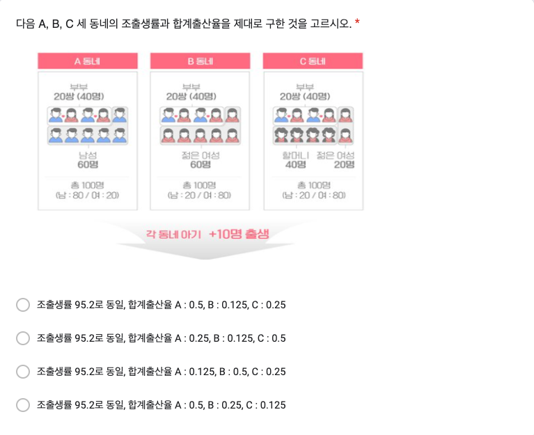
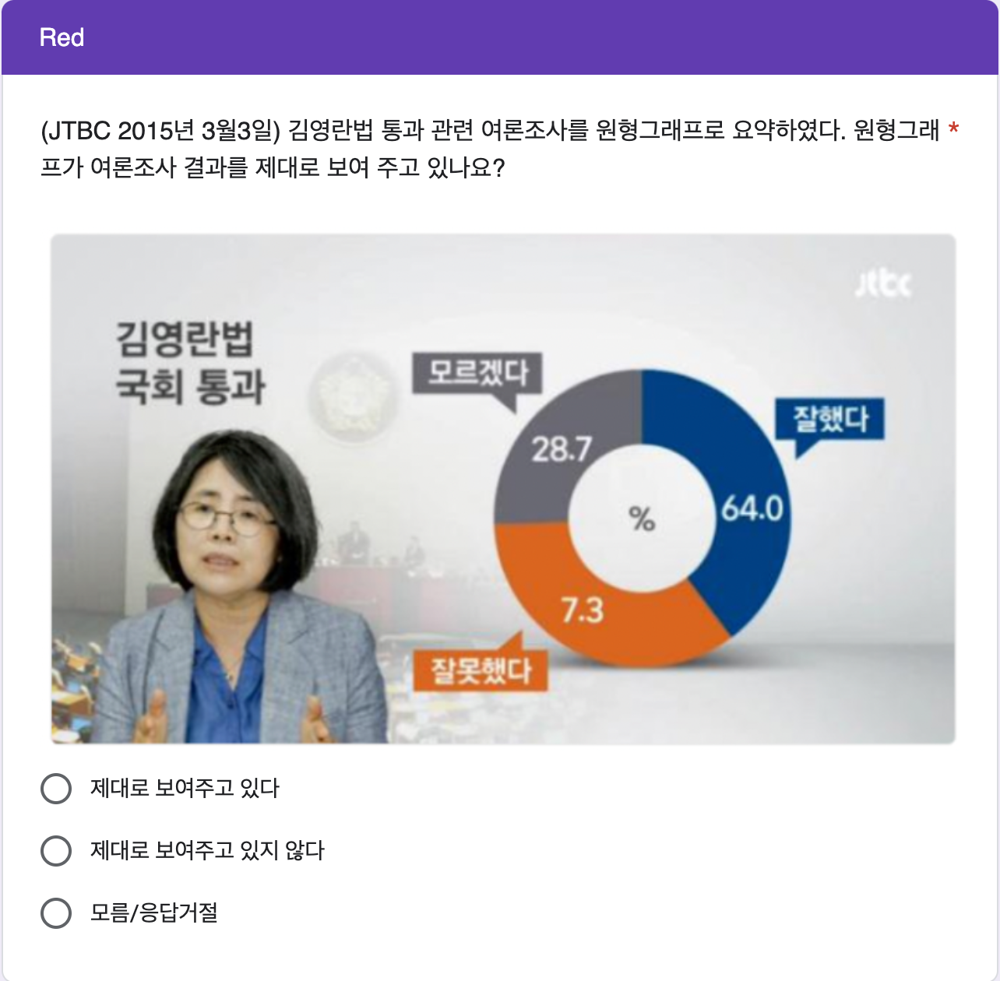
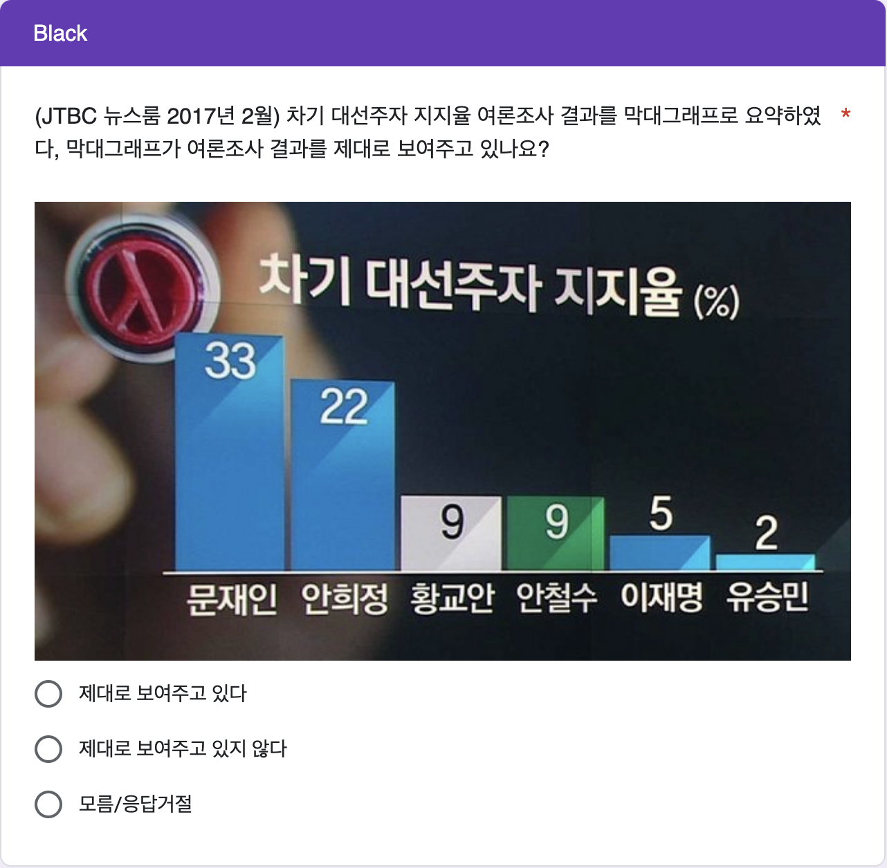

# 2주차 데이터 실험 집계

```{r setup_quiz02, include=FALSE}
knitr::opts_chunk$set(echo = TRUE)
library(readxl)
library(pander)
library(knitr)
library(magrittr)
library(dplyr)
library(stringdist)
library(showtext)
library(googlesheets4)
# font_add(family = "nanum", 
#          regular = "/Users/kwlee/Library/Fonts/NanumGothic-Regular.ttf",
#          bold    = "/Users/kwlee/Library/Fonts/NanumGothic-Bold.ttf",
#          italic  = "/Users/kwlee/Library/Fonts/NanumGothic-ExtraBold.ttf")
font_add(family = "kopub", 
         regular = "/Users/kwlee/Library/Fonts/KoPubWorld Dotum Medium.ttf",
         bold = "/Users/kwlee/Library/Fonts/KoPubWorld Dotum Bold.ttf",
         italic  = "/Users/kwlee/Library/Fonts/KoPubWorld Dotum Light.ttf")
# font_add(family = "Spoqa", 
#          regular = "/Users/kwlee/Library/Fonts/SpoqaHanSansNeo-Regular.ttf",
#          bold = "/Users/kwlee/Library/Fonts/SpoqaHanSansNeo-Bold.ttf",
#          italic  = "/Users/kwlee/Library/Fonts/SpoqaHanSansNeo-Light.ttf")
showtext_auto()
panderOptions('table.split.table', Inf)
panderOptions('table.alignment.rownames', 'left')
panderOptions('table.alignment.default', 'right')
options(width=180)
```

## 실험의 목적

2주차 구글 예습 설문지 집계결과를 분석합니다. 

Q1~Q6에서는 랜덤화의 효과로 Red, Black 이 얼마나 닮았는지 알아봅니다.

Q7에서는 같은 눈속임 그래프인데 원형그래프의 각도를 속일 떄(Red)와 막대그래프의 높이를 속일 때(Black) 오류를 지각하는 데 차이가 있는지 알아봅니다.

끝으로 제출시간의 분포가 날마다 고른지, Red, Black 간에는 닮았는지 알아봅니다.

```{r, message=FALSE, echo = FALSE, results='hide'}
class_roll0310 <- 
  readRDS("./class_roll_250310.RDS")
## Red_and_Black_250310_roll_v2.Rmd 에서 생성된 RDS 파일이어야 함.
class_roll0314 <- 
  read_excel("./data/class_roll_250314.xlsx", range = "B1:H611")
str(class_roll0314)
names(class_roll0314) <-
  c("dept", "colleges", "id", "name", "status", "email", "cell_no")
class_roll0314$group <- 
  class_roll0310$group[match(class_roll0314$id, class_roll0310$id)]
#> 폐강으로 인하여 들어 온 수강생들의 그룹 설정
na_gr <- which(is.na(class_roll0314$group)) 
class_roll0314[na_gr, ]
#> 나간 사람들이 모두 Black 이므로
class_roll0314[na_gr, "group"] <- c("Black")
saveRDS(class_roll0314, file = "./class_roll_250314.RDS")
#> 3월17일 기준 수강철회자 파악 후 조치
class_roll0317 <- class_roll0314 %>%
  filter(id != "20252139")
# class_roll0317 <- class_roll0314[!(class_roll0314$id == "20252139"), ]
saveRDS(class_roll0317, file = "./class_roll_250317.RDS")
class_roll <- class_roll0317
#> quiz reading
sheet_url <- "https://docs.google.com/spreadsheets/d/1GXwsrUiJF4fNhVEDMaslUVah8G8CwgjVAQPz-ESFOoE"
quiz <- read_sheet(sheet_url)
# quiz <- 
#   read_excel("./data/quiz_250310.xlsx",
#              range = "A2:N565",
#              col_names = FALSE)
names(quiz) <- 
  c("time", "email", "dept", "id", "name", 
    "Q1", "Q2", "Q3", "Q4", "Q5", "Q6", "group", "Q7_R", "Q7_B")
str(quiz)
## TZ Asia/Seoul 로 설정. UTC 왜곡 배제 효과
quiz$time <- format(quiz$time, format = "%Y-%m-%d %H:%M:%S")
## 자정 전에 제출한 사람의 시간 조정
quiz[quiz$id == "20232998", "time"] <- c("2025-03-10 00:00:01")
quiz <- data.frame(quiz)
class(quiz$id) <- "character"
class(quiz$Q3) <- "character"
class(quiz$Q4) <- "character"
quiz$Q7 <- ifelse(is.na(quiz$Q7_R), quiz$Q7_B, quiz$Q7_R)
quiz$dept <- factor(quiz$dept)
quiz$group <- 
  factor(quiz$group, levels = c("Red", "Black"))
table(quiz$Q1, useNA = "ifany")
quiz$Q1 <- 
  factor(quiz$Q1, levels = c("공자", "맹자", "관자", "노자", "장자"))
quiz$Q2 <- 
  factor(quiz$Q2, 
         levels = c("절대로 중요하지 않다", 
                    "거의 중요하지 않다", 
                    "보통이다", 
                    "상당히 중요하다", 
                    "절대적으로 중요하다"))
quiz$Q3 <- 
  factor(quiz$Q3, levels = c("2012", "2017", "2022", "2027"))
quiz$Q4 <- 
  factor(quiz$Q4, levels = c("2018", "2019", "2020", "2021"))
quiz$Q5 <- 
  factor(quiz$Q5, levels = c("서울", "경기", "세종", "제주"))
quiz$Q6 <- 
  factor(quiz$Q6, 
         levels = c("조출생률 95.2로 동일, 합계출산율 A : 0.5, B : 0.125, C : 0.25", 
                    "조출생률 95.2로 동일, 합계출산율 A : 0.25, B : 0.125, C : 0.5", 
                    "조출생률 95.2로 동일, 합계출산율 A : 0.125, B : 0.5, C : 0.25", 
                    "조출생률 95.2로 동일, 합계출산율 A : 0.5, B : 0.25, C : 0.125"),
         labels = c("합계출산율 A : 0.5, B : 0.125, C : 0.25", 
                    "합계출산율 A : 0.25, B : 0.125, C : 0.5", 
                    "합계출산율 A : 0.125, B : 0.5, C : 0.25", 
                    "합계출산율 A : 0.5, B : 0.25, C : 0.125"))
quiz$Q7 <- 
  factor(quiz$Q7, 
         levels = c("제대로 보여주고 있다",
                    "제대로 보여주고 있지 않다",
                    "모름/응답거절"))
#> 마감기한으로부터 제출시점의 기간
quiz$days <- 
  as.numeric(difftime("2025-03-24 00:00:00", quiz$time, units = 'days'))
quiz$hours <- 
  as.numeric(difftime("2025-03-24 00:00:00", quiz$time, units = 'hours'))
table(as.Date(quiz$time))
str(quiz)
```

```{r, echo = FALSE, results = 'hide'}
#> 학번 잘못 써서 고생시키는 녀석들 찾아내는 코드
wrong_id <- setdiff(quiz$id, class_roll$id)
quiz %>%
  filter(id %in% wrong_id) %>%
  select(id, name, dept, email)
# 1. 잘못된 id 가진 행 찾기
quiz_wrong_ids <- quiz %>%
  anti_join(class_roll, by = "id") 
# 2. 잘못된 id를 따로 저장하고 수정하기
wrong_ids <- quiz_wrong_ids$id
quiz_wrong_ids <- quiz_wrong_ids %>%
  mutate(id = case_when(
    id == "20223051" ~ "20223501",
    id == "20246475" ~ "20246745",
    TRUE ~ id
  ))
# 3. quiz 에서 id 틀린 행을 제거하고 옳은 id 갖춘 행으로 교체하기
quiz <- quiz %>%
  filter(!id %in% wrong_ids) %>%
  bind_rows(quiz_wrong_ids)
# quiz[quiz$id %in% setdiff(quiz$id, class_roll$id), c("id", "name", "dept", "group")]

#> 틀린 학번 수정하여 되돌리기 (작동하지 않음. 참고로만)
# quiz <- quiz %>%
#   #> `left_join`으로 `name`과 `dept`를 기준으로 교정 정보를 추가
#   left_join(class_roll %>% select(id, name, dept), 
#             by = "name", 
#             suffix = c("", "_correct")) %>%
#   #> `id_correct`가 있는 경우 이를 사용하여 `id`를 교정하고, 그렇지 않으면 기존의 `id`를 유지
#   mutate(id = if_else(!is.na(id_correct) & id != id_correct, id_correct, id)) %>%
#   #> 임시로 추가된 `id_correct` 열 제거
#   select(-id_correct)

#> 중복 제출자
quiz %>%
  filter(duplicated(id)) %>%
  select(id, name)
# which(duplicated(quiz$id)) %>%
#   quiz[., c("id", "name")]
quiz %>%
  filter(name %in% c("최재혁", "박지연", "최민재", "최자영", "김준서"))
# quiz[quiz$name %in% c("최재혁", "박지연"), ] #> 최재혁, 박지연이 중복 제출
quiz <- quiz %>% 
  arrange(id, desc(time)) %>%
  distinct(id, .keep_all = TRUE)
#> 불참자들
absentee <- class_roll %>%
  anti_join(quiz, by = "id") %>%
  select(id, name, group) %>%
  arrange(id)
# absentee <- 
#   class_roll[class_roll$id %in% setdiff(class_roll$id, quiz$id), c("id", "name", "group")] %>%
#   `[`(order(.$name), ) 
absentee %>%
  pander(row.names = FALSE) 
absentee %>%
  count(group) %>%
  print()
# absentee$group %>%
#   table
```

### Red, Black을 잘못 표시한 사람들

```{r, echo = FALSE}
#> group2 생성
quiz <- quiz %>%
  left_join(class_roll %>% select(id, group), by = "id", suffix = c("", "_class_roll")) %>%
  rename(group2 = group_class_roll)

#> group 과 group2가 다른 행 필터링
wrong_group <- quiz %>%
  filter(group2 != group)

#> 잘못된 그룹 정보 출력
wrong_group %>%
  select(time, id, group2, group) %>%
  arrange(time) %>%
  rename(제출시간 = time, 학번 = id, 랜덤화출석부 = group2, 구글예습퀴즈 = group) %>%
  pander(row.names = FALSE)

#> 옛 코드
# quiz$group2 <- class_roll$group[match(quiz$id, class_roll$id)]
# wrong_group <- which(quiz$group != quiz$group2)
# class_roll[wrong_group, c("id", "name", "group", "group2")] %>%
#   `colnames<-`(c("학번", "이름", "랜덤화출석부", "구글예습퀴즈")) %>%
#   pander
# quiz[wrong_group, c("time", "id", "name", "group2", "group")] %>%
#   `[`(order(.$time), ) %>%
#   `colnames<-`(c("제출시간", "학번", "이름", "랜덤화출석부", "구글예습퀴즈")) %>%
#   pander(row.name = FALSE)

#> 잘못된 그룹 정보의 테이블 생성 및 출력
wrong_tbl <- 
  table("랜덤화출석부" = quiz$group2, 
        "구글예습퀴즈" = quiz$group)

wrong_tbl %>%
  rbind("계" = colSums(.)) %>%
  pander(row.names = c("Red(랜덤화출석부)", "Black(랜덤화출석부)", "계"), 
         col.names = c("Red(구글예습퀴즈)", "Black(구글예습퀴즈)"))
```

랜덤화출석부에 있는 Red, Black 과 실제 구글설문에 올린 Red, Black 이 다른 사람들의 수효는 `r nrow(wrong_group)`명입니다. 

Red를 Black 이라고 한 사람이 `r wrong_tbl[1, 2]`명, Black 을 Red 라고 한 사람이 `r wrong_tbl[2, 1]`명입니다. 

두 가지 방법으로 분석합니다.

우선 Red, Black 을 잘못 선택한 `r nrow(wrong_group)`명을 랜덤하게 둘로 나누면 어느 한 쪽 집단에 들어갈 기대인원은 `r nrow(wrong_group)`명을 둘로 나눈 `r nrow(wrong_group) / 2`(명)이고, 표준오차는 `r nrow(wrong_group)`의 제곱근에 1/2을 곱해 준 `r round(sqrt(nrow(wrong_group)) / 2, digits  = 1)`명이 됩니다. 

실제로 Red를 Black 이라고 한 사람수, `r wrong_tbl[1, 2]`명이나 Black 을 Red 라고 한 사람수, `r wrong_tbl[2, 1]`명은 기대인원으로부터 표준오차 범위 안에 아주 잘 들어갑니다.

두 번째 분석 방법은 확률을 계산해 보는 것입니다. 

Red, Black 을 잘못 선택한 `r nrow(wrong_group)`명을 랜덤하게 둘로 나눌 때, 실제로 관찰된 `r max(wrong_tbl[1, 2], wrong_tbl[2, 1])`명 이상이나 `r min(wrong_tbl[1, 2], wrong_tbl[2, 1])`명이하로  잘못 선택한 사람수가 나올 가능성은 얼마나 되는가 입니다. 

이 경우 공평한 동전던지기를 확률 법칙으로 표현한 이항분포로부터 계산할 수 있습니다. 

시행횟수가 `r nrow(wrong_group)`이고 한 번 시행에서 성공확률이 1/2 인 이항분포에서 성공횟수가 `r min(wrong_tbl[1, 2], wrong_tbl[2, 1])`이하이거나 `r max(wrong_tbl[1, 2], wrong_tbl[2, 1])`이상을 관찰할 확률은 `r round(pbinom(min(wrong_tbl[1, 2], wrong_tbl[2, 1]), nrow(wrong_group), 1/2) * 2,  digits = 3)`입니다. 

공평한 동전 던지기에서 앞면이 `r min(wrong_tbl[1, 2], wrong_tbl[2, 1])`개 이하 나오는 확률은 `r max(wrong_tbl[1, 2], wrong_tbl[2, 1])`개 이상 나오는 확률과 같기 때문에 사실상 한쪽만 계산해서 2배 해 주면 됩니다. 

이 값을 p-value 라고 하는데, p-value가 0.05보다 작을 때 **통계적으로 유의한 차이를 관찰**하였다고 말합니다. 

즉, 공평한 동전을 던지는 것과 같은 과정이라고 가정하였을 때 실제로 관찰된 값들이 가정으로부터 얼마나 떨어져 있는지를 표현한 것입니다.

0.05, 즉 1/20은 이런 실험을 스무 번 정도 반복하면 1번 나올 정도로 드문 사건을 의미합니다. 

즉 가정이 타당하다면 나오기 힘든 결과라는 것입니다.

그런데 Red, Black 을 잘못 표시한 사람들의 분포에서 관찰된 p-value 는 0.05와는 비교도 안될 정도로 큰 값입니다.

따라서 두 집단이 랜덤화 효과가 작동하여 **통계적으로 유의한 차이를 보이지 않는다**고 할 수 있습니다.

### 응답인원의 Red, Black

Red 로 응답한 인원은 `r colSums(wrong_tbl)[1]`명, Black 에 응답한 인원은 `r colSums(wrong_tbl)[2]`명입니다. 

전체 응답인원 `r sum(wrong_tbl)` 명을 랜덤하게 둘로 나눌 때 어느 한 쪽의 기대인원은 전체 응답인원의 절반인 `r sum(wrong_tbl) / 2`명이고, 표준오차는 전체 응답인원의 제곱근에 1/2을 곱해 준 `r round(sqrt(sum(wrong_tbl)) * 1 / 2, digits = 1)` 명입니다. 

따라서 Red, Black 각 그룹에 관찰된 인원은 기대인원으로부터 표준오차 범위, 혹은 두배의 표준오차 범위 안에 들어갑니다.

## Q1. 춘추전국시대에 국가통계관리의 중요성 강조

```{r, echo = FALSE, out.width = "75%", align = "left"}

```

### 관자(집계표)

```{r, Kwanzi, echo = FALSE}
tbl_q1_a <- 
  quiz$Q1 %>% 
  table(quiz$group, ., useNA = "ifany") %>%
  cbind("계" = rowSums(.)) %>%
  rbind("계" = colSums(.))
tbl_q1_a %>% 
  pander 
chisq_test_q1 <- 
  tbl_q1_a %>%
  `[`(-3, -6) %>%
  chisq.test(simulate.p.value = TRUE) 
chisq_test_q1 %>%
  pander
```

Q1의 집계 결과가 Red, Black 간에 통계적으로 유의한 차이가 있는지 알아보기 위하여 카이제곱 테스트를 수행하였습니다. 

그 결과 카이제곱 통계량은 `r chisq_test_q1[1] %>% format(digits = 2, nsmall = 2)`, 자유도는 `r chisq_test_q1[2] %>% format(digits = 2, nsmall = 3)` , p-value 는 `r chisq_test_q1[3] %>% format(digits = 2, nsmall = 4)`이므로 Red, Black 간에 통계적으로 유의한 차이를 보이지 않습니다. 

실제로 닮은 게 느껴집니까?

### 관자(%)

```{r, Kwanzi in percentage, echo = FALSE}
ptbl_q1 <- 
  tbl_q1_a %>% 
  `[`(3, -6) %>%
  prop.table %>% 
  c("계" = sum(.)) %>%
  `*`(100) 
ptbl_q1 %>%
  format(digits = 2, nsmall = 1) %>%
  pander
```

정답률은 Red, Black 을 합하여 계산하는데, `r ptbl_q1[3] %>% format(digits = 2, nsmall = 1)`(%) 입니다.

## Q2. 국가정책을 수립하는 데 통계의 역할

```{r, echo = FALSE, out.width = "75%", align = "left"}

```

### 통계의 중요성(집계표)

```{r, state arithmetic, echo = FALSE, warning = FALSE}
tbl_q2_a <- 
  quiz$Q2 %>% 
  table(quiz$group, ., useNA = "ifany") %>%
  cbind("계" = rowSums(.)) %>%
  rbind("계" = colSums(.))
tbl_q2_a %>% 
  pander 
chisq_test_q2 <- 
  tbl_q2_a %>%
  `[`(-3, -c(2, 6)) %>%
  chisq.test(simulate.p.value = TRUE) 
chisq_test_q2 %>%
  pander
```

Q2의 집계 결과가 Red, Black 간에 통계적으로 유의한 차이가 있는지 알아보기 위하여 카이제곱 테스트를 수행하였습니다. 

그 결과 카이제곱 통계량은 `r chisq_test_q2[1] %>% format(digits = 2, nsmall = 3)`, 자유도는 `r chisq_test_q2[2] %>% format(digits = 2, nsmall = 2)`, p-value 는 `r chisq_test_q2[3] %>% format(digits = 2, nsmall = 4)`이므로 Red, Black 간에 통계적으로 유의한 차이를 보이지 않습니다.

실제로 닮은 게 느껴집니까?

### 통계의 중요성(%)

```{r, state arithmetic in percentage, echo = FALSE}
ptbl_q2 <- 
  tbl_q2_a %>% 
  `[`(3, -6) %>%
  prop.table %>% 
  c("계" = sum(.)) %>%
  `*`(100) 
ptbl_q2 %>%
  format(digits = 2, nsmall = 1) %>%
  pander
```

정답률은 Red, Black 을 합하여 계산하는데, `r ptbl_q2[5] %>% format(digits = 2, nsmall = 1)`(%) 입니다.

## Q3. 우리나라 생산가능인구 감소 시기

```{r, echo = FALSE, out.width = "75%", align = "left"}

```

### 생산가능인구 감소 시기(집계표)

```{r, labour force, echo = FALSE, warning = FALSE}
tbl_q3_a <- 
  quiz$Q3 %>% 
  table(quiz$group, ., useNA = "ifany") %>%
  cbind("계" = rowSums(.)) %>%
  rbind("계" = colSums(.))
# colnames(tbl_q3_a)[5] %<>% `<-`(., "결석")
tbl_q3_a %>% 
  pander 
chisq_test_q3 <- 
  tbl_q3_a %>%
  `[`(-3, -5) %>%
  chisq.test(simulate.p.value = FALSE) 
chisq_test_q3 %>%
  pander
```

Q3의 집계 결과가 Red, Black 간에 통계적으로 유의한 차이가 있는지 알아보기 위하여 카이제곱 테스트를 수행하였습니다. 

그 결과 카이제곱 통계량은 `r chisq_test_q3[1] %>% format(digits = 2, nsmall = 3)`, 자유도는 `r chisq_test_q3[2] %>% format(digits = 2, nsmall = 2)`, p-value 는 `r chisq_test_q3[3] %>% format(digits = 2, nsmall = 4)`이므로 Red, Black 간에 통계적으로 유의한 차이를 보이지 않습니다.

실제로 닮은 게 느껴집니까?

### 생산가능인구 감소 시기(%)

```{r, labour force in percentage, echo = FALSE}
ptbl_q3 <- 
  tbl_q3_a %>% 
  `[`(3, -5) %>%
  prop.table %>% 
  c("계" = sum(.)) %>%
  `*`(100) 
ptbl_q3 %>%
  format(digits = 2, nsmall = 1) %>%
  pander
```

정답률은 Red, Black 을 합하여 계산하는데, `r ptbl_q3[2] %>% format(digits = 2, nsmall = 1)`(%) 입니다.

## Q4. 우리나라 총인구 최대 시기

```{r, echo = FALSE, out.width = "75%", align = "left"}

```

### 총인구 최대 시기(집계표)

```{r, total population, echo = FALSE}
tbl_q4_a <- 
  quiz$Q4 %>% 
  table(quiz$group, ., useNA = "ifany") %>%
  cbind("계" = rowSums(.)) %>%
  rbind("계" = colSums(.))
# colnames(tbl_q3_a)[5] %<>% `<-`(., "결석")
tbl_q4_a %>% 
  pander 
chisq_test_q4 <- 
  tbl_q4_a %>%
  `[`(-3, -5) %>%
  chisq.test(simulate.p.value = TRUE) 
chisq_test_q4 %>%
  pander
```

Q4의 집계 결과가 Red, Black 간에 통계적으로 유의한 차이가 있는지 알아보기 위하여 카이제곱 테스트를 수행하였습니다. 

그 결과 카이제곱 통계량은 `r chisq_test_q4[1] %>% format(digits = 2, nsmall = 3)`, 자유도는 `r chisq_test_q4[2] %>% format(digits = 2, nsmall = 2)`, p-value 는 `r chisq_test_q4[3] %>% format(digits = 2, nsmall = 4)`이므로 Red, Black 간에 통계적으로 유의한 차이를 보이고 있습니다.

### 총인구 최대 시기(%)

```{r, total population in percentage, echo = FALSE}
ptbl_q4 <- 
  tbl_q4_a %>% 
  `[`(3, -5) %>%
  prop.table %>% 
  c("계" = sum(.)) %>%
  `*`(100) 
ptbl_q4 %>%
  format(digits = 2, nsmall = 1) %>%
  pander
```

정답률은 Red, Black 을 합하여 계산하는데, `r ptbl_q4[3] %>% format(digits = 2, nsmall = 1)`(%) 입니다.

## Q5. 소멸위험 단계 개선 지역

```{r, echo = FALSE, out.width = "75%", align = "left"}

```

### 소멸위험 단계 개선 지역(집계표)

```{r, echo = FALSE}
tbl_q5_a <- 
  quiz$Q5 %>% 
  table(quiz$group, ., useNA = "ifany") %>%
  cbind("계" = rowSums(.)) %>%
  rbind("계" = colSums(.))
# colnames(tbl_q3_a)[5] %<>% `<-`(., "결석")
tbl_q5_a %>% 
  pander 
chisq_test_q5 <- 
  tbl_q5_a %>%
  `[`(-3, -5) %>%
  chisq.test(simulate.p.value = TRUE) 
chisq_test_q5 %>%
  pander
```

Q5의 집계 결과가 Red, Black 간에 통계적으로 유의한 차이가 있는지 알아보기 위하여 카이제곱 테스트를 수행하였습니다. 

그 결과 카이제곱 통계량은 `r chisq_test_q5[1] %>% format(digits = 2, nsmall = 3)`, 자유도는 `r chisq_test_q5[2] %>% format(digits = 2, nsmall = 2)`, p-value 는 `r chisq_test_q5[3] %>% format(digits = 2, nsmall = 4)`이므로 Red, Black 간에 통계적으로 유의한 차이를 보이지 않습니다.

실제로 닮은 게 느껴집니까?

### 소멸위험 단계 개선 지역(%)

```{r, echo = FALSE}
ptbl_q5 <- 
  tbl_q5_a %>% 
  `[`(3, -5) %>%
  prop.table %>% 
  c("계" = sum(.)) %>%
  `*`(100) 
ptbl_q5 %>%
  format(digits = 2, nsmall = 1) %>%
  pander
```

정답률은 Red, Black 을 합하여 계산하는데, `r ptbl_q5[3] %>% format(digits = 2, nsmall = 1)`(%) 입니다.

## Q6. 조출생률과 합계출산율

```{r, echo = FALSE, out.width = "75%", align = "left"}

```

### 조출생률과 합계출산율(집계표)

```{r, birth rates, echo = FALSE}
tbl_q6_a <- 
  quiz$Q6 %>% 
  table(quiz$group, ., useNA = "ifany") %>%
  cbind("계" = rowSums(.)) %>%
  rbind("계" = colSums(.))
# colnames(tbl_q3_a)[5] %<>% `<-`(., "결석")
tbl_q6_a %>% 
  pander 
chisq_test_q6 <- 
  tbl_q6_a %>%
  `[`(-3, -5) %>%
  chisq.test(simulate.p.value = FALSE) 
chisq_test_q6 %>%
  pander
```

Q6의 집계 결과가 Red, Black 간에 통계적으로 유의한 차이가 있는지 알아보기 위하여 카이제곱 테스트를 수행하였습니다. 

그 결과 카이제곱 통계량은 `r chisq_test_q6[1] %>% format(digits = 2, nsmall = 3)`, 자유도는 `r chisq_test_q6[2] %>% format(digits = 2, nsmall = 2)`, p-value 는 `r chisq_test_q6[3] %>% format(digits = 2, nsmall = 4)`이므로 Red, Black 간에 통계적으로 유의한 차이를 보이고 있습니다.

### 조출생률과 합계출산율(%)

```{r, birth rates in percentage, echo = FALSE}
ptbl_q6 <- 
  tbl_q6_a %>% 
  `[`(3, -5) %>%
  prop.table %>% 
  c("계" = sum(.)) %>%
  `*`(100) 
ptbl_q6 %>%
  format(digits = 2, nsmall = 1) %>%
  pander
```

정답률은 Red, Black 을 합하여 계산하는데, `r ptbl_q6[1] %>% format(digits = 2, nsmall = 1)`(%) 입니다. 

## Q7. 눈속임 그래프(Cheating Charts)

지난 학기까지 앞에 나오는 선지를 고르기 쉽다는 1번효과에 대한 질문을 만들어서 테스트해 왔지만 효과를 검증하기 어려워 문제를 바꿔 보았습니다. 

언론방송에서 가끔 원형그래프나 막대그래프를 제시하면서 숫자와 그림이 맞지 않는 경우를 볼 수 있습니다. 

여러분들은 그런 경우에 어떻게 인식하는 지 언론기관에서 발표한 눈속임 그래프를 보여줍니다. 

Red에는 원형그래프의 각도를 속이고, Black 에는 막대그래프의 높이를 속여  어떤 응답이 나오는 지 살펴보았습니다. 

여러분들은 대부분 눈속임 그래프에 속지 않고 있습니다. 

언론기관들이 왜 이런 짓들을 하는지 궁금해집니다. 

```{r, echo = FALSE, out.width = "67%", align = "left"}

```

```{r, echo = FALSE, out.width = "67%", align = "left"}

```

### 집계표

```{r, cheating charts, echo = FALSE}
tbl_q7_a <- 
  quiz$Q7 %>%
  table(quiz$group, ., useNA = "ifany") %>%
  cbind("계" = rowSums(.)) %>%
  rbind("계" = colSums(.))
tbl_q7_a %>% 
  pander(row.names = c("Red(김영란법 국회통과)", "Black(고위공직자 범죄수사처 설립)", "계"))
chisq_test_q7 <- 
  tbl_q7_a %>%
  `[`(-3, -4) %>%
  chisq.test(simulate.p.value = FALSE) 
chisq_test_q7 %>%
  pander
```

Q7의 Red에는 김영란법 국회통과에 대한 여론조사 결과를 원형그래프로 나타내었는데 잘했다(64%), 잘못했다(7.3%), 모르겠다(28.7%)의 각도를 데이터와 전혀 맞지 않게 왜곡하여 마치 잘했다와 잘못했다의 비율이 거의 대등한 것처럼 각도를 조정하였습니다.

`r tbl_q7_a[1, 4]`명이 응답한 가운데 `r tbl_q7_a[1, 1]`명이 결과를 "제대로 보여주고 있다"는 반응을 보이고, `r tbl_q7_a[1, 2]`명이 결과를 "제대로 보여주고 있지 않다"는 반응을 보입니다. 

Black은 2017년 대선의 대선주자 여론조사에서 33%의 지지율을 기록한 문재인 예비후보와 22%의 지지율을 기록한 안희정 예비후보의 지지율 막대가 거의 비슷한 것처럼 왜곡하였습니다.

`r tbl_q7_a[2, 4]`명이 응답한 가운데 `r tbl_q7_a[2, 1]`명이 여론조사 결과를 "
제대로 보여주고 있다"는 반응을 보이고, `r tbl_q7_a[2, 2]`명이 여론조사 결과를 "제대로 보여주고 있지 않다"는 반응을 보입니다. 

그리고 "모름/무응답"에 답한 인원은 Red에  `r tbl_q7_a[1, 3]`명, Black 에 `r tbl_q7_a[2, 3]`명이 었습니다. 

카이제곱 테스트는 이와 같은 상황에서 원형그래프를 왜곡할 떄와 막대그래프를 왜곡할 때 인식의 차이가 통계적으로 유의하다는 것을 보여 줍니다. 

카이제곱 통계량은 `r chisq_test_q7[1] %>% format(digits = 2, nsmall = 3)`, 자유도는 `r chisq_test_q7[2] %>% format(digits = 2, nsmall = 2)`, p-value 는 `r chisq_test_q7[3] %>% format(digits = 2, nsmall = 4)`(으)로
그래프의 유형에 따라 눈속임의 인식에 통계적으로 유의한 차이가 관찰된다는 것을 보여줍니다.

여기서 그래프의 유형이 눈속임의 인식에 차이를 주지 않는다고 가정합니다.

랜덤화의 효과로 Red, Black 의 응답은 닮게 마련입니다. 

즉, 통계적으로 유의한 차이를 보이지 않게 됩니다.

그러나 실제로 관찰된 카이제곱 통계값의 P-value 는 0.05보다 매우 작은 값입니다.

따라서, 그래프의 유형이 눈속임의 인식에 영향을 끼치지 않는다는 가정은 잘못된 것이죠.

이러한 논증 방식을 귀류법이라고 합니다.

### % 비교  

```{r, cheating charts in percentage, echo = FALSE}
ptbl_q7_a <- 
  tbl_q7_a %>% 
  `[`(-3, -4) %>%
  prop.table(margin = 1) %>% 
  `*`(100) %>%
  cbind("계" = rowSums(.))
ptbl_q7_a %>%
  format(digits = 2, nsmall = 1) %>%
  pander(row.names = c("Red(김영란법 국회통과)", "Black(고위공직자 범죄수사처 설립)"))
```

원형그래프의 각도를 왜곡한 Red에서 여론조사 결과를 "제대로 보여주고 있다"고 응답하는 사람들의 백분율, `r format(ptbl_q7_a[1, 1], digits = 2, nsmall = 1)`(%)은 "제대로 보여주고 있지 않다"고 응답하는 사람들의 백분율, `r format(ptbl_q7_a[1, 2], digits = 2, nsmall = 1)`(%) 보다 매우 낮습니다. 

반면 막대그래프의 높이를 왜곡한 Black에서 여론조사 결과를 "제대로 보여주고 있다"고 응답하는 사람들의 백분율, `r format(ptbl_q7_a[2, 1], digits = 2, nsmall = 1)`(%)은 "제대로 보여주고 있지 않다"고 응답하는 사람들의 백분율, `r format(ptbl_q7_a[2, 2], digits = 2, nsmall = 1)`(%) 보다 적습니다.

원형그래프에서 눈속임을 지각하는 백분율이 막대그래프에서 눈속임을 지각하는 백분율보다 훨씬 높게 나타나고 있습니다. 

원형그래프의 각도를 속이느냐, 막대그래프의 높이를 속이느냐에 따라 반응이 달라진다는 것을 잘 알 수 있습니다. 

<!--## 합산

Red 와 Black의 응답에 유의한 차이가 관찰되지 않았기 때문에 두 집단을 합쳐 보는 것이 타당합니다. 두 집단을 합해서 집계해 보면

### 집계

```{r, echo = FALSE}
tbl_q7_a %>% 
  `[`(3, -4, drop = FALSE) %>%
  cbind("계" = rowSums(.)) %>%
  pander
```

### %

```{r, echo = FALSE}
tbl_q7_a %>% 
  `[`(3, -4, drop = FALSE) %>%
  prop.table(margin = 1) %>%
  `*`(100) %>%
  cbind("계" = rowSums(.)) %>%
  format(digits = 2, nsmall = 1) %>%
  pander
```
-->

### Mosaic Plot

```{r, echo = FALSE, fig.width = 8, fig.height = 6, eval = TRUE}
library(ggplot2)
source("./mosaic_gg.R")
m_list <- 
  quiz$Q7 %>%
  table(quiz$group, ., useNA = "ifany") %>%
  t %>%
  mosaic_gg
m <- m_list$m
df <- m_list$df
p_df <- m_list$p_df
names(df)[1] <- "Var1"
names(p_df)[1] <- "Var1"
# df$Var1 %<>% factor(labels = c("반이나 남았네", "반밖에 안 남았네", "모름/무응답"))
df$Var2 %<>% 
  factor(labels = c("원형그래프", "막대그래프"))
# p_df$Var1 %<>% factor(labels = c("반이나 남았네", "반밖에 안 남았네", "모름/무응답"))
p_df$Var2 %<>% 
  factor(labels = c("원형그래프", "막대그래프"))
m + geom_text(aes(x = center, y = 1.05), 
              family = "kopub",
              label = df[, 2]) +
  theme_bw(base_family = "kopub") +
  labs(title = "눈속임그래프의 인식", x = "Red or Black(누적 %)", y = "인원(%, 명)") +
  scale_fill_brewer(name = "응답", 
                    labels = c("제대로 보여주고 있다", 
                               "제대로 보여주고 있지 않다", 
                               "모름/응답거절"),
                    type = "qual", 
                    palette = "Set2", 
                    direction = 1) +
  theme(plot.title = element_text(hjust = 0.5, 
                                  size = 18, 
                                  family = "kopub",
                                  face = "bold")) 
ggsave("./pics/Quiz250310_Q7_RnB.png", dpi = 120, width = 960, height = 840, units = "px")
```

Mosaic Plot 은 이 집계결과를 시각적으로 잘 보여줍니다. 

원형그래프의 각도를 왜곡한 Red 에서 여론조사 결과를 "제대로 보여주고 있다"고 응답한 백분율이 매우 낮고, 막대그래프의 높이를 왜곡한 Black 에서 여론조사 결과를 "제대로 보여주고 있다"고 응답한 백분율은 상대적으로 덜 낮은 것을 시각적으로 알 수 있습니다. 

## 마감 시간으로부터 제출 시간의 분포

### 분포표

```{r, echo = FALSE, warning = FALSE}
N <- nrow(quiz)
days_tbl <- 
  quiz$days %>%
  cut(breaks = c(0:14), include.lowest = TRUE) %>%
  table(quiz$group, .) 
days_tbl %>%
  cbind("계" = rowSums(.)) %>%
  rbind("계" = colSums(.)) %>%
  `colnames<-`(., c(paste0(14:1, "일"), "계")) %>%
  pander(caption = "일 단위")
```

분포표로부터 두 가지 문제를 살펴보겠습니다. 

첫째, 날마다 고르게 제출하는가? 

둘째, Red, Black 간에 통계적으로 유의한 차이가 있는가?

각 문제를 살펴보기 위해서는 분포표의 일부분을 대상으로 카이제곱 테스트를 수행합니다.

### 날마다 고르게 제출하는가?

```{r, echo = FALSE, warning = FALSE}
days_tbl %>%
  rbind("계" = colSums(.)) %>%
  `[`(3, 1:14) %>%
  `names<-`(., paste0(14:1, "일")) %>%
  pander
days_chisq_test <-
  days_tbl %>%
  rbind("계" = colSums(.)) %>%
  `[`(3, 1:14) %>%
  chisq.test(simulate.p.value = FALSE) 
days_chisq_test %>%
  pander
```

날마다 고르게 제출하는지 알아 보았습니다. 

분포표의 "계"행에서 '계'열을 제외하고 카이제곱테스트를 수행합니다. 

분포표 만으로도 쉽게 파악할 수 있지만 카이제곱테스트가 명확히 해 줍니다. 

카이제곱 통계량은 `r format(days_chisq_test[1], digits = 2, nsmall = 2)`, 자유도는 `r format(days_chisq_test[2], digits = 2, nsmall = 2)`, p-value 는 `r format(days_chisq_test[3], digits = 2, nsmall = 2)` 이므로 결코 고르게 제출한다고 말할 수 없겠습니다. 

막대그래프로 살펴 보겠습니다.

### 막대그래프

```{r, echo = FALSE}
# png(file = "./pics/2302/quiz_submission_8.png", width = 640, height = 480)
suppressMessages({
par(family = "kopub")
b <- 
  quiz$days %>%
  cut(breaks = c(0:14), include.lowest = TRUE) %>%
  table %>%
  rev %>%
  barplot(space = 0, names.arg = rep(c("월", "화", "수", "목", "금", "토", "일"), 2),
          col = c(rep("white", 13), "pink"),
          ylim = c(0, 300)) 
text(x = b[14, 1], y = sum(days_tbl[, 1]), 
     labels = paste0(sum(days_tbl[, 1]), "명"), pos = 3)
text(x = b[14, 1], y = sum(days_tbl[, 1]) / 2, 
     labels = paste0(format(sum(days_tbl[, 1]) / N * 100, digits = 1, nsmall = 0), "%"))
title(main = paste0("Quiz250310 (", N, "명 제출)"), font.main = 2)
# title(main = "일 단위 퀴즈 제출 인원", sub = paste0("Quiz230925 (", N, "명 제출)"))
dev.copy(png, file = "./pics/2402/quiz_submission_2.png", width = 640, height = 480)
invisible(dev.off())
})
```

막대그래프는 총 제출인원 `r N`(명) 중에 `r sum(days_tbl[, 1])`(명),  `r format(sum(days_tbl[, 1]) / N * 100, digits = 1, nsmall = 0)`(%)가 마감일에 몰리는 것을 명확히 보여주고 있습니다.

### Red, Black 간에 닮았는가?

```{r, echo = FALSE, warning = FALSE}
days_tbl %>%
  rbind("계" = colSums(.)) %>%
  `[`(-3, 1:14) %>%
  `colnames<-`(., paste0(14:1, "일")) %>%
  pander
days_RnB_chisq_test <-
  days_tbl %>%
  `[`(-3, 1:14) %>%
  chisq.test(simulate.p.value = FALSE) 
days_RnB_chisq_test %>%
  pander
```

제출시간의 분포가 Red, Black 간에 닮았는지 알아 보았습니다. 

이번에는 분포표의 첫번째와 두번째 행, '계'열을 제외한 나머지 열에 대해서 카이제곱테스트를 수행합니다.

카이제곱 통계량은 `r format(days_RnB_chisq_test[1], digits = 2, nsmall = 3)`, 자유도는 `r format(days_RnB_chisq_test[2], digits = 2, nsmall = 2)`, p-value 는 `r format(days_RnB_chisq_test[3], digits = 2, nsmall = 4)` 이므로 제출 시간의 분포는 Red, Black 간에 통계적으로 유의한 차이가 관찰되지 않습니다. 

이 사실을 Mosaic Plot 을 이용하여 시각적으로 살펴보겠습니다. 

닮았다고 느껴지나요?

### Mosaic Plot

```{r, echo = FALSE, fig.width = 10, fig.height = 5}
library(ggplot2)
source("./mosaic_gg.R")
m2_list <- days_tbl[, 14:1] %>%
  mosaic_gg
m2 <- m2_list$m
df2 <- m2_list$df
p_df2 <- m2_list$p_df
names(df2[, 2]) <- "Days"
m2 + geom_text(aes(x = center, y = 1.05), 
              family = "kopub",
              label = rep(rep(c("월", "화", "수", "목", "금", "토", "일"), each = 2), times = 2)) +
  theme_bw(base_family = "kopub") +
  labs(title = "마감일로부터 제출시간의 분포", x = "마감일로부터 일수(누적 %)", y = "인원 백분율(%)") +
  scale_fill_brewer(name = "그룹", 
                    labels = c("Red", 
                               "Black"),
                    type = "qual", 
                    palette = "Set1", 
                    direction = 1) +
  theme(plot.title = element_text(hjust = 0.5, 
                                  size = 18, 
                                  family = "kopub",
                                  face = "bold"),
        axis.text.x = element_text(angle = -90, vjust = 0.5)) 
ggsave("./pics/Quiz250310_submission_2.png", dpi = 120, width = 960, height = 840, units = "px")
```

```{r, echo = FALSE}
saveRDS(quiz, file = "./quiz250310.RDS")
# save.image("./quiz250310.RData")
```