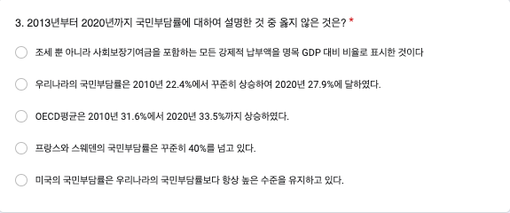
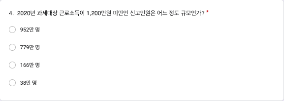
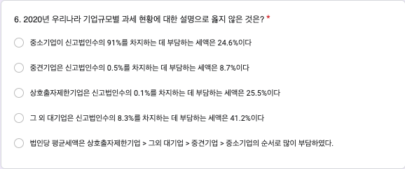
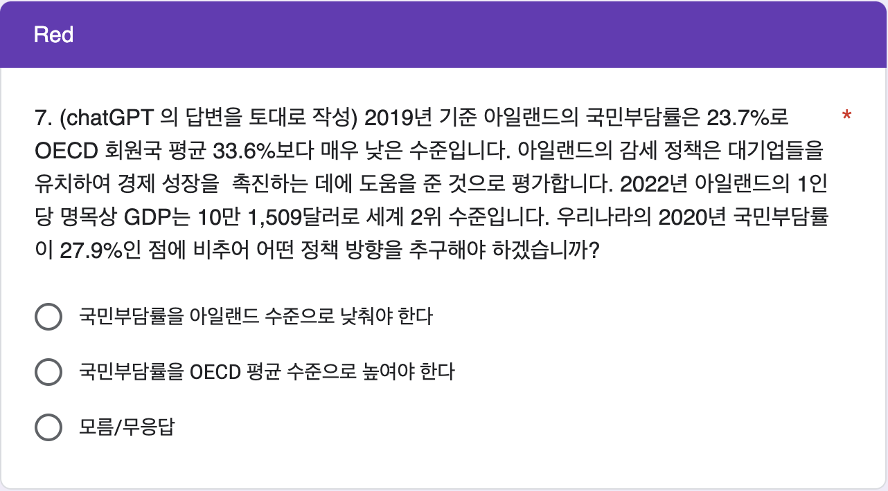

# 3주차 데이터 실험 집계

```{r setup_quiz03, include=FALSE}
knitr::opts_chunk$set(echo = TRUE)
library(readxl)
library(pander)
library(knitr)
library(magrittr)
library(dplyr)
library(googlesheets4)
library(showtext)
font_add(family = "kopub", 
         regular = "/Users/kwlee/Library/Fonts/KoPubWorld Dotum Medium.ttf",
         bold = "/Users/kwlee/Library/Fonts/KoPubWorld Dotum Bold.ttf",
         italic  = "/Users/kwlee/Library/Fonts/KoPubWorld Dotum Light.ttf")
showtext_auto()
panderOptions('table.split.table', Inf)
panderOptions('table.alignment.rownames', 'left')
panderOptions('table.alignment.default', 'right')
options(width=180)
```

## 실험의 목적

3주차 구글 예습 설문지 집계결과를 분석합니다. 

Q1~Q6에서는 랜덤화의 효과로 Red, Black 이 얼마나 닮았는지 알아봅니다.

Q7에서는 같은 사안에 대해서 질문 안에 편향된 정보를 담아 넣었을 때 Red, Black 의 응답이 어떻게 달라지는 지 알아봅니다.

끝으로 제출시간의 분포가 날마다 고른지, Red, Black 간에는 닮았는지 알아봅니다.

```{r, message = FALSE, echo=FALSE, results='hide'}
class_roll0314 <- 
  readRDS("./class_roll_250314.RDS")
class_roll0314 <- data.frame(class_roll0314)
## 수강 철회 반영 새 출석부
class_roll0321 <- read_excel("./data/class_roll_250321.xlsx", 
                        range = "B1:H605")
names(class_roll0321) <- c("dept", "college", "id", "name", "status", "email", "cell_no")
str(class_roll0321)
class_roll0321$group <- 
  class_roll0314$group[match(class_roll0321$id, class_roll0314$id)]
#> class_roll_250321 저장
saveRDS(class_roll0321, file = "./class_roll_250321.RDS")
class_roll <- class_roll0321
sheet_url <- "https://docs.google.com/spreadsheets/d/1bLatHhkcg2q5TYey3zq3U_v6M9SpmAh_mgw9T5dfrPw"
quiz <- 
  read_sheet(sheet_url)
# quiz <- 
#   read_excel("./data/quiz_250317.xlsx",
#              range = "A2:N290",
#              col_names = FALSE)
names(quiz) <- 
  c("time", "email", "dept", "id", "name", 
    "Q1", "Q2", "Q3", "Q4", "Q5", "Q6", "group", "Q7_R", "Q7_B")
str(quiz)
quiz <- data.frame(quiz)
class(quiz$id) <- "character"
quiz$Q2 <- paste0(quiz$Q2 * 100, "%")
quiz$Q5 <- paste0(format(quiz$Q5 * 100, digits = 3, nsmall = 1), "%")
quiz$Q7_R[quiz$Q7_R == "국민부담률을 OECD 평균 수준으로 높여야 한다"] <- "높여야 한다"
quiz$Q7_R[quiz$Q7_R == "국민부담률을 아일랜드 수준으로 낮춰야 한다"] <- "낮춰야 한다"
quiz$Q7_B[quiz$Q7_B == "국민부담률을 OECD 평균 수준으로 높여야 한다"] <- "높여야 한다"
quiz$Q7_B[quiz$Q7_B == "국민부담률을 아일랜드 수준으로 낮춰야 한다"] <- "낮춰야 한다"
quiz$Q7 <- ifelse(is.na(quiz$Q7_R), quiz$Q7_B, quiz$Q7_R)
quiz$dept <- factor(quiz$dept)
quiz$group <- 
  factor(quiz$group, levels = c("Red", "Black"))
table(quiz$Q1, useNA = "ifany")
quiz$Q1 <- 
  factor(quiz$Q1, levels = c("78:22", "77:23", "76:24", "75:25", "74:26"))
quiz$Q2 <- 
  factor(quiz$Q2, levels = c("10%", "15%", "20%", "25%", "30%"))
quiz$Q3 <- 
  factor(quiz$Q3, 
         levels = c("조세 뿐 아니라 사회보장기여금을 포함하는 모든 강제적 납부액을 명목 GDP 대비 비율로 표시한 것이다", 
                    "우리나라의 국민부담률은 2010년 22.4%에서 꾸준히 상승하여 2020년 27.9%에 달하였다.", 
                    "OECD평균은 2010년 31.6%에서 2020년 33.5%까지 상승하였다.", 
                    "프랑스와 스웨덴의 국민부담률은 꾸준히 40%를 넘고 있다.",
                    "미국의 국민부담률은 우리나라의 국민부담률보다 항상 높은 수준을 유지하고 있다."))
quiz$Q4 <- 
  factor(quiz$Q4, levels = c("952만 명", "779만 명", "166만 명", "38만 명"))
quiz$Q5 <- 
  factor(quiz$Q5, levels = c(" 0.2%", "15.1%", "37.4%", " 5.9%"))
quiz$Q6 <- 
  factor(quiz$Q6, 
         levels = c("중소기업이 신고법인수의 91%를 차지하는 데 부담하는 세액은 24.6%이다", 
                    "중견기업은 신고법인수의 0.5%를 차지하는 데 부담하는 세액은 8.7%이다",
                    "상호출자제한기업은 신고법인수의 0.1%를 차지하는 데 부담하는 세액은 25.5%이다", 
                    "그 외 대기업은 신고법인수의 8.3%를 차지하는 데 부담하는 세액은 41.2%이다",
                    "법인당 평균세액은 상호출자제한기업 > 그외 대기업 > 중견기업 > 중소기업의 순서로 많이 부담하였다."))
quiz$Q7 <- 
  factor(quiz$Q7, 
         levels = c("낮춰야 한다", 
                    "높여야 한다", 
                    "모름/무응답"))
```

```{r, time, echo = FALSE, results = 'hide'}
## TZ Asia/Seoul 로 설정. UTC 왜곡 배제 효과
# quiz$time <- as.POSIXct(quiz$time, tz = "Asia/Seoul")
quiz$time <- format(quiz$time, format = "%Y-%m-%d %H:%M:%S")
## 자정 전에 들어 온 사람은 몇 명이나?
as.Date(quiz$time) %>%
  table
# 03-16 제출자 인덱스 찾기
idx <- which(as.Date(quiz$time) == as.Date("2025-03-16"))

# 새 시간 생성: 2025-03-17 00:01:00, 00:02:00, ...
# new_times <- as.POSIXct("2025-03-17 00:01:00") + 60 * (seq_along(idx) - 1)

# 해당 사람들의 시간 업데이트
# quiz$time[idx] <- new_times

# 강제로 타임존 설정
# attr(quiz$time, "tzone") <- "Asia/Seoul"

# 확인
table(as.Date(format(quiz$time, format = "%Y-%m-%d", tz = "Asia/Seoul")))
## 자정 전에 제출한 사람의 시간 수동 조정
quiz[quiz$id == "20237008", "time"] <- c("2025-03-17 00:00:01")
quiz[quiz$id == "20226782", "time"] <- c("2025-03-17 00:00:02")
str(quiz)
as.Date(quiz$time) %>%
  table
#> 마감기한으로부터 제출시점의 기간
# quiz$days <- 
#   as.numeric(difftime(as.POSIXct("2025-03-31 00:00:00", format = "%Y-%m-%d %H:%M:%S"),
#                       as.POSIXct(quiz$time, format = "%Y-%m-%d %H:%M:%S"), 
#                       units = 'days'))
quiz$days <- 
  as.numeric(difftime("2025-03-31 00:00:00", quiz$time, units = 'days'))
quiz$hours <- 
  as.numeric(difftime("2025-03-31 00:00:00", quiz$time, units = 'hours'))
str(quiz)
```

```{r, echo = FALSE, results = 'hide'}
#> 학번 잘못 써서 고생시키는 녀석들 찾아내는 코드
wrong_id <- setdiff(quiz$id, class_roll$id)
quiz %>%
  filter(id %in% wrong_id) %>%
  select(id, name, dept, email)
# 1. 잘못된 id 가진 행 찾기
quiz_wrong_ids <- quiz %>%
  anti_join(class_roll, by = "id") 
# 2. 잘못된 id를 따로 저장하고 수정하기
wrong_ids <- quiz_wrong_ids$id
quiz_wrong_ids <- quiz_wrong_ids %>%
  mutate(id = case_when(
    id == "20242708" ~ "20243708",
    id == "2043817" ~ "20243817",
    id == "20343429" ~ "20243429",
    TRUE ~ id
  ))
# 3. quiz 에서 id 틀린 행을 제거하고 옳은 id 갖춘 행으로 교체하기
quiz <- quiz %>%
  filter(!id %in% wrong_ids) %>%
  bind_rows(quiz_wrong_ids)
# quiz[quiz$id %in% setdiff(quiz$id, class_roll$id), c("id", "name", "dept", "group")]

#> 틀린 학번 수정하여 되돌리기 (작동하지 않음. 참고로만)
# quiz <- quiz %>%
#   #> `left_join`으로 `name`과 `dept`를 기준으로 교정 정보를 추가
#   left_join(class_roll %>% select(id, name, dept), 
#             by = "name", 
#             suffix = c("", "_correct")) %>%
#   #> `id_correct`가 있는 경우 이를 사용하여 `id`를 교정하고, 그렇지 않으면 기존의 `id`를 유지
#   mutate(id = if_else(!is.na(id_correct) & id != id_correct, id_correct, id)) %>%
#   #> 임시로 추가된 `id_correct` 열 제거
#   select(-id_correct)

#> 중복 제출자
quiz %>%
  filter(duplicated(id)) %>%
  select(id, name)
# which(duplicated(quiz$id)) %>%
#   quiz[., c("id", "name")]
quiz %>%
  filter(id %in% c("20213320", "20241232", "20242328"))
# quiz[quiz$name %in% c("최재혁", "박지연"), ] #> 최재혁, 박지연이 중복 제출
quiz <- quiz %>% 
  arrange(id, desc(time)) %>%
  distinct(id, .keep_all = TRUE)
#> 불참자들
absentee <- class_roll %>%
  anti_join(quiz, by = "id") %>%
  select(id, name, group) %>%
  arrange(id)
# absentee <- 
#   class_roll[class_roll$id %in% setdiff(class_roll$id, quiz$id), c("id", "name", "group")] %>%
#   `[`(order(.$name), ) 
absentee %>%
  pander(row.names = FALSE) 
absentee %>%
  count(group) %>%
  print()
# absentee$group %>%
#   table
```

### Red, Black을 잘못 표시한 사람들

```{r, echo = FALSE}
#> group2 생성
quiz <- quiz %>%
  left_join(class_roll %>% select(id, group), by = "id", suffix = c("", "_class_roll")) %>%
  rename(group2 = group_class_roll)

#> group 과 group2가 다른 행 필터링
wrong_group <- quiz %>%
  filter(group2 != group)

#> 잘못된 그룹 정보 출력
# wrong_group %>%
#   select(time, id, name, group2, group) %>%
#   arrange(time) %>%
#   rename(제출시간 = time, 학번 = id, 이름 = name, 랜덤화출석부 = group2, 구글예습퀴즈 = group) %>%
#   pander(row.names = FALSE)

#> 옛 코드
# quiz$group2 <- class_roll$group[match(quiz$id, class_roll$id)]
# wrong_group <- which(quiz$group != quiz$group2)
# quiz[wrong_group, c("time", "id", "name", "group2", "group")] %>%
#   `[`(order(.$time), ) %>%
#   `colnames<-`(c("제출시간", "학번", "이름", "랜덤화출석부", "구글예습퀴즈")) %>%
#   pander(row.names = FALSE)
# quiz[wrong_group, c("time", "id", "group2", "group")] %>%
#   `[`(order(.$time), ) %>%
#   `colnames<-`(c("제출시간", "학번", "랜덤화출석부", "구글예습퀴즈")) %>%
#   pander(row.names = FALSE)
wrong_tbl <- 
  table("랜덤화출석부" = quiz$group2, "구글예습퀴즈" = quiz$group)

wrong_tbl %>%
  rbind("계" = colSums(.)) %>%
  pander(row.names = c("Red(랜덤화출석부)", "Black(랜덤화출석부)", "계"), 
         col.names = c("Red(구글예습퀴즈)", "Black(구글예습퀴즈)"))
```

랜덤화출석부에 있는 Red, Black 과 실제 구글설문에 올린 Red, Black 이 다른 사람들의 수효는 `r nrow(wrong_group)`명입니다. 

Red를 Black 이라고 한 사람이 `r wrong_tbl[1, 2]`명, Black 을 Red 라고 한 사람이 `r wrong_tbl[2, 1]`명입니다. 

두 가지 방법으로 분석합니다.

우선 Red, Black 을 잘못 선택한 `r nrow(wrong_group)`명을 랜덤하게 둘로 나누면 어느 한 쪽 집단에 들어갈 기대인원은 `r nrow(wrong_group)`명을 둘로 나눈 `r nrow(wrong_group) / 2`(명)이고, 표준오차는 `r nrow(wrong_group)`의 제곱근에 1/2을 곱해 준 `r round(sqrt(nrow(wrong_group)) / 2, digits  = 1)`명이 됩니다. 

실제로 Red를 Black 이라고 한 사람수, `r wrong_tbl[1, 2]`명이나 Black 을 Red 라고 한 사람수, `r wrong_tbl[2, 1]`명은 기대인원으로부터 표준오차 범위 안에 아주 잘 들어갑니다.

두 번째 분석 방법은 확률을 계산해 보는 것입니다. 

Red, Black 을 잘못 선택한 `r nrow(wrong_group)`명을 랜덤하게 둘로 나눌 때, 실제로 관찰된 `r max(wrong_tbl[1, 2], wrong_tbl[2, 1])`명 이상이나 `r min(wrong_tbl[1, 2], wrong_tbl[2, 1])`명이하로  잘못 선택한 사람수가 나올 가능성은 얼마나 되는가 입니다. 

이 경우 공평한 동전던지기를 확률 법칙으로 표현한 이항분포로부터 계산할 수 있습니다. 

시행횟수가 `r nrow(wrong_group)`이고 한 번 시행에서 성공확률이 1/2 인 이항분포에서 성공횟수가 `r min(wrong_tbl[1, 2], wrong_tbl[2, 1])`이하이거나 `r max(wrong_tbl[1, 2], wrong_tbl[2, 1])`이상을 관찰할 확률은 `r round(pbinom(min(wrong_tbl[1, 2], wrong_tbl[2, 1]), nrow(wrong_group), 1/2) * 2,  digits = 3)`입니다. 

공평한 동전 던지기에서 앞면이 `r min(wrong_tbl[1, 2], wrong_tbl[2, 1])`개 이하 나오는 확률은 `r max(wrong_tbl[1, 2], wrong_tbl[2, 1])`개 이상 나오는 확률과 같기 때문에 사실상 한쪽만 계산해서 2배 해 주면 됩니다. 

이 값을 p-value 라고 하는데, p-value가 0.05보다 작을 때 **통계적으로 유의한 차이를 관찰**하였다고 말합니다. 

즉, 공평한 동전을 던지는 것과 같은 과정이라고 가정하였을 때 실제로 관찰된 값들이 가정으로부터 얼마나 떨어져 있는지를 표현한 것입니다.

0.05, 즉 1/20은 이런 실험을 스무 번 정도 반복하면 1번 나올 정도로 드문 사건을 의미합니다. 

즉 가정이 타당하다면 나오기 힘든 결과라는 것입니다.

그런데 Red, Black 을 잘못 표시한 사람들의 분포에서 관찰된 p-value 는 0.05와는 비교도 안될 정도로 큰 값입니다.

따라서 두 집단이 랜덤화 효과가 작동하여 **통계적으로 유의한 차이를 보이지 않는다**고 할 수 있습니다. 

### 응답인원의 Red, Black

Red 로 응답한 인원은 `r colSums(wrong_tbl)[1]`명, Black 에 응답한 인원은 `r colSums(wrong_tbl)[2]`명입니다. 

전체 응답인원 `r sum(wrong_tbl)` 명을 랜덤하게 둘로 나눌 때 어느 한 쪽의 기대인원은 전체 응답인원의 절반인 `r sum(wrong_tbl) / 2`명이고, 표준오차는 전체 응답인원의 제곱근에 1/2을 곱해 준 `r round(sqrt(sum(wrong_tbl)) * 1 / 2, digits = 1)` 명입니다. 

따라서 Red, Black 각 그룹에 관찰된 인원은 기대인원으로부터 표준오차 범위 안에 들어갑니다.

## Q1. 국세와 지방세 비중

```{r, echo = FALSE, out.width = "75%", align = "left"}

```

### 국세와 지방세 비중(집계표)

```{r, national vs local tax, echo = FALSE, warning = FALSE}
tbl_q1_a <- 
  quiz$Q1 %>% 
  table(quiz$group, ., useNA = "ifany") %>%
  cbind("계" = rowSums(.)) %>%
  rbind("계" = colSums(.))
tbl_q1_a %>% 
  pander 
chisq_test_q1 <- 
  tbl_q1_a %>%
  `[`(-3, -6) %>%
  chisq.test(simulate.p.value = FALSE) 
chisq_test_q1 %>%
  pander
```

Q1의 집계 결과가 Red, Black 간에 통계적으로 유의한 차이가 있는지 알아보기 위하여 카이제곱 테스트를 수행하였습니다. 

그 결과 카이제곱 통계량은 `r chisq_test_q1[1] %>% format(digits = 2, nsmall = 2)`, 자유도는 `r chisq_test_q1[2] %>% format(digits = 2, nsmall = 3)` , p-value 는 `r chisq_test_q1[3] %>% format(digits = 2, nsmall = 4)`이므로 Red, Black 간에 통계적으로 유의한 차이를 보이지 않습니다.

실제로 닮은 게 느껴집니까?

### 국세와 지방세 비중(%)

```{r, national vs local tax in percentage, echo = FALSE, warning = FALSE}
ptbl_q1 <- 
  tbl_q1_a %>% 
  `[`(3, -6) %>%
  prop.table %>% 
  c("계" = sum(.)) %>%
  `*`(100) 
ptbl_q1 %>%
  format(digits = 2, nsmall = 1) %>%
  pander
```

정답률은 Red, Black 을 합하여 계산하는데, `r ptbl_q1[5] %>% format(digits = 2, nsmall = 1)`(%) 입니다.

## Q2. 조세부담률 

```{r, echo = FALSE, out.width = "75%", align = "left"}

```

### 조세부담률(집계표)

```{r, tax burden rate, echo = FALSE, warning = FALSE}
tbl_q2_a <- 
  quiz$Q2 %>% 
  table(quiz$group, ., useNA = "ifany") %>%
  cbind("계" = rowSums(.)) %>%
  rbind("계" = colSums(.))
tbl_q2_a %>% 
  pander 
chisq_test_q2 <- 
  tbl_q2_a %>%
  `[`(-3, -6) %>%
  chisq.test(simulate.p.value = FALSE) 
chisq_test_q2 %>%
  pander
```

Q2의 집계 결과가 Red, Black 간에 통계적으로 유의한 차이가 있는지 알아보기 위하여 카이제곱 테스트를 수행하였습니다. 

그 결과 카이제곱 통계량은 `r chisq_test_q2[1] %>% format(digits = 2, nsmall = 3)`, 자유도는 `r chisq_test_q2[2] %>% format(digits = 2, nsmall = 2)`, p-value 는 `r chisq_test_q2[3] %>% format(digits = 2, nsmall = 4)`이므로 Red, Black 간에 통계적으로 유의한 차이를 보이지 않습니다.

실제로 닮은 게 느껴집니까?

### 조세부담률(%)

```{r, tax burden rate in percentage, echo = FALSE}
ptbl_q2 <- 
  tbl_q2_a %>% 
  `[`(3, -6) %>%
  prop.table %>% 
  c("계" = sum(.)) %>%
  `*`(100) 
ptbl_q2 %>%
  format(digits = 2, nsmall = 1) %>%
  pander
```

정답률은 Red, Black 을 합하여 계산하는데, `r ptbl_q2[3] %>% format(digits = 2, nsmall = 1)`(%) 입니다.

## Q3. OECD 국민부담률

```{r, echo = FALSE, out.width = "75%", align = "left"}

```

### OECD 국민부담률(집계표)

```{r, national burden rate, echo = FALSE, warning = FALSE}
tbl_q3_a <- 
  quiz$Q3 %>% 
  table(quiz$group, ., useNA = "ifany") %>%
  cbind("계" = rowSums(.)) %>%
  rbind("계" = colSums(.))
tbl_q3_a %>% 
  pander 
chisq_test_q3 <- 
  tbl_q3_a %>%
  `[`(-3, -6) %>%
  chisq.test(simulate.p.value = FALSE) 
chisq_test_q3 %>%
  pander
```

Q3의 집계 결과가 Red, Black 간에 통계적으로 유의한 차이가 있는지 알아보기 위하여 카이제곱 테스트를 수행하였습니다. 

그 결과 카이제곱 통계량은 `r chisq_test_q3[1] %>% format(digits = 2, nsmall = 3)`, 자유도는 `r chisq_test_q3[2] %>% format(digits = 2, nsmall = 2)`, p-value 는 `r chisq_test_q3[3] %>% format(digits = 2, nsmall = 4)`이므로 Red, Black 간에 통계적으로 유의한 차이를 보이지 않습니다.

실제로 닮은 게 느껴집니까?

### OECD 국민부담률(%)

```{r, national burden rate in percentage, echo = FALSE}
ptbl_q3 <- 
  tbl_q3_a %>% 
  `[`(3, -6) %>%
  prop.table %>% 
  c("계" = sum(.)) %>%
  `*`(100) 
ptbl_q3 %>%
  format(digits = 2, nsmall = 1) %>%
  pander
```

정답률은 Red, Black 을 합하여 계산하는데, `r ptbl_q3[5] %>% format(digits = 2, nsmall = 1)`(%) 입니다.

## Q4. 과세대상 근로소득 1,200만 원

```{r, echo = FALSE, out.width = "75%", align = "left"}

```

### 과세대상 근로소득 1,200만 원(집계표)

```{r, lowest taxable income, echo = FALSE, warning = FALSE}
tbl_q4_a <- 
  quiz$Q4 %>% 
  table(quiz$group, ., useNA = "ifany") %>%
  cbind("계" = rowSums(.)) %>%
  rbind("계" = colSums(.))
tbl_q4_a %>% 
  pander 
chisq_test_q4 <- 
  tbl_q4_a %>%
  `[`(-3, -5) %>%
  chisq.test(simulate.p.value = FALSE) 
chisq_test_q4 %>%
  pander
```

Q4의 집계 결과가 Red, Black 간에 통계적으로 유의한 차이가 있는지 알아보기 위하여 카이제곱 테스트를 수행하였습니다. 

그 결과 카이제곱 통계량은 `r chisq_test_q4[1] %>% format(digits = 2, nsmall = 3)`, 자유도는 `r chisq_test_q4[2] %>% format(digits = 2, nsmall = 2)`, p-value 는 `r chisq_test_q4[3] %>% format(digits = 2, nsmall = 4)`이므로 Red, Black 간에 통계적으로 유의한 차이를 보이지 않습니다.

실제로 닮은 게 느껴집니까?

### 과세대상 근로소득 1,200만 원(%)

```{r, lowest taxable income in percentage, echo = FALSE}
ptbl_q4 <- 
  tbl_q4_a %>% 
  `[`(3, -5) %>%
  prop.table %>% 
  c("계" = sum(.)) %>%
  `*`(100) 
ptbl_q4 %>%
  format(digits = 2, nsmall = 1) %>%
  pander
```

정답률은 Red, Black 을 합하여 계산하는데, `r ptbl_q4[1] %>% format(digits = 2, nsmall = 1)`(%) 입니다.

## Q5. 소득세 실효세율

```{r, echo = FALSE, out.width = "75%", align = "left"}

```

### 소득세 실효세율(집계표)

```{r, echo = FALSE, warning = FALSE}
tbl_q5_a <- 
  quiz$Q5 %>% 
  table(quiz$group, ., useNA = "ifany") %>%
  cbind("계" = rowSums(.)) %>%
  rbind("계" = colSums(.))
tbl_q5_a %>% 
  pander 
chisq_test_q5 <- 
  tbl_q5_a %>%
  `[`(-3, -5) %>%
  chisq.test(simulate.p.value = FALSE) 
chisq_test_q5 %>%
  pander
```

Q5의 집계 결과가 Red, Black 간에 통계적으로 유의한 차이가 있는지 알아보기 위하여 카이제곱 테스트를 수행하였습니다. 

그 결과 카이제곱 통계량은 `r chisq_test_q5[1] %>% format(digits = 2, nsmall = 3)`, 자유도는 `r chisq_test_q5[2] %>% format(digits = 2, nsmall = 2)`, p-value 는 `r chisq_test_q5[3] %>% format(digits = 2, nsmall = 4)`이므로 Red, Black 간에 통계적으로 유의한 차이를 보이지 않습니다.

실제로 닮은 게 느껴집니까?

### 소득세 실효세율(%)

```{r, echo = FALSE}
ptbl_q5 <- 
  tbl_q5_a %>% 
  `[`(3, -5) %>%
  prop.table %>% 
  c("계" = sum(.)) %>%
  `*`(100) 
ptbl_q5 %>%
  format(digits = 2, nsmall = 1) %>%
  pander
```

정답률은 Red, Black 을 합하여 계산하는데, `r ptbl_q5[4] %>% format(digits = 2, nsmall = 1)`(%) 입니다.

## Q6. 기업규모별 과세 현황

```{r, echo = FALSE, out.width = "75%", align = "left"}

```

### 기업규모별 과세 현황(집계표)

```{r, corporate tax, echo = FALSE, warning = FALSE}
tbl_q6_a <- 
  quiz$Q6 %>% 
  table(quiz$group, ., useNA = "ifany") %>%
  cbind("계" = rowSums(.)) %>%
  rbind("계" = colSums(.))
tbl_q6_a %>% 
  pander 
chisq_test_q6 <- 
  tbl_q6_a %>%
  `[`(-3, -6) %>%
  chisq.test(simulate.p.value = FALSE) 
chisq_test_q6 %>%
  pander
```

Q6의 집계 결과가 Red, Black 간에 통계적으로 유의한 차이가 있는지 알아보기 위하여 카이제곱 테스트를 수행하였습니다. 

그 결과 카이제곱 통계량은 `r chisq_test_q6[1] %>% format(digits = 2, nsmall = 3)`, 자유도는 `r chisq_test_q6[2] %>% format(digits = 2, nsmall = 2)`, p-value 는 `r chisq_test_q6[3] %>% format(digits = 2, nsmall = 4)`이므로 Red, Black 간에 통계적으로 유의한 차이를 보이지 않습니다.

실제로 닮은 게 느껴집니까?

### 기업규모별 과세 현황(%)

```{r, corporate tax in percentage, echo = FALSE}
ptbl_q6 <- 
  tbl_q6_a %>% 
  `[`(3, -6) %>%
  prop.table %>% 
  c("계" = sum(.)) %>%
  `*`(100) 
ptbl_q6 %>%
  format(digits = 2, nsmall = 1) %>%
  pander
```

정답률은 Red, Black 을 합하여 계산하는데, `r ptbl_q6[5] %>% format(digits = 2, nsmall = 1)`(%) 입니다. 

## Q7. 국민부담률 적정 수준 : 아일랜드와 OECD 평균

질문 내용에 의도하는 바를 담으면 어떨까요? 

OECD 국가 중 국민부담률이 매우 낮은 편인 아일랜드의 사례를 들어서 감세정책이 가져온 긍정적인 효과에 대해서 설명하고 우리나라의 바람직한 조정 방향은 무엇이냐고 묻는 것을 Red, 감세 정책이 가져온 부정적인 효과에 대해서 설명하고 우리나라의 바람직한 조정 방향은 무엇이냐고 묻는 것을 Black 에 배치했을 때, 설명이 응답에 영향을 미치지 않으면 Red 와 Black에 차이가 없어야 할텐데 집계결과는 어떻게 나오고 있나요?

분명히 영향을 미치고 있는 것으로 보입니다. 

통계적으로 매우 유의한 차이가 관찰되고 있습니다. 

감세정책의 효과가 긍정적이라고 설명한 Red 에서는 낮춰야 한다는 응답이, 감세정책의 효과가 부정적이라고 설명한 Black 에서는 높여야 한다는 응답이 높게 나온 것을 볼 수 있고, 따라서 p-value 가 엄청나게 작은 값을 보여주고 있습니다.

```{r, echo = FALSE, out.width = "67%", align = "left"}

```

```{r, echo = FALSE, out.width = "67%", align = "left"}

```

### 집계표

```{r, echo = FALSE, warning = FALSE}
tbl_q7_a <- 
  quiz$Q7 %>%
  table(quiz$group, ., useNA = "ifany") %>%
  cbind("계" = rowSums(.)) %>%
  rbind("계" = colSums(.))
tbl_q7_a %>% 
  pander(row.names = c("Red(감세의 긍정적효과 설명)", 
                       "Black(감세의 부정적 효과 설명)", 
                       "계"))
chisq_test_q7 <- 
  tbl_q7_a %>%
  `[`(-3, -4) %>%
  chisq.test(simulate.p.value = FALSE) 
chisq_test_q7 %>%
  pander
```

Q7의 Red에는 아일랜드의 사례에서 감세 정책의 긍정적 측면을 설명한 후 우리나라 조세 정책의 방향에 대하여 물었을 때,  `r tbl_q7_a[1, 4]`명이 응답한 가운데 `r tbl_q7_a[1, 1]`명이 우리나라의 국민부담률을 아일랜드 수준으로 "낮춰야 한다"는 반응을 보이고, `r tbl_q7_a[1, 2]`명이 OECD평균 수준으로  "높여야 한다"는 반응을 보입니다.

Black은 같은 아일랜드의 사례에서 감세 정책의 부정적 측면을 설명한 후 우리나라 조세 정책의 방향에 대하여 물었을 떄, `r tbl_q7_a[2, 4]`명이 응답한 가운데 `r tbl_q7_a[2, 1]`명이 우리나라의 국민부담률을 아일랜드 수준으로 "낮춰야 한다"는 반응을 보이고, `r tbl_q7_a[2, 2]`명이 OECD 평균 수준으로 "높여야 한다"는 반응을 보입니다. 

그리고 "모름/무응답"에 답한 인원은 Red에  `r tbl_q7_a[1, 3]`명, Black 에 `r tbl_q7_a[2, 3]`명이 응답하였습니다. 

우연일까요? 

모름/무응답에 있어서는 Red, Black이 몹시 닮았습니다. 

카이제곱 테스트는 이와 같은 상황에서 감세정책의 긍정적 측면을 부각시킨 경우와 부정적 측면을 부각시킨 경우에 그 차이가 통계적으로 매우, 매우, ... 유의하다는 것을 보여 줍니다. 

카이제곱 통계량은 `r chisq_test_q7[1] %>% format(digits = 2, nsmall = 3)`, 자유도는 `r chisq_test_q7[2] %>% format(digits = 2, nsmall = 2)`, p-value 는 `r chisq_test_q7[3] %>% format(digits = 2, nsmall = 4)`으로
감세정책의 어떤 측면을 설명하느냐에 따라 반응이 다르게 나온다는 것을 보여줍니다.

여기서 질문 내용에 의도하는 바를 담더라도 응답에 영향을 끼치지 않는다고 가정합니다.

랜덤화의 효과로 Red, Black 의 응답은 닮게 마련입니다. 

즉, 통계적으로 유의한 차이를 보이지 않게 됩니다.

그러나 실제로 관찰된 카이제곱 통계값의 P-value 는 0.05보다 매우 작은 값입니다.

따라서, 질문 내용에 의도하는 바를 담더라도 영향을 끼치지 않는다는 가정은 잘못된 것이죠.

이러한 논증 방식을 귀류법이라고 합니다.

### % 비교  

```{r, echo = FALSE}
ptbl_q7_a <- 
  tbl_q7_a %>% 
  `[`(-3, -4) %>%
  prop.table(margin = 1) %>% 
  `*`(100) %>%
  cbind("계" = rowSums(.))
ptbl_q7_a %>%
  format(digits = 2, nsmall = 1) %>%
  pander(row.names = c("Red(감세의 긍정적효과 설명)", "Black(감세의 부정적 효과 설명)"))
```

감세정책의 긍정적 측면을 설명한 Red에서 우리나라의 국민부담률을 "낮춰야 한다"고 응답하는사람들의 백분율, `r format(ptbl_q7_a[1, 1], digits = 2, nsmall = 1)`(%)은 "높여야 한다"고 응답하는 사람들의 백분율, `r format(ptbl_q7_a[1, 2], digits = 2, nsmall = 1)`(%) 보다 높습니다. 

반면 감세정책의 부정적 측면을 설명한 Black에서 우리나라의 국민 부담률을 "낮춰야 한다"고 응답하는 사람들의 백분율, `r format(ptbl_q7_a[2, 1], digits = 2, nsmall = 1)`(%)은 "높여야 한다"고 응답하는 사람들의 백분율, `r format(ptbl_q7_a[2, 2], digits = 2, nsmall = 1)`(%) 보다 훨씬 적습니다. 

어느 정책의 긍정적 측면을 설명하느냐, 부정적 측면을 설명하느냐에 따라 반응이 달라진다는 것을 잘 알 수 있습니다. 

Red 와 Black 이 워낙 차이가 나지만 전체적으로 어느 정도가 우리나라의 국민부담률을 "낮춰야 한다"하고 어느 정도가 "높여야 한다"고 응답하였는지 합쳐 보겠습니다.

### % 합계

```{r, echo = FALSE}
ptbl_q7 <- 
  tbl_q7_a %>% 
  `[`(3, -4) %>%
  prop.table %>% 
  c("계" = sum(.)) %>%
  `*`(100) 
ptbl_q7 %>%
  format(digits = 2, nsmall = 1) %>%
  pander
```

우리나라의 국민부담률을 "낮춰야 한다"고 응답한 백분율은 Red, Black 합쳐서  `r format(ptbl_q7[1], digits = 2, nsmall = 1)`(%)(으)로  우리나라의 국민부담률을 '높여야한다"고 응답한 백분율, `r format(ptbl_q7[2], digits = 2, nsmall = 1)`(%) 보다 상당히 적습니다. 

다만, 모름/무응답이 `r format(ptbl_q7[3], digits = 2, nsmall = 1)`(%)로 적지 않습니다.

### Mosaic Plot

```{r, echo = FALSE, fig.width = 8, fig.height = 6, eval = TRUE}
library(ggplot2)
source("./mosaic_gg.R")
m_list <- 
  quiz$Q7 %>%
  table(quiz$group, ., useNA = "ifany") %>%
  t %>%
  mosaic_gg
m <- m_list$m
df <- m_list$df
p_df <- m_list$p_df
names(df)[1] <- "Var1"
names(p_df)[1] <- "Var1"
# df$Var1 %<>% factor(labels = c("반이나 남았네", "반밖에 안 남았네", "모름/무응답"))
df$Var2 %<>% factor(labels = c("감세의 긍정적 효과 설명", "감세의 부정적 효과 설명"))
# p_df$Var1 %<>% factor(labels = c("반이나 남았네", "반밖에 안 남았네", "모름/무응답"))
p_df$Var2 %<>% factor(labels = c("감세의 긍정적 효과 설명", "감세의 부정적 효과 설명"))
m + geom_text(aes(x = center, y = 1.05), 
              family = "kopub",
              label = df[, 2]) +
  theme_bw(base_family = "kopub") +
  labs(title = "국민부담률의 적정 수준 판단", x = "Red or Black(누적 %)", y = "인원(%, 명)") +
  scale_fill_brewer(name = "응답", 
                    labels = c("아일랜드 수준으로 낮춰야 한다", 
                               "OECD 평균 수준으로 높여야 한다", 
                               "모름/무등답"),
                    type = "qual", 
                    palette = "Set2", 
                    direction = 1) +
  theme(plot.title = element_text(hjust = 0.5, 
                                  size = 18, 
                                  family = "kopub",
                                  face = "bold")) 
ggsave("./pics/Quiz250317_Q7_RnB.png", dpi = 120, width = 960, height = 840, units = "px")
```

Mosaic Plot 은 이 집계결과를 시각적으로 잘 보여줍니다. 

감세정책의 긍정적 측면을 설명한 Red 에서 우리나라의 국민부담률을 "낮춰야 한다"고 응답한 백분율이 높고, 감세정책의 부정적 측면을 설명한 Black 에서 우리나라의 국민부담률을 "높여야 한다"고 응답한 백분율이 월등히 높은 것을 시각적으로 알 수 있습니다. 

## 마감 시간으로부터 제출 시간의 분포

### 분포표

```{r, echo = FALSE, warning = FALSE}
N <- nrow(quiz)
days_tbl <- 
  quiz$days %>%
  cut(breaks = c(0:14), include.lowest = TRUE) %>%
  table(quiz$group, .) 
days_tbl %>%
  cbind("계" = rowSums(.)) %>%
  rbind("계" = colSums(.)) %>%
  `colnames<-`(., c(paste0(14:1, "일"), "계")) %>%
  pander(caption = "일 단위")
```

분포표로부터 두 가지 문제를 살펴보겠습니다. 

첫째, 날마다 고르게 제출하는가? 

둘째, Red, Black 간에 통계적으로 유의한 차이가 있는가?

각 문제를 살펴보기 위해서는 분포표의 일부분을 대상으로 카이제곱 테스트를 수행합니다.

### 날마다 고르게 제출하는가?

```{r, echo = FALSE, warning = FALSE}
days_tbl %>%
  rbind("계" = colSums(.)) %>%
  `[`(3, 1:14) %>%
  `names<-`(., paste0(14:1, "일")) %>%
  pander
days_chisq_test <-
  days_tbl %>%
  rbind("계" = colSums(.)) %>%
  `[`(3, 1:14) %>%
  chisq.test(simulate.p.value = FALSE) 
days_chisq_test %>%
  pander
```

날마다 고르게 제출하는지 알아 보았습니다. 

분포표의 "계"행에서 '계'열을 제외하고 카이제곱테스트를 수행합니다. 

분포표 만으로도 쉽게 파악할 수 있지만 카이제곱테스트가 명확히 해 줍니다. 

카이제곱 통계량은 `r format(days_chisq_test[1], digits = 2, nsmall = 2)`, 자유도는 `r format(days_chisq_test[2], digits = 2, nsmall = 2)`, p-value 는 `r format(days_chisq_test[3], digits = 2, nsmall = 2)` 이므로 결코 고르게 제출한다고 말할 수 없겠습니다. 

막대그래프로 살펴 보겠습니다.

### 막대그래프

```{r, echo = FALSE}
# png(file = "./pics/2302/quiz_submission_8.png", width = 640, height = 480)
suppressMessages({
par(family = "kopub")
b <- 
  quiz$days %>%
  cut(breaks = c(0:14), include.lowest = TRUE) %>%
  table %>%
  rev %>%
  barplot(space = 0, names.arg = rep(c("월", "화", "수", "목", "금", "토", "일"), 2),
          col = c(rep("white", 13), "pink"),
          ylim = c(0, 300)) 
text(x = b[14, 1], y = sum(days_tbl[, 1]), 
     labels = paste0(sum(days_tbl[, 1]), "명"), pos = 3)
text(x = b[14, 1], y = sum(days_tbl[, 1]) / 2, 
     labels = paste0(format(sum(days_tbl[, 1]) / N * 100, digits = 1, nsmall = 0), "%"))
title(main = paste0("Quiz250317 (", N, "명 제출)"))
# title(main = "일 단위 퀴즈 제출 인원", sub = paste0("Quiz230925 (", N, "명 제출)"))
dev.copy(png, file = "./pics/2501/quiz_submission_3.png", width = 640, height = 480)
invisible(dev.off())
})
```

막대그래프는 총 제출인원 `r N`(명) 중에 `r sum(days_tbl[, 1])`(명),  `r format(sum(days_tbl[, 1]) / N * 100, digits = 1, nsmall = 0)`(%)가 마감일에 몰리는 것을 명확히 보여주고 있습니다.

### Red, Black 간에 닮았는가?

```{r, echo = FALSE, warning = FALSE}
days_tbl %>%
  rbind("계" = colSums(.)) %>%
  `[`(-3, 1:14) %>%
  `colnames<-`(., paste0(14:1, "일")) %>%
  pander
days_RnB_chisq_test <-
  days_tbl %>%
  `[`(-3, 1:14) %>%
  chisq.test(simulate.p.value = FALSE) 
days_RnB_chisq_test %>%
  pander
```

제출시간의 분포가 Red, Black 간에 닮았는지 알아 보았습니다. 

이번에는 분포표의 첫번째와 두번째 행, '계'열을 제외한 나머지 열에 대해서 카이제곱테스트를 수행합니다. 
카이제곱 통계량은 `r format(days_RnB_chisq_test[1], digits = 2, nsmall = 3)`, 자유도는 `r format(days_RnB_chisq_test[2], digits = 2, nsmall = 2)`, p-value 는 `r format(days_RnB_chisq_test[3], digits = 2, nsmall = 4)` 이므로 제출 시간의 분포는 Red, Black 간에 통계적으로 유의한 차이가 관찰되지 않습니다. 

이 사실을 Mosaic Plot을 이용하여 시각적으로 살펴보겠습니다. 

닮았다고 느껴지나요?

### Mosaic Plot

```{r, echo = FALSE, fig.width = 10, fig.height = 5}
library(ggplot2)
source("./mosaic_gg.R")
m2_list <- days_tbl[, 14:1] %>%
  mosaic_gg
m2 <- m2_list$m
df2 <- m2_list$df
p_df2 <- m2_list$p_df
names(df2[, 2]) <- "Days"
m2 + geom_text(aes(x = center, y = 1.05), 
              family = "kopub",
              label = rep(rep(c("월", "화", "수", "목", "금", "토", "일"), each = 2), times = 2)) +
  theme_bw(base_family = "kopub") +
  labs(title = "마감일로부터 제출시간의 분포", x = "마감일로부터 일수(누적 %)", y = "인원 백분율(%)") +
  scale_fill_brewer(name = "그룹", 
                    labels = c("Red", 
                               "Black"),
                    type = "qual", 
                    palette = "Set1", 
                    direction = 1) +
  theme(plot.title = element_text(hjust = 0.5, 
                                  size = 18, 
                                  family = "kopub",
                                  face = "bold"),
        axis.text.x = element_text(angle = -90, vjust = 0.5)) 
ggsave("./pics/Quiz250317_submission_3.png", dpi = 120, width = 960, height = 840, units = "px")
```

```{r, echo = FALSE}
saveRDS(quiz, file = "./quiz250317.RDS")
# save.image("./quiz250317.RData")
```