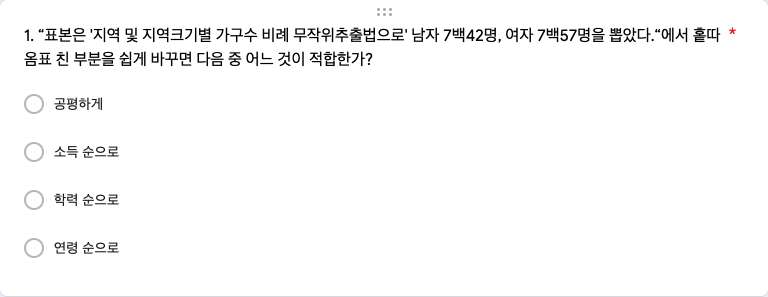
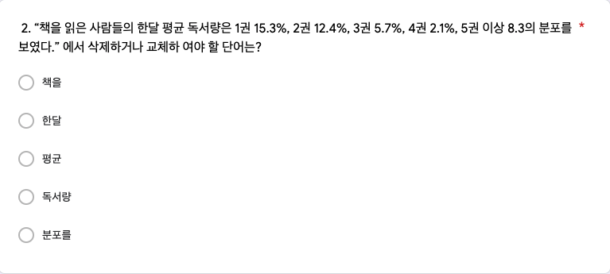
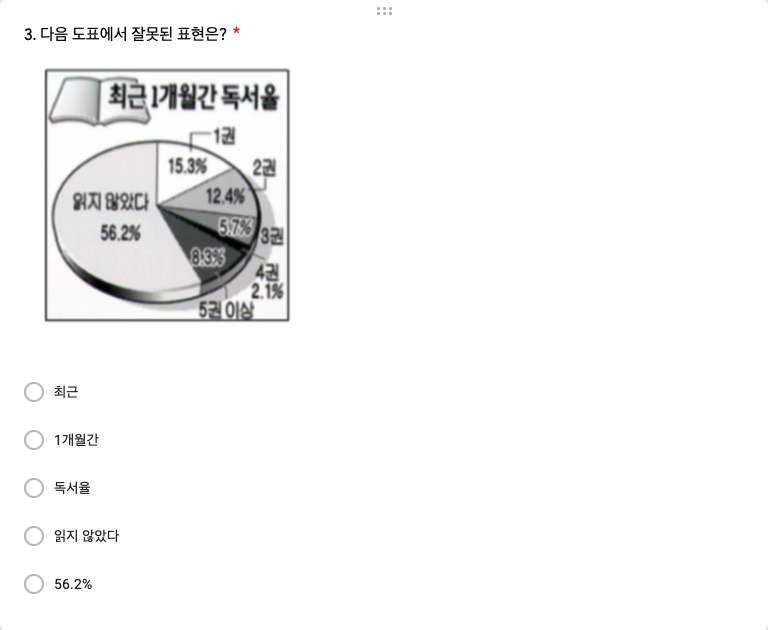
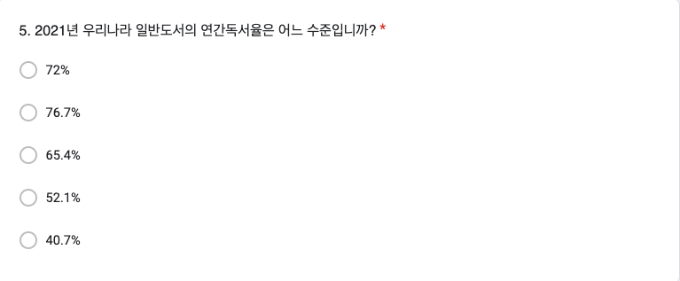
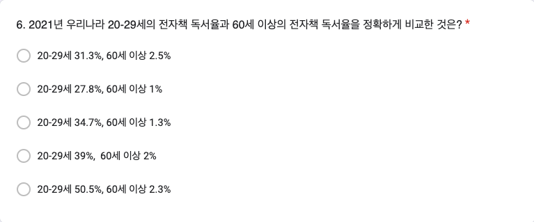

# 6주차 데이터 실험 집계

```{r setup_quiz06, include=FALSE}
knitr::opts_chunk$set(echo = TRUE)
# install.packages("pander", repos = "https://cran.rstudio.com")
# install.packages("xlsx", repos = "https://cran.rstudio.com")
library(readxl)
library(pander)
library(knitr)
library(magrittr)
library(dplyr)
library(googlesheets4)
library(showtext)
font_add(family = "kopub", 
         regular = "/Users/kwlee/Library/Fonts/KoPubWorld Dotum Medium.ttf",
         bold = "/Users/kwlee/Library/Fonts/KoPubWorld Dotum Bold.ttf",
         italic  = "/Users/kwlee/Library/Fonts/KoPubWorld Dotum Light.ttf")
showtext_auto()
panderOptions('table.split.table', Inf)
panderOptions('table.alignment.rownames', 'left')
panderOptions('table.alignment.default', 'right')
options(width=180)
```

## 실험의 목적

6주차 구글 예습 설문지 집계결과를 분석합니다. 

Q1~Q6에서는 랜덤화의 효과로 Red, Black 이 얼마나 닮았는지 알아봅니다.

Q7에서는 소득의 절대값보다 상대적 비교가 중시된다는 실험 결과를 분석합니다.

제출시간의 분포가 날마다 고른지, Red, Black 간에는 닮았는지 알아봅니다.

```{r, echo = FALSE, results = 'hide', message = FALSE}
class_roll0407 <- readRDS("./class_roll_250407.RDS")
class_roll0407 %<>% 
  data.frame
# class_roll0407 <- 
#   read_excel("./data/class_roll_250407.xlsx", range = "B1:H600")
# str(class_roll0407)
# names(class_roll0407) <- 
#   c("dept", "college", "id", "name", "status", "email", "cell_no")
# class_roll0407$group <- 
#   class_roll0321$group[match(class_roll0407$id, class_roll0321$id)]
# saveRDS(class_roll0407, file = "./class_roll_250407.RDS")
class_roll <- class_roll0407
str(class_roll)
sheet_url <- "https://docs.google.com/spreadsheets/d/1oUY8XDz5G0cp80mSpi6NJFgsQRIX9Dlz00kXRhsE_54"
quiz <- 
  read_sheet(sheet_url)
# quiz <- 
#   read_excel("./data/quiz241007.xlsx",
#              range = "A2:N737",
#              col_names = FALSE)
names(quiz) <- c("time", "email", "dept", "id", "name", paste0("Q", 1:6), "group", "Q7_R", "Q7_B")
class(quiz$id) <- "character"
str(quiz)
#> mutate, case_when 을 이용한 변수 변환
quiz <- quiz %>%
  mutate(
    # Q7_R에 대한 조건 처리
    Q7_R = case_when(
      Q7_R == "가. 내 연봉은 5천만원 남들은 2천5백만원" ~ "내가 남보다",
      Q7_R == "나. 내 연봉은 1억원, 남들은 2억원" ~ "남이 나보다",
      TRUE ~ Q7_R  # 나머지 값은 그대로 유지
    ),
    # Q7_B에 대한 조건 처리
    Q7_B = case_when(
      Q7_B == "나. 내 연봉은 5천만원, 남들은 2천5백만원" ~ "내가 남보다",
      Q7_B == "가. 내 연봉은 1억원, 남들은 2억원" ~ "남이 나보다",
      TRUE ~ Q7_B  # 나머지 값은 그대로 유지
    )
  )
quiz$Q7 <- coalesce(quiz$Q7_R, quiz$Q7_B)
#> 옛 코드
# quiz$Q7_R[quiz$Q7_R == "가. 내 연봉은 5천만원 남들은 2천5백만원"] <- 
#   "내가 남보다"
# quiz$Q7_R[quiz$Q7_R == "나. 내 연봉은 1억원, 남들은 2억원"] <- 
#   "남이 나보다"
# quiz$Q7_B[quiz$Q7_B == "나. 내 연봉은 5천만원, 남들은 2천5백만원"] <- 
#   "내가 남보다"
# quiz$Q7_B[quiz$Q7_B == "가. 내 연봉은 1억원, 남들은 2억원"] <- 
#   "남이 나보다"
# quiz$Q7 <- ifelse(is.na(quiz$Q7_R), quiz$Q7_B, quiz$Q7_R)

quiz$group <- 
  factor(quiz$group, levels = c("Red", "Black"))
quiz$Q1 <- 
  factor(quiz$Q1, levels = c("월간독서율", "월간독서량", "월간도서구입율", "월간 도서구입량"))
quiz$Q2 <- 
  factor(quiz$Q2, levels = c("공평하게", "소득 순으로", "학력 순으로", "연령 순으로"))
quiz$Q3 <- 
  factor(quiz$Q3, levels = c("책을", "한달",  "평균", "독서량", "분포를"))
quiz$Q4 <- 
  factor(quiz$Q4, 
         levels = c("최근", "1개월간",  "독서율", "읽지 않았다", "\"56.2%\""),
         labels = c("최근", "1개월간",  "독서율", "읽지 않았다", "56.2%"))
quiz$Q5 <- 
  factor(paste0(format(quiz$Q5 * 100, digits = 2, nsmall = 1), "%"), 
         levels = c("72.0%", "76.7%", "65.4%", "52.1%", "40.7%"))
quiz$Q6 <- 
  factor(quiz$Q6, 
         levels = c("20-29세 31.3%, 60세 이상 2.5%", 
                    "20-29세 27.8%, 60세 이상 1%",  
                    "20-29세 34.7%, 60세 이상 1.3%", 
                    "20-29세 39%,  60세 이상 2%", 
                    "20-29세 50.5%, 60세 이상 2.3%"),
         labels = c("20-29세 31.3%,\n 60세 이상 2.5%", 
                    "20-29세 27.8%,\n 60세 이상 1%",  
                    "20-29세 34.7%,\n 60세 이상 1.3%", 
                    "20-29세 39%,\n  60세 이상 2%", 
                    "20-29세 50.5%,\n 60세 이상 2.3%"))
quiz$Q7 <- 
  factor(quiz$Q7, levels = c("내가 남보다", "남이 나보다"))
str(quiz)
which(is.na(quiz$Q7))
table(quiz$Q7, useNA = "ifany")

#> 마감기한으로부터 제출시점의 기간
#> ## TZ Asia/Seoul 로 설정. UTC 왜곡 배제 효과
# quiz$time <- as.POSIXct(quiz$time, tz = "Asia/Seoul")
quiz$time <- format(quiz$time, format = "%Y-%m-%d %H:%M:%S")
## 자정 전에 들어 온 사람은 몇 명이나?
as.Date(quiz$time) %>%
  table
# 03-23 제출자 인덱스 찾기
# idx <- which(as.Date(quiz$time) == as.Date("2025-03-23"))

# 새 시간 생성: 2025-03-17 00:01:00, 00:02:00, ...
# new_times <- as.POSIXct("2025-03-17 00:01:00") + 60 * (seq_along(idx) - 1)

# 해당 사람들의 시간 업데이트
# quiz$time[idx] <- new_times

# 강제로 타임존 설정
# attr(quiz$time, "tzone") <- "Asia/Seoul"

# 확인
# table(as.Date(format(quiz$time, format = "%Y-%m-%d", tz = "Asia/Seoul")))
## 자정 전에 제출한 사람의 시간 수동 조정
# quiz[quiz$id == "20237008", "time"] <- c("2025-03-17 00:00:01")
# quiz[quiz$id == "20226782", "time"] <- c("2025-03-17 00:00:02")
str(quiz)
as.Date(quiz$time) %>%
  table
quiz <- data.frame(quiz)
#> 제출시간 분포 분석 코드 
quiz$days <- as.numeric(difftime("2025-04-21 00:00:00", quiz$time, units = 'days'))
quiz$hours <- as.numeric(difftime("2025-04-21 00:00:00", quiz$time, units = 'hours'))
str(quiz)
```

```{r, echo = FALSE, results = 'hide'}
#> 학번 잘못 써서 고생시키는 녀석들 찾아내는 코드
wrong_id <- setdiff(quiz$id, class_roll$id)
quiz %>%
  filter(id %in% wrong_id) %>%
  select(id, name, dept, email)

# 1. 잘못된 id 또는 name 가진 행 찾기
quiz_wrong_ids <- quiz %>%
  anti_join(class_roll, by = c("id", "name")) 

# 2. 수정 전 원래의 id와 name 쌍을 저장
wrong_keys <- quiz_wrong_ids %>% 
  select(id, name)

# 3. 잘못된 id 또는 name 수정
quiz_wrong_ids <- quiz_wrong_ids %>%
  mutate(
    id = case_when(
      id == "20214009" ~ "20214109",
      id == "202432226" ~ "20243226",
      id == "200225108" ~ "20225108",
      TRUE ~ id
      ),
    name = case_when(
      name == "이소여" ~ "이소연",
      name == "안효빔" ~ "안효빈",
      TRUE ~ name
      )
    )
# 3. quiz 에서 id 또는 name 틀린 행을 제거하고 옳은 id 또는 name 갖춘 행으로 교체하기
quiz <- quiz %>%
  anti_join(wrong_keys %>% select(id, name), by = c("id", "name")) %>%
  bind_rows(quiz_wrong_ids)

# # 1. 잘못된 id 가진 행 찾기
# quiz_wrong_ids <- quiz %>%
#   anti_join(class_roll, by = c("id", "name")) 
# # 2. 잘못된 id를 따로 저장하고 수정하기
# wrong_ids <- quiz_wrong_ids$id
# quiz_wrong_ids <- quiz_wrong_ids %>%
#   mutate(id = case_when(
#     id == "20214009" ~ "20214109",
#     TRUE ~ id
#   ))
##  3. quiz 에서 id 틀린 행을 제거하고 옳은 id 갖춘 행으로 교체하기
# quiz <- quiz %>%
#   filter(!id %in% wrong_ids) %>%
#   bind_rows(quiz_wrong_ids)
# quiz[quiz$id %in% setdiff(quiz$id, class_roll$id), c("id", "name", "dept", "group")]

#> 틀린 학번 수정하여 되돌리기 (작동하지 않음. 참고로만)
# quiz <- quiz %>%
#   #> `left_join`으로 `name`과 `dept`를 기준으로 교정 정보를 추가
#   left_join(class_roll %>% select(id, name, dept), 
#             by = "name", 
#             suffix = c("", "_correct")) %>%
#   #> `id_correct`가 있는 경우 이를 사용하여 `id`를 교정하고, 그렇지 않으면 기존의 `id`를 유지
#   mutate(id = if_else(!is.na(id_correct) & id != id_correct, id_correct, id)) %>%
#   #> 임시로 추가된 `id_correct` 열 제거
#   select(-id_correct)

#> 중복 제출자
quiz %>%
  filter(duplicated(id)) %>%
  select(time, id, name) %>%
  arrange(time)
# which(duplicated(quiz$id)) %>%
#   quiz[., c("id", "name")]
quiz %>%
  filter(id %in% c("20232504", "20243348"))
# quiz[quiz$name %in% c("최재혁", "박지연"), ] #> 최재혁, 박지연이 중복 제출
quiz <- quiz %>% 
  arrange(id, desc(time)) %>%
  distinct(id, .keep_all = TRUE)
#> 불참자들
absentee <- class_roll %>%
  anti_join(quiz, by = "id") %>%
  select(id, name, group) %>%
  arrange(id)
# absentee <- 
#   class_roll[class_roll$id %in% setdiff(class_roll$id, quiz$id), c("id", "name", "group")] %>%
#   `[`(order(.$name), ) 
absentee %>%
  pander(row.names = FALSE) 
absentee %>%
  count(group) %>%
  print()
# absentee$group %>%
#   table
```

### Red, Black을 잘못 표시한 사람들

```{r, echo = FALSE}
#> group2 생성
quiz <- quiz %>%
  left_join(class_roll %>% select(id, group), by = "id", suffix = c("", "_class_roll")) %>%
  rename(group2 = group_class_roll)

#> group 과 group2가 다른 행 필터링
wrong_group <- quiz %>%
  filter(group2 != group)

#> 잘못된 그룹 정보 출력
wrong_group %>%
  select(time, id, group2, group) %>%
  arrange(time) %>%
  rename("제출시간" = time, "학번" = id, "랜덤화출석부" = group2, "구글예습퀴즈" = group) %>%
  pander(row.names = FALSE)

#> 옛 코드
# quiz$group2 <- class_roll$group[match(quiz$id, class_roll$id)]
# wrong_group <- which(quiz$group != quiz$group2)
# class_roll[wrong_group, c("id", "name", "group", "group2")] %>%
#   `colnames<-`(c("학번", "이름", "랜덤화출석부", "구글예습퀴즈")) %>%
#   pander
# quiz[wrong_group, c("time", "id", "name", "group2", "group")] %>%
#   `[`(order(.$time), ) %>%
#   `colnames<-`(c("제출시간", "학번", "이름", "랜덤화출석부", "구글예습퀴즈")) %>%
#   pander(row.name = FALSE)

#> 잘못된 그룹 정보의 테이블 생성 및 출력
wrong_tbl <- 
  table("랜덤화출석부" = quiz$group2, "구글예습퀴즈" = quiz$group)

wrong_tbl %>%
  rbind("계" = colSums(.)) %>%
  pander(row.names = c("Red(랜덤화출석부)", "Black(랜덤화출석부)", "계"), 
         col.names = c("Red(구글예습퀴즈)", "Black(구글예습퀴즈)"))
```

<!--
# Group Mismatch

```{r, echo = FALSE, message = FALSE, results = 'asis', eval = TRUE}
library(dplyr)
quiz_join <- left_join(class_roll[c("id", "name", "group")], 
                       quiz[c("id", "name", "group")], by = "id")
which(quiz_join$group.x != quiz_join$group.y) %>%
  quiz_join[., c("id", "name.x", "group.x", "group.y")] %>%
  kable
```
-->

랜덤화출석부에 있는 Red, Black 과 실제 구글설문에 올린 Red, Black 이 다른 사람들의 수효는 `r nrow(wrong_group)`명입니다. 

Red를 Black 이라고 한 사람이 `r wrong_tbl[1, 2]`명, Black 을 Red 라고 한 사람이 `r wrong_tbl[2, 1]`명입니다. 

두 가지 방법으로 분석합니다.

우선 Red, Black 을 잘못 선택한 `r nrow(wrong_group)`명을 랜덤하게 둘로 나누면 어느 한 쪽 집단에 들어갈 기대인원은 `r nrow(wrong_group)`명을 둘로 나눈 `r nrow(wrong_group) / 2`(명)이고, 표준오차는 `r nrow(wrong_group)`의 제곱근에 1/2을 곱해 준 `r round(sqrt(nrow(wrong_group)) / 2, digits  = 1)`명이 됩니다. 

실제로 Red를 Black 이라고 한 사람수, `r wrong_tbl[1, 2]`명이나 Black 을 Red 라고 한 사람수, `r wrong_tbl[2, 1]`명은 기대인원으로부터 표준오차 범위는 벗어 나지만 표준오차 두  배 범위에는 잘  들어갑니다.

두 번째 분석 방법은 확률을 계산해 보는 것입니다. 

Red, Black 을 잘못 선택한 `r nrow(wrong_group)`명을 랜덤하게 둘로 나눌 때, 실제로 관찰된 `r max(wrong_tbl[1, 2], wrong_tbl[2, 1])`명 이상이나 `r min(wrong_tbl[1, 2], wrong_tbl[2, 1])`명이하로  잘못 선택한 사람수가 나올 가능성은 얼마나 되는가 입니다. 

이 경우 공평한 동전던지기를 확률 법칙으로 표현한 이항분포로부터 계산할 수 있습니다. 

시행횟수가 `r nrow(wrong_group)`이고 한 번 시행에서 성공확률이 1/2 인 이항분포에서 성공횟수가 `r min(wrong_tbl[1, 2], wrong_tbl[2, 1])`이하이거나 `r max(wrong_tbl[1, 2], wrong_tbl[2, 1])`이상을 관찰할 확률은 `r round(pbinom(min(wrong_tbl[1, 2], wrong_tbl[2, 1]), nrow(wrong_group), 1/2) * 2,  digits = 3)`입니다. 

공평한 동전 던지기에서 앞면이 `r min(wrong_tbl[1, 2], wrong_tbl[2, 1])`개 이하 나오는 확률은 `r max(wrong_tbl[1, 2], wrong_tbl[2, 1])`개 이상 나오는 확률과 같기 때문에 사실상 한쪽만 계산해서 2배 해 주면 됩니다. 

이 값을 p-value 라고 하는데, p-value가 0.05보다 작을 때 **통계적으로 유의한 차이를 관찰**하였다고 말합니다. 

즉, 공평한 동전을 던지는 것과 같은 과정이라고 가정하였을 때 실제로 관찰된 값들이 가정으로부터 얼마나 떨어져 있는지를 표현한 것입니다.

0.05는 이런 실험을 스무 번 정도 반복하면 1번 나올 정도로 드문 사건을 의미합니다. 

즉 가정이 잘못되었다는 것입니다.

그런데 Red, Black 을 잘못 표시한 사람들의 분포에서 관찰된 p-value 는 0.05와는 비교도 안될 정도로 큰 값입니다.

따라서 두 집단이 랜덤화 효과가 작동하여 **통계적으로 유의한 차이를 보이지 않는다**고 할 수 있습니다. 

### 응답인원의 Red, Black

Red 로 응답한 인원은 `r colSums(wrong_tbl)[1]`명, Black 에 응답한 인원은 `r colSums(wrong_tbl)[2]`명입니다. 

전체 응답인원 `r sum(wrong_tbl)` 명을 랜덤하게 둘로 나눌 때 어느 한 쪽의 기대인원은 전체 응답인원의 절반인 `r sum(wrong_tbl) / 2`명이고, 표준오차는 전체 응답인원의 제곱근에 1/2을 곱해 준 `r round(sqrt(sum(wrong_tbl)) * 1 / 2, digits = 1)` 명입니다. 

따라서 Red, Black 각 그룹에 관찰된 인원은 기대인원으로부터 표준오차 범위 안에 들어갑니다.

## Q1. 월간 독서율

```{r, echo = FALSE, out.width = "75%", fig.align = "left"}

```

### 집계

```{r, echo = FALSE, warning = FALSE}
tbl_q1_a <- quiz$Q1 %>% 
  table(quiz$group, ., useNA = "ifany") %>%
  cbind("계" = rowSums(.)) %>%
  rbind("계" = colSums(.))
tbl_q1_a %>% 
  pander 
chisq_test_q1 <- 
  tbl_q1_a %>%
  `[`(-3, -5) %>%
  chisq.test(simulate.p.value = FALSE) 
chisq_test_q1 %>%
  pander
```

Q1의 집계 결과가 Red, Black 간에 통계적으로 유의한 차이가 있는지 알아보기 위하여 카이제곱 테스트를 수행하였습니다. 

그 결과 카이제곱 통계량은 `r chisq_test_q1[1] %>% format(digits = 2, nsmall = 2)`, 자유도는 `r chisq_test_q1[2] %>% format(digits = 2, nsmall = 2)` , p-value 는 `r chisq_test_q1[3] %>% format(digits = 2, nsmall = 4)`이므로 Red, Black 간에 통계적으로 유의한 차이를 보이고 있습니다. 

어디가 문제인가요?

### %

```{r, echo = FALSE, warning = FALSE}
ptbl_q1 <- 
  tbl_q1_a %>% 
  `[`(3, -5) %>%
  prop.table %>% 
  c("계" = sum(.)) %>%
  `*`(100) 
ptbl_q1 %>%
  format(digits = 2, nsmall = 1) %>%
  pander
```

정답률은 Red, Black 을 합하여 계산하는데, `r ptbl_q1[1] %>% format(digits = 2, nsmall = 1)`(%) 입니다.

## Q2. 지역 및 지역크기별 가구수 비례 무작위추출법

```{r, echo = FALSE, out.width = "75%", fig.align = "left"}

```

### 집계

```{r, echo = FALSE, warning = FALSE}
tbl_q2_a <- quiz$Q2 %>% 
  table(quiz$group, ., useNA = "ifany") %>%
  cbind("계" = rowSums(.)) %>%
  rbind("계" = colSums(.))
tbl_q2_a %>% 
  pander 
chisq_test_q2 <- 
  tbl_q2_a %>%
  `[`(-3, -5) %>%
  chisq.test(simulate.p.value = FALSE) 
chisq_test_q2 %>%
  pander
```

Q2의 집계 결과가 Red, Black 간에 통계적으로 유의한 차이가 있는지 알아보기 위하여 카이제곱 테스트를 수행하였습니다. 

그 결과 카이제곱 통계량은 `r chisq_test_q2[1] %>% format(digits = 2, nsmall = 2)`, 자유도는 `r chisq_test_q2[2] %>% format(digits = 2, nsmall = 2)`, p-value 는 `r chisq_test_q2[3] %>% format(digits = 2, nsmall = 4)`이므로 Red, Black 간에 통계적으로 유의한 차이를 보이지 않습니다. 

실제로 닮은 게 느껴집니까?

### %

```{r, echo = FALSE}
ptbl_q2 <- 
  tbl_q2_a %>% 
  `[`(3, -5) %>%
  prop.table %>% 
  c("계" = sum(.)) %>%
  `*`(100) 
ptbl_q2 %>%
  format(digits = 2, nsmall = 1) %>%
  pander
```

정답률은 Red, Black 을 합하여 계산하는데, `r ptbl_q2[1] %>% format(digits = 2, nsmall = 1)`(%) 입니다.

## Q3. 한달 독서량의 분포

```{r, echo = FALSE, out.width = "75%", fig.align = "left"}

```

### 집계

```{r, echo = FALSE, warning = FALSE}
tbl_q3_a <- quiz$Q3 %>% 
  table(quiz$group, ., useNA = "ifany") %>%
  cbind("계" = rowSums(.)) %>%
  rbind("계" = colSums(.))
tbl_q3_a %>% 
  pander 
chisq_test_q3 <- 
  tbl_q3_a %>%
  `[`(-3, -6) %>%
  chisq.test(simulate.p.value = FALSE) 
chisq_test_q3 %>%
  pander
```

Q3의 집계 결과가 Red, Black 간에 통계적으로 유의한 차이가 있는지 알아보기 위하여 카이제곱 테스트를 수행하였습니다. 

그 결과 카이제곱 통계량은 `r chisq_test_q3[1] %>% format(digits = 2, nsmall = 2)`, 자유도는 `r chisq_test_q3[2] %>% format(digits = 2, nsmall = 2)`, p-value 는 `r chisq_test_q3[3] %>% format(digits = 2, nsmall = 4)`이므로 Red, Black 간에 통계적으로 유의한 차이를 보이고(지) 있(않)습니다. 

실제로 닮은 게 느껴집니까?

### %

```{r, echo = FALSE}
ptbl_q3 <- 
  tbl_q3_a %>% 
  `[`(3, -6) %>%
  prop.table %>% 
  c("계" = sum(.)) %>%
  `*`(100) 
ptbl_q3 %>%
  format(digits = 2, nsmall = 1) %>%
  pander
```

정답률은 Red, Black 을 합하여 계산하는데, `r ptbl_q3[3] %>% format(digits = 2, nsmall = 1)`(%) 입니다.

## Q4. 최근 1개월간 독서량

```{r, echo = FALSE, out.width = "75%", fig.align = "left"}

```

### 집계

```{r, echo = FALSE, warning = FALSE}
tbl_q4_a <- quiz$Q4 %>% 
  table(quiz$group, ., useNA = "ifany") %>%
  cbind("계" = rowSums(.)) %>%
  rbind("계" = colSums(.))
tbl_q4_a %>% 
  pander 
chisq_test_q4 <- 
  tbl_q4_a %>%
  `[`(-3, -6) %>%
  chisq.test(simulate.p.value = FALSE) 
chisq_test_q4 %>%
  pander
```

Q4의 집계 결과가 Red, Black 간에 통계적으로 유의한 차이가 있는지 알아보기 위하여 카이제곱 테스트를 수행하였습니다. 

그 결과 카이제곱 통계량은 `r chisq_test_q4[1] %>% format(digits = 2, nsmall = 2)`, 자유도는 `r chisq_test_q4[2] %>% format(digits = 2, nsmall = 2)`, p-value 는 `r chisq_test_q4[3] %>% format(digits = 2, nsmall = 4)`이므로 Red, Black 간에 통계적으로 유의한 차이를 보이지 않습니다. 

실제로 닮은 게 느껴집니까?

### %

```{r, echo = FALSE}
ptbl_q4 <- 
  tbl_q4_a %>% 
  `[`(3, -6) %>%
  prop.table %>% 
  c("계" = sum(.)) %>%
  `*`(100) 
ptbl_q4 %>%
  format(digits = 2, nsmall = 1) %>%
  pander
```

정답률은 Red, Black 을 합하여 계산하는데, `r ptbl_q4[3] %>% format(digits = 2, nsmall = 1)`(%) 입니다.

## Q5. 20대의 연간독서율

```{r, echo = FALSE, out.width = "75%", fig.align = "left"}

```

### 집계

```{r, echo = FALSE, warning = FALSE}
tbl_q5_a <- quiz$Q5 %>% 
  table(quiz$group, ., useNA = "ifany") %>%
  cbind("계" = rowSums(.)) %>%
  rbind("계" = colSums(.))
tbl_q5_a %>% 
  pander 
chisq_test_q5 <- 
  tbl_q5_a %>%
  `[`(-3, -6) %>%
  chisq.test(simulate.p.value = FALSE) 
chisq_test_q5 %>%
  pander
```

Q5의 집계 결과가 Red, Black 간에 통계적으로 유의한 차이가 있는지 알아보기 위하여 카이제곱 테스트를 수행하였습니다. 

그 결과 카이제곱 통계량은 `r chisq_test_q5[1] %>% format(digits = 2, nsmall = 2)`, 자유도는 `r chisq_test_q5[2] %>% format(digits = 2, nsmall = 2)`, p-value 는 `r chisq_test_q5[3] %>% format(digits = 2, nsmall = 4)`이므로 Red, Black 간에 통계적으로 유의한 차이를 보이지 않습니다. 

실제로 닮은 게 느껴집니까?

### %

```{r, echo = FALSE}
ptbl_q5 <- 
  tbl_q5_a %>% 
  `[`(3, -6) %>%
  prop.table %>% 
  c("계" = sum(.)) %>%
  `*`(100) 
ptbl_q5 %>%
  format(digits = 2, nsmall = 1) %>%
  pander
```

정답률은 Red, Black 을 합하여 계산하는데, `r ptbl_q5[5] %>% format(digits = 2, nsmall = 1)`(%) 입니다.

## Q6. 50대의 연간독서율

```{r, echo = FALSE, out.width = "75%", fig.align = "left"}

```

### 집계

```{r, echo = FALSE, warning = FALSE}
tbl_q6_a <- quiz$Q6 %>% 
  table(quiz$group, ., useNA = "ifany") %>%
  cbind("계" = rowSums(.)) %>%
  rbind("계" = colSums(.))
tbl_q6_a %>% 
  pander
chisq_test_q6 <- 
  tbl_q6_a %>%
  `[`(-3, -6) %>%
  chisq.test(simulate.p.value = FALSE) 
chisq_test_q6 %>%
  pander
```

Q6의 집계 결과가 Red, Black 간에 통계적으로 유의한 차이가 있는지 알아보기 위하여 카이제곱 테스트를 수행하였습니다. 

그 결과 카이제곱 통계량은 `r chisq_test_q6[1] %>% format(digits = 2, nsmall = 2)`, 자유도는 `r chisq_test_q6[2] %>% format(digits = 2, nsmall = 2)`, p-value 는 `r chisq_test_q6[3] %>% format(digits = 2, nsmall = 4)`이므로 Red, Black 간에 통계적으로 유의한 차이를 보이지 않습니다. 

실제로 닮은 게 느껴집니까?

### %

```{r, echo = FALSE}
ptbl_q6 <- 
  tbl_q6_a %>% 
  `[`(3, -6) %>%
  prop.table %>% 
  c("계" = sum(.)) %>%
  `*`(100) 
ptbl_q6 %>%
  format(digits = 2, nsmall = 1) %>%
  pander
```

정답률은 Red, Black 을 합하여 계산하는데, `r ptbl_q6[5] %>% format(digits = 2, nsmall = 1)`(%) 입니다. 

## Q7. The more, the better? : 내가 남보다, 혹은 남이 나보다

Q7의 응답결과는 매우 중요한 시사점을 보여줍니다. 

다다익선, 많으면 많을수록 좋다, 영어로는 The more, the better 가 아니라 절대 금액은 적더라도 상대적 비교에서 많은 것을 더 선호한다는 것입니다. 

Red 와 Black 의 차이는 순서를 바꿔서 소위 1번효과가 나타나는지를 살펴보고자 하였으나 P-value 가 시사하듯이 그러한 차이는 관찰되지 않습니다. 

소득의 절대값이 아니라 상대 비교가 중요하다는 Solnick and Hemenway(1998)의 연구결과와 일치합니다. 

랜덤화하였지만 응답에는 차이가 없음을 보여주고 있습니다.

```{r, echo = FALSE, out.width = "67%", fig.align = "left"}

```

```{r, echo = FALSE, out.width = "67%", fig.align = "left"}

```

### 집계

```{r, echo = FALSE}
tbl_q7_a <- quiz$Q7 %>%
  table(quiz$group, ., useNA = "ifany") %>%
  cbind("계" = rowSums(.)) %>%
  rbind("계" = colSums(.))
# colnames(tbl_q7_a)[4] <- "결석"
rownames(tbl_q7_a)[1:2] <- c("Red('내가 남보다' 먼저)", "Black('남이 나보다' 먼저)")
tbl_q7_a %>% 
  pander
#> 카이제곱 테스트
chisq_test_q7 <- 
  tbl_q7_a %>%
  `[`(-3, -3) %>%
  chisq.test(simulate.p.value = FALSE) 
chisq_test_q7 %>%
  pander
```

Q7의 Red 는 앞 선택지에 내 연봉은 5천만원, 남들은 2천5백만원을 받는 세상을 제시하고 뒷 선택지에 내 연봉은 1억원, 남들은 2억원을 받는 세상을 제시하였습니다. 

Black 은 각 선택지의 순서만 바꿔서 소위 1번효과를 측정하려 하였습니다. 

집계결과는 절대금액에서 많이 받는 세상보다 상대적으로 더 많이 받는 세상을 원한다는 점을 명확히 보여 줍니다. 

여기서 수행하고 있는 카이제곱 테스트는 선택지의 순서만 바꿨을 때 통계적으로 유의한 차이를 보여주는지 파악하는 것으로서 카이제곱 통계량은 `r chisq_test_q7[1] %>% format(digits = 2, nsmall = 2)`, 자유도는 `r chisq_test_q7[2] %>% format(digits = 2, nsmall = 2)`, p-value 는 `r chisq_test_q7[3] %>% format(digits = 2, nsmall = 4)`로 깜짝 놀랄만큼 선택지의 순서는 관계 없다는 것을 보여 줍니다. 

여러분이 보기에도 그렇게 닮았다고 느껴집니까?

이번에도 귀류법의 논리를 적용해 봅니다.

여기서 선택지의 순서를 바꾸는 것이 응답에 영향을 끼치지 않는다고 가정해 봅시다. 

그렇다면 Red, Black 의 응답은 Q1~Q4 에서와 같이 랜덤화 효과에 의하여 통계적으로 유의한 차이를 보이지 않을 것입니다. 

그리고 실제로 관찰된 카이제곱 통계값의 p-value 도 0.05와는 비교도 안 되는 수준으로 크기 때문에 통계적으로 유의한 차이를 보여주지 못합니다.  

따라서 선지의 순서를 바꾸는 것은 응답에 영향을 끼치지 못한다는 가설을 받아들이게 됩니다.

### % 비교.  

```{r, echo = FALSE}
ptbl_q7_a <- 
  tbl_q7_a %>% 
  `[`(-3, -3) %>%
  prop.table(margin = 1) %>% 
  `*`(100) %>%
  cbind("계" = rowSums(.))
ptbl_q7_a %>%
  format(digits = 2, nsmall = 1) %>%
  pander
```

이를 백분율로 살펴보면 "내가 남보다"를 앞 선택지로 한 Red 에서 "내가 남보다"를 선택한 백분율, `r format(ptbl_q7_a[1, 1], digits = 2, nsmall = 1)`(%)(이)나 "남이 나보다"를 앞에 앞 선택지로 한 Black 에서 "내가 남보다"를 선택한 백분율, `r format(ptbl_q7_a[2, 1], digits = 2, nsmall = 1)`(%)(이)나 거의 차이가 없어서 선택지의 순서를 바꿔 봐야 응답에 통계적으로 유의한 영향을 주지 못한다는 것을 명확히 알 수 있습니다. 

따라서 통계적으로 유의한 차이를 관찰하지 못했으므로 Red, Black 은 합쳐서 분석하는 것이 타당합니다. 

그 결과는 다음과 같습니다.

### 합산(%)

```{r, echo = FALSE}
ptbl_q7 <- 
  tbl_q7_a %>% 
  `[`(3, -3) %>%
  prop.table %>% 
  c("계" = sum(.)) %>%
  `*`(100) 
ptbl_q7 %>%
  format(digits = 2, nsmall = 1) %>%
  pander
```

"내가 남보다" 많이 받는 세상을 원한다고 응답한 백분률은 선택지의 순서와는 무관하게 `r format(ptbl_q7[1], digits = 2, nsmall = 1)`(%)(으)로 매우 높습니다.  

### Mosaic Plot

```{r, echo = FALSE, fig.width = 7, fig.height = 5}
library(ggplot2)
source("./mosaic_gg.R")
m_list <- quiz$Q7 %>%
  table(quiz$group, ., useNA = "ifany") %>%
  t %>%
  mosaic_gg
m <- m_list$m
df <- m_list$df
p_df <- m_list$p_df
names(df)[1] <- "Var1"
names(p_df)[1] <- "Var1"
# df$Var1 %<>% factor(labels = c("반이나 남았네", "반밖에 안 남았네", "모름/무응답"))
df$Var2 %<>% factor(labels = c("Red('내가 남보다' 먼저)", "Black('남이 나보다' 먼저)"))
# p_df$Var1 %<>% factor(labels = c("반이나 남았네", "반밖에 안 남았네", "모름/무응답"))
p_df$Var2 %<>% factor(labels = c("Red('내가 남보다' 먼저)", "Black('남이 나보다' 먼저)"))
m + geom_text(aes(x = center, y = 1.05), 
              family = "kopub",
              label = df[, 2]) +
  theme_bw(base_family = "kopub") +
  labs(title = "The more, the better?", x = "Red or Black(누적 %)", y = "인원(%, 명)") +
  scale_fill_brewer(name = "응답", 
                    labels = c("내가 남보다 많이", "남이 나보다 많이"),
                    type = "qual", 
                    palette = "Set2", 
                    direction = 1) +
  theme(plot.title = element_text(hjust = 0.5, 
                                  size = 18, 
                                  family = "kopub",
                                  face = "bold")) 
ggsave("./pics/Quiz241007_Q7_RnB.png", dpi = 120, width = 960, height = 840, units = "px")
```

Mosaic Plot 은 이 집계결과를 시각적으로 잘 보여줍니다. 

선택지의 순서에 거의 무관할 정도로 응답이 비슷하기 때문에 Red, Black 이 닮았고, "내가 남보다" 많이 받아야 한다고 응답한 백분율도 닮은 것을 잘 알 수 있습니다.

## 마감 시간으로부터 제출 시간의 분포

### 분포표

```{r, echo = FALSE, warning = FALSE}
N <- nrow(quiz)
days_tbl <- 
  quiz$days %>%
  cut(breaks = c(0:14), include.lowest = TRUE) %>%
  table(quiz$group, .) 
days_tbl %>%
  cbind("계" = rowSums(.)) %>%
  rbind("계" = colSums(.)) %>%
  `colnames<-`(., c(paste0(14:1, "일"), "계")) %>%
  pander(caption = "일 단위")
```

분포표로부터 두 가지 문제를 살펴보겠습니다. 

첫째, 날마다 고르게 제출하는가? 

둘째, Red, Black 간에 통계적으로 유의한 차이가 있는가?

각 문제를 살펴보기 위해서는 분포표의 일부분을 대상으로 카이제곱 테스트를 수행합니다.

### 날마다 고르게 제출하는가?

```{r, echo = FALSE, warning = FALSE}
days_tbl %>%
  rbind("계" = colSums(.)) %>%
  `[`(3, 1:14) %>%
  `names<-`(., paste0(14:1, "일")) %>%
  pander
days_chisq_test <-
  days_tbl %>%
  rbind("계" = colSums(.)) %>%
  `[`(3, 1:14) %>%
  chisq.test(simulate.p.value = FALSE) 
days_chisq_test %>%
  pander
```

날마다 고르게 제출하는지 알아 보았습니다. 

분포표의 "계"행에서 '계'열을 제외하고 카이제곱테스트를 수행합니다. 

분포표 만으로도 쉽게 파악할 수 있지만 카이제곱테스트가 명확히 해 줍니다. 

카이제곱 통계량은 `r format(days_chisq_test[1], digits = 2, nsmall = 2)`, 자유도는 `r format(days_chisq_test[2], digits = 2, nsmall = 2)`, p-value 는 `r format(days_chisq_test[3], digits = 2, nsmall = 4)` 이므로 날짜별로 고르게 제출하고 있는지 살펴보기에는 천문학적으로 낮은 P-value 가 관찰되었습니다.  

막대그래프로 살펴 보겠습니다.

### 막대그래프

```{r, echo = FALSE}
# png(file = "./pics/2302/quiz_submission_8.png", width = 640, height = 480)
suppressMessages({
par(family = "kopub")
b <- 
  quiz$days %>%
  cut(breaks = c(0:14), include.lowest = TRUE) %>%
  table %>%
  rev %>%
  barplot(space = 0, names.arg = rep(c("월", "화", "수", "목", "금", "토", "일"), 2),
          col = c(rep("white", 13), "pink"),
          ylim = c(0, 300)) 
text(x = b[14, 1], y = sum(days_tbl[, 1]), 
     labels = paste0(sum(days_tbl[, 1]), "명"), pos = 3)
text(x = b[14, 1], y = sum(days_tbl[, 1]) / 2, 
     labels = paste0(format(sum(days_tbl[, 1]) / N * 100, digits = 1, nsmall = 0), "%"))
title(main = paste0("Quiz250407 (", N, "명 제출)"))
# title(main = "일 단위 퀴즈 제출 인원", sub = paste0("Quiz230925 (", N, "명 제출)"))
dev.copy(png, file = "./pics/2501/quiz_submission_6.png", width = 640, height = 480)
invisible(dev.off())
})
```

### Red, Black 간에 닮았는가?

```{r, echo = FALSE, warning = FALSE}
days_tbl %>%
  rbind("계" = colSums(.)) %>%
  `[`(-3, 1:14) %>%
  `colnames<-`(., paste0(14:1, "일")) %>%
  pander
days_RnB_chisq_test <-
  days_tbl %>%
  `[`(-3, 1:14) %>%
  chisq.test(simulate.p.value = FALSE) 
days_RnB_chisq_test %>%
  pander
```

제출시간의 분포가 Red, Black 간에 닮았는지 알아 보았습니다. 

이번에는 분포표의 첫번째와 두번째 행, '계'열을 제외한 나머지 열에 대해서 카이제곱테스트를 수행합니다. 

카이제곱 통계량은 `r format(days_RnB_chisq_test[1], digits = 2, nsmall = 2)`, 자유도는 `r format(days_RnB_chisq_test[2], digits = 2, nsmall = 2)`, p-value 는 `r format(days_RnB_chisq_test[3], digits = 2, nsmall = 2)` 이므로 제출 시간의 분포는 Red, Black 간에 통계적으로 유의한 차이가 관찰되고 있습니다. 

이 사실을 Mosaic Plot 을 이용하여 시각적으로 살펴보겠습니다. 

어디서 차이가 나고 있나요?

### Mosaic Plot

```{r, echo = FALSE, fig.width = 10, fig.height = 5}
library(ggplot2)
source("./mosaic_gg.R")
m2_list <- days_tbl[, 14:1] %>%
  mosaic_gg
m2 <- m2_list$m
df2 <- m2_list$df
p_df2 <- m2_list$p_df
names(df2[, 2]) <- "Days"
m2 + geom_text(aes(x = center, y = 1.05), 
              family = "kopub",
              label = rep(rep(c("월", "화", "수", "목", "금", "토", "일"), each = 2), times = 2)) +
  theme_bw(base_family = "kopub") +
  labs(title = "마감일로부터 제출시간의 분포", x = "마감일로부터 일수(누적 %)", y = "인원 백분율(%)") +
  scale_fill_brewer(name = "그룹", 
                    labels = c("Red", 
                               "Black"),
                    type = "qual", 
                    palette = "Set1", 
                    direction = 1) +
  theme(plot.title = element_text(hjust = 0.5, 
                                  size = 18, 
                                  family = "kopub",
                                  face = "bold"),
        axis.text.x = element_text(angle = -90, vjust = 0.5)) 
ggsave("./pics/Quiz250407_submission_6.png", dpi = 120, width = 960, height = 840, units = "px")
```

```{r, echo = FALSE}
saveRDS(quiz, file = "./quiz250407.RDS")
# save.image("./quiz241007.RData")
```

