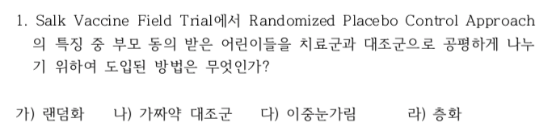
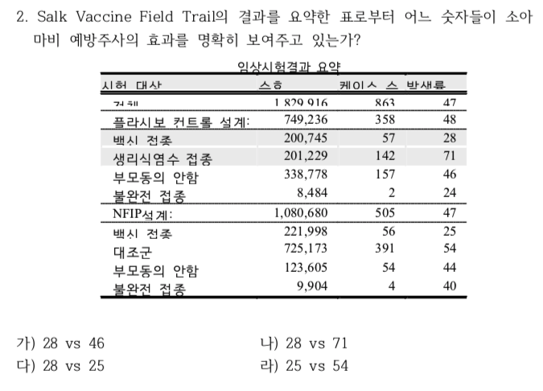
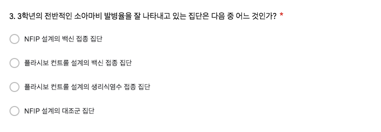
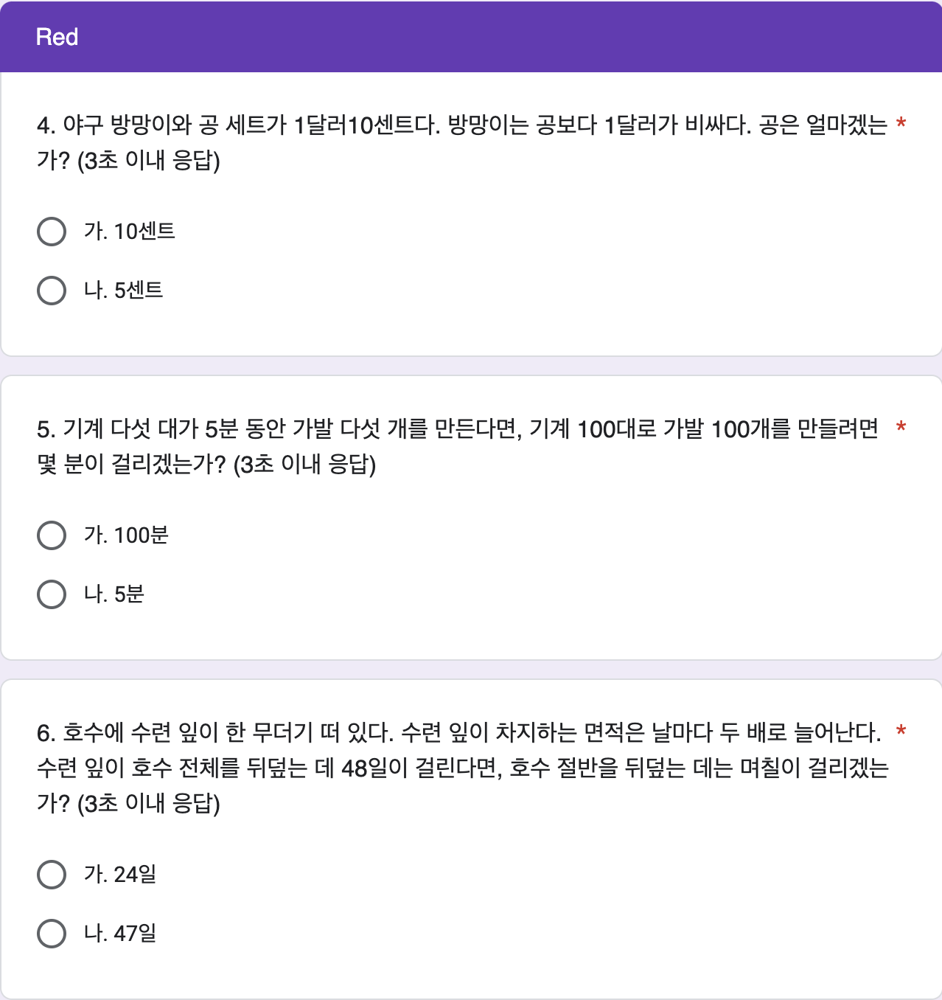
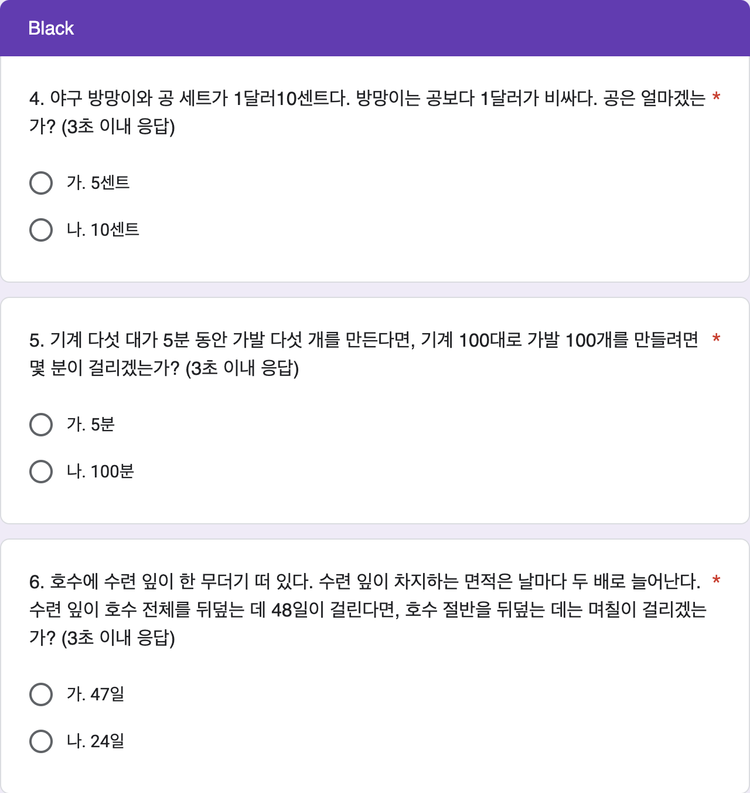

# 8주차 데이터 실험 집계

```{r, include=FALSE}
knitr::opts_chunk$set(echo = TRUE)
library(readxl)
library(pander)
library(knitr)
library(magrittr)
library(dplyr)
library(showtext)
font_add(family = "kopub", 
         regular = "/Users/kwlee/Library/Fonts/KoPubWorld Dotum Medium.ttf",
         bold = "/Users/kwlee/Library/Fonts/KoPubWorld Dotum Bold.ttf",
         italic  = "/Users/kwlee/Library/Fonts/KoPubWorld Dotum Light.ttf")
showtext_auto()
panderOptions('table.split.table', Inf)
panderOptions('table.alignment.rownames', 'left')
panderOptions('table.alignment.default', 'right')
options(width = 180)
```

## 실험의 목적

8주차 구글 예습 설문지 집계결과를 분석합니다.

Q1 \~ Q3에서는 랜덤화의 효과로 Red, Black 이 얼마나 닮았는지 알아봅니다.

Q4 \~ Q6에서는 인지반응테스트를 수행하면서 1번효과에 대해서 알아봅니다.

제출시간의 분포가 날마다 고른지, Red, Black 간에는 닮았는지 알아봅니다.

```{r, echo = FALSE, results = 'hide', message = FALSE}
class_roll0414 <- 
  readRDS("./class_roll_250414.RDS")
class_roll0414 %<>% 
  data.frame
class_roll <- 
  read_excel("./data/class_roll_250421.xlsx", 
             range = "B1:H599")
class_roll %<>% 
  data.frame
str(class_roll)
names(class_roll) <- c("dept", "college", "id", "name", "status", "email", "cell_no")
class_roll$group <- class_roll0414$group[match(class_roll$id, class_roll0414$id)]
saveRDS(class_roll, file = "./class_roll_250421.RDS")
#> googlesheets4 패키지 시험
quiz_url <-"https://docs.google.com/spreadsheets/d/1l7GkyxjsDz0uzraoMwYcohTvNsy6v5KZyHhD08JfVEw"
# gs4_deauth()
quiz <- read_sheet(quiz_url)
# quiz <- 
#   read_excel("./data/quiz250421.xlsx",
#              range = "A2:O741",
#              col_names = FALSE)
names(quiz) <- 
  c("time", "email", "dept", "id", "name", paste0("Q", 1:3),  
    "group", "Q4_R", "Q5_R", "Q6_R", "Q4_B", "Q5_B", "Q6_B")
str(quiz)
class(quiz$id) <- "character"
class(quiz$dept) <- "character"
quiz$group %<>% 
  factor(levels = c("Red", "Black"))
quiz[10:15] %<>% 
  sapply(FUN = {. %>% 
      strsplit(split = "[.]") %>% 
      sapply(`[`, 1)})
#> factor로 만들 것을 처음부터 고려한다면 cbind에서 stringsAsFactors = TRUE, 즉 default로 놔 두면 된다.
quiz %<>% 
  cbind(mapply(function(x, y){
    ifelse(is.na(x), y, x)}, quiz[10:12], quiz[13:15], 
    USE.NAMES = FALSE)) 
names(quiz)[16:18] <- paste0("Q", 4:6)
#> 다음 코드에서 sapply를 사용하면 character 행렬이 나오게 되므로 반드시 lapply를 사용해야 한다.
quiz[paste0("Q", 4:6)] %<>% 
  lapply(factor) 
Black <- quiz$group == "Black"
quiz[Black, paste0("Q", 4:6)] %<>%
  lapply(`levels<-`, c("나", "가"))
quiz[c("group", paste0("Q", 4:6))]  
quiz$Q4 %<>%
  factor(levels = c("가", "나"), labels = c("10센트", "5센트"))
quiz$Q5 %<>%
  factor(levels = c("가", "나"), labels = c("100분", "5분"))
quiz$Q6 %<>%
  factor(levels = c("가", "나"), labels = c("24일", "47일"))
quiz$Q1 %<>% 
  factor(levels = c("랜덤화", "가짜약 대조군", "이중눈가림", "층화"))
quiz$Q2 %<>% 
  factor(levels = c("28 vs 46", "28 vs 71", "28 vs 25", "25 vs 54"))
quiz$Q3 %<>% 
  factor(levels = c("NFIP 설계의 백신 접종 집단", 
                    "플라시보 컨트롤 설계의 백신 접종 집단", 
                    "플라시보 컨트롤 설계의 생리식염수 접종 집단", 
                    "NFIP 설계의 대조군 집단"))
str(quiz)
#> 마감기한으로부터 제출시점의 기간
#> ## TZ Asia/Seoul 로 설정. UTC 왜곡 배제 효과
# quiz$time <- as.POSIXct(quiz$time, tz = "Asia/Seoul")
quiz$time <- format(quiz$time, format = "%Y-%m-%d %H:%M:%S")
## 자정 전에 들어 온 사람은 몇 명이나?
as.Date(quiz$time) %>%
  table
# 03-23 제출자 인덱스 찾기
# idx <- which(as.Date(quiz$time) == as.Date("2025-03-23"))

# 새 시간 생성: 2025-03-17 00:01:00, 00:02:00, ...
# new_times <- as.POSIXct("2025-03-17 00:01:00") + 60 * (seq_along(idx) - 1)

# 해당 사람들의 시간 업데이트
# quiz$time[idx] <- new_times

# 강제로 타임존 설정
# attr(quiz$time, "tzone") <- "Asia/Seoul"

# 확인
# table(as.Date(format(quiz$time, format = "%Y-%m-%d", tz = "Asia/Seoul")))
## 자정 전에 제출한 사람의 시간 수동 조정
# quiz[quiz$id == "20237008", "time"] <- c("2025-03-17 00:00:01")
# quiz[quiz$id == "20226782", "time"] <- c("2025-03-17 00:00:02")
str(quiz)
as.Date(quiz$time) %>%
  table
#> 마감기한으로부터 제출시점의 기간
quiz$days <- as.numeric(difftime("2025-05-05 00:00:00", quiz$time, units = 'days'))
quiz$hours <- as.numeric(difftime("2025-05-05 00:00:00", quiz$time, units = 'hours'))
str(quiz)
```

```{r, echo = FALSE, results = 'hide'}
# 1. 잘못된 id 또는 name 가진 행 찾기
quiz_wrong_ids <- quiz %>%
  anti_join(class_roll, by = c("id", "name")) 

# 2. 수정 전 원래의 id와 name 쌍을 저장
wrong_keys <- quiz_wrong_ids %>% 
  select(id, name)

# 3. 잘못된 id 또는 name 수정
quiz_wrong_ids <- quiz_wrong_ids %>%
  mutate(
    id = case_when(
      id == "20223822" ~ "20223821",
      id == "20243437" ~ "20243427",
      id == "2022116" ~ "20222116",
      id == "20242966" ~ "20242967",
      id == "2021451" ~ "20214151",
      TRUE ~ id
      ),
    name = case_when(
      name == "김민연" ~ "김민영",
      )
    )
# 3. quiz 에서 id 또는 name 틀린 행을 제거하고 옳은 id 또는 name 갖춘 행으로 교체하기
quiz <- quiz %>%
  anti_join(wrong_keys %>% select(id, name), by = c("id", "name")) %>%
  bind_rows(quiz_wrong_ids)

# quiz[quiz$id %in% setdiff(quiz$id, class_roll$id), c("id", "name", "dept", "group")]

#> 틀린 학번 수정하여 되돌리기 (작동하지 않음. 참고로만)
# quiz <- quiz %>%
#   #> `left_join`으로 `name`과 `dept`를 기준으로 교정 정보를 추가
#   left_join(class_roll %>% select(id, name, dept), 
#             by = "name", 
#             suffix = c("", "_correct")) %>%
#   #> `id_correct`가 있는 경우 이를 사용하여 `id`를 교정하고, 그렇지 않으면 기존의 `id`를 유지
#   mutate(id = if_else(!is.na(id_correct) & id != id_correct, id_correct, id)) %>%
#   #> 임시로 추가된 `id_correct` 열 제거
#   select(-id_correct)

#> 중복 제출자
quiz %>%
  filter(duplicated(id)) %>%
  select(time, id, name) %>%
  arrange(time)
# which(duplicated(quiz$id)) %>%
#   quiz[., c("id", "name")]
quiz %>%
  filter(id %in% c("20242581"))
#> 전유빈이  정소은 id 를 갖다 쓴 상황 발생
# quiz[quiz$name == "전유빈", "id"] <- class_roll[class_roll$name == "전유빈", "id"]
# quiz <- quiz %>%
#   mutate(id = if_else(name == "전유빈", class_roll %>% filter(name == "전유빈") %>% pull(id), id))
quiz <- quiz %>% 
  arrange(id, desc(time)) %>%
  distinct(id, .keep_all = TRUE)

#> 불참자들
absentee <- class_roll %>%
  anti_join(quiz, by = "id") %>%
  select(id, name, group) %>%
  arrange(id)
# absentee <- 
#   class_roll[class_roll$id %in% setdiff(class_roll$id, quiz$id), c("id", "name", "group")] %>%
#   `[`(order(.$name), ) 
absentee %>%
  pander(row.names = FALSE) 
absentee %>%
  count(group) %>%
  print()
# absentee$group %>%
#   table
```

### Red, Black을 잘못 표시한 사람들

```{r, echo = FALSE}
#> group2 생성
quiz <- quiz %>%
  left_join(class_roll %>% select(id, group), by = "id", suffix = c("", "_class_roll")) %>%
  rename(group2 = group_class_roll)

#> group 과 group2가 다른 행 필터링
wrong_group <- quiz %>%
  filter(group2 != group)

#> 잘못된 그룹 정보 출력
# wrong_group %>%
#   select(time, id, group2, group) %>%
#   arrange(time) %>%
#   rename("제출시간" = time, "학번" = id, "랜덤화출석부" = group2, "구글예습퀴즈" = group) %>%
#  pander(row.names = FALSE)

#> 옛 코드
# quiz$group2 <- class_roll$group[match(quiz$id, class_roll$id)]
# wrong_group <- which(quiz$group != quiz$group2)
# class_roll[wrong_group, c("id", "name", "group", "group2")] %>%
#   `colnames<-`(c("학번", "이름", "랜덤화출석부", "구글예습퀴즈")) %>%
#   pander
# quiz[wrong_group, c("time", "id", "name", "group2", "group")] %>%
#   `[`(order(.$time), ) %>%
#   `colnames<-`(c("제출시간", "학번", "이름", "랜덤화출석부", "구글예습퀴즈")) %>%
#   pander(row.name = FALSE)

#> 잘못된 그룹 정보의 테이블 생성 및 출력
wrong_tbl <- 
  table("랜덤화출석부" = quiz$group2, "구글예습퀴즈" = quiz$group)

wrong_tbl %>%
  rbind("계" = colSums(.)) %>%
  pander(row.names = c("Red(랜덤화출석부)", "Black(랜덤화출석부)", "계"), 
         col.names = c("Red(구글예습퀴즈)", "Black(구글예습퀴즈)"))
```

랜덤화출석부에 있는 Red, Black 과 실제 구글설문에 올린 Red, Black 이 다른 사람들의 수효는 `r nrow(wrong_group)`명입니다.

Red를 Black 이라고 한 사람이 `r wrong_tbl[1, 2]`명, Black 을 Red 라고 한 사람이 `r wrong_tbl[2, 1]`명입니다.

두 가지 방법으로 분석합니다.

우선 Red, Black 을 잘못 선택한 `r nrow(wrong_group)`명을 랜덤하게 둘로 나누면 어느 한 쪽 집단에 들어갈 기대인원은 `r nrow(wrong_group)`명을 둘로 나눈 `r nrow(wrong_group) / 2`(명)이고, 표준오차는 `r nrow(wrong_group)`의 제곱근에 1/2을 곱해 준 `r round(sqrt(nrow(wrong_group)) / 2, digits  = 1)`명이 됩니다.

실제로 Red를 Black 이라고 한 사람수, `r wrong_tbl[1, 2]`명이나 Black 을 Red 라고 한 사람수, `r wrong_tbl[2, 1]`명은 기대인원으로부터 표준오차 범위에 아주 잘 들어갑니다.

두 번째 분석 방법은 확률을 계산해 보는 것입니다.

Red, Black 을 잘못 선택한 `r nrow(wrong_group)`명을 랜덤하게 둘로 나눌 때, 실제로 관찰된 `r max(wrong_tbl[1, 2], wrong_tbl[2, 1])`명 이상이나 `r min(wrong_tbl[1, 2], wrong_tbl[2, 1])`명이하로 잘못 선택한 사람수가 나올 가능성은 얼마나 되는가 입니다.

이 경우 공평한 동전던지기를 확률 법칙으로 표현한 이항분포로부터 계산할 수 있습니다.

시행횟수가 `r nrow(wrong_group)`이고 한 번 시행에서 성공확률이 1/2 인 이항분포에서 성공횟수가 `r min(wrong_tbl[1, 2], wrong_tbl[2, 1])`이하이거나 `r max(wrong_tbl[1, 2], wrong_tbl[2, 1])`이상을 관찰할 확률은 `r min(1, round(pbinom(min(wrong_tbl[1, 2], wrong_tbl[2, 1]), nrow(wrong_group), 1/2) * 2,  digits = 3))`입니다.

공평한 동전 던지기에서 앞면이 `r min(wrong_tbl[1, 2], wrong_tbl[2, 1])`개 이하 나오는 확률은 `r max(wrong_tbl[1, 2], wrong_tbl[2, 1])`개 이상 나오는 확률과 같기 때문에 사실상 한쪽만 계산해서 2배 해 주면 됩니다.

다만, 이번 실험과 같이 3명씩 동일한 결과가 나온 경우에는 중복되는 확률을 빼 주어야 합니다.

이 값을 p-value 라고 하는데, p-value가 0.05보다 작을 때 **통계적으로 유의한 차이를 관찰**하였다고 말합니다.

즉, 공평한 동전을 던지는 것과 같은 과정이라고 가정하였을 때 실제로 관찰된 값들이 가정으로부터 얼마나 떨어져 있는지를 표현한 것입니다.

0.05는 이런 실험을 스무 번 정도 반복하면 1번 나올 정도로 드문 사건을 의미합니다.

즉 가정이 잘못되었다는 것입니다.

그런데 Red, Black 을 잘못 표시한 사람들의 분포에서 관찰된 p-value 는 0.05와는 비교도 안될 정도로 큰 값입니다.

따라서 두 집단이 랜덤화 효과가 작동하여 **통계적으로 유의한 차이를 보이지 않는다**고 할 수 있습니다.

### 응답인원의 Red, Black

Red 로 응답한 인원은 `r colSums(wrong_tbl)[1]`명, Black 에 응답한 인원은 `r colSums(wrong_tbl)[2]`명입니다.

전체 응답인원 `r sum(wrong_tbl)` 명을 랜덤하게 둘로 나눌 때 어느 한 쪽의 기대인원은 전체 응답인원의 절반인 `r sum(wrong_tbl) / 2`명이고, 표준오차는 전체 응답인원의 제곱근에 1/2을 곱해 준 `r round(sqrt(sum(wrong_tbl)) * 1 / 2, digits = 1)` 명입니다.

따라서 Red, Black 각 그룹에 관찰된 인원은 기대인원으로부터 표준오차 범위 안에 들어갑니다. 랜덤화출석부에 있는 Red, Black 과 실제 구글설문에 올린 Red, Black 이 다른 사람들의 수효는 `r nrow(wrong_group)`명입니다. Red를 Black 이라고 한 사람이 `r wrong_tbl[1, 2]`명, Black 을 Red 라고 한 사람이 `r wrong_tbl[2, 1]`명입니다.

## Q1. 랜덤화 플라시보 대조군 설계의 특징

```{r, echo = FALSE, out.width = "75%", fig.align = "left"}

```

### 집계

```{r, echo = FALSE, warning = FALSE}
tbl_q1_a <- quiz$Q1 %>%
  table(quiz$group, ., useNA = "ifany") %>%
  cbind("계" = rowSums(.)) %>%
  rbind("계" = colSums(.))
# colnames(tbl_q1_a)[6] <- "결석"
tbl_q1_a %>% 
  pander
chisq_test_q1 <- 
  tbl_q1_a %>%
  `[`(-3, -5) %>%
  chisq.test(simulate.p.value = FALSE) 
chisq_test_q1 %>%
  pander
```

Q1의 집계 결과가 Red, Black 간에 통계적으로 유의한 차이가 있는지 알아보기 위하여 카이제곱 테스트를 수행하였습니다.

그 결과 카이제곱 통계량은 `r chisq_test_q1[1] %>% format(digits = 2, nsmall = 2)`, 자유도는 `r chisq_test_q1[2] %>% format(digits = 2, nsmall = 2)` , p-value 는 `r chisq_test_q1[3] %>% format(digits = 2, nsmall = 2)`이므로 Red, Black 간에 통계적으로 유의한 차이를 보이지 않습니다.

실제로 닮은 게 느껴집니까?

### 집계 (%)

```{r, echo = FALSE}
ptbl_q1 <- 
  tbl_q1_a %>% 
  `[`(3, -5) %>%
  prop.table %>% 
  c("계" = sum(.)) %>%
  `*`(100) 
ptbl_q1 %>%
  format(digits = 2, nsmall = 1) %>%
  pander
```

정답률은 Red, Black 을 합하여 계산하는데, `r ptbl_q1[1] %>% format(digits = 2, nsmall = 1)`(%) 입니다.

## Q2. 백신의 효과 확인

```{r, echo = FALSE, out.width = "75%", fig.align = "left"}

```

### 집계

```{r, echo = FALSE, warning = FALSE}
tbl_q2_a <- quiz$Q2 %>%
  table(quiz$group, ., useNA = "ifany") %>%
  cbind("계" = rowSums(.)) %>%
  rbind("계" = colSums(.))
# colnames(tbl_q2_a)[5] <- "결석"
tbl_q2_a %>% 
  pander
chisq_test_q2 <- 
  tbl_q2_a %>%
  `[`(-3, -5) %>%
  chisq.test(simulate.p.value = FALSE) 
chisq_test_q2 %>%
  pander
```

Q2의 집계 결과가 Red, Black 간에 통계적으로 유의한 차이가 있는지 알아보기 위하여 카이제곱 테스트를 수행하였습니다.

그 결과 카이제곱 통계량은 `r chisq_test_q2[1] %>% format(digits = 2, nsmall = 2)`, 자유도는 `r chisq_test_q2[2] %>% format(digits = 2, nsmall = 2)`, p-value 는 `r chisq_test_q2[3] %>% format(digits = 2, nsmall = 2)`이므로 Red, Black 간에 통계적으로 유의한 차이를 보이지 않습니다.

실제로 닮은 게 느껴집니까?

### 집계 (%)

```{r, echo = FALSE}
ptbl_q2 <- 
  tbl_q2_a %>% 
  `[`(3, -5) %>%
  prop.table %>% 
  c("계" = sum(.)) %>%
  `*`(100) 
ptbl_q2 %>%
  format(digits = 2, nsmall = 1) %>%
  pander
```

정답률은 Red, Black 을 합하여 계산하는데, `r ptbl_q2[2] %>% format(digits = 2, nsmall = 1)`(%) 입니다.

## Q3. 3학년의 발병율

```{r, echo = FALSE, out.width = "75%", fig.align = "left"}

```

### 집계

```{r, echo = FALSE, warning = FALSE}
tbl_q3_a <- quiz$Q3 %>%
  table(quiz$group, ., useNA = "ifany") %>%
  cbind("계" = rowSums(.)) %>%
  rbind("계" = colSums(.))
# colnames(tbl_q3_a)[5] <- "누락"
tbl_q3_a %>% 
  pander
chisq_test_q3 <- 
  tbl_q3_a %>%
  `[`(-3, -5) %>%
  chisq.test(simulate.p.value = FALSE) 
chisq_test_q3 %>%
  pander
```

Q3의 집계 결과가 Red, Black 간에 통계적으로 유의한 차이가 있는지 알아보기 위하여 카이제곱 테스트를 수행하였습니다.

그 결과 카이제곱 통계량은 `r chisq_test_q3[1] %>% format(digits = 2, nsmall = 2)`, 자유도는 `r chisq_test_q3[2] %>% format(digits = 2, nsmall = 2)`, p-value 는 `r chisq_test_q3[3] %>% format(digits = 2, nsmall = 2)`이므로 Red, Black 간에 통계적으로 유의한 차이를 보이지 않습니다.

실제로 닮은 게 느껴집니까?

### 집계 (%)

```{r, echo = FALSE}
ptbl_q3 <- 
  tbl_q3_a %>% 
  `[`(3, -5) %>%
  prop.table %>% 
  c("계" = sum(.)) %>%
  `*`(100) 
ptbl_q3 %>%
  format(digits = 2, nsmall = 1) %>%
  pander
```

정답률은 Red, Black 을 합하여 계산하는데, `r ptbl_q3[4] %>% format(digits = 2, nsmall = 1)`(%) 입니다.

## Cognitive Response Test

3초 안에 답하려면 틀리기 쉬운 문제들로 구성한 인지반응 테스트인데 정답률이 상당히 높습니다.

Red 는 가)에 끌리는 답, 나)에 생각이 필요한 답을 배치하고 Black 은 가)에 생각이 필요한 답, 나)에 끌리는 답을 배치하였습니다만 이로 인한 차이는 통계적으로 유의하지 않습니다.

Kahneman 의 Thinking, Fast and Slow 에 의하면 하버드, MIT, 프린스턴 대학 학생의 50%가 직관적인 오답을 말했고, 그 외 대학생들의 오답률은 80퍼센트가 넘었답니다.

스스로 자랑스러워 해도 됩니다.

3초 제한을 둔 이유는 깊이 생각하지 말고 직관적으로 풀어보라는 것이었는데 앞에 나온 댓글들을 보니까 시간을 들여 가면서 정답을 구하려 한 것 같습니다.

해외 명문대 학생들은 가벼운 마음으로 생각나는 대로 답하는 데 우리 수강생들은 3초 제한을 넘겨가면서 정답을 구하려 하는 걸까요?

```{r, echo = FALSE, out.width = "67%", fig.align = "left"}

```

```{r, echo = FALSE, out.width = "67%", fig.align = "left"}

```

## Q4. 야구 방망이와 공

### 집계

```{r, echo = FALSE}
tbl_q4_a <- quiz$Q4 %>%
  table(quiz$group, ., useNA = "ifany") %>%
  cbind("계" = rowSums(.)) %>%
  rbind("계" = colSums(.))
rownames(tbl_q4_a)[1:2] <- c("Red(10센트 먼저)", "Black(5센트 먼저)")
tbl_q4_a %>% 
  pander
chisq_test_q4 <- 
  tbl_q4_a %>%
  `[`(-3, -3) %>%
  chisq.test(simulate.p.value = FALSE) 
chisq_test_q4 %>%
  pander
```

Q4는 야구 방망이와 공 세트가 1달러10센트이고 방망이는 공보다 1달러가 비싸다는 설명으로부터 얼핏 그 차이인 10센트가 바로 공의 가격이라고 착각하기 쉽습니다.

3초 안에 답을 해야 하기 때문에 방망이 + 공 = 1달러10센트, 방망이 - 공 = 1달러 를 계산할 시간이 없습니다.

Red 와 Black 은 선택지의 순서만 바꾸었는데 앞에 놓은 선택지를 고르는 1번효과가 나타나(지 않고) 통계적으로 유의한 차이를 보이지(고) 않(있)습니다.

여기서 수행하고 있는 카이제곱 테스트는 이 순서를 바꾼 것의 효과가 통계적으로 유의한지 알아보기 위한 것입니다.

그 결과 카이제곱 통계량은 `r chisq_test_q4[1] %>% format(digits = 2, nsmall = 2)`, 자유도는 `r chisq_test_q4[2] %>% format(digits = 2, nsmall = 2)`, p-value 는 `r chisq_test_q4[3] %>% format(digits = 2, nsmall = 4)`이므로 선택지의 순서를 바꾼 것이 앞에 배치한 선택지를 고르는 데 있어서 통계적으로 유의한 차이를 보이지 않습니다.

### % 비교.

```{r, echo = FALSE}
ptbl_q4_a <- 
  tbl_q4_a %>% 
  `[`(-3, -3) %>%
  prop.table(margin = 1) %>% 
  `*`(100) %>%
  cbind("계" = rowSums(.))
ptbl_q4_a %>%
  format(digits = 2, nsmall = 1) %>%
  pander
```

이를 백분률로 살펴보면 10센트를 먼저 선택지에 올린 Red 에서 정답 5센트를 고른 백분율, `r format(ptbl_q4_a[1, 2], digits = 2, nsmall = 1)`(%)(이)나 5센트를 먼저 선택지에 올린 Black 에서 정답 5센트를 고른 백분율, `r format(ptbl_q4_a[2, 2], digits = 2, nsmall = 1)`(%) 간에 차이가 관찰되었지만 선택지를 바꾸는 것이 응답에 큰 영향을 주지 않고 있다는 것을 알 수 있습니다.

Red, Black 간에 통계적으로 유의한 차이가 관찰되지 않았기에 합쳐서 분석한 결과는 다음과 같습니다.

### 합산(%)

```{r, echo = FALSE}
ptbl_q4 <- 
  tbl_q4_a %>% 
  `[`(3, -3) %>%
  prop.table %>% 
  c("계" = sum(.)) %>%
  `*`(100) 
ptbl_q4 %>%
  format(digits = 2, nsmall = 1) %>%
  pander
```

정답 5센트를 고른 백분률은 Red, Black 을 합쳤을 때 `r format(ptbl_q4[2], digits = 2, nsmall = 1)`(%)(으)로 제법 높은 편이라고 할 수 있습니다.

### Mosaic Plot

```{r, echo = FALSE, fig.width = 7, fig.height = 5}
library(ggplot2)
source("./mosaic_gg.R")
m_list4 <- quiz$Q4 %>%
  table(quiz$group, ., useNA = "ifany") %>%
  t %>%
  mosaic_gg
m4 <- m_list4$m
df4 <- m_list4$df
p_df4 <- m_list4$p_df
names(df4)[1] <- "Var1"
names(p_df4)[1] <- "Var1"
df4$Var2 %<>% factor(labels = c("Red(10센트 먼저)", "Black(5센트 먼저)"))
p_df4$Var2 %<>% factor(labels = c("Red(10센트 먼저)", "Black(5센트 먼저)"))
m4 + geom_text(aes(x = center, y = 1.05), 
              family = "kopub",
              label = df4[, 2]) +
  theme_bw(base_family = "kopub") +
  labs(title = "야구 방망이와 공 세트", x = "Red or Black(누적 %)", y = "인원(%, 명)") +
  scale_fill_brewer(name = "응답", 
                    labels = c("10센트", "5센트"),
                    type = "qual", 
                    palette = "Set2", 
                    direction = 1) +
  theme(plot.title = element_text(hjust = 0.5, 
                                  size = 18, 
                                  family = "kopub",
                                  face = "bold")) 
ggsave("./pics/Quiz250421_Q4_RnB.png", dpi = 120, width = 960, height = 840, units = "px")
```

Mosaic Plot 은 이 집계결과를 시각적으로 잘 보여줍니다.

선택지의 순서 바꿈에 거의 무관할 정도로 응답이 같았기 때문에 Red, Black 이 닮았고, 정답인 5센트를 고른 비율도 닮은 것을 잘 알 수 있습니다.

## Q5. 가발 만드는 기계

### 집계

```{r, echo = FALSE}
tbl_q5_a <- quiz$Q5 %>%
  table(quiz$group, ., useNA = "ifany") %>%
  cbind("계" = rowSums(.)) %>%
  rbind("계" = colSums(.))
rownames(tbl_q5_a)[1:2] <- c("Red(100분 먼저)", "Black(5분 먼저)")
tbl_q5_a %>% 
  pander
chisq_test_q5 <- 
  tbl_q5_a %>%
  `[`(-3, -3) %>%
  chisq.test(simulate.p.value = FALSE) 
chisq_test_q5 %>%
  pander
```

기계 다섯 대가 5분 동안 가발 다섯 개를 만들면 기계 한 대가 5분 동안 가발 한 개를 만드는 셈이므로 기계 100대를 동원하더라도 5분이면 가발 100 개를 만들 수 있습니다.

다만, 다섯 대, 5분, 다섯 개가 함께 나오니까 저도 모르게 즉각적으로 100대, 100분, 100개로 반응하게 됩니다.

Red 와 Black 은 선택지의 순서만 바꾼 것인데 응답에 영향을 미치는지 알아 봅니다. 

여기서 수행하고 있는 카이제곱 테스트는 이 순서를 바꾼 것의 효과가 통계적으로 유의한지 알아보기 위한 것입니다.

그 결과 카이제곱 통계량은 `r chisq_test_q5[1] %>% format(digits = 2, nsmall = 2)`, 자유도는 `r chisq_test_q5[2] %>% format(digits = 2, nsmall = 2)`, p-value 는 `r chisq_test_q5[3] %>% format(digits = 2, nsmall = 2)`이므로 선택지의 순서를 바꾼 것은 통계적으로 유의한 차이를 보이지 않습니다.

### % 비교.

```{r, echo = FALSE}
ptbl_q5_a <- 
  tbl_q5_a %>% 
  `[`(-3, -3) %>%
  prop.table(margin = 1) %>% 
  `*`(100) %>%
  cbind("계" = rowSums(.))
ptbl_q5_a %>%
  format(digits = 2, nsmall = 1) %>%
  pander
```

이를 백분률로 살펴보면 100분을 먼저 선택지에 올린 Red에서 정답 5분을 고른 백분율, `r format(ptbl_q5_a[1, 2], digits = 2, nsmall = 1)`(%)(이)나 5분을 먼저 선택지에 올린 Black 에서 정답 5분을 고른 백분율, `r format(ptbl_q5_a[2, 2], digits = 2, nsmall = 1)`(%)(이)나 큰 차이가 없어서 선택지를 바꾸는 것이 응답에 영향을 준다는 것을 명확히 알 수 있습니다.

Red, Black 을 합쳐서 분석합니다.

그 결과는 다음과 같습니다.

### 합산(%)

```{r, echo = FALSE}
ptbl_q5 <- 
  tbl_q5_a %>% 
  `[`(3, -3) %>%
  prop.table %>% 
  c("계" = sum(.)) %>%
  `*`(100) 
ptbl_q5 %>%
  format(digits = 2, nsmall = 1) %>%
  pander
```

정답 5분을 고른 백분률은 선택지의 순서 바꿈과는 무관하게 `r format(ptbl_q5[2], digits = 2, nsmall = 1)`(%)(으)로 상당히 높은 편이라고 할 수 있습니다.

### Mosaic Plot

```{r, echo = FALSE, fig.width = 7, fig.height = 5}
library(ggplot2)
source("./mosaic_gg.R")
m_list5 <- quiz$Q5 %>%
  table(quiz$group, ., useNA = "ifany") %>%
  t %>%
  mosaic_gg
m5 <- m_list5$m
df5 <- m_list5$df
p_df5 <- m_list5$p_df
names(df5)[1] <- "Var1"
names(p_df5)[1] <- "Var1"
df5$Var2 %<>% factor(labels = c("Red(100분 먼저)", "Black(5분 먼저)"))
p_df5$Var2 %<>% factor(labels = c("Red(100분 먼저)", "Black(5분 먼저)"))
m5 + geom_text(aes(x = center, y = 1.05), 
              family = "kopub",
              label = df5[, 2]) +
  theme_bw(base_family = "kopub") +
  labs(title = "가발 만드는 기계", x = "Red or Black(누적 %)", y = "인원(%, 명)") +
  scale_fill_brewer(name = "응답", 
                    labels = c("100분", "5분"),
                    type = "qual", 
                    palette = "Set2", 
                    direction = 1) +
  theme(plot.title = element_text(hjust = 0.5, 
                                  size = 18, 
                                  family = "kopub",
                                  face = "bold")) 
ggsave("./pics/Quiz250421_Q5_RnB.png", dpi = 120, width = 960, height = 840, units = "px")
```

Mosaic Plot 은 이 집계결과를 시각적으로 잘 보여줍니다.

선택지의 순서 바꿈에 거의 무관할 정도로 응답이 같았기 때문에 Red, Black 이 닮았고, 정답인 5분을 고른 비율도 닮은 것을 잘 알 수 있습니다.

## Q6. 호수에 수련

### 집계

```{r, echo = FALSE}
tbl_q6_a <- quiz$Q6 %>%
  table(quiz$group, ., useNA = "ifany") %>%
  cbind("계" = rowSums(.)) %>%
  rbind("계" = colSums(.))
rownames(tbl_q6_a)[1:2] <- c("Red(24일 먼저)", "Black(47일 먼저)")
tbl_q6_a %>% 
  pander
chisq_test_q6 <- 
  tbl_q6_a %>%
  `[`(-3, -3) %>%
  chisq.test(simulate.p.value = FALSE) 
chisq_test_q6 %>%
  pander
```

수련 잎이 차지하는 면적이 날마다 두 배로 늘어나기 때문에 호수 전체를 뒤덮는데 48일이 걸린다면, 호수 절반을 뒤덮는 데는 그 절반인 24일로 답하기 쉽습니다.

그러나 절반이 뒤덮인 상태에서 하루면 전체를 뒤덮게 되므로 정답은 47일입니다.

Red 와 Black 은 선택지의 순서만 바꾼 것인데 아무런 영향을 주지 않고 있습니다.

여기서 수행하고 있는 카이제곱 테스트는 이 순서를 바꾼 것의 효과가 통계적으로 유의한지 알아보기 위한 것입니다.

그 결과 카이제곱 통계량은 `r chisq_test_q6[1] %>% format(digits = 2, nsmall = 2)`, 자유도는 `r chisq_test_q6[2] %>% format(digits = 2, nsmall = 2)`, p-value 는 `r chisq_test_q6[3] %>% format(digits = 2, nsmall = 2)`이므로 선택지의 순서를 바꾼 것은 통계적으로 유의한 차이를 보이지 않습니다.

### % 비교.

```{r, echo = FALSE}
ptbl_q6_a <- 
  tbl_q6_a %>% 
  `[`(-3, -3) %>%
  prop.table(margin = 1) %>% 
  `*`(100) %>%
  cbind("계" = rowSums(.))
ptbl_q6_a %>%
  format(digits = 2, nsmall = 1) %>%
  pander
```

이를 백분률로 살펴보면 24일을 먼저 선택지에 올린 Red에서 정답 47일을 고른 백분율, `r format(ptbl_q6_a[1, 2], digits = 2, nsmall = 1)`(%)(이)나 47일을 먼저 선택지에 올린 Black 에서 정답 47일을 고른 백분율, `r format(ptbl_q6_a[2, 2], digits = 2, nsmall = 1)`(%)(이)나 큰 차이가 없어서 선택지를 바꾸어도 응답에는 아무런 영향을 주지 못한다는 것을 명확히 알 수 있습니다.

따라서 Red, Black 은 합쳐서 분석하는 것이 타당합니다.

그 결과는 다음과 같습니다.

### 합산(%)

```{r, echo = FALSE}
ptbl_q6 <- 
  tbl_q6_a %>% 
  `[`(3, -3) %>%
  prop.table %>% 
  c("계" = sum(.)) %>%
  `*`(100) 
ptbl_q6 %>%
  format(digits = 2, nsmall = 1) %>%
  pander
```

정답 47일을 고른 백분율은 선택지의 순서 바꿈과는 무관하게 `r format(ptbl_q6[2], digits = 2, nsmall = 1)`(%)(으)로 상당히 높은 편이라고 할 수 있습니다.

### Mosaic Plot

```{r, echo = FALSE, fig.width = 7, fig.height = 5}
library(ggplot2)
source("./mosaic_gg.R")
m_list6 <- quiz$Q6 %>%
  table(quiz$group, ., useNA = "ifany") %>%
  t %>%
  mosaic_gg
m6 <- m_list6$m
df6 <- m_list6$df
p_df6 <- m_list6$p_df
names(df6)[1] <- "Var1"
names(p_df6)[1] <- "Var1"
df6$Var2 %<>% factor(labels = c("Red(24일 먼저)", "Black(48일 먼저)"))
p_df6$Var2 %<>% factor(labels = c("Red(24일 먼저)", "Black(48일 먼저)"))
m6 + geom_text(aes(x = center, y = 1.05), 
              family = "kopub",
              label = df6[, 2]) +
  theme_bw(base_family = "kopub") +
  labs(title = "호수에 수련", x = "Red or Black(누적 %)", y = "인원(%, 명)") +
  scale_fill_brewer(name = "응답", 
                    labels = c("24일", "48일"),
                    type = "qual", 
                    palette = "Set2", 
                    direction = 1) +
  theme(plot.title = element_text(hjust = 0.5, 
                                  size = 18, 
                                  family = "kopub",
                                  face = "bold")) 
ggsave("./pics/Quiz250421_Q6_RnB.png", dpi = 120, width = 960, height = 840, units = "px")
```

Mosaic Plot 은 이 집계결과를 시각적으로 잘 보여줍니다.

선택지의 순서 바꿈에 거의 무관할 정도로 응답이 같았기 때문에 Red, Black 이 닮았고, 정답인 47일을 고른 비율도 닮은 것을 잘 알 수 있습니다.

## 마감 시간으로부터 제출 시간의 분포

### 분포표

```{r, echo = FALSE, warning = FALSE}
N <- nrow(quiz)
days_tbl <- 
  quiz$days %>%
  cut(breaks = c(0:14), include.lowest = TRUE) %>%
  table(quiz$group, .) 
days_tbl %>%
  cbind("계" = rowSums(.)) %>%
  rbind("계" = colSums(.)) %>%
  `colnames<-`(., c(paste0(14:1, "일"), "계")) %>%
  pander(caption = "일 단위")
```

분포표로부터 두 가지 문제를 살펴보겠습니다.

첫째, 날마다 고르게 제출하는가?

둘째, Red, Black 간에 통계적으로 유의한 차이가 있는가?

각 문제를 살펴보기 위해서는 분포표의 일부분을 대상으로 카이제곱 테스트를 수행합니다.

### 날마다 고르게 제출하는가?

```{r, echo = FALSE, warning = FALSE}
days_tbl %>%
  rbind("계" = colSums(.)) %>%
  `[`(3, 1:14) %>%
  `names<-`(., paste0(14:1, "일")) %>%
  pander
days_chisq_test <-
  days_tbl %>%
  rbind("계" = colSums(.)) %>%
  `[`(3, 1:14) %>%
  chisq.test(simulate.p.value = FALSE) 
days_chisq_test %>%
  pander
```

날마다 고르게 제출하는지 알아 보았습니다.

분포표의 "계"행에서 '계'열을 제외하고 카이제곱테스트를 수행합니다.

분포표 만으로도 쉽게 파악할 수 있지만 카이제곱테스트가 명확히 해 줍니다.

카이제곱 통계량은 `r format(days_chisq_test[1], digits = 2, nsmall = 2)`, 자유도는 `r format(days_chisq_test[2], digits = 2, nsmall = 2)`, p-value 는 `r format(days_chisq_test[3], digits = 2, nsmall = 2)` 이므로 제출은 고르지 않고 특정 날짜에 치우쳐 있습니다.

막대그래프로 살펴 보겠습니다.

### 막대그래프

```{r, echo = FALSE}
# png(file = "./pics/2302/quiz_submission_8.png", width = 640, height = 480)
suppressMessages({
par(family = "kopub")
b <- 
  quiz$days %>%
  cut(breaks = c(0:14), include.lowest = TRUE) %>%
  table %>%
  rev %>%
  barplot(space = 0, names.arg = rep(c("월", "화", "수", "목", "금", "토", "일"), 2),
          col = c(rep("white", 13), "pink"),
          ylim = c(0, 300)) 
text(x = b[14, 1], y = sum(days_tbl[, 1]), 
     labels = paste0(sum(days_tbl[, 1]), "명"), pos = 3)
text(x = b[14, 1], y = sum(days_tbl[, 1]) / 2, 
     labels = paste0(format(sum(days_tbl[, 1]) / N * 100, digits = 1, nsmall = 0), "%"))
title(main = paste0("Quiz250421 (", N, "명 제출)"))
# title(main = "일 단위 퀴즈 제출 인원", sub = paste0("Quiz230925 (", N, "명 제출)"))
dev.copy(png, file = "./pics/2501/quiz_submission_8.png", width = 640, height = 480)
invisible(dev.off())
})
```

### Red, Black 간에 닮았는가?

```{r, echo = FALSE, warning = FALSE}
days_tbl %>%
  rbind("계" = colSums(.)) %>%
  `[`(-3, 1:14) %>%
  `colnames<-`(., paste0(14:1, "일")) %>%
  pander
days_RnB_chisq_test <-
  days_tbl %>%
  `[`(-3, 1:14) %>%
  chisq.test(simulate.p.value = FALSE) 
days_RnB_chisq_test %>%
  pander
```

제출시간의 분포가 Red, Black 간에 닮았는지 알아 보았습니다.

이번에는 분포표의 첫번째와 두번째 행, '계'열을 제외한 나머지 열에 대해서 카이제곱테스트를 수행합니다.

카이제곱 통계량은 `r format(days_RnB_chisq_test[1], digits = 2, nsmall = 2)`, 자유도는 `r format(days_RnB_chisq_test[2], digits = 2, nsmall = 2)`, p-value 는 `r format(days_RnB_chisq_test[3], digits = 2, nsmall = 2)` 이므로 제출 시간의 분포는 Red, Black 간에 통계적으로 유의한 차이가 관찰되지 않습니다.

이 사실을 Mosaic Plot 을 이용하여 시각적으로 살펴보겠습니다.

닮았다고 느껴지나요?

### Mosaic Plot

```{r, echo = FALSE, fig.width = 10, fig.height = 5}
library(ggplot2)
source("./mosaic_gg.R")
m2_list <- days_tbl[, 14:1] %>%
  mosaic_gg
m2 <- m2_list$m
df2 <- m2_list$df
p_df2 <- m2_list$p_df
names(df2[, 2]) <- "Days"
m2 + geom_text(aes(x = center, y = 1.05), 
              family = "kopub",
              label = rep(rep(c("월", "화", "수", "목", "금", "토", "일"), each = 2), times = 2)) +
  theme_bw(base_family = "kopub") +
  labs(title = "마감일로부터 제출시간의 분포", x = "마감일로부터 일수(누적 %)", y = "인원 백분율(%)") +
  scale_fill_brewer(name = "그룹", 
                    labels = c("Red", 
                               "Black"),
                    type = "qual", 
                    palette = "Set1", 
                    direction = 1) +
  theme(plot.title = element_text(hjust = 0.5, 
                                  size = 18, 
                                  family = "kopub"),
        axis.text.x = element_text(angle = -90, vjust = 0.5)) 
ggsave("./pics/Quiz250421_submission_8.png", dpi = 120, width = 960, height = 840, units = "px")
```

```{r, echo = FALSE}
saveRDS(quiz[c("id", "name")], file = "./quiz250421.RDS")
```
