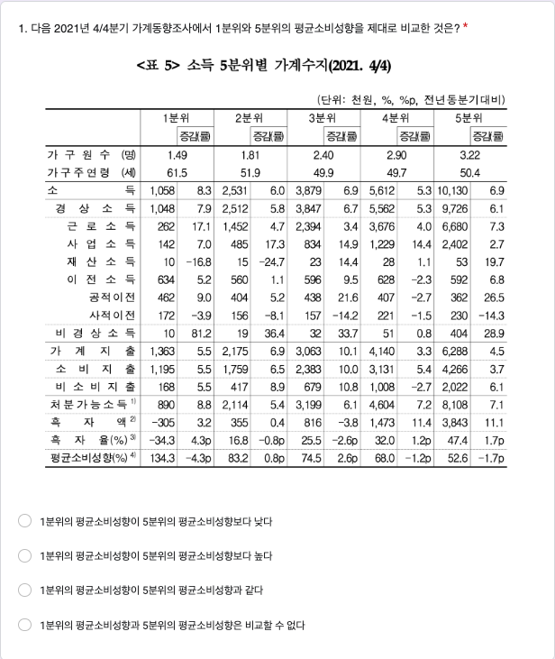
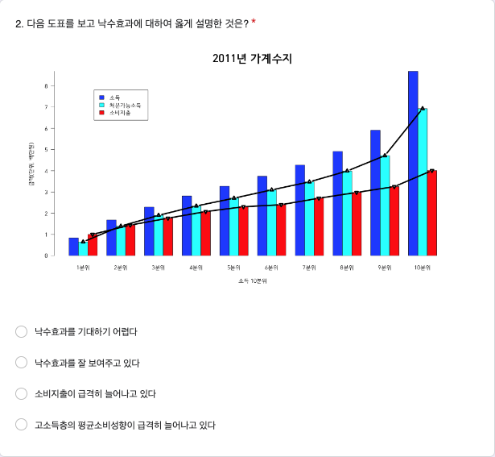
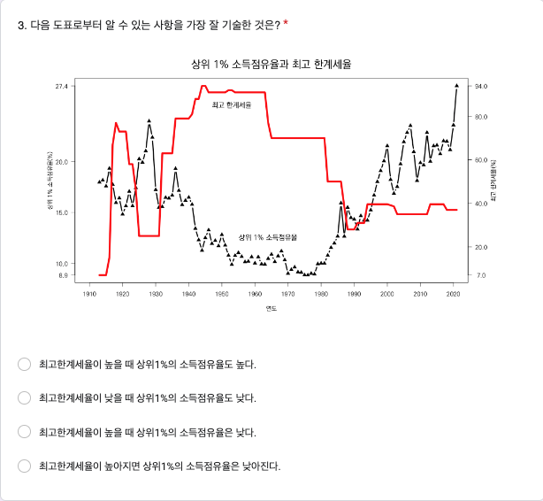
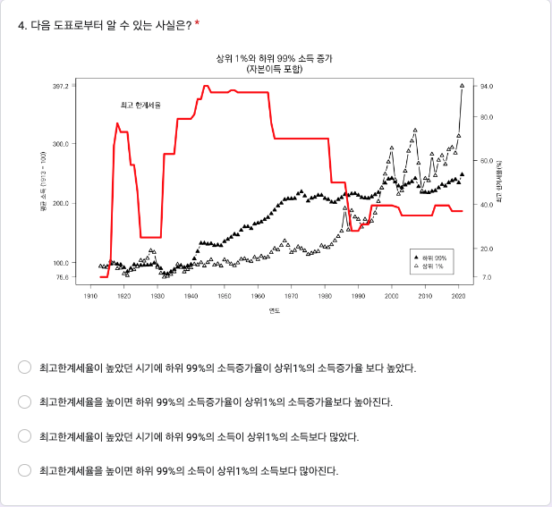
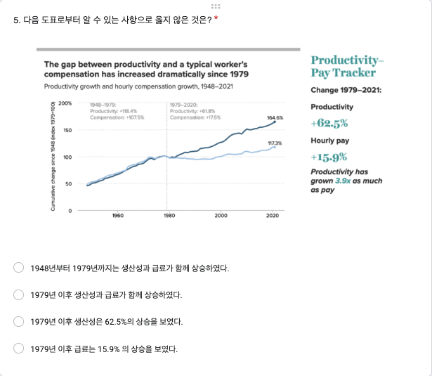
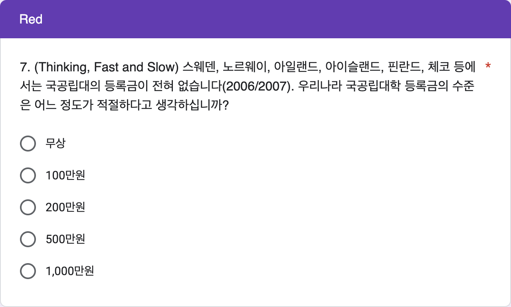
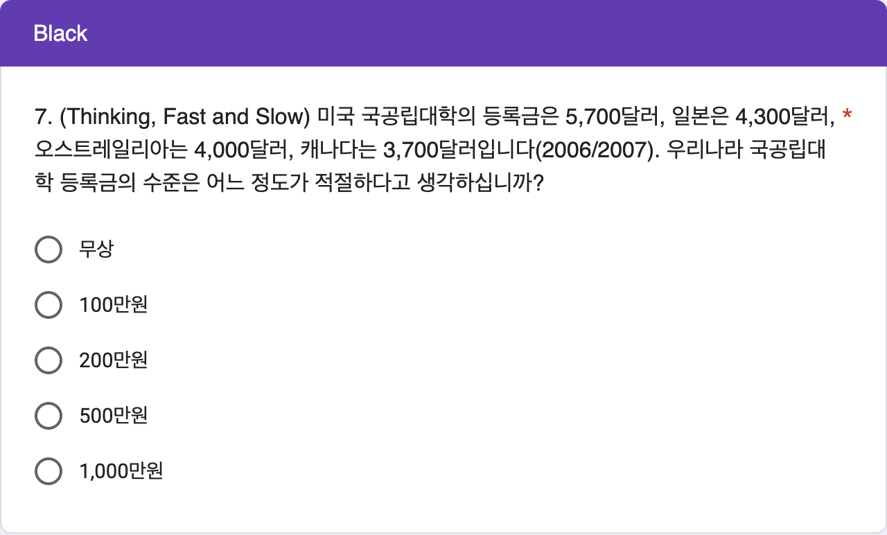

# 11주차 데이터실험 집계

```{r, include=FALSE}
knitr::opts_chunk$set(echo = TRUE)
library(readxl)
library(magrittr)
library(pander)
library(knitr)
library(dplyr)
library(googlesheets4)
library(showtext)
font_add(family = "kopub", 
         regular = "/Users/kwlee/Library/Fonts/KoPubWorld Dotum Medium.ttf",
         bold = "/Users/kwlee/Library/Fonts/KoPubWorld Dotum Bold.ttf",
         italic  = "/Users/kwlee/Library/Fonts/KoPubWorld Dotum Light.ttf")
showtext_auto()
panderOptions('table.split.table', Inf)
panderOptions('table.alignment.rownames', 'left')
panderOptions('table.alignment.default', 'right')
options(width = 180)
```

## 실험의 목적

11주차 구글 예습 설문지 집계결과를 분석합니다. 

Q1~Q6에서는 랜덤화의 효과로 Red, Black 이 얼마나 닮았는지 알아봅니다.

Q7에서는 Anchor Effects 를 알아 보기 위하여 Red 에서는 대학 등록금이 무상인 나라들의 예를 들고 나서 우리나라 국공립 대학 등록금의 적정 수준에 대해서 묻고, Black 에서는  대학 등록금이 고액인 나라들의 예를 들고 나서 우리나라 국공립 대학 등록금의 적정 수준에 대해서 물어 보아 차이가 통계적으로 유의한지 살핍니다. 

그리고, 제출시간의 분포가 날마다 고른지, Red, Black 간에는 닮았는지 알아봅니다.

```{r, echo = FALSE, message = FALSE, results = 'hide'}
class_roll0428 <- 
  readRDS("./class_roll_250428.RDS")
class_roll0428 %<>% 
  data.frame
#> 5월16일 출석부로 업데이트
class_roll <- 
  read_excel("./data/class_roll_250516.xlsx", 
             range = "B1:H597")
class_roll %<>% 
  data.frame
str(class_roll)
names(class_roll) <- c("dept", "colleges", "id", "name", "status", "email", "cell_no")
class_roll$group <- class_roll0428$group[match(class_roll$id, class_roll0428$id)]
# saveRDS(class_roll, file = "./class_roll_250516.RDS")
#> 
quiz_url <-"https://docs.google.com/spreadsheets/d/1bz-eMj0-kSHnkX2NqY0wa5rXlIS9ihmM7Xdd2NghU9A"
# gs4_deauth()
quiz <- read_sheet(quiz_url)
# quiz <- 
#   read_excel("./data/quiz250512.xlsx",
#              range = "A2:N705",
#              col_names = FALSE)
str(quiz)
names(quiz) <- 
  c("time", "email", "dept", "id", "name", paste0("Q", 1:6),  "group", "Q7_R", "Q7_B")
class(quiz$id) <- "character"
quiz <- data.frame(quiz)
str(quiz)
quiz[c("group", "Q7_R", "Q7_B")]
quiz$Q7 <- 
  ifelse(is.na(quiz$Q7_R), quiz$Q7_B, quiz$Q7_R)
quiz$Q7 %<>% 
  strsplit(split = " : ") %>% sapply(`[`, 1)
quiz[c("group", "Q7_R", "Q7_B", "Q7")]
# quiz$Q7 %<>% 
#   strsplit(split = "[.]") %>% sapply(`[`, 1)
quiz$dept %<>% 
  factor
quiz$group %<>% 
  factor(levels = c("Red", "Black"))
quiz$Q1 %<>% 
  factor(levels = c("1분위의 평균소비성향이 5분위의 평균소비성향보다 낮다", 
                    "1분위의 평균소비성향이 5분위의 평균소비성향보다 높다", 
                    "1분위의 평균소비성향이 5분위의 평균소비성향과 같다", 
                    "1분위의 평균소비성향과 5분위의 평균소비성향은 비교할 수 없다"))
quiz$Q2 %<>% 
  factor(levels = c("낙수효과를 기대하기 어렵다",
                    "낙수효과를 잘 보여주고 있다",
                    "소비지출이 급격히 늘어나고 있다",
                    "고소득층의 평균소비성향이 급격히 늘어나고 있다")) 
quiz$Q3 %<>% 
  factor(levels = c("최고한계세율이 높을 때 상위1%의 소득점유율도 높다.", 
                    "최고한계세율이 낮을 때 상위1%의 소득점유율도 낮다.", 
                    "최고한계세율이 높을 때 상위1%의 소득점유율은 낮다.", 
                    "최고한계세율이 높아지면 상위1%의 소득점유율은 낮아진다."))
quiz$Q4 %<>% 
  factor(levels = c("최고한계세율이 높았던 시기에 하위 99%의 소득증가율이 상위1%의 소득증가율 보다 높았다.", 
                    "최고한계세율을 높이면 하위 99%의 소득증가율이 상위1%의 소득증가율보다 높아진다.", 
                    "최고한계세율이 높았던 시기에 하위 99%의 소득이 상위1%의 소득보다 많았다.", 
                    "최고한계세율을 높이면 하위 99%의 소득이 상위1%의 소득보다 많아진다.")) 
quiz$Q5 %<>% 
  factor(levels = c("1948년부터 1979년까지는 생산성과 급료가 함께 상승하였다.", 
                    "1979년 이후 생산성과 급료가 함께 상승하였다.", 
                    "1979년 이후 생산성은 62.5%의 상승을 보였다.", 
                    "1979년 이후 급료는 15.9% 의 상승을 보였다."))
quiz$Q6 %<>% 
  factor(levels = c("10억원", "20억원", "25억원", "30억원"))
quiz$Q7 %<>% 
  factor(levels = c("무상", "100만원", "200만원", "500만원", "1,000만원"))

#> 마감기한으로부터 제출시점의 기간
#> ## TZ Asia/Seoul 로 설정. UTC 왜곡 배제 효과
# quiz$time <- as.POSIXct(quiz$time, tz = "Asia/Seoul")
quiz$time <- format(quiz$time, format = "%Y-%m-%d %H:%M:%S")
## 자정 전에 들어 온 사람은 몇 명이나?
as.Date(quiz$time) %>%
  table
#> 마감기한으로부터 제출시점의 기간
quiz$days <- as.numeric(difftime("2025-05-26 00:00:00", quiz$time, 
                                 tz = "Asia/Seoul",  units = 'days'))
quiz$hours <- as.numeric(difftime("2025-05-26 00:00:00", quiz$time, 
                                  tz = "Asia/Seoul", units = 'hours'))
quiz %>% 
  str
```

```{r, echo = FALSE, results = 'hide'}
# 1. 잘못된 id 또는 name 가진 행 찾기
quiz_wrong_ids <- quiz %>%
  anti_join(class_roll, by = c("id", "name")) 

# 2. 수정 전 원래의 id와 name 쌍을 저장
wrong_keys <- quiz_wrong_ids %>% 
  select(id, name)

# 3. 잘못된 id 또는 name 수정
quiz_wrong_ids <- quiz_wrong_ids %>%
  mutate(
    id = case_when(
      id == "2022276" ~ "20222761",
      id == "202430353" ~ "20243035",
      id == "20242650" ~ "20242605",
      id == "2023176" ~ "20231716",
      id == "20242556" ~ "20242553",
      id == "2022704" ~ "20227042",
      id == "20221116" ~ "20222116",
    TRUE ~ id
    ),
    name = case_when(
      name == "김종유" ~ "김종우",
      TRUE ~ name
      )
    )
# 3. quiz 에서 id 또는 name 틀린 행을 제거하고 옳은 id 또는 name 갖춘 행으로 교체하기
quiz <- quiz %>%
  anti_join(wrong_keys %>% select(id, name), by = c("id", "name")) %>%
  bind_rows(quiz_wrong_ids)

# 4. 수정여부 확인
quiz %>%
  anti_join(class_roll, by = c("id", "name")) 

#> 중복 제출자
quiz %>%
  filter(duplicated(id)) %>%
  select(time, id, name) %>%
  arrange(time)
# which(duplicated(quiz$id)) %>%
#   quiz[., c("id", "name")]
quiz %>%
  filter(id %in% c("20226424", "20242615"))
quiz <- quiz %>% 
  arrange(id, desc(time)) %>%
  distinct(id, .keep_all = TRUE)
#> 불참자들
absentee <- class_roll %>%
  anti_join(quiz, by = "id") %>%
  select(id, name, group) %>%
  arrange(id)
# absentee <- 
#   class_roll[class_roll$id %in% setdiff(class_roll$id, quiz$id), c("id", "name", "group")] %>%
#   `[`(order(.$name), ) 
absentee %>%
  pander(row.names = FALSE) 
absentee %>%
  count(group) %>%
  print()
# absentee$group %>%
#   table
```

### Red, Black을 잘못 표시한 사람들

```{r, echo = FALSE}
#> group2 생성
quiz <- quiz %>%
  left_join(class_roll %>% select(id, group), by = "id", suffix = c("", "_class_roll")) %>%
  rename(group2 = group_class_roll)

#> group 과 group2가 다른 행 필터링
wrong_group <- quiz %>%
  filter(group2 != group)

#> 잘못된 그룹 정보 출력
# wrong_group %>%
#   select(time, id, group2, group) %>%
#   arrange(time) %>%
#   rename("제출시간" = time, "학번" = id, "랜덤화출석부" = group2, "구글예습퀴즈" = group) %>%
#   pander(row.names = FALSE)

#> 옛 코드
# quiz$group2 <- class_roll$group[match(quiz$id, class_roll$id)]
# wrong_group <- which(quiz$group != quiz$group2)
# class_roll[wrong_group, c("id", "name", "group", "group2")] %>%
#   `colnames<-`(c("학번", "이름", "랜덤화출석부", "구글예습퀴즈")) %>%
#   pander
# quiz[wrong_group, c("time", "id", "name", "group2", "group")] %>%
#   `[`(order(.$time), ) %>%
#   `colnames<-`(c("제출시간", "학번", "이름", "랜덤화출석부", "구글예습퀴즈")) %>%
#   pander(row.name = FALSE)

#> 잘못된 그룹 정보의 테이블 생성 및 출력
wrong_tbl <- 
  table("랜덤화출석부" = quiz$group2, "구글예습퀴즈" = quiz$group)

wrong_tbl %>%
  rbind("계" = colSums(.)) %>%
  pander(row.names = c("Red(랜덤화출석부)", "Black(랜덤화출석부)", "계"), 
         col.names = c("Red(구글예습퀴즈)", "Black(구글예습퀴즈)"))
```

<!--
랜덤화출석부에 있는 Red, Black 과 실제 구글설문에 올린 Red, Black 이 다른 사람들의 수효는 `r nrow(wrong_group)`명입니다. 

Red를 Black 이라고 한 사람이 `r wrong_tbl[1, 2]`명, Black 을 Red 라고 한 사람이 `r wrong_tbl[2, 1]`명입니다. 

두 가지 방법으로 분석합니다.

우선 Red, Black 을 잘못 선택한 `r nrow(wrong_group)`명을 랜덤하게 둘로 나누면 어느 한 쪽 집단에 들어갈 기대인원은 `r nrow(wrong_group)`명을 둘로 나눈 `r nrow(wrong_group) / 2`(명)이고, 표준오차는 `r nrow(wrong_group)`의 제곱근에 1/2을 곱해 준 `r round(sqrt(nrow(wrong_group)) / 2, digits  = 1)`명이 됩니다. 

실제로 Red를 Black 이라고 한 사람수, `r wrong_tbl[1, 2]`명이나 Black 을 Red 라고 한 사람수, `r wrong_tbl[2, 1]`명은 기대인원으로부터 표준오차 범위에 아주 잘 들어갑니다. 

두 번째 분석 방법은 확률을 계산해 보는 것입니다. 

Red, Black 을 잘못 선택한 `r nrow(wrong_group)`명을 랜덤하게 둘로 나눌 때, 실제로 관찰된 `r max(wrong_tbl[1, 2], wrong_tbl[2, 1])`명 이상이나 `r min(wrong_tbl[1, 2], wrong_tbl[2, 1])`명이하로  잘못 선택한 사람수가 나올 가능성은 얼마나 되는가 입니다. 

이 경우 공평한 동전던지기를 확률 법칙으로 표현한 이항분포로부터 계산할 수 있습니다. 

시행횟수가 `r nrow(wrong_group)`이고 한 번 시행에서 성공확률이 1/2 인 이항분포에서 성공횟수가 `r min(wrong_tbl[1, 2], wrong_tbl[2, 1])`이하이거나 `r max(wrong_tbl[1, 2], wrong_tbl[2, 1])`이상을 관찰할 확률은 `r min(1, round(pbinom(min(wrong_tbl[1, 2], wrong_tbl[2, 1]), nrow(wrong_group), 1/2) * 2,  digits = 3))`입니다. 

공평한 동전 던지기에서 앞면이 `r min(wrong_tbl[1, 2], wrong_tbl[2, 1])`개 이하 나오는 확률은 `r max(wrong_tbl[1, 2], wrong_tbl[2, 1])`개 이상 나오는 확률과 같기 때문에 사실상 한쪽만 계산해서 2배 해 주면 됩니다. 

다만, 이번 실험과 같이 3명씩 동일한 결과가 나온 경우에는 중복되는 확률을 빼 주어야 합니다. 

이 값을 p-value 라고 하는데, p-value가 0.05보다 작을 때 **통계적으로 유의한 차이를 관찰**하였다고 말합니다. 

즉, 공평한 동전을 던지는 것과 같은 과정이라고 가정하였을 때 실제로 관찰된 값들이 가정으로부터 얼마나 떨어져 있는지를 표현한 것입니다.

0.05는 이런 실험을 스무 번 정도 반복하면 1번 나올 정도로 드문 사건을 의미합니다. 

즉 가정이 잘못되었다는 것입니다.

그런데 Red, Black 을 잘못 표시한 사람들의 분포에서 관찰된 p-value 는 0.05와는 비교도 안될 정도로 큰 값입니다.

따라서 두 집단이 랜덤화 효과가 작동하여 **통계적으로 유의한 차이를 보이지 않는다**고 할 수 있습니다. 
-->

### 응답인원의 Red, Black

Red 로 응답한 인원은 `r colSums(wrong_tbl)[1]`명, Black 에 응답한 인원은 `r colSums(wrong_tbl)[2]`명입니다. 

전체 응답인원 `r sum(wrong_tbl)` 명을 랜덤하게 둘로 나눌 때 어느 한 쪽의 기대인원은 전체 응답인원의 절반인 `r sum(wrong_tbl) / 2`명이고, 표준오차는 전체 응답인원의 제곱근에 1/2을 곱해 준 `r round(sqrt(sum(wrong_tbl)) * 1 / 2, digits = 1)` 명입니다. 

따라서 Red, Black 각 그룹에 관찰된 인원은 기대인원으로부터 표준오차 범위 안에 들어갑니다.

```{r, echo = FALSE, results = 'hide'}
quiz %>% str
```

## Q1. 1분위와 5분위의 평균소비성향 비교

```{r, echo = FALSE, out.width = "75%"}

```

### 집계

```{r, echo = FALSE, warning = FALSE}
tbl_q1_a <- quiz %$%
  table(.$group, .$Q1, useNA = "ifany") %>%
# tbl_q1_a <- quiz$Q1 %>% 
#   table(quiz$group, ., useNA = "ifany") %>%
  cbind("계" = rowSums(.)) %>%
  rbind("계" = colSums(.))
tbl_q1_a %>% 
  pander 
chisq_test_q1 <- 
  tbl_q1_a %>%
  `[`(-3, -5) %>%
  chisq.test(simulate.p.value = FALSE) 
chisq_test_q1 %>%
  pander
```

Q1의 집계 결과가 Red, Black 간에 통계적으로 유의한 차이가 있는지 알아보기 위하여 카이제곱 테스트를 수행하였습니다. 

그 결과 카이제곱 통계량은 `r chisq_test_q1[1] %>% format(digits = 2, nsmall = 3)`, 자유도는 `r chisq_test_q1[2] %>% format(digits = 2, nsmall = 2)` , p-value 는 `r chisq_test_q1[3] %>% format(digits = 2, nsmall = 4)`이므로 Red, Black 간에 통계적으로 유의한 차이를 보이지 않습니다. 

실제로 닮은 게 느껴집니까?

### %

```{r, echo = FALSE}
ptbl_q1 <- 
  tbl_q1_a %>% 
  `[`(3, -5) %>%
  prop.table %>% 
  c("계" = sum(.)) %>%
  `*`(100) 
ptbl_q1 %>%
  format(digits = 2, nsmall = 1) %>%
  pander
```

정답률은 Red, Black 을 합하여 계산하는데, `r ptbl_q1[2] %>% format(digits = 2, nsmall = 1)`(%) 입니다.

## Q2. 낙수효과

```{r, echo = FALSE, out.width = "75%"}

```

### 집계

```{r, echo = FALSE, warning = FALSE}
tbl_q2_a <- quiz$Q2 %>% 
  table(quiz$group, ., useNA = "ifany") %>%
  cbind("계" = rowSums(.)) %>%
  rbind("계" = colSums(.))
tbl_q2_a %>% 
  pander 
chisq_test_q2 <- 
  tbl_q2_a %>%
  `[`(-3, -5) %>%
  chisq.test(simulate.p.value = FALSE) 
chisq_test_q2 %>%
  pander
```

Q2의 집계 결과가 Red, Black 간에 통계적으로 유의한 차이가 있는지 알아보기 위하여 카이제곱 테스트를 수행하였습니다. 

그 결과 카이제곱 통계량은 `r chisq_test_q2[1] %>% format(digits = 2, nsmall = 3)`, 자유도는 `r chisq_test_q2[2] %>% format(digits = 2, nsmall = 2)`, p-value 는 `r chisq_test_q2[3] %>% format(digits = 2, nsmall = 4)`이므로 Red, Black 간에 통계적으로 유의한 차이를 보이지 않습니다. 

실제로 닮은 게 느껴집니까?

### %

```{r, echo = FALSE}
ptbl_q2 <- 
  tbl_q2_a %>% 
  `[`(3, -5) %>%
  prop.table %>% 
  c("계" = sum(.)) %>%
  `*`(100) 
ptbl_q2 %>%
  format(digits = 2, nsmall = 1) %>%
  pander
```

정답률은 Red, Black 을 합하여 계산하는데, `r ptbl_q2[1] %>% format(digits = 2, nsmall = 1)`(%) 입니다.

## Q3. 최고한계세율과 상위1% 소득점유율

```{r, echo = FALSE, out.width = "75%"}

```

### 집계

```{r, echo = FALSE, warning = FALSE}
tbl_q3_a <- quiz$Q3 %>%
  table(quiz$group, ., useNA = "ifany") %>%
  cbind("계" = rowSums(.)) %>%
  rbind("계" = colSums(.))
tbl_q3_a %>% 
  pander 
chisq_test_q3 <- 
  tbl_q3_a %>%
  `[`(-3, -5) %>%
  chisq.test(simulate.p.value = FALSE) 
chisq_test_q3 %>%
  pander
```

Q3의 집계 결과가 Red, Black 간에 통계적으로 유의한 차이가 있는지 알아보기 위하여 카이제곱 테스트를 수행하였습니다. 

그 결과 카이제곱 통계량은 `r chisq_test_q3[1] %>% format(digits = 2, nsmall = 3)`, 자유도는 `r chisq_test_q3[2] %>% format(digits = 2, nsmall = 2)`, p-value 는 `r chisq_test_q3[3] %>% format(digits = 2, nsmall = 4)`이므로 Red, Black 간에 통계적으로 유의한 차이를 보이지 않습니다. 

실제로 닮은 게 느껴집니까?

### %

```{r, echo = FALSE}
ptbl_q3 <- 
  tbl_q3_a %>% 
  `[`(3, -5) %>%
  prop.table %>% 
  c("계" = sum(.)) %>%
  `*`(100) 
ptbl_q3 %>%
  format(digits = 2, nsmall = 1) %>%
  pander
```

정답률은 Red, Black 을 합하여 계산하는데, `r ptbl_q3[3] %>% format(digits = 2, nsmall = 1)`(%) 입니다.

## Q4. 최고한계세율과 상위1%, 하위99%의 소득증가

```{r, echo = FALSE, out.width = "75%"}

```

### 집계

```{r, echo = FALSE, warning = FALSE}
tbl_q4_a <- quiz$Q4 %>%
  table(quiz$group, ., useNA = "ifany") %>%
  cbind("계" = rowSums(.)) %>%
  rbind("계" = colSums(.))
tbl_q4_a %>% 
  pander
chisq_test_q4 <- 
  tbl_q4_a %>%
  `[`(-3, -5) %>%
  chisq.test(simulate.p.value = FALSE) 
chisq_test_q4 %>%
  pander
```

Q4의 집계 결과가 Red, Black 간에 통계적으로 유의한 차이가 있는지 알아보기 위하여 카이제곱 테스트를 수행하였습니다. 

그 결과 카이제곱 통계량은 `r chisq_test_q4[1] %>% format(digits = 2, nsmall = 3)`, 자유도는 `r chisq_test_q4[2] %>% format(digits = 2, nsmall = 2)`, p-value 는 `r chisq_test_q4[3] %>% format(digits = 2, nsmall = 4)`이므로 Red, Black 간에 통계적으로 유의한 차이를 보이지 않습니다. 

실제로 닮은 게 느껴집니까?

### %

```{r, echo = FALSE}
ptbl_q4 <- 
  tbl_q4_a %>% 
  `[`(3, -5) %>%
  prop.table %>% 
  c("계" = sum(.)) %>%
  `*`(100) 
ptbl_q4 %>%
  format(digits = 2, nsmall = 1) %>%
  pander
```

정답률은 Red, Black 을 합하여 계산하는데, `r ptbl_q4[3] %>% format(digits = 2, nsmall = 1)`(%) 입니다.

## Q5. 생산성과 급료의 격차

```{r, echo = FALSE, out.width = "75%"}

```

### 집계

```{r, echo = FALSE, warning = FALSE}
tbl_q5_a <- quiz %$%
  table(.$group, .$Q5, useNA = "ifany") %>%
# tbl_q2_a <- quiz$Q5 %>%
#   table(quiz$group, ., useNA = "ifany") %>%
  cbind("계" = rowSums(.)) %>%
  rbind("계" = colSums(.))
tbl_q5_a %>% 
  pander 
chisq_test_q5 <- 
  tbl_q5_a %>%
  `[`(-3, -5) %>%
  chisq.test(simulate.p.value = FALSE) 
chisq_test_q5 %>%
  pander
```

Q5의 집계 결과가 Red, Black 간에 통계적으로 유의한 차이가 있는지 알아보기 위하여 카이제곱 테스트를 수행하였습니다. 

그 결과 카이제곱 통계량은 `r chisq_test_q5[1] %>% format(digits = 2, nsmall = 3)`, 자유도는 `r chisq_test_q5[2] %>% format(digits = 2, nsmall = 2)`, p-value 는 `r chisq_test_q5[3] %>% format(digits = 2, nsmall = 4)`이므로 Red, Black 간에 통계적으로 유의한 차이를 보이지 않습니다. 

실제로 닮은 게 느껴집니까?

### %

```{r, echo = FALSE}
ptbl_q5 <- 
  tbl_q5_a %>% 
  `[`(3, -5) %>%
  prop.table %>% 
  c("계" = sum(.)) %>%
  `*`(100) 
ptbl_q5 %>%
  format(digits = 2, nsmall = 1) %>%
  pander
```

정답률은 Red, Black 을 합하여 계산하는데, `r ptbl_q5[2] %>% format(digits = 2, nsmall = 1)`(%) 입니다.

## Q6. LM3

```{r, echo = FALSE, out.width = "75%"}
include_graphics("./pics/Quiz230510_Q6.png")
```

### 집계

```{r, echo = FALSE, warning = FALSE}
tbl_q6_a <- quiz %$%
  table(.$group, .$Q6, useNA = "ifany") %>%
# tbl_q3_a <- quiz$Q6 %>%
#   table(quiz$group, ., useNA = "ifany") %>%
  cbind("계" = rowSums(.)) %>%
  rbind("계" = colSums(.))
tbl_q6_a %>% 
  pander
chisq_test_q6 <- 
  tbl_q6_a %>%
  `[`(-3, -5) %>%
  chisq.test(simulate.p.value = FALSE) 
chisq_test_q6 %>%
  pander
```

Q6의 집계 결과가 Red, Black 간에 통계적으로 유의한 차이가 있는지 알아보기 위하여 카이제곱 테스트를 수행하였습니다. 

그 결과 카이제곱 통계량은 `r chisq_test_q6[1] %>% format(digits = 2, nsmall = 3)`, 자유도는 `r chisq_test_q6[2] %>% format(digits = 2, nsmall = 2)`, p-value 는 `r chisq_test_q6[3] %>% format(digits = 2, nsmall = 4)`이므로 Red, Black 간에 통계적으로 유의한 차이를 보이지 않습니다.

실제로 닮은 게 느껴집니까?

### %

```{r, echo = FALSE}
ptbl_q6 <- 
  tbl_q6_a %>% 
  `[`(3, -5) %>%
  prop.table %>% 
  c("계" = sum(.)) %>%
  `*`(100) 
ptbl_q6 %>%
  format(digits = 2, nsmall = 1) %>%
  pander
```

정답률은 Red, Black 을 합하여 계산하는데, `r ptbl_q6[2] %>% format(digits = 2, nsmall = 1)`(%) 입니다. 

## Q7. 국공립대 등록금 국제 비교

이 질문은 기준점이 어디에 있느냐에 따라서 응답이 달라진다는 Anchor Effects 를 보여줍니다. 

국공립대학의 등록금이 무상인 나라들을 소개한 Red 에서는 적정 수준이 "무상" 또는 100만원이라고 응답한 비율이 국공립대학의 등록금이 우리나라보다 높거나 대등한 나라들의 예를 먼저 들고 적정 수준을 물어본 경우(Black)에 "무상" 또는 100만원이라고 응답한 비율보다 월등히 높은 것을 알 수 있습니다. 

500만원 이상을 적정하다고 응답한 비율의 비교도 흥미롭습니다.

```{r, echo = FALSE, out.width = "75%"}

```

```{r, echo = FALSE, out.width = "75%"}

```

### 국공립대 등록금의 적정 수준 (집계)

```{r, echo = FALSE, warning = FALSE}
library(DescTools)
tbl_q7_a <- quiz %$%
  table(.$group, .$Q7, useNA = "ifany") %>%
# tbl_q4_a <- quiz$Q7 %>%
#   table(quiz$group, ., useNA = "ifany") %>%
  cbind("계" = rowSums(.)) %>%
  rbind("계" = colSums(.))
rownames(tbl_q7_a) <- c("Red(등록금무상국가 소개)", "Black(등록금고액국가 소개)", "계")
tbl_q7_a %>% 
  pander
#> CochranArmitageTest
CA_test_q7 <- tbl_q7_a[-3, -6] %>%
  CochranArmitageTest(alternative = "one.sided") 
CA_test_q7 %>%
  pander

#> 카이제곱 테스트 : 타당하지 않음
# chisq_test_q7 <- 
#   tbl_q7_a %>%
#   `[`(-3, -6) %>%
#   chisq.test(simulate.p.value = FALSE) 
# chisq_test_q7 %>%
#   pander
```

Q7의 Red에는 스웨덴, 노르웨이, 아일랜드, 아이슬랜드, 핀란드, 체코 등 국공립대학의 등록금이 전혀 없는 나라들의 예를 든 후에 우리나라 국공립대학 등록금의 적정 수준을 묻고, Black에는 미국, 일본, 오스트레일리아, 캐나다 등 국공립대학 등록금이 높은 수준인 나라들의 예를 든 후에 우리나라 국공립대학 등록금의 적정 수준을 물었습니다. 

Daniel Kahneman 의 Thinking, Fast and Slow 에서 설명한 것처럼 이와 같이 설정하였을 때 소개한 나라들의 등록금 수준이 마치 닻을 내린 것과 같은 역할을 하여 등록금이 무상인 나라들을 소개한 Red 에서는 우리나라 국공립대학 등록금의 적정 수준을 낮게 잡고, 대학 등록금 수준이 높은 나라들을 소개한 Black 에서는 우리나라 국공립대학 등록금의 적정 수준을 높게 잡는 것을 관찰할 수 있습니다. 

응답결과를 분석하는 데 있어서 유의해야 할 사항은 등록금 수준이 무상에서 1000만원까지 순서가 있다는 점입니다. 따라서 명목형 변수에 대하여 사용한 카이제곱 동일성 테스트를 적용하는 것은 적절치 않고 코크란-아미티지 테스트가 이 상황에 적합한 분석 도구입니다.

적정 등록금 수준을 다섯 단계로 나누어 차이를 분석하기 위한 코크란-아미티지 통계량은 `r CA_test_q7[1] %>% format(digits = 2, nsmall = 3)`, `dim`은 `r CA_test_q7[2] %>% format(digits = 2, nsmall = 2)`, p-value 는 `r CA_test_q7$p.value %>% format(digits = 2, nsmall = 4)` 으로 등록금의 적정 수준의 차이가 통계적으로 유의함을 보여 줍니다. 

즉, Anchor 효과가 있는 것으로 파악됩니다. 

### 국공립대 등록금의 적정 수준 (%)

```{r, echo = FALSE}
ptbl_q7_a <- 
  tbl_q7_a %>% 
  `[`(-3, -6) %>%
  prop.table(margin = 1) %>% 
  `*`(100) %>%
  cbind("계" = rowSums(.))
ptbl_q7_a %>%
  format(digits = 2, nsmall = 1) %>%
  pander
```

이를 백분율로 살펴보면 대학 등록금 무상 국가들을 소개한  Red에서 국공립대 적정 등록금 수준을 무상이라고 답한 백분율은 `r format(ptbl_q7_a[1, 1], digits = 2, nsmall = 1)`(%), 100만원이라고 답한 백분율은  `r format(ptbl_q7_a[1, 2], digits = 2, nsmall = 1)`(%) 입니다. 

반면 대학 등록금이 고액인 국가들을 소개한  Black에서 국공립대 적정 등록금 수준을 무상이라고 답한 백분율은 `r format(ptbl_q7_a[2, 1], digits = 2, nsmall = 1)`(%), 100만원이라고 답한 백분율은  `r format(ptbl_q7_a[2, 2], digits = 2, nsmall = 1)`(%) 입니다.

Red에서 국공립대 적정 등록금 수준을 500만원이라고 답한 백분율은 `r format(ptbl_q7_a[1, 4], digits = 2, nsmall = 1)`(%), 1,000만원이라고 답한 백분율은  `r format(ptbl_q7_a[1, 5], digits = 2, nsmall = 1)`(%) 입니다. 

반면 Black에서 국공립대 적정 등록금 수준을 500만원이라고 답한 백분율은 `r format(ptbl_q7_a[2, 4], digits = 2, nsmall = 1)`(%), 1,000만원이라고 답한 백분율은  `r format(ptbl_q7_a[2, 5], digits = 2, nsmall = 1)`(%) 입니다.  

### Mosaic Plot

```{r, echo = FALSE, fig.width = 7, fig.height = 5}
library(ggplot2)
source("./mosaic_gg.R")
m_list <- quiz$Q7 %>%
  table(quiz$group, ., useNA = "ifany") %>%
  t %>%
  mosaic_gg
m <- m_list$m
df <- m_list$df
p_df <- m_list$p_df
names(df)[1] <- "Var1"
names(p_df)[1] <- "Var1"
df$Var2 %<>% 
  factor(labels = c("Red(등록금무상국가 소개)", "Black(등록금고액국가 소개)"))
p_df$Var2 %<>% 
  factor(labels = c("Red(등록금무상국가 소개)", "Black(등록금고액국가 소개)"))
m + geom_text(aes(x = center, y = 1.05), 
              family = "kopub",
              label = df[, 2]) +
  theme_bw(base_family = "kopub") +
  labs(title = "Anchor Effects", x = "Red or Black(누적 %)", y = "인원(%, 명)") +
  scale_fill_brewer(name = "응답", 
                    labels = levels(df$Var1),
                    type = "qual", 
                    palette = "Set2", 
                    direction = 1) +
  theme(plot.title = element_text(hjust = 0.5, 
                                  size = 18, 
                                  family = "kopub",
                                  face = "bold")) 
ggsave("./pics/Quiz250512_Q7_RnB.png", dpi = 120, width = 960, height = 840, units = "px")
```

Mosaic Plot 은 이 집계결과를 시각적으로 잘 보여줍니다. 

대학 등록금의 적정 수준을 예로 들은 나라들의 수준에 맞춰 설정하는 것을 시각적으로 파악할 수 있습니다. 

### 국공립대 등록금의 적정 수준 (2단계) (%) 

무상, 100만원을 100만원 이하, 200만원, 500만원, 1,000만원을 200만원 이상으로 나눠 보겠습니다.

```{r, echo = FALSE}
levels(quiz$Q7) <- list("100만원 이하" = c("무상", "100만원"), 
                            "200만원 이상" = c("200만원", "500만원", "1,000만원"))
# tbl_q4_a2 <- 
ptbl_q7_a2 <- quiz$Q7 %>%
  table(quiz$group, ., useNA = "ifany") %>%
  cbind("계" = rowSums(.)) %>%
  rbind("계" = colSums(.)) %>%
  `[`(-3, -3) %>%
  prop.table(margin = 1) %>%
  `*`(100) %>%
  cbind("계" = rowSums(.)) %>%
  `rownames<-`(c("Red(등록금무상국가 소개)", "Black(등록금고액국가 소개)")) 
# rownames(tbl_q4_a2) <- c("Red(등록금무상국가 소개)", "Black(등록금고액국가 소개)")
ptbl_q7_a2 %>%
  format(digits = 2, nsmall = 1) %>%
  pander
```

이를 백분율로 살펴보면 Red 에서 100만원 이하를 적정 수준이라고 답한 백분율, `r format(ptbl_q7_a2[1, 1], digits = 2, nsmall = 1)`(%)은 200만원 이상을 적정 수준이라고 답한 백분율, `r format(ptbl_q7_a[1, 2], digits = 2, nsmall = 1)`(%) 보다 월등히 높습니다. 반면 Black에서 100만원 이하를 적정 수준이라고 답한 백분율, `r format(ptbl_q7_a[2, 1], digits = 2, nsmall = 1)`(%)은 200만원 이상을 적정 수준이라고 답한 백분율, `r format(ptbl_q7_a[2, 2], digits = 2, nsmall = 1)`(%) 보다 낮습니다. 

Anchor Effects 를 확인할 수 있는 것입니다.

### Mosaic Plot

```{r, echo = FALSE, fig.width = 7, fig.height = 5}
m1_list <- quiz$Q7 %>%
  table(quiz$group, ., useNA = "ifany") %>%
  t %>%
  mosaic_gg
m1 <- m1_list$m
df1 <- m1_list$df
p_df1 <- m1_list$p_df
names(df1)[1] <- "Var1"
names(p_df1)[1] <- "Var1"
df1$Var2 %<>% 
  factor(labels = c("Red(등록금무상국가 소개)", "Black(등록금고액국가 소개)"))
p_df1$Var2 %<>% 
  factor(labels = c("Red(등록금무상국가 소개)", "Black(등록금고액국가 소개)"))
m1 + geom_text(aes(x = center, y = 1.05), 
              family = "kopub",
              label = df1[, 2]) +
  theme_bw(base_family = "kopub") +
  labs(title = "Anchor Effects", x = "Red or Black(누적 %)", y = "인원(%, 명)") +
  scale_fill_brewer(name = "응답", 
                    labels = c("백만원 이하", "200만원 이상"),
                    type = "qual", 
                    palette = "Set2", 
                    direction = 1) +
  theme(plot.title = element_text(hjust = 0.5, 
                                  size = 18, 
                                  family = "kopub",
                                  face = "bold")) 
ggsave("./pics/Quiz250512_Q7_RnB.png", dpi = 120, width = 960, height = 840, units = "px")
```

Mosaic Plot 은 이 집계결과를 시각적으로 잘 보여줍니다. 

대학 등록금의 적정 수준을 예로 들은 나라들의 수준에 맞춰 설정하는 것을 시각적으로 파악할 수 있습니다. 

## 마감 시간으로부터 제출 시간의 분포

### 분포표

```{r, echo = FALSE, warning = FALSE}
N <- nrow(quiz)
days_tbl <- 
  quiz$days %>%
  cut(breaks = c(0:14), include.lowest = TRUE) %>%
  table(quiz$group, .) 
days_tbl %>%
  cbind("계" = rowSums(.)) %>%
  rbind("계" = colSums(.)) %>%
  `colnames<-`(., c(paste0(14:1, "일"), "계")) %>%
  pander(caption = "일 단위")
```

분포표로부터 두 가지 문제를 살펴보겠습니다. 

첫째, 날마다 고르게 제출하는가? 

둘째, Red, Black 간에 통게적으로 유의한 차이가 있는가?

각 문제를 살펴보기 위해서는 분포표의 일부분을 대상으로 카이제곱 테스트를 수행합니다.

### 날마다 고르게 제출하는가?

```{r, echo = FALSE, warning = FALSE}
days_tbl %>%
  rbind("계" = colSums(.)) %>%
  `[`(3, 1:14) %>%
  `names<-`(., paste0(14:1, "일")) %>%
  pander
days_chisq_test <-
  days_tbl %>%
  rbind("계" = colSums(.)) %>%
  `[`(3, 1:14) %>%
  chisq.test(simulate.p.value = FALSE) 
days_chisq_test %>%
  pander
```

날마다 고르게 제출하는지 알아 보았습니다. 

분포표의 "계"행에서 '계'열을 제외하고 카이제곱테스트를 수행합니다. 

분포표 만으로도 쉽게 파악할 수 있지만 카이제곱테스트가 명확히 해 줍니다. 

카이제곱 통계량은 `r format(days_chisq_test[1], digits = 2, nsmall = 3)`, 자유도는 `r format(days_chisq_test[2], digits = 2, nsmall = 2)`, p-value 는 `r format(days_chisq_test[3], digits = 2, nsmall = 4)` 이므로 날짜별로 제출이 고르지 않다는 점을 강력히 시사합니다. 

막대그래프로 살펴 보겠습니다.

### 막대그래프

```{r, echo = FALSE}
# png(file = "./pics/2302/quiz_submission_8.png", width = 640, height = 480)
suppressMessages({
par(family = "kopub")
b <- 
  quiz$days %>%
  cut(breaks = c(0:14), include.lowest = TRUE) %>%
  table %>%
  rev %>%
  barplot(space = 0, names.arg = rep(c("월", "화", "수", "목", "금", "토", "일"), 2),
          col = c(rep("white", 13), "pink"),
          ylim = c(0, 300)) 
text(x = b[14, 1], y = sum(days_tbl[, 1]), 
     labels = paste0(sum(days_tbl[, 1]), "명"), pos = 3)
text(x = b[14, 1], y = sum(days_tbl[, 1]) / 2, 
     labels = paste0(format(sum(days_tbl[, 1]) / N * 100, digits = 1, nsmall = 0), "%"))
title(main = paste0("Quiz250512 (", N, "명 제출)"))
# title(main = "일 단위 퀴즈 제출 인원", sub = paste0("Quiz230925 (", N, "명 제출)"))
dev.copy(png, file = "./pics/2501/quiz_submission_11.png", width = 640, height = 480)
invisible(dev.off())
})
```

### Red, Black 간에 닮았는가?

```{r, echo = FALSE, warning = FALSE}
days_tbl %>%
  rbind("계" = colSums(.)) %>%
  `[`(-3, 1:14) %>%
  `colnames<-`(., paste0(14:1, "일")) %>%
  pander
days_RnB_chisq_test <-
  days_tbl %>%
  `[`(-3, 1:14) %>%
  chisq.test(simulate.p.value = FALSE) 
days_RnB_chisq_test %>%
  pander
```

제출시간의 분포가 Red, Black 간에 닮았는지 알아 보았습니다. 

이번에는 분포표의 첫번째와 두번째 행, '계'열을 제외한 나머지 열에 대해서 카이제곱테스트를 수행합니다. 

카이제곱 통계량은 `r format(days_RnB_chisq_test[1], digits = 2, nsmall = 2)`, 자유도는 `r format(days_RnB_chisq_test[2], digits = 2, nsmall = 3)`, p-value 는 `r format(days_RnB_chisq_test[3], digits = 2, nsmall = 4)` 이므로 제출 시간의 분포는 Red, Black 간에 통계적으로 유의한 차이가 관찰되지 않습니다. 

이 사실을 Mosaic Plot을 이용하여 시각적으로 살펴보겠습니다. 

닮았다고 느껴지나요?

### Mosaic Plot

```{r, echo = FALSE, fig.width = 10, fig.height = 5}
library(ggplot2)
source("./mosaic_gg.R")
m2_list <- days_tbl[, 14:1] %>%
  mosaic_gg
m2 <- m2_list$m
df2 <- m2_list$df
p_df2 <- m2_list$p_df
names(df2[, 2]) <- "Days"
m2 + geom_text(aes(x = center, y = 1.05), 
              family = "kopub",
              label = rep(rep(c("월", "화", "수", "목", "금", "토", "일"), each = 2), times = 2)) +
  theme_bw(base_family = "kopub") +
  labs(title = "마감일로부터 제출시간의 분포", x = "마감일로부터 일수(누적 %)", y = "인원 백분율(%)") +
  scale_fill_brewer(name = "그룹", 
                    labels = c("Red", 
                               "Black"),
                    type = "qual", 
                    palette = "Set1", 
                    direction = 1) +
  theme(plot.title = element_text(hjust = 0.5, 
                                  size = 18, 
                                  family = "kopub",
                                  face = "bold"),
        axis.text.x = element_text(angle = -90, vjust = 0.5)) 
ggsave("./pics/Quiz250512_submission_11.png", dpi = 120, width = 960, height = 840, units = "px")
```

```{r, echo = FALSE}
saveRDS(quiz, file = "quiz250512.RDS")
```